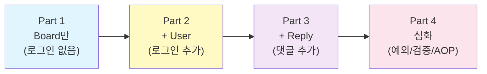

# Spring Boot 게시판 - 점진적 확장 교재

> Board만 → User 추가 → Reply 추가 → 심화
> 한 단계씩 기능을 확장하며 Spring Boot를 배웁니다!

---

## 이 교재의 특징

- **Part 1**: 게시글만 (로그인 없이 CRUD)
- **Part 2**: 사용자 추가 (로그인, 권한, DTO, Lazy/Eager)
- **Part 3**: 댓글 추가 (OneToMany, N+1 문제, batch_fetch_size)
- **Part 4**: 심화 (예외 처리, 유효성 검사, AOP, 테스트)

---

## 목차

### Part 1. Board만으로 시작하기

> 로그인 없이, 게시글 CRUD만 만듭니다. Spring Boot의 기본 구조를 이해합니다.

| 챕터 | 제목 | 핵심 내용 | 실행 확인 |
|------|------|----------|----------|
| [Ch01](part1-ch01-setup.md) | 프로젝트 설정 | Spring Boot, Gradle, H2, properties | H2 콘솔 확인 |
| [Ch02](part1-ch02-board-entity.md) | Board 엔티티 | @Entity, @Id, @GeneratedValue | 테이블 생성 확인 |
| [Ch03](part1-ch03-board-repository.md) | BoardRepository + 테스트 | EntityManager, 영속성 컨텍스트, @DataJpaTest | 테스트 통과 |
| [Ch04](part1-ch04-board-crud.md) | Board CRUD | Controller, Service, Mustache 뷰 | **게시판 동작!** |

### Part 2. User 추가 - 로그인과 권한

> User를 추가하고, 로그인/로그아웃을 구현합니다. "내 글만 수정/삭제" 기능을 만듭니다.

| 챕터 | 제목 | 핵심 내용 | 실행 확인 |
|------|------|----------|----------|
| Ch05 | User 엔티티 + Repository | User 테이블, findByUsername | 테스트 통과 |
| Ch06 | 회원가입과 로그인 | HttpSession, 세션 관리 | 로그인 테스트 |
| Ch07 | Board + User 관계 | @ManyToOne, FetchType, Lazy/Eager | N+1 쿼리 확인 |
| Ch08 | DTO와 isOwner | BoardResponse, DetailDTO, Optional | 내 글만 수정 가능 |

### Part 3. Reply 추가 - 댓글과 N+1

> Reply를 추가하고, N+1 문제를 발견하고 해결합니다.

| 챕터 | 제목 | 핵심 내용 | 실행 확인 |
|------|------|----------|----------|
| Ch09 | Reply 엔티티 + Repository | @OneToMany, Reply 테이블 | 테스트 통과 |
| Ch10 | 댓글 CRUD | ReplyController, getReference() | 댓글 등록/삭제 |
| Ch11 | N+1 문제와 해결 | N+1 발견, batch_fetch_size, IN 쿼리 | **쿼리 최적화!** |

### Part 4. 심화 - 예외/검증/AOP/테스트

> 완성된 게시판의 품질을 개선합니다.

| 챕터 | 제목 | 핵심 내용 | 비고 |
|------|------|----------|------|
| Ch12 | 예외 처리 | 커스텀 예외, GlobalExceptionHandler | |
| Ch13 | 유효성 검사 | @Valid, @NotBlank, @Size | 의존성 추가 |
| Ch14 | 유효성 검사 AOP | ValidationAspect, 횡단 관심사 | 의존성 추가 |
| Ch15 | 테스트 코드 총정리 | Part별 쿼리 진화, N+1 재현 | |

---

## 기술 스택

| 기술 | 버전 | 설명 |
|------|------|------|
| Java | 21 | 프로그래밍 언어 |
| Spring Boot | 4.0.2 | 웹 프레임워크 |
| H2 | - | 인메모리 데이터베이스 |
| Mustache | - | 템플릿 엔진 |
| Lombok | - | 코드 간소화 |
| Bootstrap | 5.3.3 | CSS 프레임워크 |

---

## 학습 방식

1. 각 챕터를 **순서대로** 진행합니다
2. **실습 코드**를 직접 타이핑합니다 (복사-붙여넣기 금지!)
3. 각 챕터 끝의 **실행 확인**을 반드시 수행합니다
4. 콘솔의 **SQL 쿼리**를 눈으로 확인합니다 (특히 Part 2, 3!)
