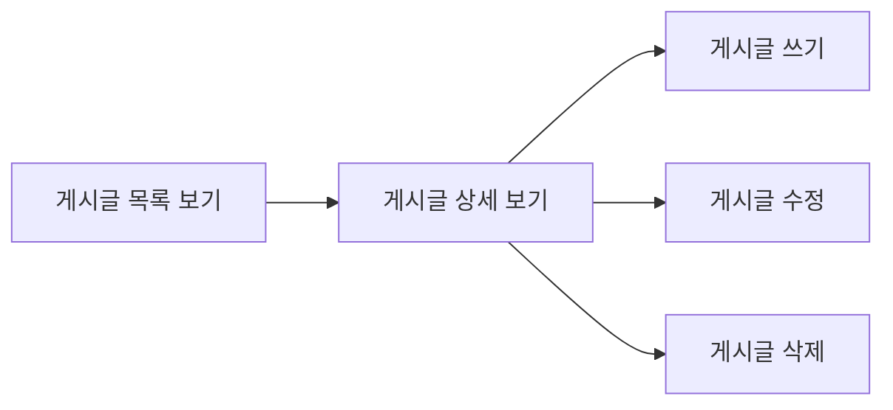
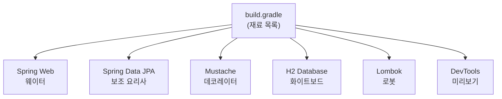
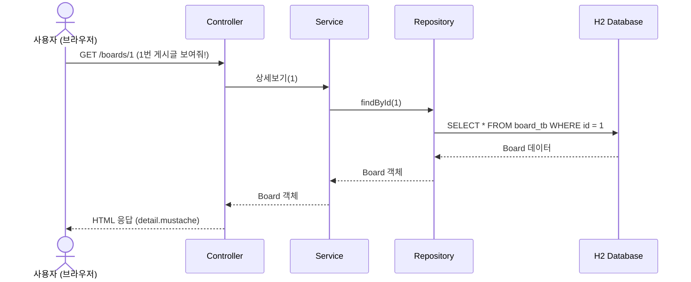

# Chapter 01. 프로젝트 소개와 환경 설정

---

## 1.1 우리가 만들 것

우리가 만들 것은 **게시판(Board)** 입니다!

> **게시판이 뭐예요?**
>
> 학교 복도에 있는 게시판을 떠올려보세요. 누구나 종이(게시글)를 붙일 수 있고, 읽을 수 있고, 떼어낼 수도 있죠. 웹 게시판도 똑같습니다!

### Part 1에서 만드는 것

Part 1에서는 아주 간단한 게시판을 만듭니다. **로그인 없이, 게시글만!**



> **Part 1의 한계**: 로그인이 없어서 누구나 수정/삭제할 수 있어요. "이건 내 글인데!" 같은 확인이 안 됩니다.
> **Part 2에서 해결합니다!** 로그인을 추가하면 내 글만 수정/삭제할 수 있게 됩니다.

---

## 1.2 기술 스택 소개

### Spring Boot란?

> **정의**: Java로 웹 애플리케이션을 쉽게 만들 수 있게 도와주는 도구 모음
>
> **예시**: 레고를 생각해보세요!
> - 레고 블록 하나하나 조립하기 = **Spring** (느리고 복잡함)
> - 반쯤 조립된 레고 세트 = **Spring Boot** (빠르고 편함!)
>
> Spring Boot는 이미 필요한 설정이 대부분 되어 있어서, 우리는 게시판 기능 만들기에만 집중하면 됩니다.

### JPA란?

> **정의**: Java 객체와 데이터베이스 테이블을 자동으로 연결해주는 기술
>
> **예시**: 통역사를 생각해보세요!
> - 우리가 Java로 `board.setTitle("안녕")` 이라고 말하면
> - JPA(통역사)가 `INSERT INTO board_tb (title) VALUES ('안녕')` 이라고 SQL로 바꿔줍니다
>
> 우리는 SQL을 직접 쓰지 않아도 됩니다!

### Mustache란?

> **정의**: HTML 안에 데이터를 끼워 넣어주는 템플릿 엔진
>
> **예시**: 편지 양식을 생각해보세요!
> - 양식: "안녕하세요 `{{이름}}`님, `{{제목}}` 글을 작성했습니다"
> - 실제: "안녕하세요 **철수**님, **오늘의 일기** 글을 작성했습니다"
>
> `{{}}` 안에 실제 데이터가 들어갑니다!

### H2 Database란?

> **정의**: 별도 설치 없이 메모리에서 동작하는 가벼운 데이터베이스
>
> **예시**: 화이트보드 메모를 생각해보세요!
> - 화이트보드에 적으면 바로 보이고 (서버 켜면 데이터 있음)
> - 지우개로 다 지우면 끝 (서버 끄면 데이터 사라짐)
>
> 연습하기 딱 좋은 DB입니다!

---

## 1.3 프로젝트 생성하기

### Step 1: Spring Initializr에서 프로젝트 생성

[https://start.spring.io](https://start.spring.io) 에 접속해서 아래 설정으로 프로젝트를 생성합니다.

| 항목 | 값 |
|------|-----|
| Project | Gradle - Groovy |
| Language | Java |
| Spring Boot | 4.0.2 |
| Group | com.example |
| Artifact | boardv1 |
| Java | 21 |

### Step 2: 의존성(Dependencies) 추가

> **의존성이 뭐예요?** 우리가 만들 게시판에 필요한 "재료"들입니다.
> 요리할 때 밀가루, 설탕, 달걀이 필요하듯이, 프로그래밍에도 필요한 라이브러리(재료)가 있습니다!

다음 의존성을 추가합니다:

| 의존성 | 역할 | 쉬운 설명 |
|--------|------|----------|
| Spring Web | HTTP 요청/응답 처리 | 손님(브라우저) 주문을 받는 **웨이터** |
| Spring Data JPA | DB 접근 기술 | 창고에서 재료를 꺼내오는 **보조 요리사** |
| H2 Database | 메모리 데이터베이스 | 연습용 **화이트보드** |
| Mustache | HTML 화면 생성 | 음식을 예쁜 접시에 담아주는 **데코레이터** |
| Lombok | 반복 코드 제거 | 복사-붙여넣기를 대신해주는 **로봇** |
| Spring Boot DevTools | 코드 변경시 자동 재시작 | **실시간 미리보기** |



---

## 1.4 build.gradle 살펴보기

> **build.gradle이 뭐예요?** 재료 목록표입니다. "이 프로젝트에는 이런 재료들이 필요해요"라고 적어두는 파일입니다.

`build.gradle`

```groovy
plugins {
    id 'java'
    id 'org.springframework.boot' version '4.0.2'
    id 'io.spring.dependency-management' version '1.1.7'
}

group = 'com.example'
version = '0.0.1-SNAPSHOT'

java {
    toolchain {
        languageVersion = JavaLanguageVersion.of(21)
    }
}

configurations {
    compileOnly {
        extendsFrom annotationProcessor
    }
}

repositories {
    mavenCentral()
}

dependencies {
    implementation 'org.springframework.boot:spring-boot-h2console'
    implementation 'org.springframework.boot:spring-boot-starter-data-jpa'
    implementation 'org.springframework.boot:spring-boot-starter-mustache'
    implementation 'org.springframework.boot:spring-boot-starter-webmvc'
    compileOnly 'org.projectlombok:lombok'
    developmentOnly 'org.springframework.boot:spring-boot-devtools'
    runtimeOnly 'com.h2database:h2'
    annotationProcessor 'org.projectlombok:lombok'
    testImplementation 'org.springframework.boot:spring-boot-starter-data-jpa-test'
    testImplementation 'org.springframework.boot:spring-boot-starter-mustache-test'
    testImplementation 'org.springframework.boot:spring-boot-starter-webmvc-test'
    testRuntimeOnly 'org.junit.platform:junit-platform-launcher'
}

tasks.named('test') {
    useJUnitPlatform()
}
```

### 핵심 부분만 보면

```groovy
dependencies {
    implementation 'spring-boot-starter-data-jpa'   // JPA (통역사)
    implementation 'spring-boot-starter-mustache'    // Mustache (편지 양식)
    implementation 'spring-boot-starter-webmvc'      // Web (웨이터)
    runtimeOnly 'com.h2database:h2'                  // H2 (화이트보드)
    compileOnly 'org.projectlombok:lombok'           // Lombok (로봇)
}
```

> `implementation`은 "이 재료를 사용합니다"라는 뜻이에요!

---

## 1.5 application.properties 설정하기

> **application.properties가 뭐예요?** 식당의 "운영 규칙"을 적어놓는 파일입니다.
> - 몇 시에 문 열지? → `server.port=8080`
> - 어떤 DB를 쓸지? → `spring.datasource.url=...`

`src/main/resources/application.properties`

```properties
# ===== Server =====
server.port=8080
spring.servlet.encoding.charset=UTF-8
spring.servlet.encoding.enabled=true
spring.servlet.encoding.force=true

# ===== Mustache =====
spring.mustache.servlet.expose-session-attributes=true
spring.mustache.servlet.expose-request-attributes=true

# ===== ansi =====
spring.output.ansi.enabled=always

# ===== H2 Datasource =====
spring.datasource.driver-class-name=org.h2.Driver
spring.datasource.url=jdbc:h2:mem:test
spring.datasource.username=sa
spring.datasource.password=
spring.h2.console.enabled=true

# ===== SQL Init (data.sql) =====
spring.sql.init.data-locations=classpath:db/data.sql
spring.jpa.defer-datasource-initialization=true

# ===== query view =====
spring.jpa.show-sql=true
spring.jpa.properties.hibernate.format_sql=true

# ===== osiv =====
spring.jpa.open-in-view=false

# ===== url rewrite close =====
server.servlet.session.tracking-modes=cookie

# ===== Tomcat session =====
server.servlet.session.timeout=30m
```

### 설정 핵심 정리

| 설정 | 값 | 쉬운 설명 |
|------|-----|----------|
| `server.port` | 8080 | 식당 문 번호 (8080번) |
| `spring.datasource.url` | jdbc:h2:mem:test | 화이트보드 주소 |
| `spring.h2.console.enabled` | true | 화이트보드를 브라우저에서 볼 수 있게 |
| `spring.jpa.show-sql` | true | 실행되는 SQL을 콘솔에 보여줘! |
| `spring.jpa.properties.hibernate.format_sql` | true | SQL을 예쁘게 정렬해서 보여줘! |
| `spring.sql.init.data-locations` | classpath:db/data.sql | 서버 시작할 때 이 SQL 파일을 실행해줘! |

> **`spring.jpa.show-sql=true`가 중요한 이유**: 이 설정 덕분에 콘솔에서 JPA가 만들어낸 SQL 쿼리를 볼 수 있습니다. 테스트할 때 "어떤 SQL이 실행됐는지" 확인하는 핵심 도구입니다!

---

## 1.6 초기 데이터 넣기 (data.sql)

> **data.sql이 뭐예요?** 서버가 켜질 때 자동으로 실행되는 SQL 파일입니다.
> 가게가 문을 열기 전에 진열대에 상품을 미리 채워놓는 것과 같아요!

`src/main/resources/db/data.sql`

```sql
insert into board_tb(title, content, created_at) values('제목1', '내용1', now());
insert into board_tb(title, content, created_at) values('제목2', '내용2', now());
insert into board_tb(title, content, created_at) values('제목3', '내용3', now());
insert into board_tb(title, content, created_at) values('제목4', '내용4', now());
insert into board_tb(title, content, created_at) values('제목5', '내용5', now());
insert into board_tb(title, content, created_at) values('제목6', '내용6', now());
```

> **Part 1에서는 Board 데이터만 넣습니다!** User나 Reply 테이블은 아직 없어요.
> Part 2에서 User를 추가하고, Part 3에서 Reply를 추가하면 data.sql도 함께 업그레이드됩니다.

---

## 1.7 메인 클래스 확인

`src/main/java/com/example/boardv1/Boardv1Application.java`

```java
package com.example.boardv1;

import org.springframework.boot.SpringApplication;
import org.springframework.boot.autoconfigure.SpringBootApplication;

@SpringBootApplication
public class Boardv1Application {

    public static void main(String[] args) {
        SpringApplication.run(Boardv1Application.class, args);
    }
}
```

### @SpringBootApplication이란?

> **예시**: 식당 개업을 생각해보세요!
>
> `@SpringBootApplication` 하나만 붙이면 이 3가지가 한 번에 됩니다:
>
> | 어노테이션 | 역할 | 식당 비유 |
> |-----------|------|----------|
> | `@SpringBootConfiguration` | 설정 파일 선언 | 사업자 등록 |
> | `@EnableAutoConfiguration` | 자동 설정 | 주방 기구 셋팅 |
> | `@ComponentScan` | 빈(Bean) 스캔 | 직원 채용 |
>
> 한마디로, "이 클래스가 Spring Boot 앱의 시작점이야!"라고 알려주는 어노테이션입니다.

---

## 1.8 전체 요청 흐름 (미리보기)



> **지금은 이 흐름이 이해 안 되어도 괜찮아요!**
> ch02~ch04를 진행하면서 하나씩 만들게 됩니다.

---

## 1.9 프로젝트 구조

```
src/main/
├── java/com/example/boardv1/
│   ├── Boardv1Application.java   ← 메인 클래스 (이번 챕터)
│   └── board/
│       ├── Board.java            ← ch02에서 작성
│       ├── BoardRepository.java  ← ch03에서 작성
│       ├── BoardService.java     ← ch04에서 작성
│       └── BoardController.java  ← ch04에서 작성
└── resources/
    ├── application.properties    ← 이번 챕터
    ├── db/
    │   └── data.sql              ← 이번 챕터
    └── templates/
        ├── header.mustache       ← ch04에서 작성
        ├── index.mustache        ← ch04에서 작성
        └── board/
            ├── detail.mustache   ← ch04에서 작성
            ├── save-form.mustache   ← ch04에서 작성
            └── update-form.mustache ← ch04에서 작성
```

---

## 실행 확인

1. IDE에서 `Boardv1Application.java`의 `main` 메서드 실행
2. 콘솔에 `Started Boardv1Application` 메시지가 나오면 서버 시작 성공!
3. 브라우저에서 `http://localhost:8080/h2-console` 접속
4. JDBC URL을 `jdbc:h2:mem:test`로 입력하고 Connect 클릭
5. 왼쪽 패널에 `BOARD_TB` 테이블이 보이면 성공!
6. `SELECT * FROM BOARD_TB` 쿼리를 실행해서 6개의 게시글이 보이는지 확인

> **아직 화면은 없습니다!** `http://localhost:8080`에 접속하면 에러 페이지가 나옵니다.
> Controller와 View를 아직 만들지 않았기 때문이에요. ch04에서 만듭니다!

---

## 핵심 정리

- **Spring Boot**: 설정을 최소화하고 빠르게 웹 앱을 만들 수 있는 프레임워크
- **build.gradle**: 프로젝트에 필요한 재료(의존성) 목록
- **application.properties**: 서버, DB, 뷰 등 모든 설정을 관리하는 파일
- **data.sql**: 서버 시작시 자동으로 실행되는 초기 데이터
- **@SpringBootApplication**: "여기서 앱이 시작됩니다!" 선언
- **Part 1에서는 Board만**: User, Reply는 Part 2, 3에서 추가합니다

> **다음 챕터**: [Chapter 02. Board 엔티티](part1-ch02-board-entity.md) - 게시글을 담는 그릇(Entity)을 만들어봅시다!
