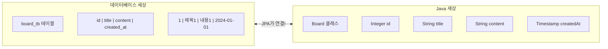
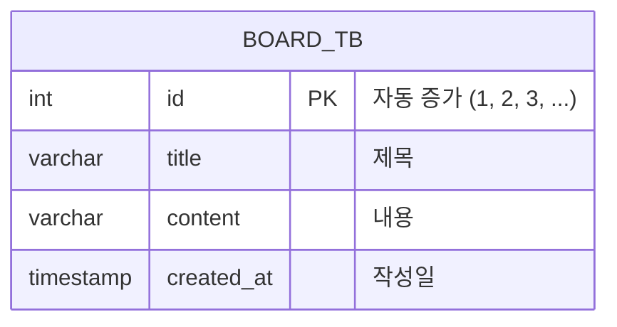
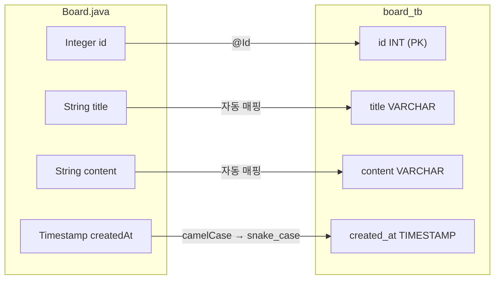
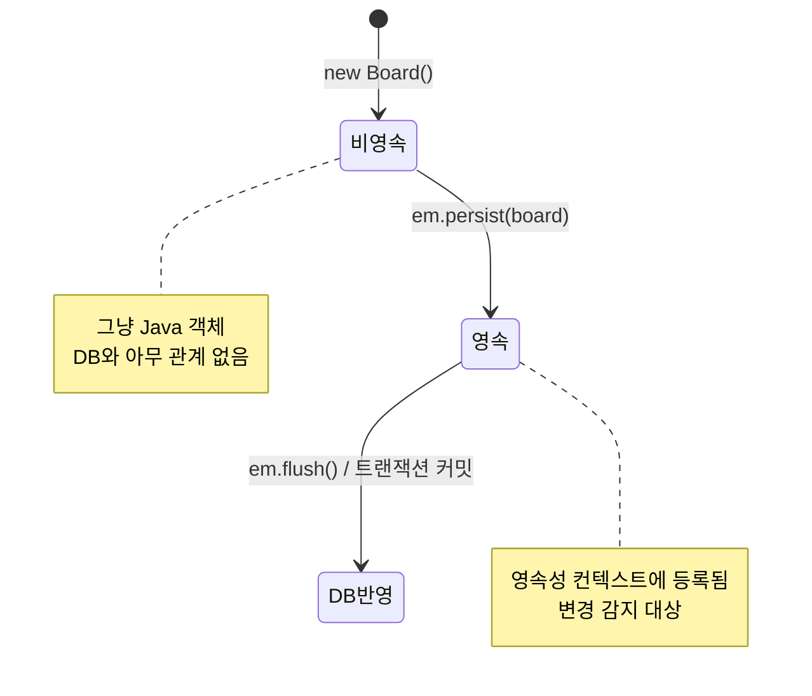

# Chapter 02. Board 엔티티

> **선수 조건**: [Chapter 01. 프로젝트 설정](part1-ch01-setup.md)을 완료하세요.

---

## 2.1 엔티티(Entity)란?

> **정의**: 데이터베이스 테이블을 Java 클래스로 옮겨놓은 것
>
> **예시**: 학교에 "출석부"가 있다고 생각해보세요!

| 출석부 (데이터베이스) | Java 코드 (엔티티) |
|---------------------|-------------------|
| 출석부 양식 = **테이블** | 클래스 = **Entity** |
| 칸 (이름, 학번, 반) = **컬럼** | 변수 = **필드** |
| 한 줄 (철수, 1번, 3반) = **행(Row)** | 객체 = **Object** |



> **핵심**: 테이블의 **칸(컬럼)**이 Java 클래스의 **변수(필드)**가 됩니다!

---

## 2.2 Board 테이블 설계

Part 1에서 만드는 Board 테이블은 아주 간단합니다.



| 컬럼 | 타입 | 설명 | 예시 |
|------|------|------|------|
| `id` | int | 게시글 번호 (자동 증가) | 1, 2, 3, ... |
| `title` | varchar | 게시글 제목 | "오늘의 일기" |
| `content` | varchar | 게시글 내용 | "오늘은 맑음" |
| `created_at` | timestamp | 작성 날짜/시간 | 2024-01-01 12:00:00 |

> **Part 1에서는 `user_id`가 없습니다!** 누가 쓴 글인지 아직 구분하지 않아요.
> Part 2에서 User를 추가하면 "누가 이 글을 썼는지" 알 수 있게 됩니다.

---

## 2.3 Board 엔티티 작성하기

### 실습 코드

`src/main/java/com/example/boardv1/board/Board.java`

```java
package com.example.boardv1.board;

import java.sql.Timestamp;

import org.hibernate.annotations.CreationTimestamp;

import jakarta.persistence.Entity;
import jakarta.persistence.GeneratedValue;
import jakarta.persistence.GenerationType;
import jakarta.persistence.Id;
import jakarta.persistence.Table;
import lombok.Data;
import lombok.NoArgsConstructor;

@NoArgsConstructor
@Data
@Entity
@Table(name = "board_tb")
public class Board {
    @Id
    @GeneratedValue(strategy = GenerationType.IDENTITY)
    private Integer id;
    private String title;
    private String content;

    @CreationTimestamp
    private Timestamp createdAt;
}
```

> **아직은 이것만!** User, Reply 관련 코드는 없습니다. Part 2, 3에서 추가합니다.

---

## 2.4 어노테이션 하나하나 뜯어보기

### @Entity

```java
@Entity
public class Board { ... }
```

> **"이 클래스는 데이터베이스 테이블이야!"** 라고 JPA에게 알려주는 표시입니다.
>
> **예시**: 학교에서 "이 종이는 공식 시험지입니다"라고 도장을 찍는 것과 같아요.
> 도장(@Entity)이 없으면 JPA는 이 클래스를 무시합니다.

### @Table(name = "board_tb")

```java
@Table(name = "board_tb")
public class Board { ... }
```

> **"데이터베이스에서 이 테이블 이름은 board_tb야"** 라고 지정합니다.
>
> 만약 이 어노테이션이 없으면? 클래스 이름 `Board`가 테이블 이름이 됩니다.
> 우리는 `_tb`를 붙여서 "이건 테이블이다"라고 명확하게 표시합니다.

### @Id

```java
@Id
private Integer id;
```

> **"이 필드가 기본 키(Primary Key)야!"** 라고 알려줍니다.
>
> **예시**: 학생 번호를 생각해보세요. 같은 반에 "김철수"가 2명일 수 있지만, 학생 번호 1번과 2번은 절대 겹치지 않죠. `@Id`는 이 "절대 겹치지 않는 번호"를 지정하는 것입니다.

### @GeneratedValue(strategy = GenerationType.IDENTITY)

```java
@GeneratedValue(strategy = GenerationType.IDENTITY)
private Integer id;
```

> **"id 값은 데이터베이스가 자동으로 만들어줘!"** 라는 뜻입니다.
>
> **예시**: 은행 대기표를 생각해보세요!
> - 첫 번째 손님: 1번
> - 두 번째 손님: 2번
> - 세 번째 손님: 3번
>
> 우리가 번호를 정하지 않아도, 자동으로 1씩 증가합니다. 이것이 `IDENTITY` 전략입니다.

### @CreationTimestamp

```java
@CreationTimestamp
private Timestamp createdAt;
```

> **"이 객체가 만들어질 때(INSERT 될 때) 자동으로 현재 시간을 넣어줘!"**
>
> **예시**: 편지에 날짜 도장을 찍는 것과 같아요. 우편함에 넣는 순간(INSERT) 자동으로 날짜가 찍힙니다.

### @Data (Lombok)

```java
@Data
public class Board { ... }
```

> **"getter, setter, toString 등을 자동으로 만들어줘!"**
>
> `@Data`가 없으면 우리가 직접 이런 코드를 써야 합니다:
>
> ```java
> public String getTitle() { return title; }
> public void setTitle(String title) { this.title = title; }
> public String toString() { return "Board(id="+id+", title="+title+", ...)"; }
> // ... 필드마다 반복!
> ```
>
> `@Data` 하나면 이 모든 것이 자동 생성됩니다. Lombok 로봇이 대신 해줘요!

### @NoArgsConstructor (Lombok)

```java
@NoArgsConstructor
public class Board { ... }
```

> **"파라미터 없는 기본 생성자를 만들어줘!"**
>
> ```java
> // @NoArgsConstructor가 자동으로 만들어주는 코드
> public Board() { }
> ```
>
> JPA는 엔티티를 만들 때 이 기본 생성자를 사용합니다. 없으면 에러가 나요!

---

## 2.5 Java 필드 ↔ DB 컬럼 매핑



> **이름 변환 규칙**: Java에서 `createdAt` (카멜 케이스) → DB에서 `created_at` (스네이크 케이스)
>
> JPA가 자동으로 변환해줍니다!

---

## 2.6 엔티티 생명주기



> **예시**: 취업 과정을 생각해보세요!
>
> | 단계 | 비유 | JPA |
> |------|------|-----|
> | 이력서 작성 | 아직 회사와 관계없음 | `new Board()` (비영속) |
> | 입사 지원 | 회사 시스템에 등록 | `em.persist()` (영속) |
> | 정식 등록 | 인사 DB에 기록 완료 | `flush()` (DB 반영) |
>
> 지금은 감이 안 와도 괜찮아요. ch03에서 직접 코드를 실행하며 느껴봅시다!

---

## 실행 확인

서버를 재시작하고 `http://localhost:8080/h2-console`에서 확인합니다:

1. `BOARD_TB` 테이블이 왼쪽 패널에 보이는지
2. `SELECT * FROM BOARD_TB` 실행 → 6개의 게시글 데이터가 보이는지
3. 컬럼이 `ID`, `TITLE`, `CONTENT`, `CREATED_AT` 4개인지

> **USER_ID 컬럼이 없는 것이 정상입니다!** Part 1에서는 Board에 User 관계가 없으니까요.

### 이 시점의 파일 구조

```
src/main/java/com/example/boardv1/
├── Boardv1Application.java   ← ch01
└── board/
    └── Board.java            ← 이번 챕터
```

---

## 핵심 정리

- **엔티티(Entity)**: 데이터베이스 테이블을 Java 클래스로 만든 것
- **@Entity**: "이 클래스는 DB 테이블이야!" 선언
- **@Table**: 테이블 이름 지정 (없으면 클래스 이름 사용)
- **@Id**: 기본 키(Primary Key) 지정
- **@GeneratedValue(IDENTITY)**: id를 DB가 자동으로 1씩 증가시킴
- **@CreationTimestamp**: INSERT 할 때 자동으로 현재 시간 기록
- **@Data**: getter, setter, toString 자동 생성 (Lombok)
- **@NoArgsConstructor**: 기본 생성자 자동 생성 (JPA 필수!)
- Part 1의 Board는 **id, title, content, createdAt만** 있음 (User 없음!)

> **다음 챕터**: [Chapter 03. BoardRepository](part1-ch03-board-repository.md) - 게시글을 저장하고 꺼내오는 사서(Repository)를 만들어봅시다!
