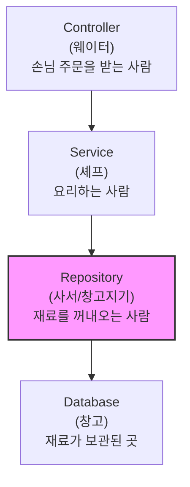
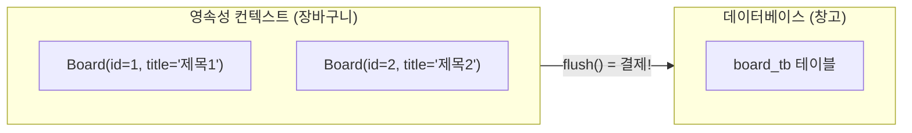
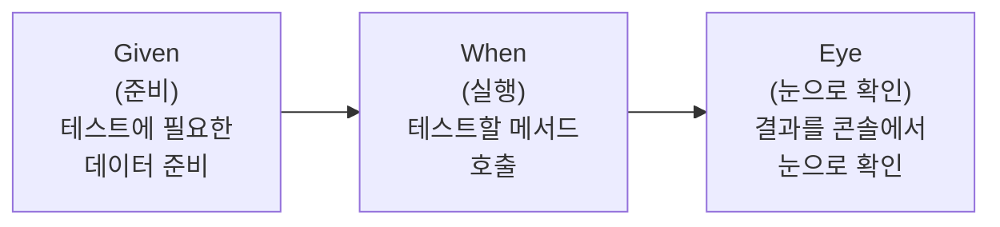
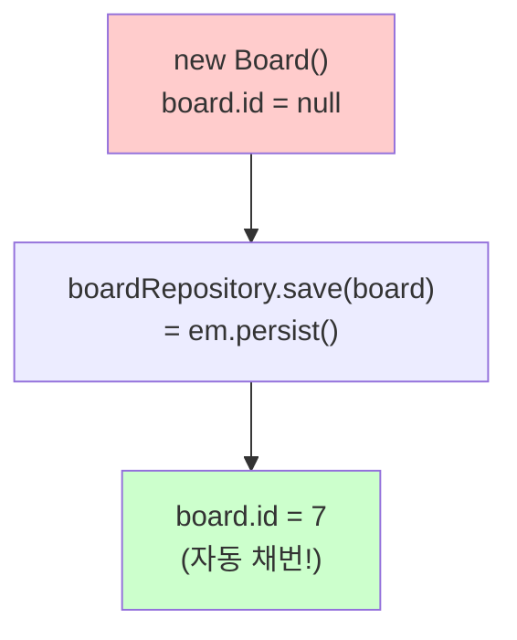
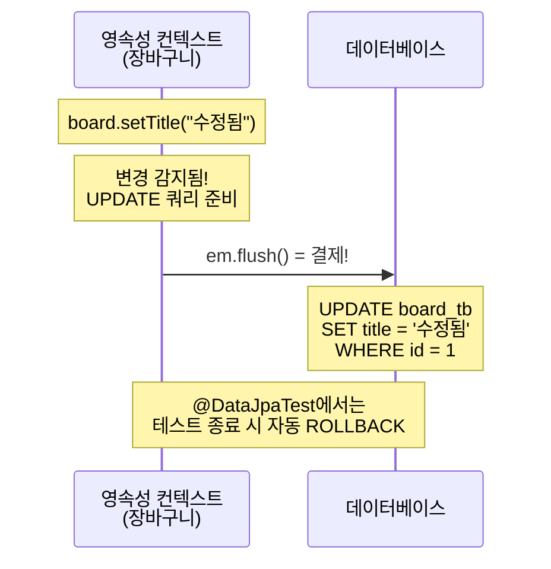

# Chapter 03. BoardRepository + 테스트

> **선수 조건**: [Chapter 02. Board 엔티티](part1-ch02-board-entity.md)를 완료하세요.

---

## 3.1 Repository란?

> **정의**: 데이터베이스에 데이터를 저장, 조회, 수정, 삭제하는 역할을 하는 클래스
>
> **예시**: 도서관 사서를 생각해보세요!
>
> | 요청 | 사서(Repository)가 하는 일 | 메서드 |
> |------|--------------------------|--------|
> | "이 책 찾아주세요" | 창고에서 책 꺼내옴 | `findById(1)` |
> | "이 책 넣어주세요" | 창고에 책 넣음 | `save(board)` |
> | "이 책 빼주세요" | 창고에서 책 제거 | `delete(board)` |
> | "전체 목록 보여주세요" | 모든 책 목록 가져옴 | `findAll()` |
>
> 우리는 사서에게 **부탁만** 하면 됩니다. 사서가 직접 창고(DB)에 가서 처리해줘요!

### 계층 구조에서의 위치



---

## 3.2 EntityManager란?

> **정의**: JPA에서 엔티티를 관리하는 핵심 객체. 모든 DB 작업은 EntityManager를 통해 이루어짐
>
> **예시**: EntityManager는 **매니저(팀장)** 입니다!
> - 신입사원 입사 → `em.persist()` (저장)
> - 직원 번호로 찾기 → `em.find()` (조회)
> - 직원 퇴사 → `em.remove()` (삭제)
> - 모든 직원에게 공지 → `em.createQuery()` (JPQL 쿼리)

### EntityManager의 주요 메서드

| 메서드 | 역할 | SQL 대응 | 쉬운 설명 |
|--------|------|---------|----------|
| `em.persist(entity)` | 저장 | INSERT | 새 직원 입사시키기 |
| `em.find(Class, id)` | PK로 조회 | SELECT WHERE id=? | 직원번호로 찾기 |
| `em.remove(entity)` | 삭제 | DELETE | 직원 퇴사시키기 |
| `em.createQuery(jpql)` | JPQL 쿼리 | SELECT (복잡한 조건) | 조건 검색 |
| `em.flush()` | DB에 반영 | - | 변경사항 저장하기 |
| `em.clear()` | 캐시 비우기 | - | 메모 초기화 |

---

## 3.3 영속성 컨텍스트 (Persistence Context)

> **정의**: 엔티티를 관리하는 가상의 저장소 (1차 캐시)
>
> **예시**: 온라인 쇼핑몰의 **장바구니**를 생각해보세요!



| 쇼핑 | JPA | 설명 |
|------|-----|------|
| 장바구니에 상품 넣기 | `em.persist(board)` | 영속성 컨텍스트에 등록 |
| 장바구니에서 빼기 | `em.remove(board)` | 삭제 표시 |
| 결제하기 | `em.flush()` | DB에 실제 반영 |
| 장바구니 비우기 | `em.clear()` | 캐시 초기화 |

### 영속성 컨텍스트의 장점

| 장점 | 설명 | 예시 |
|------|------|------|
| **1차 캐시** | 같은 것을 두 번 조회하면 DB 안 감 | `findById(1)` 두 번 → SQL 1번만! |
| **변경 감지** | 필드만 바꾸면 자동 UPDATE | `board.setTitle("수정")` → UPDATE 자동! |

> **변경 감지(Dirty Checking)가 뭐예요?**
>
> 시험지에 답을 고쳤다고 생각해보세요. 선생님(JPA)이 제출 시(flush) 원래 답과 비교해서 "아, 3번을 A에서 B로 고쳤구나"라고 자동으로 알아채고 수정합니다!
>
> 우리가 `em.persist()`를 다시 호출하지 않아도, 필드를 바꾸기만 하면 자동으로 UPDATE SQL이 만들어집니다.

---

## 3.4 BoardRepository 작성하기

### 실습 코드

`src/main/java/com/example/boardv1/board/BoardRepository.java`

```java
package com.example.boardv1.board;

import java.util.List;
import java.util.Optional;

import org.springframework.stereotype.Repository;

import jakarta.persistence.EntityManager;
import lombok.RequiredArgsConstructor;

@RequiredArgsConstructor
@Repository
public class BoardRepository {

    private final EntityManager em;

    public Optional<Board> findById(int id) {
        Board board = em.find(Board.class, id);
        return Optional.ofNullable(board);
    }

    public List<Board> findAll() {
        return em.createQuery("select b from Board b order by b.id desc", Board.class)
                .getResultList();
    }

    public Board save(Board board) {
        em.persist(board);
        return board;
    }

    public void delete(Board board) {
        em.remove(board);
    }
}
```

### 코드 해설

#### @Repository

```java
@Repository
public class BoardRepository { ... }
```

> **"이 클래스는 DB 담당 사서입니다!"** 라고 Spring에게 알려주는 표시입니다.
> Spring이 이 클래스를 자동으로 만들어서 관리합니다 (IoC 컨테이너에 등록).

#### @RequiredArgsConstructor + final

```java
@RequiredArgsConstructor
public class BoardRepository {
    private final EntityManager em;
}
```

> `final`이 붙은 필드를 초기화하는 생성자를 Lombok이 자동으로 만들어줍니다.
>
> ```java
> // Lombok이 자동으로 만들어주는 코드
> public BoardRepository(EntityManager em) {
>     this.em = em;
> }
> ```
>
> **의존성 주입(DI)**: Spring이 EntityManager를 알아서 넣어줍니다!

#### findById - PK로 한 건 조회

```java
public Optional<Board> findById(int id) {
    Board board = em.find(Board.class, id);
    return Optional.ofNullable(board);
}
```

> `em.find(Board.class, 1)` → "Board 타입에서 id가 1인 것을 찾아줘!"
>
> **SQL로 변환하면:**
> ```sql
> SELECT * FROM board_tb WHERE id = 1
> ```
>
> **Optional이 뭐예요?**
>
> **예시**: 택배 상자를 생각해보세요!
> - 상자 안에 물건이 **있을 수도** 있고, **없을 수도** 있어요
> - `Optional.of(board)` = 물건이 있는 상자
> - `Optional.empty()` = 빈 상자
> - `Optional.ofNullable(board)` = board가 있으면 담고, null이면 빈 상자
>
> 왜 쓰나요? **NullPointerException** (빈 상자인데 물건 꺼내려다 에러)을 방지합니다!

#### findAll - 전체 목록 조회

```java
public List<Board> findAll() {
    return em.createQuery("select b from Board b order by b.id desc", Board.class)
            .getResultList();
}
```

> **JPQL(Java Persistence Query Language)** 을 사용합니다.
>
> | JPQL | SQL |
> |------|-----|
> | `select b from Board b` | `SELECT * FROM board_tb` |
> | `order by b.id desc` | `ORDER BY id DESC` |
>
> **차이점**: JPQL은 **테이블 이름**이 아니라 **클래스 이름**(Board)을 씁니다!
>
> `order by b.id desc` → 게시글 번호가 높은 것부터 (최신글 먼저!)

#### save - 저장

```java
public Board save(Board board) {
    em.persist(board);
    return board;
}
```

> `em.persist(board)` → "이 board를 DB에 넣어줘!"
>
> **SQL로 변환하면:**
> ```sql
> INSERT INTO board_tb (title, content, created_at) VALUES ('제목', '내용', '2024-01-01')
> ```
>
> persist 후에는 `board.getId()`로 자동 생성된 id를 확인할 수 있습니다!

#### delete - 삭제

```java
public void delete(Board board) {
    em.remove(board);
}
```

> `em.remove(board)` → "이 board를 DB에서 삭제해줘!"
>
> **SQL로 변환하면:**
> ```sql
> DELETE FROM board_tb WHERE id = 1
> ```
>
> **주의**: 영속 상태인 엔티티만 삭제할 수 있습니다. (먼저 find로 가져와야 함!)

---

## 3.5 테스트 코드 작성하기

### 테스트란?

> **예시**: 자동차를 만들고 바로 도로에 내보낼까요? 아닙니다!
> 공장에서 **충돌 테스트, 브레이크 테스트, 엔진 테스트**를 먼저 합니다.
>
> 코드도 마찬가지입니다. 코드를 만들고 바로 서버에 올리지 않고, **테스트 코드**로 먼저 확인합니다!

### 테스트 패턴: Given-When-Eye



> **예시**: 자판기 테스트
> - **Given** (준비): 500원 동전을 넣는다
> - **When** (실행): 콜라 버튼을 누른다
> - **Eye** (확인): 콜라가 나왔는지 눈으로 확인!

### @DataJpaTest란?

```java
@DataJpaTest
public class BoardRepositoryTest { ... }
```

> **"JPA 관련된 것만 테스트하겠습니다!"**
>
> **예시**: 전체 식당(Spring 앱)을 열지 않고, **주방(JPA)만** 따로 테스트하는 것!
>
> | 특징 | 설명 |
> |------|------|
> | EntityManager 자동 등록 | 우리가 직접 만들 필요 없음 |
> | H2 인메모리 DB 사용 | 테스트용 DB 자동 설정 |
> | 각 테스트마다 롤백 | 테스트끼리 데이터가 섞이지 않음 |
> | data.sql 실행 | 초기 데이터 자동 삽입 |

### @Import가 필요한 이유

```java
@Import(BoardRepository.class)
@DataJpaTest
public class BoardRepositoryTest { ... }
```

> `@DataJpaTest`는 우리가 만든 `BoardRepository`를 자동으로 등록하지 않습니다.
> `@Import`로 "이 클래스도 테스트에 포함시켜줘!"라고 알려줘야 합니다.

### 실습 코드

`src/test/java/com/example/boardv1/board/BoardRepositoryTest.java`

```java
package com.example.boardv1.board;

import java.util.List;

import org.junit.jupiter.api.Test;
import org.springframework.beans.factory.annotation.Autowired;
import org.springframework.boot.data.jpa.test.autoconfigure.DataJpaTest;
import org.springframework.context.annotation.Import;

import jakarta.persistence.EntityManager;

@Import(BoardRepository.class)
@DataJpaTest
public class BoardRepositoryTest {

    @Autowired
    private BoardRepository boardRepository;

    @Autowired
    private EntityManager em;

    @Test
    public void save_test() {
        // given
        Board board = new Board();
        board.setTitle("title7");
        board.setContent("content7");
        System.out.println("===before persist");
        System.out.println(board);

        // when
        boardRepository.save(board);

        // eye
        System.out.println("===after persist");
        System.out.println(board);
    }

    @Test
    public void findById_test() {
        // given
        int id = 1;

        // when
        Board board = boardRepository.findById(id)
                .orElseThrow(() -> new RuntimeException("게시글을 찾을 수 없어요"));

        // eye
        System.out.println(board);
    }

    @Test
    public void findAll_test() {
        // given (없음)

        // when
        List<Board> list = boardRepository.findAll();

        // eye
        for (Board board : list) {
            System.out.println(board);
        }
    }

    @Test
    public void delete_test() {
        // given
        int id = 1;
        Board board = boardRepository.findById(id)
                .orElseThrow(() -> new RuntimeException("게시글을 찾을 수 없어요"));

        // when
        boardRepository.delete(board);

        // eye
        em.flush();
    }

    @Test
    public void update_test() {
        // given
        int id = 1;
        Board board = boardRepository.findById(id)
                .orElseThrow(() -> new RuntimeException("게시글을 찾을 수 없어요"));

        // when
        board.setTitle("title1-update");

        // eye
        em.flush();

        List<Board> list = boardRepository.findAll();
        for (Board b : list) {
            System.out.println(b);
        }
    }
}
```

---

## 3.6 각 테스트 해설

### save_test() - INSERT 테스트



> **핵심 관찰 포인트**:
> - persist 전: `board.getId()` = **null** (아직 DB에 안 넣었으니까)
> - persist 후: `board.getId()` = **7** (DB가 자동으로 번호를 매겨줌!)
>
> 콘솔에서 `INSERT INTO board_tb ...` SQL이 보이는지 확인하세요!

### findById_test() - SELECT 단건 조회

```java
Board board = boardRepository.findById(1)
        .orElseThrow(() -> new RuntimeException("게시글을 찾을 수 없어요"));
```

> **콘솔에서 확인할 SQL:**
> ```sql
> SELECT * FROM board_tb WHERE id = 1
> ```
>
> `orElseThrow()`는 "못 찾으면 에러를 던져!"라는 뜻입니다.
>
> **예시**: 도서관에서 "7번 책 주세요" → 없으면 "그 책 없습니다!" 에러

### findAll_test() - SELECT 전체 조회

> **콘솔에서 확인할 SQL:**
> ```sql
> SELECT * FROM board_tb ORDER BY id DESC
> ```
>
> 6개의 게시글이 id 내림차순(6, 5, 4, 3, 2, 1)으로 출력됩니다.

### delete_test() - DELETE 테스트

```java
Board board = boardRepository.findById(1).orElseThrow(...);  // 먼저 찾기
boardRepository.delete(board);  // 그 다음 삭제
em.flush();  // DB에 반영!
```

> **왜 find를 먼저 해야 할까요?**
>
> JPA는 **영속 상태**(find로 가져온 상태)인 엔티티만 삭제할 수 있습니다.
> "창고에 있는 물건만 빼낼 수 있다"고 생각하면 됩니다!
>
> **콘솔에서 확인할 SQL:**
> ```sql
> SELECT * FROM board_tb WHERE id = 1  -- 먼저 조회
> DELETE FROM board_tb WHERE id = 1    -- 그 다음 삭제
> ```

### update_test() - 변경 감지 테스트

```java
board.setTitle("title1-update");  // 제목만 변경
em.flush();                        // DB에 반영 → UPDATE 자동 실행!
```

> **마법 같은 일이 일어납니다!**
>
> `em.persist()`를 다시 호출하지 않았는데, `setTitle()`만 했더니 UPDATE가 실행됩니다.
> 이것이 **변경 감지(Dirty Checking)** 입니다!
>
> **콘솔에서 확인할 SQL:**
> ```sql
> UPDATE board_tb SET title='title1-update', content='내용1', ... WHERE id=1
> ```

---

## 3.7 em.flush()의 역할



> **테스트에서 flush를 명시적으로 호출하는 이유**:
>
> `@DataJpaTest`는 각 테스트 후 자동으로 ROLLBACK합니다.
> ROLLBACK되면 flush가 안 되므로, **UPDATE/DELETE SQL이 실제로 실행되는지 확인하려면** `em.flush()`를 직접 호출해야 합니다!
>
> **예시**: 시험 답안지를 제출하기 전에 ROLLBACK(취소)하면, 선생님이 채점할 수 없잖아요? flush는 "제출하기!"입니다.

---

## 3.8 1차 캐시 확인 테스트 (보너스)

```java
@Test
public void cache_test() {
    // given
    int id = 1;

    // when - 같은 id를 두 번 조회
    boardRepository.findById(id);
    boardRepository.findById(id);  // 캐시에서 가져옴!
}
```

> **콘솔에서 확인**: SELECT 쿼리가 **1번만** 실행됩니다!
> 두 번째 조회는 1차 캐시(장바구니)에서 바로 가져오기 때문입니다.

```java
@Test
public void cache_clear_test() {
    // given
    int id = 1;

    // when - 캐시를 비우고 다시 조회
    boardRepository.findById(id);
    em.clear();                     // 캐시 비우기!
    boardRepository.findById(id);   // 다시 DB에서 가져옴
}
```

> **콘솔에서 확인**: SELECT 쿼리가 **2번** 실행됩니다!
> `em.clear()`로 캐시를 비웠기 때문에, 두 번째 조회도 DB에 가야 합니다.

---

## 실행 확인

1. `BoardRepositoryTest` 클래스를 우클릭 → Run Test
2. 모든 테스트(초록색)가 통과하는지 확인
3. 콘솔에서 **Hibernate SQL**이 출력되는지 확인:
   - save_test: `INSERT INTO board_tb ...`
   - findById_test: `SELECT ... FROM board_tb WHERE id=?`
   - findAll_test: `SELECT ... FROM board_tb ORDER BY ...`
   - delete_test: `DELETE FROM board_tb WHERE id=?`
   - update_test: `UPDATE board_tb SET title=? WHERE id=?`

> **Part 1의 SQL은 매우 단순합니다!**
> `board_tb` 테이블 하나만 조회하면 되니까요. JOIN도 없고, 서브쿼리도 없어요.
>
> Part 2에서 User를 추가하면 SQL이 어떻게 변하는지 비교해봅시다!

### 이 시점의 파일 구조

```
src/main/java/com/example/boardv1/
├── Boardv1Application.java       ← ch01
└── board/
    ├── Board.java                ← ch02
    └── BoardRepository.java     ← 이번 챕터

src/test/java/com/example/boardv1/
└── board/
    └── BoardRepositoryTest.java  ← 이번 챕터
```

---

## 핵심 정리

- **Repository**: 데이터베이스에 접근하는 계층 (도서관 사서)
- **EntityManager**: JPA의 핵심 객체, 모든 DB 작업을 처리
- **영속성 컨텍스트**: 엔티티를 관리하는 1차 캐시 (장바구니)
- **변경 감지(Dirty Checking)**: 필드만 바꾸면 자동으로 UPDATE SQL 생성
- **em.flush()**: 영속성 컨텍스트의 변경사항을 DB에 강제 반영 (결제하기)
- **em.clear()**: 1차 캐시를 비움 (장바구니 비우기)
- **@DataJpaTest**: JPA 전용 슬라이스 테스트 (주방만 테스트)
- **Given-When-Eye**: 준비 → 실행 → 눈으로 확인 패턴
- **Optional**: null 안전한 택배 상자

> **다음 챕터**: [Chapter 04. Board CRUD](part1-ch04-board-crud.md) - 드디어 브라우저에서 게시글을 만들고, 보고, 수정하고, 삭제합니다!
