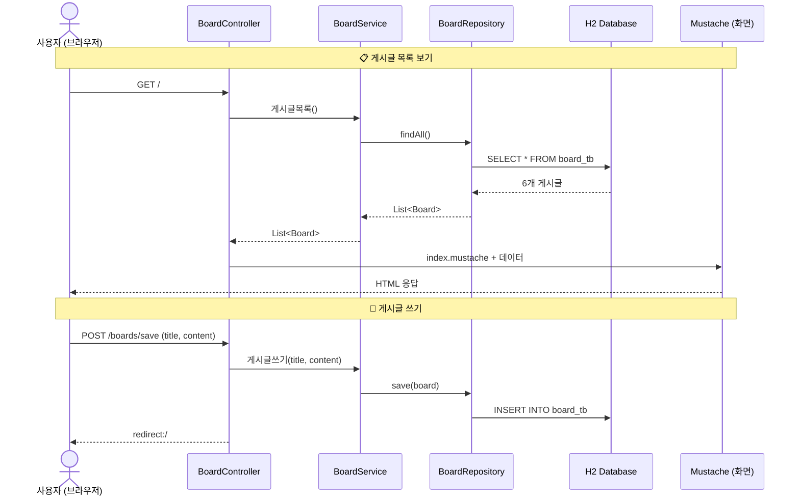
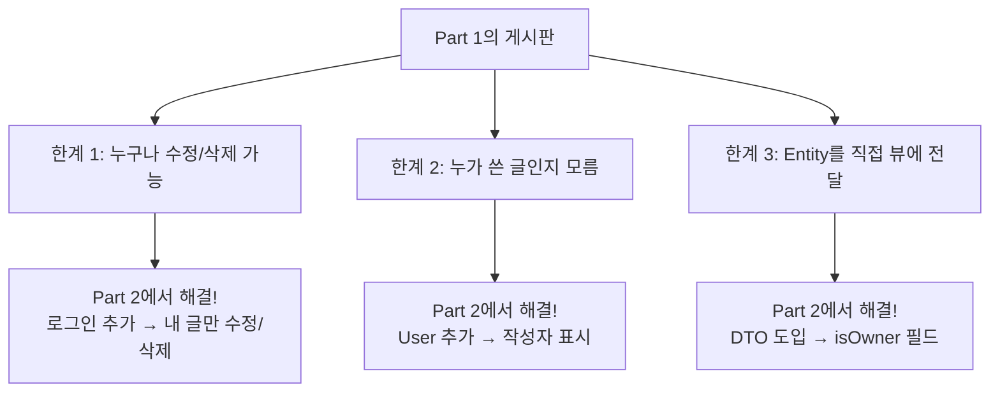
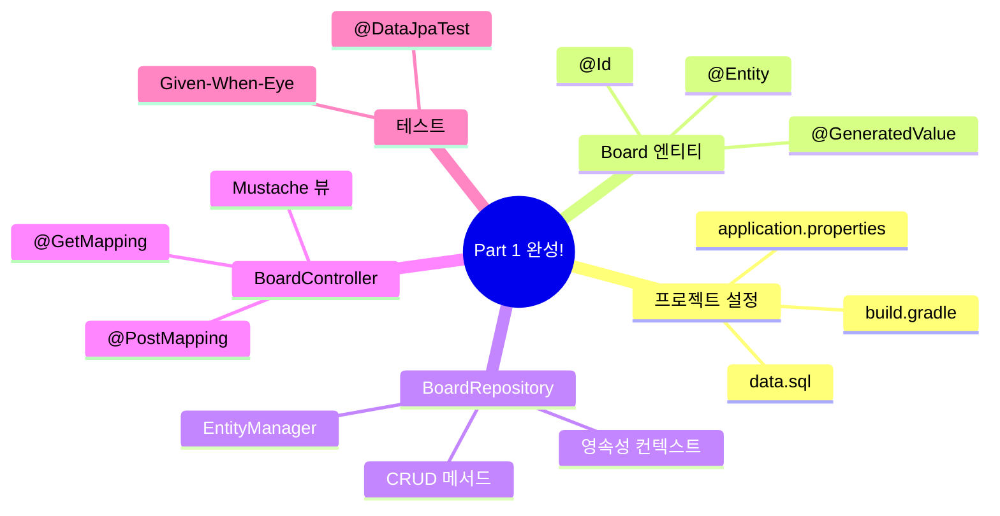

# Chapter 04. Board CRUD - 게시글 만들기

> **선수 조건**: [Chapter 03. BoardRepository](part1-ch03-board-repository.md)를 완료하세요.

---

## 4.1 CRUD란?

> **정의**: 데이터의 4가지 기본 동작

| 영문 | 한글 | SQL | HTTP 메서드 | 예시 |
|------|------|-----|-----------|------|
| **C**reate | 생성 | INSERT | POST | 게시글 쓰기 |
| **R**ead | 조회 | SELECT | GET | 게시글 보기 |
| **U**pdate | 수정 | UPDATE | POST | 게시글 수정 |
| **D**elete | 삭제 | DELETE | POST | 게시글 삭제 |

> **예시**: 노트에 메모를 적는다고 생각해보세요!
> - **C**: 새 메모 적기 (Create)
> - **R**: 메모 읽기 (Read)
> - **U**: 메모 고치기 (Update)
> - **D**: 메모 지우기 (Delete)

---

## 4.2 전체 흐름 한눈에 보기



---

## 4.3 BoardService 작성하기

> **Service란?** Controller(웨이터)와 Repository(사서) 사이에서 **비즈니스 로직을 처리**하는 셰프입니다.
>
> **예시**: 레스토랑 흐름
> - 웨이터(Controller): "1번 테이블에서 스테이크 주문이요!"
> - 셰프(Service): "좋아, 재료 갖다줘!" → 사서(Repository)에게 부탁
> - 사서(Repository): 창고(DB)에서 재료를 꺼내옴

### 실습 코드

`src/main/java/com/example/boardv1/board/BoardService.java`

```java
package com.example.boardv1.board;

import java.util.List;

import org.springframework.stereotype.Service;
import org.springframework.transaction.annotation.Transactional;

import lombok.RequiredArgsConstructor;

@RequiredArgsConstructor
@Service
public class BoardService {

    private final BoardRepository boardRepository;

    public List<Board> 게시글목록() {
        return boardRepository.findAll();
    }

    public Board 상세보기(int id) {
        Board board = boardRepository.findById(id)
                .orElseThrow(() -> new RuntimeException("게시글을 찾을 수 없어요"));
        return board;
    }

    @Transactional
    public void 게시글쓰기(String title, String content) {
        Board board = new Board();
        board.setTitle(title);
        board.setContent(content);
        boardRepository.save(board);
    }

    @Transactional
    public void 게시글수정(int id, String title, String content) {
        Board board = boardRepository.findById(id)
                .orElseThrow(() -> new RuntimeException("수정할 게시글을 찾을 수 없어요"));

        board.setTitle(title);
        board.setContent(content);
    } // 트랜잭션 종료 시 변경 감지 → UPDATE 자동 실행!

    @Transactional
    public void 게시글삭제(int id) {
        Board board = boardRepository.findById(id)
                .orElseThrow(() -> new RuntimeException("삭제할 게시글을 찾을 수 없어요"));

        boardRepository.delete(board);
    }
}
```

### 코드 해설

#### @Service

> **"이 클래스는 비즈니스 로직 담당 셰프입니다!"** Spring이 자동으로 관리합니다.

#### @Transactional

```java
@Transactional
public void 게시글쓰기(String title, String content) { ... }
```

> **"이 메서드 안의 작업은 하나의 묶음이야!"**
>
> **예시**: 은행 송금을 생각해보세요.
> 1. A 계좌에서 1만원 빼기
> 2. B 계좌에 1만원 넣기
>
> 만약 1번은 됐는데 2번에서 에러가 나면? **둘 다 취소**(rollback)해야 합니다!
> `@Transactional`이 이것을 보장해줍니다.
>
> **규칙**: INSERT, UPDATE, DELETE 할 때 반드시 붙이세요!

#### 게시글수정 - 변경 감지의 마법

```java
@Transactional
public void 게시글수정(int id, String title, String content) {
    Board board = boardRepository.findById(id)
            .orElseThrow(() -> new RuntimeException("수정할 게시글을 찾을 수 없어요"));

    board.setTitle(title);     // 제목만 변경
    board.setContent(content); // 내용만 변경
    // save()를 호출하지 않아도 UPDATE가 실행된다!
}
```

> **왜 save()를 안 해도 되나요?**
>
> ch03에서 배운 **변경 감지(Dirty Checking)** 덕분입니다!
> `findById()`로 가져온 board는 **영속 상태**이므로, 필드를 바꾸면 트랜잭션 종료 시 자동으로 UPDATE SQL이 만들어집니다.
>
> ```
> 1. findById(1)     → Board(title="제목1") 가져옴 (영속 상태)
> 2. setTitle("수정") → 메모리에서 title 변경
> 3. 트랜잭션 종료    → JPA가 "어? title이 바뀌었네!" → UPDATE 자동 실행!
> ```

---

## 4.4 요청 DTO 작성하기

> **DTO(Data Transfer Object)란?** 데이터를 실어 나르는 택배 상자입니다.
>
> 사용자가 폼에서 입력한 데이터(제목, 내용)를 Controller까지 전달할 때 사용합니다.

### 실습 코드

`src/main/java/com/example/boardv1/board/BoardRequest.java`

```java
package com.example.boardv1.board;

import lombok.Data;

public class BoardRequest {

    @Data
    public static class SaveOrUpdateDTO {
        private String title;
        private String content;
    }
}
```

> 사용자가 폼에서 제목(title)과 내용(content)을 입력하면, 이 DTO에 자동으로 담깁니다!
>
> ```
> 사용자 입력: title=오늘의일기&content=오늘은맑음
>                    ↓ (Spring이 자동으로 변환)
> SaveOrUpdateDTO { title="오늘의일기", content="오늘은맑음" }
> ```

---

## 4.5 BoardController 작성하기

> **Controller란?** 손님(브라우저)의 주문(HTTP 요청)을 받는 **웨이터**입니다.

### 실습 코드

`src/main/java/com/example/boardv1/board/BoardController.java`

```java
package com.example.boardv1.board;

import java.util.List;

import org.springframework.stereotype.Controller;
import org.springframework.web.bind.annotation.GetMapping;
import org.springframework.web.bind.annotation.PathVariable;
import org.springframework.web.bind.annotation.PostMapping;

import jakarta.servlet.http.HttpServletRequest;
import lombok.RequiredArgsConstructor;

@RequiredArgsConstructor
@Controller
public class BoardController {

    private final BoardService boardService;

    // 게시글 목록
    @GetMapping("/")
    public String index(HttpServletRequest req) {
        List<Board> list = boardService.게시글목록();
        req.setAttribute("models", list);
        return "index";
    }

    // 게시글 상세
    @GetMapping("/boards/{id}")
    public String detail(@PathVariable("id") int id, HttpServletRequest req) {
        Board board = boardService.상세보기(id);
        req.setAttribute("model", board);
        return "board/detail";
    }

    // 게시글 작성 폼
    @GetMapping("/boards/save-form")
    public String saveForm() {
        return "board/save-form";
    }

    // 게시글 저장
    @PostMapping("/boards/save")
    public String save(BoardRequest.SaveOrUpdateDTO reqDTO) {
        boardService.게시글쓰기(reqDTO.getTitle(), reqDTO.getContent());
        return "redirect:/";
    }

    // 게시글 수정 폼
    @GetMapping("/boards/{id}/update-form")
    public String updateForm(@PathVariable("id") int id, HttpServletRequest req) {
        Board board = boardService.상세보기(id);
        req.setAttribute("model", board);
        return "board/update-form";
    }

    // 게시글 수정
    @PostMapping("/boards/{id}/update")
    public String update(@PathVariable("id") int id, BoardRequest.SaveOrUpdateDTO reqDTO) {
        boardService.게시글수정(id, reqDTO.getTitle(), reqDTO.getContent());
        return "redirect:/boards/" + id;
    }

    // 게시글 삭제
    @PostMapping("/boards/{id}/delete")
    public String delete(@PathVariable("id") int id) {
        boardService.게시글삭제(id);
        return "redirect:/";
    }
}
```

### 코드 해설

#### @Controller

> **"이 클래스는 HTTP 요청을 받는 웨이터입니다!"**
>
> `@Controller`는 HTML 화면을 반환합니다. (API용 `@RestController`와 다름!)

#### @GetMapping vs @PostMapping

| 어노테이션 | HTTP 메서드 | 용도 | 예시 |
|-----------|-----------|------|------|
| `@GetMapping` | GET | 조회, 폼 보여주기 | 목록, 상세, 작성폼, 수정폼 |
| `@PostMapping` | POST | 데이터 변경 | 저장, 수정, 삭제 |

> **예시**: 도서관 비유
> - GET = "이 책 보여주세요" (단순 열람)
> - POST = "이 책을 대출하겠습니다" (상태 변경)

#### @PathVariable

```java
@GetMapping("/boards/{id}")
public String detail(@PathVariable("id") int id, ...) { ... }
```

> URL에서 `{id}` 부분을 변수로 추출합니다.
>
> ```
> GET /boards/3  →  id = 3
> GET /boards/7  →  id = 7
> ```
>
> **예시**: 택배 송장 번호처럼, URL에 포함된 번호를 꺼내 쓰는 것입니다.

#### req.setAttribute + return "뷰이름"

```java
req.setAttribute("models", list);  // 데이터를 뷰에 전달
return "index";                     // index.mustache를 렌더링
```

> `req.setAttribute("models", list)` → Mustache에서 `{{#models}}` 로 사용 가능!
>
> **예시**: 웨이터가 주방에서 음식(데이터)을 받아서, 접시(mustache)에 담아 손님에게 전달하는 것!

#### redirect:/

```java
return "redirect:/";  // 메인 페이지로 이동
```

> **redirect란?** "다시 이 주소로 가!"
>
> 게시글을 저장/삭제한 후에는 목록 페이지로 돌아가야 하잖아요?
> `redirect:/`는 브라우저에게 "메인 페이지(`/`)로 다시 가!"라고 알려줍니다.

---

## 4.6 뷰 템플릿 만들기

### header.mustache - 공통 헤더

`src/main/resources/templates/header.mustache`

```html
<!DOCTYPE html>
<html lang="en">
<head>
  <meta charset="utf-8">
  <meta name="viewport" content="width=device-width, initial-scale=1">
  <link href="https://cdn.jsdelivr.net/npm/bootstrap@5.3.3/dist/css/bootstrap.min.css" rel="stylesheet">
  <script src="https://cdn.jsdelivr.net/npm/bootstrap@5.3.3/dist/js/bootstrap.bundle.min.js"></script>
</head>
<body>

<nav class="navbar navbar-expand-sm" style="background-color: grey;">
  <div class="container-fluid">
    <ul class="navbar-nav">
      <li class="nav-item">
        <a class="nav-link" href="/" style="font-weight: bold; color: white">게시판</a>
      </li>
      <li class="nav-item">
        <a class="nav-link" href="/boards/save-form" style="color: white">글쓰기</a>
      </li>
    </ul>
  </div>
</nav>
```

> **`{{> header}}`로 다른 템플릿에서 불러올 수 있습니다!**
>
> 모든 페이지에 동일한 네비게이션 바를 넣으려면, 매번 복사하지 않고 `{{> header}}` 한 줄이면 됩니다.
>
> **Part 1에서는 로그인이 없으므로**, 글쓰기 버튼이 항상 보입니다.
> Part 2에서 로그인을 추가하면, 로그인한 사용자에게만 글쓰기 버튼이 보이도록 업그레이드합니다!

### index.mustache - 게시글 목록 (메인 페이지)

`src/main/resources/templates/index.mustache`

```html
{{> header}}

<div class="container mt-3">

  <table class="table table-hover">
    <thead>
      <tr>
        <th>번호</th>
        <th>제목</th>
        <th>내용</th>
      </tr>
    </thead>
    <tbody>
    {{#models}}
      <tr onclick="location.href='/boards/{{id}}'" style="cursor: pointer;">
        <td>{{id}}</td>
        <td>{{title}}</td>
        <td>{{content}}</td>
      </tr>
    {{/models}}
    </tbody>
  </table>
</div>

</body>
</html>
```

> **Mustache 문법 해설**:
>
> | 문법 | 의미 | 예시 |
> |------|------|------|
> | `{{> header}}` | 다른 파일 불러오기 | header.mustache 포함 |
> | `{{#models}} ... {{/models}}` | 반복문 | models 리스트의 각 항목을 반복 |
> | `{{id}}` | 변수 출력 | Board 객체의 id 필드 |
>
> **예시**: 편지 양식을 생각해보세요!
> ```
> {{#models}}       ← "models 리스트를 하나씩 꺼내서..."
>   {{id}} {{title}} ← "id와 title을 채워넣어!"
> {{/models}}       ← "끝!"
> ```
>
> 게시글이 6개면 `<tr>` 태그가 6번 반복됩니다!

### save-form.mustache - 게시글 작성 폼

`src/main/resources/templates/board/save-form.mustache`

```html
{{> header}}

<div class="container p-5">
    <div class="card">
        <div class="card-header"><b>게시글 작성</b></div>
        <div class="card-body">
            <form action="/boards/save" method="post" enctype="application/x-www-form-urlencoded">
                <div class="mb-3">
                    <input type="text" class="form-control" placeholder="Enter title" name="title">
                </div>
                <div class="mb-3">
                    <textarea class="form-control" rows="5" name="content"></textarea>
                </div>
                <button class="btn btn-secondary form-control">글쓰기</button>
            </form>
        </div>
    </div>
</div>

</body>
</html>
```

> **핵심 포인트**:
> - `action="/boards/save"` → 폼을 제출하면 `/boards/save`로 POST 요청
> - `name="title"` → 입력값이 `SaveOrUpdateDTO`의 `title` 필드에 자동으로 들어감
> - `name="content"` → 입력값이 `SaveOrUpdateDTO`의 `content` 필드에 자동으로 들어감

### detail.mustache - 게시글 상세

`src/main/resources/templates/board/detail.mustache`

```html
{{> header}}

<div class="container p-5">

    <!-- 수정/삭제 버튼 -->
    <div class="d-flex justify-content-end">
        <a href="/boards/{{model.id}}/update-form" class="btn btn-secondary me-1">수정</a>
        <form action="/boards/{{model.id}}/delete" method="post">
            <button class="btn btn-outline-secondary">삭제</button>
        </form>
    </div>

    <!-- 게시글 내용 -->
    <div>
        <h2><b>{{model.title}}</b></h2>
        <hr />
        <div class="m-4 p-2">
            {{model.content}}
        </div>
    </div>
</div>

</body>
</html>
```

> **Part 1에서는 수정/삭제 버튼이 항상 보입니다!**
> 로그인이 없으니까 "이 글이 내 글인지" 확인할 수 없어요.
>
> Part 2에서 로그인을 추가하면, **본인 글에만** 수정/삭제 버튼이 보이도록 업그레이드합니다.

### update-form.mustache - 게시글 수정 폼

`src/main/resources/templates/board/update-form.mustache`

```html
{{> header}}

<div class="container p-5">
    <div class="card">
        <div class="card-header"><b>게시글 수정</b></div>
        <div class="card-body">
            <form action="/boards/{{model.id}}/update" method="post"
                  enctype="application/x-www-form-urlencoded">
                <div class="mb-3">
                    <input type="text" class="form-control" placeholder="Enter title"
                           name="title" value="{{model.title}}">
                </div>
                <div class="mb-3">
                    <textarea class="form-control" rows="5"
                              name="content">{{model.content}}</textarea>
                </div>
                <button class="btn btn-secondary form-control">글수정하기</button>
            </form>
        </div>
    </div>
</div>

</body>
</html>
```

> 수정 폼은 작성 폼과 거의 같지만, **기존 데이터가 미리 채워져** 있습니다!
> - `value="{{model.title}}"` → 기존 제목이 input에 미리 표시
> - `{{model.content}}` → 기존 내용이 textarea에 미리 표시

---

## 4.7 Part 1 게시판의 전체 URL 정리

| URL | 메서드 | 기능 | 뷰 |
|-----|--------|------|-----|
| `/` | GET | 게시글 목록 | index.mustache |
| `/boards/{id}` | GET | 게시글 상세 | board/detail.mustache |
| `/boards/save-form` | GET | 작성 폼 | board/save-form.mustache |
| `/boards/save` | POST | 게시글 저장 | redirect:/ |
| `/boards/{id}/update-form` | GET | 수정 폼 | board/update-form.mustache |
| `/boards/{id}/update` | POST | 게시글 수정 | redirect:/boards/{id} |
| `/boards/{id}/delete` | POST | 게시글 삭제 | redirect:/ |

---

## 4.8 Part 1의 한계 (Part 2에서 해결!)



> **Part 1은 "일단 돌아가는 게시판"입니다!**
>
> 식당으로 비유하면:
> - Part 1: 셀프 식당 (누구나 음식을 가져다 먹을 수 있음)
> - Part 2: 주문 식당 (본인 주문만 받을 수 있음)
> - Part 3: 메뉴 추가 (댓글 = 사이드 메뉴)

---

## 실행 확인

서버를 재시작하고 다음을 확인하세요:

1. `http://localhost:8080` → 게시글 목록(6개)이 테이블로 표시되는지
2. 게시글 행 클릭 → 상세 페이지로 이동하는지
3. 네비게이션의 "글쓰기" 클릭 → 작성 폼이 보이는지
4. 제목/내용 입력 후 "글쓰기" 버튼 → 목록에 새 글이 추가되는지
5. 상세 페이지에서 "수정" 클릭 → 기존 데이터가 채워진 수정 폼이 보이는지
6. 수정 후 저장 → 변경된 내용이 상세 페이지에 반영되는지
7. "삭제" 클릭 → 게시글이 목록에서 사라지는지

### 이 시점의 파일 구조

```
src/main/java/com/example/boardv1/
├── Boardv1Application.java       ← ch01
└── board/
    ├── Board.java                ← ch02
    ├── BoardRepository.java      ← ch03
    ├── BoardRequest.java         ← 이번 챕터
    ├── BoardService.java         ← 이번 챕터
    └── BoardController.java      ← 이번 챕터

src/main/resources/templates/
├── header.mustache               ← 이번 챕터
├── index.mustache                ← 이번 챕터
└── board/
    ├── detail.mustache           ← 이번 챕터
    ├── save-form.mustache        ← 이번 챕터
    └── update-form.mustache      ← 이번 챕터

src/test/java/com/example/boardv1/
└── board/
    └── BoardRepositoryTest.java  ← ch03
```

---

## 핵심 정리

- **CRUD**: Create(생성), Read(조회), Update(수정), Delete(삭제) - 데이터의 4가지 기본 동작
- **Controller**: HTTP 요청을 받는 웨이터 (`@GetMapping`, `@PostMapping`)
- **Service**: 비즈니스 로직을 처리하는 셰프 (`@Transactional`)
- **@Transactional**: INSERT/UPDATE/DELETE 시 반드시 붙여야 하는 트랜잭션 어노테이션
- **변경 감지(Dirty Checking)**: 영속 상태 엔티티의 필드를 바꾸면 자동 UPDATE
- **@PathVariable**: URL에서 변수 추출 (`/boards/3` → `id = 3`)
- **redirect:/**: 다른 URL로 재이동
- **Mustache**: `{{> header}}` (파일 포함), `{{#list}}` (반복), `{{변수}}` (값 출력)
- **Part 1 한계**: 로그인 없음 → 누구나 수정/삭제 가능 → Part 2에서 해결!

---

## Part 1 완성!

**축하합니다!** Part 1을 모두 완료하면 **로그인 없이 동작하는 기본 게시판**이 완성됩니다!



> **다음 Part**: [Part 2. User 추가](part2-ch05-user-entity.md) - 로그인을 추가하고, "내 글"만 수정/삭제할 수 있게 만듭니다!
