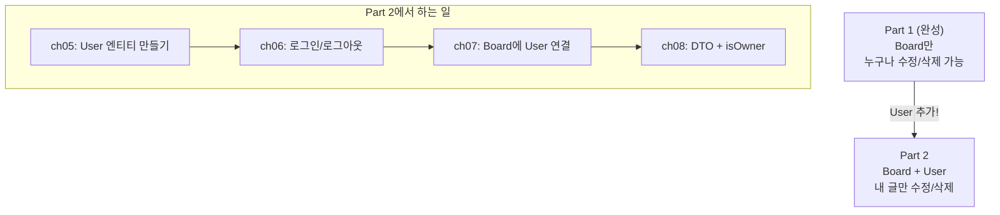
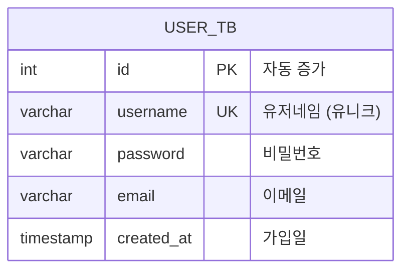

# Chapter 05. User 엔티티 + UserRepository

> **선수 조건**: [Part 1 (ch01~ch04)](part1-ch04-board-crud.md)을 모두 완료하세요.
>
> **Part 2에서 달라지는 것**: 이제 "누가 이 글을 썼는지" 알 수 있도록 **User(사용자)** 를 추가합니다!

---

## 5.1 Part 2의 큰 그림



> **예시**: Part 1은 아무나 들어올 수 있는 **공개 게시판**이었어요.
> Part 2에서는 **이름표(로그인)** 를 달아야 글을 쓸 수 있고, **내 이름표가 붙은 글만** 수정/삭제할 수 있게 됩니다!

---

## 5.2 User 테이블 설계



| 컬럼 | 타입 | 설명 | 제약조건 |
|------|------|------|---------|
| `id` | int | 유저 번호 | PK, 자동 증가 |
| `username` | varchar | 로그인 아이디 | **UNIQUE** (중복 불가!) |
| `password` | varchar | 비밀번호 | NOT NULL |
| `email` | varchar | 이메일 | null 가능 |
| `created_at` | timestamp | 가입일 | 자동 생성 |

> **UNIQUE란?** "같은 값이 두 개 있으면 안 돼!"
>
> **예시**: 학교에서 학생 번호는 겹칠 수 없잖아요? 1번 학생이 두 명이면 안 됩니다!
> username도 마찬가지입니다. `ssar`이라는 아이디는 한 명만 쓸 수 있어요.

---

## 5.3 User 엔티티 작성하기

### 실습 코드

`src/main/java/com/example/boardv1/user/User.java`

```java
package com.example.boardv1.user;

import java.time.LocalDateTime;

import org.hibernate.annotations.CreationTimestamp;

import jakarta.persistence.Column;
import jakarta.persistence.Entity;
import jakarta.persistence.GeneratedValue;
import jakarta.persistence.GenerationType;
import jakarta.persistence.Id;
import jakarta.persistence.Table;
import lombok.Data;
import lombok.NoArgsConstructor;

@NoArgsConstructor
@Data
@Entity
@Table(name = "user_tb")
public class User {
    @GeneratedValue(strategy = GenerationType.IDENTITY)
    @Id
    private Integer id;

    @Column(unique = true)
    private String username;

    @Column(nullable = false, length = 100)
    private String password;

    private String email;

    @CreationTimestamp
    private LocalDateTime createdAt;
}
```

### 새로 나온 어노테이션

#### @Column(unique = true)

```java
@Column(unique = true)
private String username;
```

> **"이 컬럼의 값은 절대 겹치면 안 돼!"**
>
> `ssar`이라는 username으로 이미 가입한 사람이 있으면, 또 다른 사람이 `ssar`로 가입하려고 하면 **에러가 발생**합니다!

#### @Column(nullable = false, length = 100)

```java
@Column(nullable = false, length = 100)
private String password;
```

> - `nullable = false` → **NULL 불가** (비밀번호는 반드시 입력해야 함!)
> - `length = 100` → **최대 100자**

#### email은 @Column이 없음

```java
private String email;  // null 가능!
```

> `@Column` 어노테이션이 없으면 기본값이 적용됩니다:
> - `nullable = true` (빈 값 허용)
> - `length = 255` (기본 최대 길이)
>
> 이메일은 선택 입력이므로 null을 허용합니다.

---

## 5.4 UserRepository 작성하기

### 실습 코드

`src/main/java/com/example/boardv1/user/UserRepository.java`

```java
package com.example.boardv1.user;

import java.util.Optional;

import org.springframework.stereotype.Repository;

import jakarta.persistence.EntityManager;
import lombok.RequiredArgsConstructor;

@RequiredArgsConstructor
@Repository
public class UserRepository {

    private final EntityManager em;

    public User save(User user) {
        em.persist(user);
        return user;
    }

    public Optional<User> findByUsername(String username) {
        try {
            User user = em.createQuery("select u from User u where u.username = :username", User.class)
                    .setParameter("username", username)
                    .getSingleResult();
            return Optional.of(user);
        } catch (Exception e) {
            return Optional.ofNullable(null);
        }
    }

    public Optional<User> findById(int id) {
        User findUser = em.find(User.class, id);
        return Optional.ofNullable(findUser);
    }
}
```

### 코드 해설

#### save - 회원가입 시 사용

```java
public User save(User user) {
    em.persist(user);
    return user;
}
```

> **SQL:** `INSERT INTO user_tb (username, password, email, created_at) VALUES (?, ?, ?, ?)`

#### findByUsername - 로그인 시 사용

```java
public Optional<User> findByUsername(String username) {
    try {
        User user = em.createQuery("select u from User u where u.username = :username", User.class)
                .setParameter("username", username)
                .getSingleResult();
        return Optional.of(user);
    } catch (Exception e) {
        return Optional.ofNullable(null);
    }
}
```

> **SQL:** `SELECT * FROM user_tb WHERE username = 'ssar'`
>
> **왜 try-catch를 쓰나요?**
> `getSingleResult()`는 결과가 없으면 **예외**를 던집니다!
> 로그인 시 없는 아이디를 입력하면 예외가 발생하므로, catch에서 빈 Optional을 반환합니다.
>
> **예시**: 도서관에서 "홍길동 책 있어요?" 물으면
> - 있으면: "여기요!" (Optional.of)
> - 없으면: "그 책은 없습니다" (Optional.empty)

#### :username (파라미터 바인딩)

```java
.setParameter("username", username)
```

> `:username`은 **자리 표시자**입니다. 실제 값을 나중에 넣어줍니다.
>
> ```
> JPQL: select u from User u where u.username = :username
>       setParameter("username", "ssar")
> → SQL: SELECT * FROM user_tb WHERE username = 'ssar'
> ```
>
> **왜 직접 안 넣고 파라미터를 쓰나요?** **SQL Injection 방지!** (보안)

---

## 5.5 data.sql 업그레이드

Part 1에서는 Board 데이터만 있었지만, Part 2에서는 **User 데이터도 추가**합니다.

`src/main/resources/db/data.sql`

```sql
-- User 데이터 (Part 2에서 추가!)
insert into user_tb(username, password, email, created_at) values('ssar', '1234', 'ssar@nate.com', now());
insert into user_tb(username, password, email, created_at) values('cos', '1234', 'cos@nate.com', now());

-- Board 데이터 (Part 1에서 만든 것 + user_id 추가!)
insert into board_tb(user_id, title, content, created_at) values(1, '제목1', '내용1', now());
insert into board_tb(user_id, title, content, created_at) values(1, '제목2', '내용2', now());
insert into board_tb(user_id, title, content, created_at) values(1, '제목3', '내용3', now());
insert into board_tb(user_id, title, content, created_at) values(2, '제목4', '내용4', now());
insert into board_tb(user_id, title, content, created_at) values(2, '제목5', '내용5', now());
insert into board_tb(user_id, title, content, created_at) values(2, '제목6', '내용6', now());
```

> **변경 포인트:**
> - User 2명 추가 (ssar, cos)
> - Board에 `user_id` 컬럼 추가 → 누가 쓴 글인지 알 수 있음!
> - ssar(id=1)이 제목1~3, cos(id=2)가 제목4~6을 작성

---

## 5.6 UserRepository 테스트

### 실습 코드

`src/test/java/com/example/boardv1/user/UserRepositoryTest.java`

```java
package com.example.boardv1.user;

import org.junit.jupiter.api.Test;
import org.springframework.beans.factory.annotation.Autowired;
import org.springframework.boot.data.jpa.test.autoconfigure.DataJpaTest;
import org.springframework.context.annotation.Import;

@Import(UserRepository.class)
@DataJpaTest
public class UserRepositoryTest {

    @Autowired
    private UserRepository userRepository;

    @Test
    public void findById_test() {
        int id = 1;

        User user = userRepository.findById(id)
                .orElseThrow(() -> new RuntimeException("해당 아이디로 유저를 찾을 수 없어요"));

        System.out.println("user : " + user);
    }

    @Test
    public void save_fail_test() {
        // given - 이미 data.sql에 cos가 존재함!
        User user = new User();
        user.setUsername("cos");    // 중복된 username!
        user.setPassword("1234");
        user.setEmail("cos@nate.com");

        // when
        User findUser = userRepository.save(user);

        // eye
        System.out.println(findUser);
    }

    @Test
    public void save_test() {
        // given - 새로운 username
        User user = new User();
        user.setUsername("love");
        user.setPassword("1234");
        user.setEmail("love@nate.com");

        // when
        User findUser = userRepository.save(user);

        // eye
        System.out.println(findUser);
    }

    @Test
    public void findByUsername_test() {
        // given
        String username = "ssar";

        // when
        User findUser = userRepository.findByUsername(username)
                .orElseThrow(() -> new RuntimeException("해당 user를 찾을 수 없어요"));

        // eye
        System.out.println(findUser);
    }
}
```

### 테스트 해설

#### save_fail_test - UNIQUE 제약조건 위반

> data.sql에 이미 `cos`가 있는데, 같은 username으로 INSERT하면?
>
> ```
> ConstraintViolationException!  ← UNIQUE 위반 에러 발생!
> ```
>
> **예시**: 같은 반에 학생 번호 1번이 두 명이면 안 되는 것처럼, username도 중복되면 안 됩니다!

---

## 실행 확인

1. `UserRepositoryTest` 클래스를 우클릭 → Run Test
2. `findById_test` → User(id=1, username=ssar) 출력 확인
3. `save_fail_test` → **에러 발생** (UNIQUE 위반) 확인
4. `save_test` → User(id=3, username=love) 출력 확인
5. `findByUsername_test` → User(username=ssar) 출력 확인

### 이 시점의 파일 구조

```
src/main/java/com/example/boardv1/
├── Boardv1Application.java
├── board/
│   ├── Board.java
│   ├── BoardRepository.java
│   ├── BoardRequest.java
│   ├── BoardService.java
│   └── BoardController.java
└── user/                          ← 이번 챕터에서 추가!
    ├── User.java                  ← 이번 챕터
    └── UserRepository.java        ← 이번 챕터
```

---

## 핵심 정리

- **User 엔티티**: 사용자 정보를 담는 클래스 (username, password, email)
- **@Column(unique = true)**: 중복 불가 (username은 한 명만!)
- **@Column(nullable = false)**: NULL 불가 (비밀번호는 필수!)
- **findByUsername**: JPQL로 username 기반 조회
- **파라미터 바인딩** (`:username`): SQL Injection 방지
- **Optional**: null 안전한 반환 타입 (빈 택배 상자)
- data.sql에 **User 데이터 추가** + Board에 **user_id 추가**

> **다음 챕터**: [Chapter 06. 회원가입과 로그인](part2-ch06-login.md) - User를 만들었으니, 이제 로그인/로그아웃을 구현합니다!
