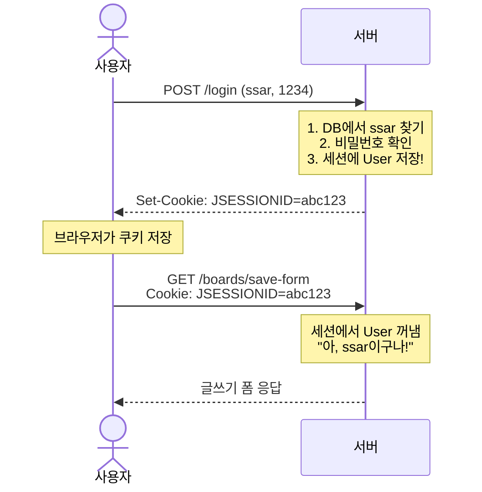
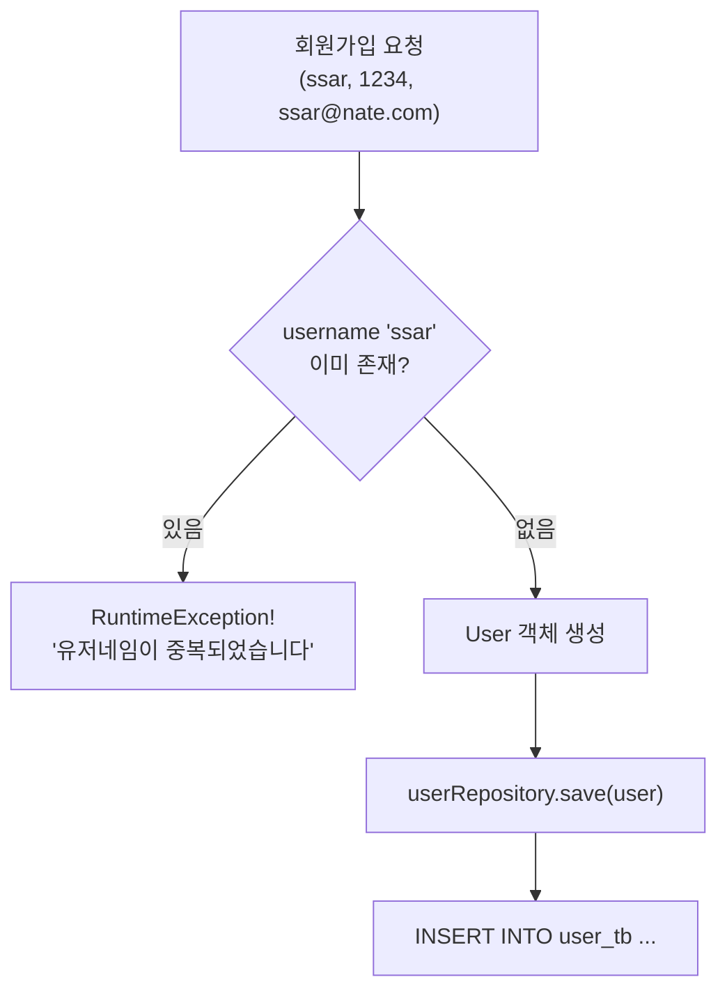
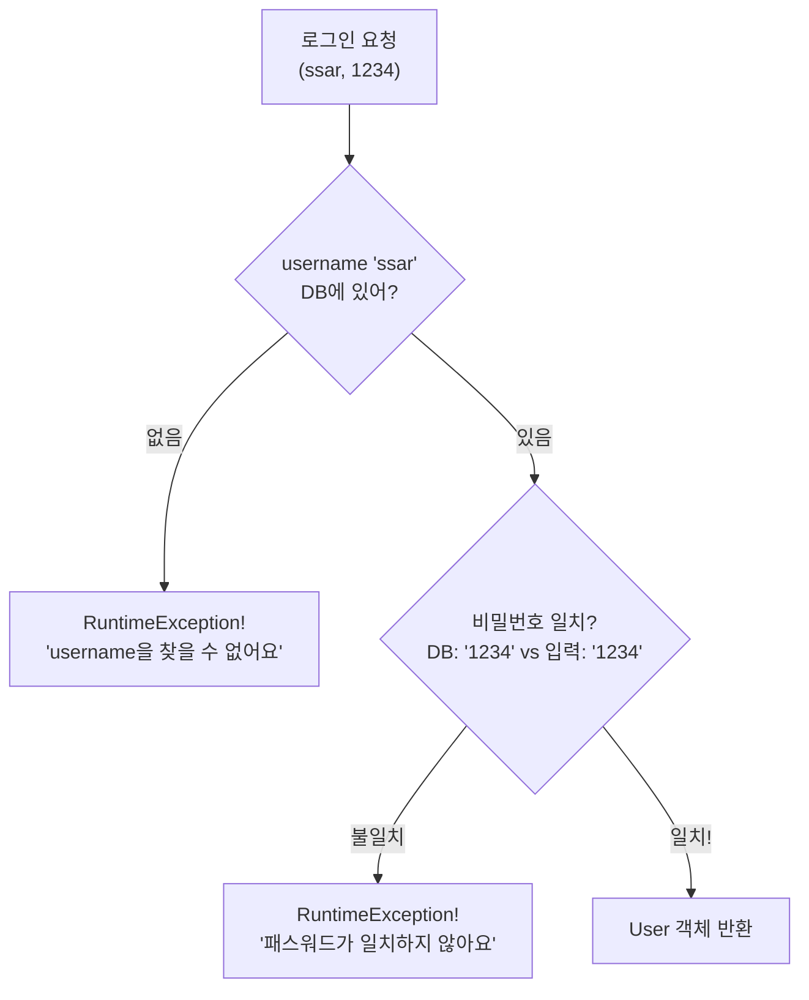

# Chapter 06. 회원가입과 로그인

> **선수 조건**: [Chapter 05. User 엔티티](part2-ch05-user-entity.md)를 완료하세요.

---

## 6.1 로그인이란?

> **예시**: 놀이공원 입장을 생각해보세요!
>
> | 놀이공원 | 웹 사이트 |
> |---------|----------|
> | 입장권 구매 | **회원가입** |
> | 입장 게이트 통과 | **로그인** |
> | 손목에 밴드 채움 | **세션(Session) 생성** |
> | 밴드 보여주면 놀이기구 탈 수 있음 | 세션이 있으면 글쓰기 가능 |
> | 퇴장 | **로그아웃** (세션 삭제) |

### Session(세션)이란?



> **세션 = 서버가 기억하는 손목 밴드**
>
> - 로그인하면 서버가 "이 사람은 ssar이야"라고 기억합니다 (세션에 저장)
> - 다음에 요청할 때 쿠키(JSESSIONID)를 보내면, 서버가 "아, ssar이구나" 하고 알아봅니다
> - 로그아웃하면 서버가 기억을 지웁니다 (세션 삭제)

---

## 6.2 UserRequest (요청 DTO)

`src/main/java/com/example/boardv1/user/UserRequest.java`

```java
package com.example.boardv1.user;

import lombok.Data;

public class UserRequest {

    @Data
    public static class LoginDTO {
        private String username;
        private String password;
    }

    @Data
    public static class JoinDTO {
        private String username;
        private String password;
        private String email;
    }
}
```

> **LoginDTO**: 로그인할 때 필요한 정보 (아이디, 비밀번호)
> **JoinDTO**: 회원가입할 때 필요한 정보 (아이디, 비밀번호, 이메일)

---

## 6.3 UserService - 비즈니스 로직

`src/main/java/com/example/boardv1/user/UserService.java`

```java
package com.example.boardv1.user;

import java.util.Optional;

import org.springframework.stereotype.Service;
import org.springframework.transaction.annotation.Transactional;

import lombok.RequiredArgsConstructor;

@RequiredArgsConstructor
@Service
public class UserService {
    private final UserRepository userRepository;

    @Transactional
    public void 회원가입(String username, String password, String email) {
        // 1. 유저네임 중복체크
        Optional<User> optUser = userRepository.findByUsername(username);
        if (optUser.isPresent()) {
            throw new RuntimeException("유저네임이 중복되었습니다");
        }

        // 2. User 객체 생성
        User user = new User();
        user.setUsername(username);
        user.setPassword(password);
        user.setEmail(email);

        // 3. DB에 저장
        userRepository.save(user);
    }

    public User 로그인(String username, String password) {
        // 1. username으로 User 찾기
        User findUser = userRepository.findByUsername(username)
                .orElseThrow(() -> new RuntimeException("username을 찾을 수 없어요"));

        // 2. 비밀번호 비교
        if (!findUser.getPassword().equals(password)) {
            throw new RuntimeException("패스워드가 일치하지 않아요");
        }

        return findUser;
    }
}
```

### 코드 해설

#### 회원가입 흐름



#### 로그인 흐름



> **예시**: ATM 기계 사용을 생각해보세요!
> 1. 카드 넣기 → "이 계좌번호 있어?" (findByUsername)
> 2. 비밀번호 입력 → "비밀번호 맞아?" (password.equals)
> 3. 둘 다 통과 → "출금 가능!" (User 반환)

---

## 6.4 UserController - 요청 처리

`src/main/java/com/example/boardv1/user/UserController.java`

```java
package com.example.boardv1.user;

import org.springframework.stereotype.Controller;
import org.springframework.web.bind.annotation.GetMapping;
import org.springframework.web.bind.annotation.PostMapping;

import jakarta.servlet.http.HttpSession;
import lombok.RequiredArgsConstructor;

@RequiredArgsConstructor
@Controller
public class UserController {

    private final UserService userService;
    private final HttpSession session;

    @PostMapping("/join")
    public String join(UserRequest.JoinDTO reqDTO) {
        userService.회원가입(reqDTO.getUsername(), reqDTO.getPassword(), reqDTO.getEmail());
        return "redirect:/login-form";
    }

    @PostMapping("/login")
    public String login(UserRequest.LoginDTO reqDTO) {
        User sessionUser = userService.로그인(reqDTO.getUsername(), reqDTO.getPassword());
        session.setAttribute("sessionUser", sessionUser);
        return "redirect:/";
    }

    @GetMapping("/logout")
    public String logout() {
        session.invalidate();
        return "redirect:/";
    }

    @GetMapping("/login-form")
    public String loginForm() {
        return "user/login-form";
    }

    @GetMapping("/join-form")
    public String joinForm() {
        return "user/join-form";
    }
}
```

### 코드 해설

#### session.setAttribute - 세션에 저장

```java
session.setAttribute("sessionUser", sessionUser);
```

> **"이 사용자를 기억해!"** 서버의 세션 저장소에 User 객체를 넣습니다.
>
> **예시**: 놀이공원에서 손목 밴드에 "VIP"라고 적는 것!
> 나중에 밴드를 보여주면(쿠키 전송) → "아, VIP시군요!" (세션에서 User 꺼냄)

#### session.invalidate - 로그아웃

```java
session.invalidate();
```

> **"기억 지워!"** 세션을 완전히 삭제합니다.
>
> **예시**: 놀이공원에서 손목 밴드를 잘라버리는 것!

---

## 6.5 뷰 템플릿 만들기

### header.mustache 업그레이드

Part 1의 header에서 **로그인 상태에 따라 메뉴가 바뀌도록** 업그레이드합니다!

`src/main/resources/templates/header.mustache`

```html
<!DOCTYPE html>
<html lang="en">
<head>
  <meta charset="utf-8">
  <meta name="viewport" content="width=device-width, initial-scale=1">
  <link href="https://cdn.jsdelivr.net/npm/bootstrap@5.3.3/dist/css/bootstrap.min.css" rel="stylesheet">
  <script src="https://cdn.jsdelivr.net/npm/bootstrap@5.3.3/dist/js/bootstrap.bundle.min.js"></script>
</head>
<body>

<nav class="navbar navbar-expand-sm" style="background-color: grey;">
  <div class="container-fluid">
    <ul class="navbar-nav">
      <li class="nav-item">
        <a class="nav-link" href="/" style="font-weight: bold; color: white">게시판</a>
      </li>

      {{#sessionUser}}
      <li class="nav-item">
        <a class="nav-link" href="/boards/save-form" style="color: white">글쓰기</a>
      </li>
      <li class="nav-item">
        <a class="nav-link" href="/logout" style="color: white">로그아웃</a>
      </li>
      {{/sessionUser}}
      {{^sessionUser}}
      <li class="nav-item">
        <a class="nav-link" href="/join-form" style="color: white">회원가입</a>
      </li>
      <li class="nav-item">
        <a class="nav-link" href="/login-form" style="color: white">로그인</a>
      </li>
      {{/sessionUser}}

    </ul>
  </div>
</nav>
```

### Mustache 조건문 문법

```html
{{#sessionUser}}   ← sessionUser가 있으면 (로그인 상태)
  글쓰기, 로그아웃 버튼
{{/sessionUser}}

{{^sessionUser}}   ← sessionUser가 없으면 (비로그인 상태)
  회원가입, 로그인 버튼
{{/sessionUser}}
```

> | 기호 | 의미 | 예시 |
> |------|------|------|
> | `{{#변수}}` | 변수가 있으면 보여줘 | `{{#sessionUser}}` → 로그인 시 |
> | `{{^변수}}` | 변수가 없으면 보여줘 | `{{^sessionUser}}` → 비로그인 시 |
>
> **예시**: 놀이공원 입구에서
> - 밴드 있으면(#) → "VIP 전용 통로"로 안내
> - 밴드 없으면(^) → "입장권 구매 창구"로 안내

### login-form.mustache

`src/main/resources/templates/user/login-form.mustache`

```html
{{> header}}

<div class="container p-5">
    <div class="card">
        <div class="card-header"><b>로그인 페이지</b></div>
        <div class="card-body">
            <form action="/login" method="post" enctype="application/x-www-form-urlencoded">
                <div class="mb-3">
                    <input type="text" class="form-control" placeholder="Enter username" name="username" required>
                </div>
                <div class="mb-3">
                    <input type="password" class="form-control" placeholder="Enter password" name="password" required>
                </div>
                <button class="btn btn-secondary form-control">로그인</button>
            </form>
        </div>
    </div>
</div>

</body>
</html>
```

### join-form.mustache

`src/main/resources/templates/user/join-form.mustache`

```html
{{> header}}

<div class="container p-5">
    <div class="card">
        <div class="card-header"><b>회원가입 페이지</b></div>
        <div class="card-body">
            <form action="/join" method="post" enctype="application/x-www-form-urlencoded">
                <div class="mb-3">
                    <input type="text" class="form-control" placeholder="Enter username" name="username" required>
                </div>
                <div class="mb-3">
                    <input type="password" class="form-control" placeholder="Enter password" name="password" required>
                </div>
                <div class="mb-3">
                    <input type="email" class="form-control" placeholder="Enter email" name="email" required>
                </div>
                <button class="btn btn-secondary form-control">회원가입</button>
            </form>
        </div>
    </div>
</div>

</body>
</html>
```

---

## 6.6 BoardController 업그레이드 - 인증 체크 추가

Part 1에서는 누구나 글을 쓸 수 있었지만, 이제 **로그인한 사용자만** 글을 쓸 수 있습니다!

`BoardController.java`에서 변경되는 부분:

```java
// Part 1 (로그인 없음)
@PostMapping("/boards/save")
public String save(BoardRequest.SaveOrUpdateDTO reqDTO) {
    boardService.게시글쓰기(reqDTO.getTitle(), reqDTO.getContent());
    return "redirect:/";
}

// Part 2 (인증 체크 추가!)
@PostMapping("/boards/save")
public String save(BoardRequest.SaveOrUpdateDTO reqDTO) {
    // 인증 체크 - 로그인했는지 확인!
    User sessionUser = (User) session.getAttribute("sessionUser");
    if (sessionUser == null)
        throw new RuntimeException("인증되지 않았습니다.");

    boardService.게시글쓰기(reqDTO.getTitle(), reqDTO.getContent(), sessionUser);
    return "redirect:/";
}
```

> **인증(Authentication)이란?** "너 누구야?" 확인하는 것!
>
> **예시**: 영화관에서 티켓 확인하는 것
> - 티켓 있으면 → 입장!
> - 티켓 없으면 → "티켓 없으시면 못 들어갑니다!" (RuntimeException)

---

## 실행 확인

서버를 재시작하고 다음을 확인하세요:

1. `http://localhost:8080` → 네비게이션에 "회원가입", "로그인" 버튼이 보이는지
2. 회원가입 → username: `test`, password: `1234`, email: `test@test.com` → 로그인 페이지로 이동
3. 로그인 → username: `ssar`, password: `1234` → 메인 페이지로 이동
4. 로그인 후 → 네비게이션에 "글쓰기", "로그아웃" 버튼이 보이는지
5. 로그아웃 → 다시 "회원가입", "로그인" 버튼이 보이는지

### 이 시점의 파일 구조

```
src/main/java/com/example/boardv1/
├── board/ (기존 유지)
└── user/
    ├── User.java                ← ch05
    ├── UserRepository.java      ← ch05
    ├── UserRequest.java         ← 이번 챕터
    ├── UserService.java         ← 이번 챕터
    └── UserController.java      ← 이번 챕터

src/main/resources/templates/
├── header.mustache              ← 이번 챕터에서 업그레이드!
└── user/
    ├── login-form.mustache      ← 이번 챕터
    └── join-form.mustache       ← 이번 챕터
```

---

## 핵심 정리

- **Session(세션)**: 서버가 로그인한 사용자를 기억하는 방법 (손목 밴드)
- **session.setAttribute()**: 세션에 데이터 저장 (밴드 채우기)
- **session.getAttribute()**: 세션에서 데이터 꺼내기 (밴드 확인하기)
- **session.invalidate()**: 세션 삭제 (밴드 자르기 = 로그아웃)
- **Mustache 조건문**: `{{#변수}}` (있으면), `{{^변수}}` (없으면)
- **인증 체크**: `sessionUser == null` → "로그인 안 했네!" → 에러
- header.mustache를 **업그레이드**하면 모든 페이지에 자동 적용!

> **다음 챕터**: [Chapter 07. Board + User 관계](part2-ch07-board-user.md) - Board에 "누가 썼는지" User를 연결합니다!
