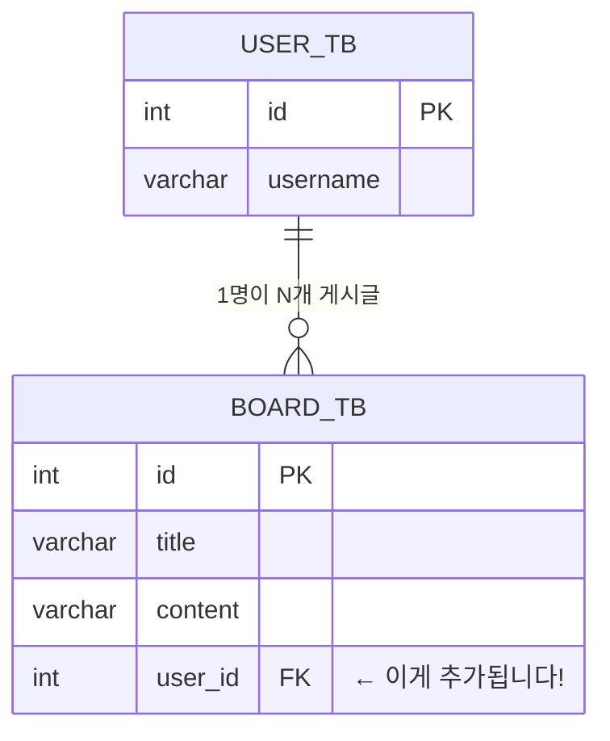
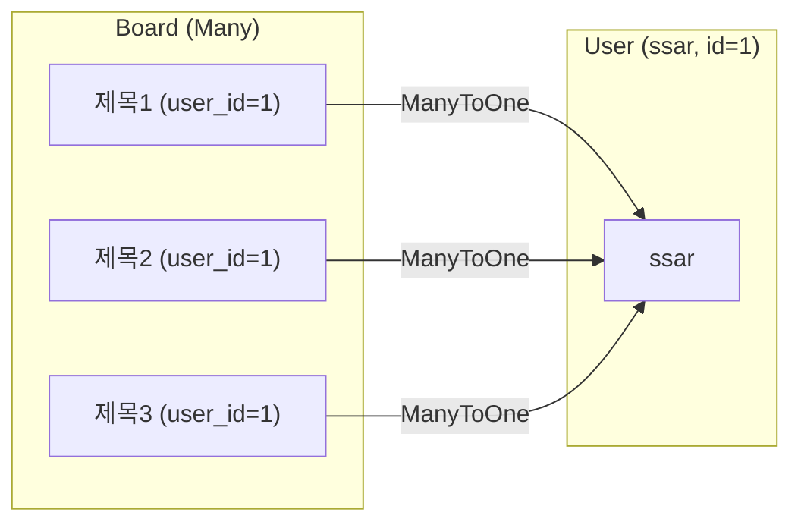

# Chapter 07. Board + User 관계 - @ManyToOne과 FetchType

> **선수 조건**: [Chapter 06. 회원가입과 로그인](part2-ch06-login.md)을 완료하세요.

---

## 7.1 관계의 필요성

> Part 1에서 Board에는 "누가 쓴 글인지" 정보가 없었습니다.
> 이제 Board에 User를 연결해서 **"이 글은 ssar이 썼어!"** 를 표현합니다.



> **예시**: 도서관 도서 카드를 생각해보세요!
> - Part 1: 책 정보만 있음 (제목, 내용)
> - Part 2: **"누가 빌렸는지"** 정보 추가 (대출자 = user_id)
>
> 1명의 사용자(User)가 여러 개의 게시글(Board)을 쓸 수 있으므로 **1:N 관계**입니다.

---

## 7.2 Board 엔티티 업그레이드

### Part 1 → Part 2 변경점

```java
// Part 1의 Board (User 없음)
public class Board {
    private Integer id;
    private String title;
    private String content;
    private Timestamp createdAt;
}

// Part 2의 Board (User 추가!)
public class Board {
    private Integer id;
    private String title;
    private String content;

    @ManyToOne(fetch = FetchType.EAGER)    // ← 추가!
    private User user;                      // ← 추가!

    private Timestamp createdAt;
}
```

### 수정된 Board 전체 코드

`src/main/java/com/example/boardv1/board/Board.java`

```java
package com.example.boardv1.board;

import java.sql.Timestamp;

import org.hibernate.annotations.CreationTimestamp;

import com.example.boardv1.user.User;

import jakarta.persistence.Entity;
import jakarta.persistence.FetchType;
import jakarta.persistence.GeneratedValue;
import jakarta.persistence.GenerationType;
import jakarta.persistence.Id;
import jakarta.persistence.ManyToOne;
import jakarta.persistence.Table;
import lombok.Data;
import lombok.NoArgsConstructor;

@NoArgsConstructor
@Data
@Entity
@Table(name = "board_tb")
public class Board {
    @Id
    @GeneratedValue(strategy = GenerationType.IDENTITY)
    private Integer id;
    private String title;
    private String content;

    @ManyToOne(fetch = FetchType.EAGER)
    private User user; // DB에 user_id 컬럼이 생성됨!

    @CreationTimestamp
    private Timestamp createdAt;
}
```

---

## 7.3 @ManyToOne 이해하기

```java
@ManyToOne(fetch = FetchType.EAGER)
private User user;
```

> **"Board **Many**개가 User **One**에 속한다"** = N:1 관계



> **예시**: 반과 학생 관계를 생각해보세요!
> - 반 **1개** ← 학생 **여러 명**
> - User **1명** ← Board **여러 개**
>
> Board 입장에서 "나를 쓴 사람은 **한 명**" → `@ManyToOne`

### DB에서는 어떻게 될까?

```
board_tb 테이블:
| id | title | content | user_id | created_at |
|----|-------|---------|---------|------------|
| 1  | 제목1 | 내용1   | 1       | ...        |  ← ssar(id=1)이 작성
| 2  | 제목2 | 내용2   | 1       | ...        |  ← ssar(id=1)이 작성
| 4  | 제목4 | 내용4   | 2       | ...        |  ← cos(id=2)가 작성
```

> `private User user;` → DB에는 `user_id` **외래 키(FK)** 컬럼이 자동 생성됩니다!
> JPA가 Java의 객체 참조(`User user`)를 DB의 FK(`user_id`)로 자동 변환해줍니다.

---

## 7.4 FetchType - EAGER vs LAZY

### EAGER (즉시 로딩)

```java
@ManyToOne(fetch = FetchType.EAGER)
private User user;
```

> **"Board를 가져올 때 User도 같이 가져와!"**
>
> **예시**: 편의점에서 도시락을 사면 젓가락이 **자동으로 같이** 나오는 것!

```sql
-- Board를 조회하면 User도 JOIN해서 한 번에 가져옴
SELECT b.*, u.*
FROM board_tb b
LEFT JOIN user_tb u ON b.user_id = u.id
WHERE b.id = 1
```

### LAZY (지연 로딩)

```java
@ManyToOne(fetch = FetchType.LAZY)
private User user;
```

> **"Board만 먼저 가져오고, User는 필요할 때 가져와!"**
>
> **예시**: 편의점에서 도시락을 사고, 젓가락은 **필요할 때 따로 달라고** 하는 것!

```sql
-- 1단계: Board만 조회
SELECT * FROM board_tb WHERE id = 1

-- 2단계: user.getUsername() 호출할 때 비로소 User 조회!
SELECT * FROM user_tb WHERE id = 1
```

### EAGER vs LAZY 비교

| 항목 | EAGER (즉시) | LAZY (지연) |
|------|-------------|-------------|
| 비유 | 도시락 + 젓가락 자동 세트 | 도시락만, 젓가락은 나중에 |
| 쿼리 수 | 1번 (JOIN) | 2번 (SELECT + SELECT) |
| 장점 | 한 번에 다 가져옴 | 필요할 때만 가져옴 |
| 단점 | 안 쓰는 데이터도 가져옴 | **N+1 문제** 발생 가능! |

> **N+1 문제가 뭐예요?** 뒤에서 테스트로 직접 확인합니다!

---

## 7.5 BoardRepository 업그레이드 - JOIN FETCH 추가

User를 LAZY로 설정한 경우, 한 번의 쿼리로 Board + User를 함께 가져오려면 **JOIN FETCH**를 사용합니다.

`BoardRepository.java`에 추가:

```java
public Optional<Board> findByIdJoinUser(int id) {
    Query query = em.createQuery(
        "select b from Board b join fetch b.user u where b.id = :id", Board.class);
    query.setParameter("id", id);
    try {
        Board board = (Board) query.getSingleResult();
        return Optional.of(board);
    } catch (Exception e) {
        return Optional.ofNullable(null);
    }
}
```

> **JOIN FETCH란?** "Board를 가져올 때 User도 **한 방에** 가져와!"
>
> ```sql
> SELECT b.*, u.*
> FROM board_tb b
> JOIN user_tb u ON b.user_id = u.id
> WHERE b.id = 1
> ```
>
> LAZY 설정이어도 JOIN FETCH를 쓰면 **1번의 쿼리**로 Board + User를 가져옵니다!

---

## 7.6 테스트로 쿼리 차이 확인하기

### 테스트 1: LAZY 로딩 - N+1 문제 확인

```java
@Test
public void part2_findById_lazy_n_plus_1_test() {
    System.out.println("===== [Part 2] findById 호출 - Lazy Loading =====");
    Board board = boardRepository.findById(1)
            .orElseThrow(() -> new RuntimeException("게시글을 찾을 수 없어요"));
    System.out.println("===== board 조회 완료 =====");

    // User 접근 시 추가 쿼리 발생 (N+1!)
    System.out.println("===== user.username 접근 시작 =====");
    String username = board.getUser().getUsername();
    System.out.println("===== user.username 접근 완료: " + username + " =====");
}
```

> **콘솔에서 확인:**
> ```
> ===== board 조회 완료 =====
> SELECT * FROM board_tb WHERE id = 1          ← 1번째 쿼리
> ===== user.username 접근 시작 =====
> SELECT * FROM user_tb WHERE id = 1           ← 2번째 쿼리 (N+1!)
> ===== user.username 접근 완료: ssar =====
> ```
>
> Board 가져오는데 1번, User 가져오는데 +1번 = **총 2번 쿼리!**

### 테스트 2: JOIN FETCH - N+1 해결

```java
@Test
public void part2_findByIdJoinUser_no_n_plus_1_test() {
    System.out.println("===== [Part 2] findByIdJoinUser 호출 - JOIN FETCH =====");
    Board board = boardRepository.findByIdJoinUser(1)
            .orElseThrow(() -> new RuntimeException("게시글을 찾을 수 없어요"));
    System.out.println("===== JOIN FETCH로 board + user 조회 완료 =====");

    // User 접근 시 추가 쿼리 없음!
    String username = board.getUser().getUsername();
    System.out.println("===== user.username: " + username + " (추가 쿼리 없음) =====");
}
```

> **콘솔에서 확인:**
> ```
> SELECT b.*, u.* FROM board_tb b
> JOIN user_tb u ON b.user_id = u.id
> WHERE b.id = 1                                ← 단 1번의 쿼리!
> ===== user.username: ssar (추가 쿼리 없음) =====
> ```

### 테스트 3: findAll + N+1 문제

```java
@Test
public void part2_findAll_n_plus_1_test() {
    List<Board> boards = boardRepository.findAll();
    // ← 1번 쿼리: SELECT * FROM board_tb

    for (Board board : boards) {
        String username = board.getUser().getUsername();
        // ← Board마다 User 쿼리 발생! (N번 추가!)
    }
    // 총: 1 + N번 쿼리 = N+1 문제!
}
```

> **N+1 문제란?**
>
> **예시**: 반장이 출석부를 부르는 상황을 생각해보세요.
> - 1번 쿼리: "전체 게시글 목록 가져와!" → 6개 게시글
> - +N번 쿼리: 게시글 1번의 작성자 누구? → SELECT
>   게시글 2번의 작성자 누구? → SELECT
>   ...
>   게시글 6번의 작성자 누구? → SELECT
>
> **총 7번 쿼리!** (1 + 6 = 7) 게시글이 100개면 101번!
>
> **Part 3에서 `batch_fetch_size` 설정으로 해결합니다!**

---

## 7.7 BoardService 업그레이드 - User 세팅

게시글을 쓸 때 "누가 썼는지" User를 세팅해야 합니다.

```java
// Part 1
public void 게시글쓰기(String title, String content) {
    Board board = new Board();
    board.setTitle(title);
    board.setContent(content);
    boardRepository.save(board);
}

// Part 2 (User 세팅 추가!)
@Transactional
public void 게시글쓰기(String title, String content, User sessionUser) {
    Board board = new Board();
    board.setTitle(title);
    board.setContent(content);
    board.setUser(sessionUser);   // ← 누가 썼는지 세팅!
    boardRepository.save(board);
}
```

---

## 실행 확인

1. 로그인(`ssar` / `1234`) → 글쓰기 → 게시글이 생성되는지
2. H2 콘솔에서 `SELECT * FROM BOARD_TB` → `user_id` 컬럼에 값이 들어있는지
3. `BoardRepositoryTest`의 Part 2 테스트 실행 → 콘솔에서 SQL 쿼리 확인

---

## 핵심 정리

- **@ManyToOne**: "Board N개가 User 1명에 속한다" (N:1 관계)
- **FetchType.EAGER**: Board 조회 시 User도 함께 가져옴 (JOIN)
- **FetchType.LAZY**: Board만 먼저, User는 필요할 때 가져옴
- **N+1 문제**: 목록 조회(1번) + 각 항목의 연관 데이터(N번) = N+1번 쿼리
- **JOIN FETCH**: N+1 문제를 해결하는 JPQL 기법
- Board에 `user_id` FK가 자동 생성됨
- 게시글 작성 시 `board.setUser(sessionUser)` 필수!

> **다음 챕터**: [Chapter 08. DTO와 isOwner](part2-ch08-dto-isowner.md) - "내 글인가?" 판별하고, 본인 글에만 수정/삭제 버튼을 보여줍니다!
