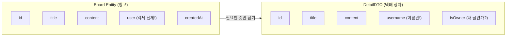
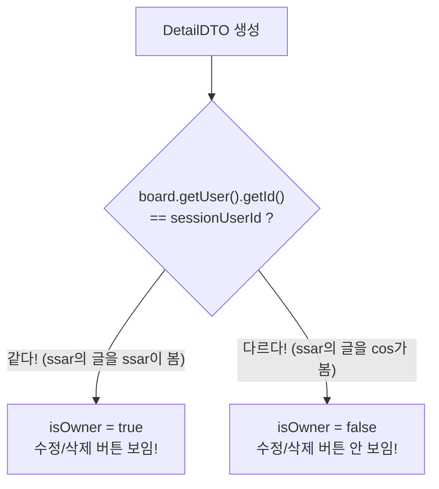
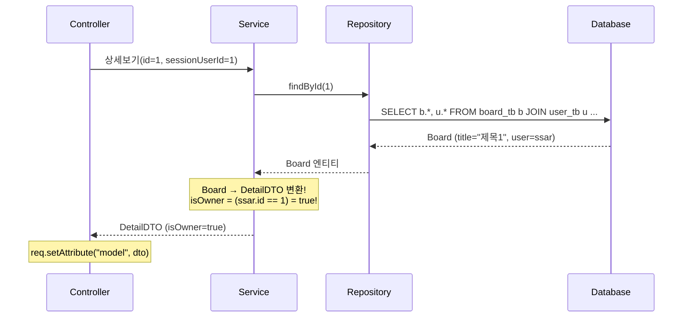
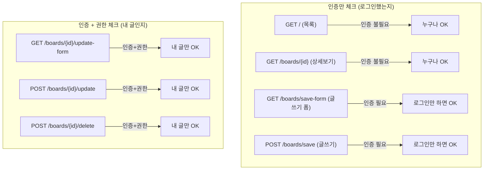
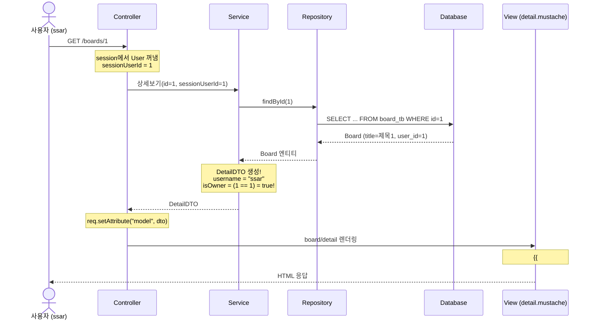
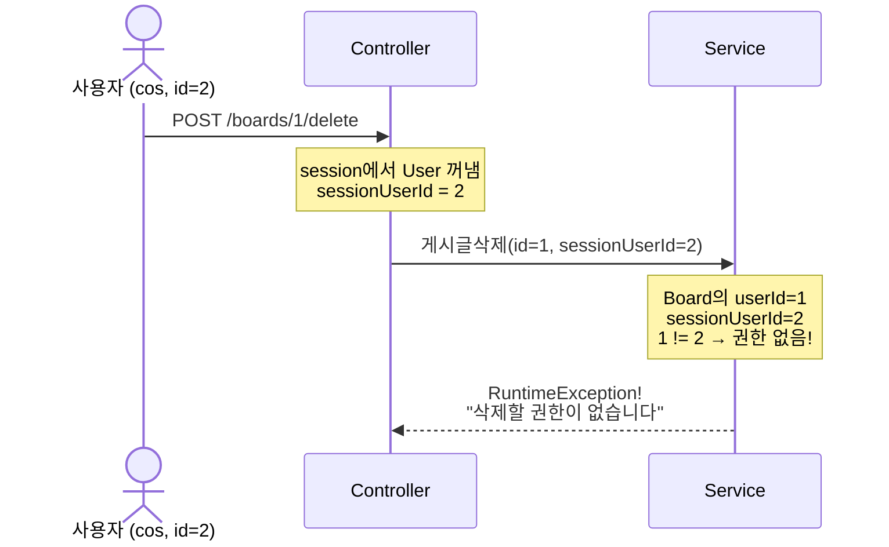

# Chapter 08. DTO와 isOwner - "내 글인가?" 판별하기

> **선수 조건**: [Chapter 07. Board + User 관계](part2-ch07-board-user.md)를 완료하세요.

---

## 8.1 왜 DTO가 필요할까?

### Part 1의 문제점

Part 1에서는 Board **엔티티를 그대로** 뷰에 넘겼습니다.

```java
// Part 1: Entity 직접 반환
Board board = boardRepository.findById(id).orElseThrow(...);
req.setAttribute("model", board);
```

> **문제 1: 불필요한 데이터 노출**
> Board 엔티티에는 DB의 모든 정보가 들어있습니다.
> 화면에 보여줄 필요 없는 `createdAt`, `user` 객체 전체가 노출됩니다!
>
> **문제 2: "내 글인가?" 판별 불가**
> Part 1에서는 누구나 수정/삭제 버튼이 보였습니다.
> Board 엔티티에는 "지금 보고 있는 사람이 글 주인인지" 정보가 없습니다!
>
> **문제 3: 화면에 맞는 데이터 가공이 어려움**
> "작성자: ssar" 같은 정보를 보여주려면 `board.getUser().getUsername()`을 호출해야 하는데,
> 뷰에서 직접 하면 복잡하고, Lazy 로딩이면 **추가 쿼리**가 발생합니다!

### DTO란?

> **DTO = Data Transfer Object** (데이터 전달 객체)
>
> **예시**: 택배 상자를 생각해보세요!
> - Entity = 창고에 있는 **모든 물건** (물건 100개)
> - DTO = 택배 상자에 **필요한 것만** 담아서 보냄 (물건 5개만)
>
> 창고에서 물건을 전부 보내는 게 아니라, **받는 사람이 필요한 것만** 상자에 담아서 보내는 겁니다!



> **Entity vs DTO 비교**
>
> | 항목 | Entity | DTO |
> |------|--------|-----|
> | 역할 | DB 테이블과 매핑 | 화면에 필요한 데이터만 |
> | 비유 | 창고의 모든 물건 | 택배 상자 (필요한 것만) |
> | 추가 정보 | 없음 (DB 그대로) | **isOwner** 같은 연산 결과 추가 가능! |
> | 보안 | 민감한 정보 포함 | 필요한 것만 노출 |

---

## 8.2 BoardResponse 만들기

### 응답 DTO 설계

`src/main/java/com/example/boardv1/board/BoardResponse.java`

```java
package com.example.boardv1.board;

import lombok.Data;

public class BoardResponse {

    @Data
    public static class DTO {
        private int id;
        private String title;
        private String content;

        public DTO(Board board) {
            this.id = board.getId();
            this.title = board.getTitle();
            this.content = board.getContent();
        }
    }

    @Data
    public static class DetailDTO {
        // 화면에 보이지 않는것
        private int id;
        private int userId;

        // 화면에 보이는것
        private String title;
        private String content;
        private String username;

        // 연산해서 만들어야 되는것
        private boolean isOwner; // 게시글의 주인인가?

        public DetailDTO(Board board, Integer sessionUserId) {
            this.id = board.getId();
            this.userId = board.getUser().getId();
            this.title = board.getTitle();
            this.content = board.getContent();
            this.username = board.getUser().getUsername();
            this.isOwner = board.getUser().getId() == sessionUserId;
        }
    }
}
```

### 코드 해설

#### DTO - 목록용 (간단한 정보만)

```java
@Data
public static class DTO {
    private int id;
    private String title;
    private String content;

    public DTO(Board board) {
        this.id = board.getId();
        this.title = board.getTitle();
        this.content = board.getContent();
    }
}
```

> 게시글 **목록**에서는 제목, 내용만 보여주면 충분합니다.
> Board 엔티티에서 필요한 것만 꺼내서 DTO에 담습니다.
>
> **예시**: 도서관 책 목록표 - 제목, 저자만 적혀있고, 전체 내용은 안 적혀있죠!

#### DetailDTO - 상세보기용 (isOwner 포함!)

```java
@Data
public static class DetailDTO {
    private int id;
    private int userId;
    private String title;
    private String content;
    private String username;       // ← User에서 꺼낸 이름!
    private boolean isOwner;       // ← 내 글인가? (연산 결과!)

    public DetailDTO(Board board, Integer sessionUserId) {
        this.id = board.getId();
        this.userId = board.getUser().getId();
        this.title = board.getTitle();
        this.content = board.getContent();
        this.username = board.getUser().getUsername();
        this.isOwner = board.getUser().getId() == sessionUserId;
    }
}
```

> **핵심은 `isOwner`입니다!**



> **예시**: 사물함을 생각해보세요!
> - 내 사물함(1번)에는 열쇠가 맞으니까 → **열 수 있음** (isOwner = true)
> - 친구 사물함(2번)에는 내 열쇠가 안 맞으니까 → **못 열음** (isOwner = false)
>
> `board.getUser().getId()` = 사물함 주인의 번호
> `sessionUserId` = 지금 열쇠를 들고 있는 사람의 번호
> 둘이 같으면 → **내 사물함!** (isOwner = true)

#### Integer sessionUserId - 왜 Integer일까?

```java
public DetailDTO(Board board, Integer sessionUserId) {
```

> `int`가 아니라 `Integer`를 쓴 이유:
> - **비로그인 사용자**는 세션에 User가 없으므로 `sessionUserId`가 **null**입니다!
> - `int`는 null을 담을 수 없지만, `Integer`는 **null 가능**!
>
> | 타입 | null 가능? | 사용 시점 |
> |------|-----------|----------|
> | `int` | 불가능 | 반드시 값이 있을 때 |
> | `Integer` | **가능** | null일 수 있을 때 |
>
> **예시**: 출석부에서
> - 학생이 있으면 → 번호가 있음 (`int`)
> - 손님(비회원)이 오면 → 번호가 없음 (`Integer` = null)

---

## 8.3 BoardService 업그레이드

### 상세보기 메서드 추가

```java
// Part 1: Entity 직접 반환
public Board 상세보기(int id) {
    return boardRepository.findById(id)
            .orElseThrow(() -> new RuntimeException("게시글을 찾을 수 없어요"));
}

// Part 2: DTO로 변환해서 반환!
public BoardResponse.DetailDTO 상세보기(int id, Integer sessionUserId) {
    Board board = boardRepository.findById(id)
            .orElseThrow(() -> new RuntimeException("게시글을 찾을 수 없어요"));

    return new BoardResponse.DetailDTO(board, sessionUserId);
}
```



> **Service의 역할**: DB에서 Entity를 가져오고 → **화면에 맞는 DTO로 변환**하는 것!
>
> **예시**: 레스토랑 주방을 생각해보세요!
> - Repository = 냉장고에서 재료를 꺼냄 (Board Entity)
> - Service = 재료를 요리해서 **접시에 예쁘게 담음** (DetailDTO로 변환)
> - Controller = 손님 테이블에 전달 (뷰에 전달)

### 수정폼 게시글 정보 + 권한 체크

```java
public Board 수정폼게시글정보(int id, int sessionUserId) {
    Board board = boardRepository.findById(id)
            .orElseThrow(() -> new RuntimeException("게시글을 찾을 수 없어요"));

    if (sessionUserId != board.getUser().getId())
        throw new RuntimeException("수정할 권한이 없습니다");
    return board;
}
```

> **권한 체크(Authorization)**: "이 글의 주인이 맞는지" 확인하는 것!
>
> | 용어 | 의미 | 비유 |
> |------|------|------|
> | 인증(Authentication) | "너 누구야?" | 놀이공원 입장 (티켓 확인) |
> | 권한(Authorization) | "이거 할 수 있어?" | VIP 전용 놀이기구 (VIP 밴드 확인) |
>
> ```mermaid
> flowchart TD
>     A["수정 요청"] --> B{"인증 체크<br/>로그인했어?"}
>     B -->|"No"| C["RuntimeException!<br/>'인증되지 않았습니다'"]
>     B -->|"Yes"| D{"권한 체크<br/>내 글이야?"}
>     D -->|"No"| E["RuntimeException!<br/>'수정할 권한이 없습니다'"]
>     D -->|"Yes"| F["수정 폼 보여주기!"]
> ```

### 게시글 수정 + 권한 체크

```java
@Transactional
public void 게시글수정(int id, String title, String content, int sessionUserId) {
    Board board = boardRepository.findById(id)
            .orElseThrow(() -> new RuntimeException("수정할 게시글을 찾을 수 없어요"));

    if (sessionUserId != board.getUser().getId())
        throw new RuntimeException("수정할 권한이 없습니다");

    board.setTitle(title);
    board.setContent(content);
}
```

> **Dirty Checking으로 자동 UPDATE!** (Part 1 ch03에서 배운 것 기억하시죠?)
> - `@Transactional` 메서드가 끝나면 JPA가 변경된 필드를 감지해서 자동으로 UPDATE 쿼리를 날립니다!
> - `boardRepository.save(board)` 같은 걸 안 해도 됩니다!

### 게시글 삭제 + 권한 체크

```java
@Transactional
public void 게시글삭제(int id, int sessionUserId) {
    Board board = boardRepository.findById(id)
            .orElseThrow(() -> new RuntimeException("삭제할 게시글을 찾을 수 없어요"));

    if (sessionUserId != board.getUser().getId())
        throw new RuntimeException("삭제할 권한이 없습니다");

    boardRepository.delete(board);
}
```

> **삭제도 권한 체크 필수!** 남의 글을 삭제하면 안 되니까요!

### Part 2 BoardService 전체 코드

`src/main/java/com/example/boardv1/board/BoardService.java`

```java
package com.example.boardv1.board;

import java.util.List;

import org.springframework.stereotype.Service;
import org.springframework.transaction.annotation.Transactional;

import com.example.boardv1.user.User;

import lombok.RequiredArgsConstructor;

@RequiredArgsConstructor
@Service
public class BoardService {

    private final BoardRepository boardRepository;

    public List<Board> 게시글목록() {
        return boardRepository.findAll();
    }

    public BoardResponse.DetailDTO 상세보기(int id, Integer sessionUserId) {
        Board board = boardRepository.findById(id)
                .orElseThrow(() -> new RuntimeException("게시글을 찾을 수 없어요"));

        return new BoardResponse.DetailDTO(board, sessionUserId);
    }

    public Board 수정폼게시글정보(int id, int sessionUserId) {
        Board board = boardRepository.findById(id)
                .orElseThrow(() -> new RuntimeException("게시글을 찾을 수 없어요"));

        if (sessionUserId != board.getUser().getId())
            throw new RuntimeException("수정할 권한이 없습니다");
        return board;
    }

    @Transactional
    public void 게시글쓰기(String title, String content, User sessionUser) {
        Board board = new Board();
        board.setTitle(title);
        board.setContent(content);
        board.setUser(sessionUser);
        boardRepository.save(board);
    }

    @Transactional
    public void 게시글수정(int id, String title, String content, int sessionUserId) {
        Board board = boardRepository.findById(id)
                .orElseThrow(() -> new RuntimeException("수정할 게시글을 찾을 수 없어요"));

        if (sessionUserId != board.getUser().getId())
            throw new RuntimeException("수정할 권한이 없습니다");

        board.setTitle(title);
        board.setContent(content);
    }

    @Transactional
    public void 게시글삭제(int id, int sessionUserId) {
        Board board = boardRepository.findById(id)
                .orElseThrow(() -> new RuntimeException("삭제할 게시글을 찾을 수 없어요"));

        if (sessionUserId != board.getUser().getId())
            throw new RuntimeException("삭제할 권한이 없습니다");

        boardRepository.delete(board);
    }
}
```

---

## 8.4 BoardController 업그레이드

### Part 1 → Part 2 변경점

```java
// Part 1: Entity 직접 전달, 인증 없음
@GetMapping("/boards/{id}")
public String detail(@PathVariable("id") int id, HttpServletRequest req) {
    Board board = boardService.상세보기(id);
    req.setAttribute("model", board);
    return "board/detail";
}

// Part 2: DTO 전달, 세션에서 userId 꺼내기!
@GetMapping("/boards/{id}")
public String detail(@PathVariable("id") int id, HttpServletRequest req) {
    User sessionUser = (User) session.getAttribute("sessionUser");
    Integer sessionUserId = sessionUser == null ? null : sessionUser.getId();
    BoardResponse.DetailDTO dto = boardService.상세보기(id, sessionUserId);
    req.setAttribute("model", dto);
    return "board/detail";
}
```

> **핵심 변경**: `sessionUserId`를 구해서 Service에 넘기기!
>
> ```java
> Integer sessionUserId = sessionUser == null ? null : sessionUser.getId();
> ```
>
> **삼항 연산자**: `조건 ? 참일때값 : 거짓일때값`
>
> - 로그인한 상태 → `sessionUser`가 있음 → `sessionUser.getId()` (예: 1)
> - 비로그인 상태 → `sessionUser`가 null → `null`

### Part 2 BoardController 전체 코드

`src/main/java/com/example/boardv1/board/BoardController.java`

```java
package com.example.boardv1.board;

import java.util.List;

import org.springframework.stereotype.Controller;
import org.springframework.web.bind.annotation.GetMapping;
import org.springframework.web.bind.annotation.PathVariable;
import org.springframework.web.bind.annotation.PostMapping;

import com.example.boardv1.user.User;

import jakarta.servlet.http.HttpServletRequest;
import jakarta.servlet.http.HttpSession;
import lombok.RequiredArgsConstructor;

@RequiredArgsConstructor
@Controller
public class BoardController {

    private final BoardService boardService;
    private final HttpSession session;

    @GetMapping("/")
    public String index(HttpServletRequest req) {
        List<Board> list = boardService.게시글목록();
        req.setAttribute("models", list);
        return "index";
    }

    @GetMapping("/boards/{id}")
    public String detail(@PathVariable("id") int id, HttpServletRequest req) {
        User sessionUser = (User) session.getAttribute("sessionUser");
        Integer sessionUserId = sessionUser == null ? null : sessionUser.getId();
        BoardResponse.DetailDTO dto = boardService.상세보기(id, sessionUserId);
        req.setAttribute("model", dto);
        return "board/detail";
    }

    @GetMapping("/boards/save-form")
    public String saveForm() {
        // 인증 체크
        User sessionUser = (User) session.getAttribute("sessionUser");
        if (sessionUser == null)
            throw new RuntimeException("인증되지 않았습니다.");
        return "board/save-form";
    }

    @PostMapping("/boards/save")
    public String save(BoardRequest.SaveOrUpdateDTO reqDTO) {
        // 인증 체크
        User sessionUser = (User) session.getAttribute("sessionUser");
        if (sessionUser == null)
            throw new RuntimeException("인증되지 않았습니다.");

        boardService.게시글쓰기(reqDTO.getTitle(), reqDTO.getContent(), sessionUser);
        return "redirect:/";
    }

    @GetMapping("/boards/{id}/update-form")
    public String updateForm(@PathVariable("id") int id, HttpServletRequest req) {
        // 인증 + 권한 체크
        User sessionUser = (User) session.getAttribute("sessionUser");
        if (sessionUser == null)
            throw new RuntimeException("인증되지 않았습니다.");
        Board board = boardService.수정폼게시글정보(id, sessionUser.getId());

        req.setAttribute("model", board);
        return "board/update-form";
    }

    @PostMapping("/boards/{id}/update")
    public String update(@PathVariable("id") int id, BoardRequest.SaveOrUpdateDTO reqDTO) {
        // 인증 + 권한 체크
        User sessionUser = (User) session.getAttribute("sessionUser");
        if (sessionUser == null)
            throw new RuntimeException("인증되지 않았습니다.");

        boardService.게시글수정(id, reqDTO.getTitle(), reqDTO.getContent(), sessionUser.getId());
        return "redirect:/boards/" + id;
    }

    @PostMapping("/boards/{id}/delete")
    public String delete(@PathVariable("id") int id) {
        // 인증 + 권한 체크
        User sessionUser = (User) session.getAttribute("sessionUser");
        if (sessionUser == null)
            throw new RuntimeException("인증되지 않았습니다.");

        boardService.게시글삭제(id, sessionUser.getId());
        return "redirect:/";
    }
}
```

### 인증 vs 권한 정리



> **예시**: 학교를 생각해보세요!
> - **인증** = 학생증 확인 → 학교에 들어올 수 있는지 (로그인)
> - **권한** = 본인 사물함만 열 수 있음 → 내 것인지 확인 (isOwner)
>
> | 행동 | 인증 | 권한 |
> |------|------|------|
> | 게시글 보기 | 불필요 | 불필요 |
> | 글 쓰기 | **필요** | 불필요 |
> | 글 수정/삭제 | **필요** | **필요** (내 글만!) |

---

## 8.5 detail.mustache 업그레이드

### Part 1 → Part 2 변경점

```html
<!-- Part 1: 수정/삭제 버튼이 항상 보임! -->
<div class="d-flex justify-content-end">
    <a href="/boards/{{model.id}}/update-form" class="btn btn-secondary me-1">수정</a>
    <form action="/boards/{{model.id}}/delete" method="post">
        <button class="btn btn-outline-secondary">삭제</button>
    </form>
</div>

<!-- Part 2: 내 글일 때만 수정/삭제 버튼이 보임! -->
{{#model.isOwner}}
<div class="d-flex justify-content-end">
    <a href="/boards/{{model.id}}/update-form" class="btn btn-secondary me-1">수정</a>
    <form action="/boards/{{model.id}}/delete" method="post">
        <button class="btn btn-outline-secondary">삭제</button>
    </form>
</div>
{{/model.isOwner}}
```

> **`{{#model.isOwner}}`**: isOwner가 true이면 안의 내용을 보여줌!
> **`{{/model.isOwner}}`**: 조건문 끝!
>
> - ssar이 ssar의 글을 보면 → isOwner = true → 수정/삭제 **보임**
> - cos가 ssar의 글을 보면 → isOwner = false → 수정/삭제 **안 보임**

### Part 2 detail.mustache 전체 코드

`src/main/resources/templates/board/detail.mustache`

```html
{{> header}}

<div class="container p-5">

    {{#model.isOwner}}
    <!-- 수정삭제버튼 (내 글일 때만!) -->
    <div class="d-flex justify-content-end">
        <a href="/boards/{{model.id}}/update-form" class="btn btn-secondary me-1">수정</a>
        <form action="/boards/{{model.id}}/delete" method="post">
            <button class="btn btn-outline-secondary">삭제</button>
        </form>
    </div>
    {{/model.isOwner}}

    <!-- 게시글내용 -->
    <div>
        <h2><b>{{model.title}}</b></h2>
        <hr />
        <div class="d-flex justify-content-end">
            작성자 : {{model.username}}
        </div>
        <div class="m-4 p-2">
            {{model.content}}
        </div>
    </div>

</div>

</body>
</html>
```

> **변경 포인트:**
> 1. `{{#model.isOwner}}` ~ `{{/model.isOwner}}`로 수정/삭제 버튼 감싸기
> 2. `작성자 : {{model.username}}` 추가 → DetailDTO의 username 표시
> 3. 댓글 영역은 아직 없음 → **Part 3에서 추가합니다!**

### 화면 비교

```
[ ssar로 로그인 → ssar의 글 상세보기 ]
┌──────────────────────────────┐
│                  [수정] [삭제] │  ← isOwner=true → 보임!
│ 제목1                         │
│ ────────────────────────────  │
│                 작성자 : ssar  │
│ 내용1                         │
└──────────────────────────────┘

[ cos로 로그인 → ssar의 글 상세보기 ]
┌──────────────────────────────┐
│                               │  ← isOwner=false → 안 보임!
│ 제목1                         │
│ ────────────────────────────  │
│                 작성자 : ssar  │
│ 내용1                         │
└──────────────────────────────┘
```

---

## 8.6 데이터 흐름 전체 정리

### 상세보기 요청 흐름 (ssar로 로그인 → 1번 글 상세보기)



### 삭제 요청 흐름 (cos가 ssar의 글 삭제 시도)



> **이중 보안!**
> 1. **뷰에서 1차 차단**: isOwner가 false면 버튼 자체가 안 보임
> 2. **서버에서 2차 차단**: URL을 직접 입력해도 Service에서 권한 체크!
>
> **예시**: 은행 금고를 생각해보세요!
> - 1차: 금고실 문이 안 보임 (뷰에서 버튼 숨김)
> - 2차: 문을 찾아도 비밀번호가 틀림 (서버에서 권한 체크)

---

## 실행 확인

서버를 재시작하고 다음을 확인하세요:

1. `ssar` / `1234`로 로그인 → **제목1** 클릭 → 수정/삭제 버튼이 **보이는지**
2. `ssar`로 로그인 → **제목4** 클릭 (cos의 글) → 수정/삭제 버튼이 **안 보이는지**
3. `cos` / `1234`로 로그인 → **제목1** 클릭 (ssar의 글) → 수정/삭제 버튼이 **안 보이는지**
4. `cos`로 로그인 → **제목4** 클릭 → 수정/삭제 버튼이 **보이는지**
5. 비로그인 상태 → 아무 글 클릭 → 수정/삭제 버튼이 **안 보이는지**
6. `작성자 : ssar` 또는 `작성자 : cos`가 표시되는지

### 이 시점의 파일 구조

```
src/main/java/com/example/boardv1/
├── board/
│   ├── Board.java              ← ch07에서 User 추가
│   ├── BoardRepository.java    ← ch07에서 findByIdJoinUser 추가
│   ├── BoardRequest.java       ← ch04 유지
│   ├── BoardResponse.java      ← 이번 챕터에서 추가!
│   ├── BoardService.java       ← 이번 챕터에서 업그레이드!
│   └── BoardController.java    ← 이번 챕터에서 업그레이드!
└── user/
    ├── User.java
    ├── UserRepository.java
    ├── UserRequest.java
    ├── UserService.java
    └── UserController.java

src/main/resources/templates/
├── header.mustache
├── index.mustache
└── board/
    ├── detail.mustache         ← 이번 챕터에서 업그레이드!
    ├── save-form.mustache
    └── update-form.mustache
```

---

## 핵심 정리

- **DTO (Data Transfer Object)**: Entity에서 화면에 필요한 데이터만 담은 객체 (택배 상자)
- **isOwner**: `board.getUser().getId() == sessionUserId` → 내 글인지 판별
- **Integer vs int**: null이 필요하면 Integer (비로그인 사용자 대응)
- **인증(Authentication)**: "너 누구야?" → 로그인 확인
- **권한(Authorization)**: "이거 할 수 있어?" → 내 글인지 확인
- **이중 보안**: 뷰에서 버튼 숨김(1차) + 서버에서 권한 체크(2차)
- **Mustache 조건문**: `{{#model.isOwner}}` → isOwner가 true면 보여줌
- Service에서 Entity → DTO 변환 (주방에서 요리 후 접시에 담기)

> **Part 2 완성!** 이제 Board + User가 연결되고, 로그인한 사용자만 글을 쓸 수 있고, **내 글만** 수정/삭제할 수 있습니다!
>
> **다음 챕터**: [Chapter 09. Reply 엔티티](part3-ch09-reply-entity.md) - 게시글에 **댓글**을 달 수 있게 합니다! Reply를 추가하면서 @OneToMany를 배웁니다!
