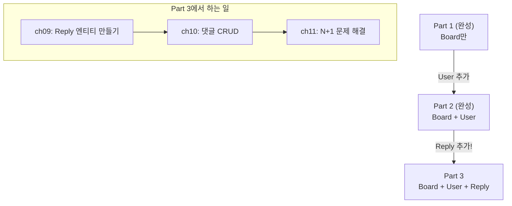
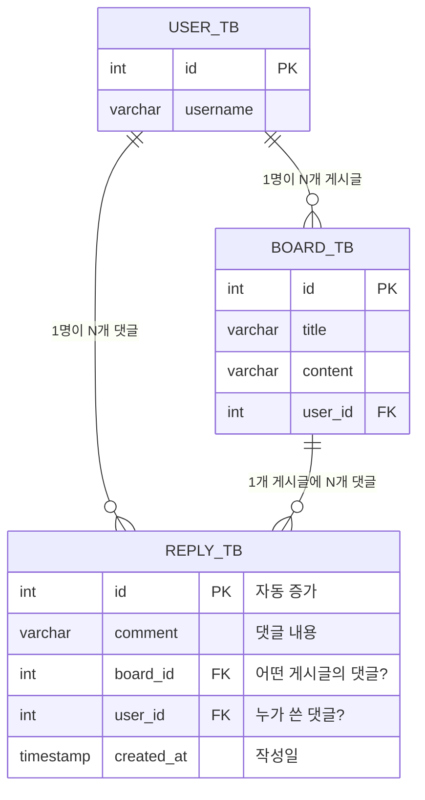
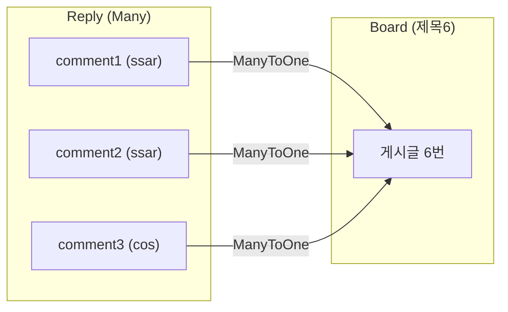
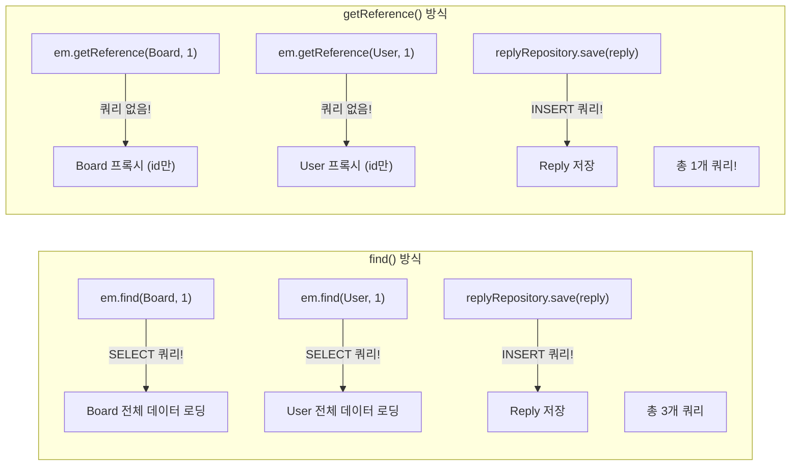

# Chapter 09. Reply 엔티티 + ReplyRepository

> **선수 조건**: [Chapter 08. DTO와 isOwner](part2-ch08-dto-isowner.md)를 완료하세요.
>
> **Part 3에서 달라지는 것**: 이제 게시글에 **댓글(Reply)** 을 달 수 있습니다!

---

## 9.1 Part 3의 큰 그림



> **예시**: 수업 노트를 생각해보세요!
> - Part 1: 노트에 **글**만 있음 (게시글)
> - Part 2: 글에 **이름**을 적음 (작성자)
> - Part 3: 글 아래에 **메모/코멘트**를 달 수 있음 (댓글!)

---

## 9.2 Reply 테이블 설계



| 컬럼 | 타입 | 설명 | 제약조건 |
|------|------|------|---------|
| `id` | int | 댓글 번호 | PK, 자동 증가 |
| `comment` | varchar | 댓글 내용 | |
| `board_id` | int | 어떤 게시글의 댓글인지 | FK → board_tb |
| `user_id` | int | 누가 쓴 댓글인지 | FK → user_tb |
| `created_at` | timestamp | 작성일 | 자동 생성 |

> **Reply는 두 개의 FK를 가집니다!**
> - `board_id`: "이 댓글은 **어떤 글**에 달린 건지"
> - `user_id`: "이 댓글을 **누가** 쓴 건지"
>
> **예시**: 교실 칠판에 붙은 포스트잇을 생각해보세요!
> - 포스트잇(Reply)에는 **어떤 칠판 글**(board_id)에 대한 건지 + **누가** 붙였는지(user_id) 적혀 있습니다.

---

## 9.3 Reply 엔티티 작성하기

`src/main/java/com/example/boardv1/reply/Reply.java`

```java
package com.example.boardv1.reply;

import java.time.LocalDateTime;

import org.hibernate.annotations.CreationTimestamp;

import com.example.boardv1.board.Board;
import com.example.boardv1.user.User;

import jakarta.persistence.Entity;
import jakarta.persistence.GeneratedValue;
import jakarta.persistence.GenerationType;
import jakarta.persistence.Id;
import jakarta.persistence.ManyToOne;
import jakarta.persistence.Table;
import lombok.Data;
import lombok.NoArgsConstructor;

@NoArgsConstructor
@Data
@Entity
@Table(name = "reply_tb")
public class Reply {
    @GeneratedValue(strategy = GenerationType.IDENTITY)
    @Id
    private Integer id;
    private String comment;

    @ManyToOne
    private Board board; // board_id

    @ManyToOne
    private User user; // user_id

    @CreationTimestamp
    private LocalDateTime createdAt;
}
```

### 코드 해설

#### @ManyToOne이 두 개!

```java
@ManyToOne
private Board board; // board_id

@ManyToOne
private User user;   // user_id
```

> Reply 입장에서:
> - Board **1개**에 Reply **여러 개** → `@ManyToOne` Board
> - User **1명**이 Reply **여러 개** → `@ManyToOne` User



> **예시**: 유튜브 댓글을 생각해보세요!
> - 동영상 1개 ← 댓글 여러 개 (Board ← Reply)
> - 사용자 1명 → 여러 동영상에 댓글 가능 (User → Reply)

---

## 9.4 Board 엔티티에 @OneToMany 추가

### Part 2 → Part 3 변경점

Board에서 "이 게시글의 댓글 목록"을 가져올 수 있도록 `@OneToMany`를 추가합니다!

```java
// Part 2의 Board
public class Board {
    private Integer id;
    private String title;
    private String content;
    @ManyToOne(fetch = FetchType.EAGER)
    private User user;
    private Timestamp createdAt;
}

// Part 3의 Board (Reply 추가!)
public class Board {
    private Integer id;
    private String title;
    private String content;
    @ManyToOne(fetch = FetchType.EAGER)
    private User user;

    @OneToMany(mappedBy = "board", fetch = FetchType.EAGER)  // ← 추가!
    @OrderBy("id DESC")                                       // ← 추가!
    private List<Reply> replies = new ArrayList<>();           // ← 추가!

    private Timestamp createdAt;
}
```

### Part 3 Board 전체 코드

`src/main/java/com/example/boardv1/board/Board.java`

```java
package com.example.boardv1.board;

import java.sql.Timestamp;
import java.util.ArrayList;
import java.util.List;

import org.hibernate.annotations.CreationTimestamp;

import com.example.boardv1.reply.Reply;
import com.example.boardv1.user.User;

import jakarta.persistence.Entity;
import jakarta.persistence.FetchType;
import jakarta.persistence.GeneratedValue;
import jakarta.persistence.GenerationType;
import jakarta.persistence.Id;
import jakarta.persistence.ManyToOne;
import jakarta.persistence.OneToMany;
import jakarta.persistence.OrderBy;
import jakarta.persistence.Table;
import lombok.Data;
import lombok.NoArgsConstructor;

@NoArgsConstructor
@Data
@Entity
@Table(name = "board_tb")
public class Board {
    @Id
    @GeneratedValue(strategy = GenerationType.IDENTITY)
    private Integer id;
    private String title;
    private String content;

    @ManyToOne(fetch = FetchType.EAGER)
    private User user;

    @OneToMany(mappedBy = "board", fetch = FetchType.EAGER)
    @OrderBy("id DESC")
    private List<Reply> replies = new ArrayList<>();

    @CreationTimestamp
    private Timestamp createdAt;
}
```

### @OneToMany 이해하기

```java
@OneToMany(mappedBy = "board", fetch = FetchType.EAGER)
@OrderBy("id DESC")
private List<Reply> replies = new ArrayList<>();
```

> **"Board One개에 Reply Many개가 속한다"** = 1:N 관계

#### mappedBy = "board"

> **"Reply 엔티티의 `board` 필드가 FK의 주인이야!"** 라는 뜻입니다.
>
> ```java
> // Reply.java에서
> @ManyToOne
> private Board board;  // ← 이 "board"를 가리킴!
> ```
>
> **예시**: 부모-자녀 관계를 생각해보세요!
> - 부모(Board)가 "내 자녀 목록"을 알고 싶음 → `@OneToMany`
> - 하지만 실제 가족 관계 증명서(FK)는 **자녀(Reply)** 쪽에 있음 → `mappedBy`
>
> DB에서는 항상 **N쪽(Reply)**에 FK가 있습니다!
> Board에 `@OneToMany`를 붙여도 **board_tb에 새 컬럼이 생기지 않습니다!**
> reply_tb의 `board_id`를 통해 조회하는 것뿐입니다.

#### @OrderBy("id DESC")

> **"댓글을 id 역순으로 정렬해!"** → 최신 댓글이 맨 위에 옵니다.
>
> - `ASC` = 오름차순 (1, 2, 3 ...) - 오래된 것 먼저
> - `DESC` = 내림차순 (3, 2, 1 ...) - 최신 것 먼저

#### new ArrayList<>()로 초기화

```java
private List<Reply> replies = new ArrayList<>();
```

> **왜 빈 리스트로 초기화?** 댓글이 없는 게시글에서 `replies`가 null이면
> `board.getReplies().size()`에서 **NullPointerException**이 발생합니다!
>
> 빈 리스트로 초기화하면 댓글이 없어도 `size() = 0`으로 안전하게 처리됩니다.
>
> **예시**: 장바구니를 생각해보세요!
> - `null` = 장바구니 자체가 없음 → "물건 몇 개?" → 에러!
> - `new ArrayList<>()` = 빈 장바구니 → "물건 몇 개?" → "0개요!"

### @ManyToOne vs @OneToMany 비교

| 항목 | @ManyToOne | @OneToMany |
|------|-----------|------------|
| 위치 | Reply (N쪽) | Board (1쪽) |
| DB 컬럼 | **생성됨** (board_id) | 생성 안 됨 |
| FK 주인 | **Reply가 주인** | Board는 주인 아님 (mappedBy) |
| 예시 | "이 댓글은 1번 글에 속함" | "1번 글의 댓글 목록" |

```
board_tb (Board):                    reply_tb (Reply):
| id | title | user_id |            | id | comment | board_id | user_id |
|----|-------|---------|            |----|---------|----------|---------|
| 5  | 제목5 | 2       |            | 4  | 댓글4   | 5        | 1       |
| 6  | 제목6 | 2       |            | 5  | 댓글5   | 5        | 2       |
                                    | 1  | 댓글1   | 6        | 1       |
                                    | 2  | 댓글2   | 6        | 1       |
                                    | 3  | 댓글3   | 6        | 2       |
```

> Board에서 `board.getReplies()` 하면?
> → `SELECT * FROM reply_tb WHERE board_id = 6` → 댓글1, 댓글2, 댓글3

---

## 9.5 ReplyRepository 작성하기

`src/main/java/com/example/boardv1/reply/ReplyRepository.java`

```java
package com.example.boardv1.reply;

import java.util.Optional;

import org.springframework.stereotype.Repository;

import jakarta.persistence.EntityManager;
import lombok.RequiredArgsConstructor;

@RequiredArgsConstructor
@Repository
public class ReplyRepository {

    private final EntityManager em;

    public Optional<Reply> findById(int id) {
        Reply reply = em.find(Reply.class, id);
        return Optional.ofNullable(reply);
    }

    public void save(Reply reply) {
        em.persist(reply);
    }

    public void delete(Reply reply) {
        em.remove(reply);
    }
}
```

> BoardRepository와 구조가 같습니다!
> - `findById`: 댓글 조회 (삭제할 때 사용)
> - `save`: 댓글 등록
> - `delete`: 댓글 삭제
>
> Reply는 **findAll이 없습니다!** 왜냐하면 댓글 목록은 Board의 `@OneToMany`로 가져오기 때문입니다.

---

## 9.6 data.sql 업그레이드

Part 2에서 User + Board 데이터가 있었고, Part 3에서 **Reply 데이터를 추가**합니다.

`src/main/resources/db/data.sql`

```sql
-- User 데이터
insert into user_tb(username, password, email, created_at) values('ssar', '1234', 'ssar@nate.com', now());
insert into user_tb(username, password, email, created_at) values('cos', '1234', 'cos@nate.com', now());

-- Board 데이터
insert into board_tb(user_id, title, content, created_at) values(1, 'title1', 'content1', now());
insert into board_tb(user_id, title, content, created_at) values(1, 'title2', 'content2', now());
insert into board_tb(user_id, title, content, created_at) values(1, 'title3', 'content3', now());
insert into board_tb(user_id, title, content, created_at) values(2, 'title4', 'content4', now());
insert into board_tb(user_id, title, content, created_at) values(2, 'title5', 'content5', now());
insert into board_tb(user_id, title, content, created_at) values(2, 'title6', 'content6', now());

-- Reply 데이터 (Part 3에서 추가!)
insert into reply_tb(user_id, board_id, comment, created_at) values(1, 6, 'comment1', now());
insert into reply_tb(user_id, board_id, comment, created_at) values(1, 6, 'comment2', now());
insert into reply_tb(user_id, board_id, comment, created_at) values(2, 6, 'comment3', now());
insert into reply_tb(user_id, board_id, comment, created_at) values(1, 5, 'comment4', now());
insert into reply_tb(user_id, board_id, comment, created_at) values(2, 5, 'comment5', now());
```

> **댓글 데이터 분석:**
>
> | 댓글 | 작성자 | 게시글 |
> |------|--------|--------|
> | comment1 | ssar (id=1) | 제목6 (id=6) |
> | comment2 | ssar (id=1) | 제목6 (id=6) |
> | comment3 | cos (id=2) | 제목6 (id=6) |
> | comment4 | ssar (id=1) | 제목5 (id=5) |
> | comment5 | cos (id=2) | 제목5 (id=5) |
>
> - 6번 게시글에 댓글 3개, 5번 게시글에 댓글 2개
> - 나머지 게시글(1~4)에는 댓글 없음

---

## 9.7 ReplyResponse 만들기

댓글도 화면에 보여줄 때 DTO를 사용합니다!

`src/main/java/com/example/boardv1/reply/ReplyResponse.java`

```java
package com.example.boardv1.reply;

import lombok.Data;

public class ReplyResponse {

    @Data
    public static class DTO {
        private Integer id;
        private String comment;
        private Integer replyUserId;
        private String replyUsername;
        private boolean isReplyOwner; // 로그인한 유저가 댓글을 작성한 유저인지

        public DTO(Reply reply, Integer sessionUserId) {
            this.id = reply.getId();
            this.comment = reply.getComment();
            this.replyUserId = reply.getUser().getId();
            this.replyUsername = reply.getUser().getUsername();
            this.isReplyOwner = reply.getUser().getId() == sessionUserId;
        }
    }
}
```

> **isReplyOwner**: BoardResponse의 `isOwner`와 같은 개념!
> - 게시글의 주인 = `isOwner`
> - 댓글의 주인 = `isReplyOwner`
>
> 댓글 주인만 **댓글 삭제 버튼**이 보입니다!

---

## 9.8 BoardResponse 업그레이드

DetailDTO에 **댓글 목록**을 추가합니다!

```java
// Part 2의 DetailDTO (댓글 없음)
@Data
public static class DetailDTO {
    private int id;
    private int userId;
    private String title;
    private String content;
    private String username;
    private boolean isOwner;

    public DetailDTO(Board board, Integer sessionUserId) {
        // ...
    }
}

// Part 3의 DetailDTO (댓글 추가!)
@Data
public static class DetailDTO {
    private int id;
    private int userId;
    private String title;
    private String content;
    private String username;
    private boolean isOwner;
    private List<ReplyResponse.DTO> replies;  // ← 추가!

    public DetailDTO(Board board, Integer sessionUserId) {
        // ... 기존 코드 유지
        this.replies = board.getReplies().stream()           // ← 추가!
                .map(reply -> new ReplyResponse.DTO(reply, sessionUserId))
                .toList();
    }
}
```

### Part 3 BoardResponse 전체 코드

`src/main/java/com/example/boardv1/board/BoardResponse.java`

```java
package com.example.boardv1.board;

import java.util.List;

import com.example.boardv1.reply.ReplyResponse;

import lombok.Data;

public class BoardResponse {

    @Data
    public static class DTO {
        private int id;
        private String title;
        private String content;

        public DTO(Board board) {
            this.id = board.getId();
            this.title = board.getTitle();
            this.content = board.getContent();
        }
    }

    @Data
    public static class DetailDTO {
        private int id;
        private int userId;
        private String title;
        private String content;
        private String username;
        private boolean isOwner;
        private List<ReplyResponse.DTO> replies; // 댓글 목록!

        public DetailDTO(Board board, Integer sessionUserId) {
            this.id = board.getId();
            this.userId = board.getUser().getId();
            this.title = board.getTitle();
            this.content = board.getContent();
            this.username = board.getUser().getUsername();
            this.isOwner = board.getUser().getId() == sessionUserId;
            this.replies = board.getReplies().stream()
                    .map(reply -> new ReplyResponse.DTO(reply, sessionUserId))
                    .toList();
        }
    }
}
```

### stream().map().toList() 이해하기

```java
this.replies = board.getReplies().stream()
        .map(reply -> new ReplyResponse.DTO(reply, sessionUserId))
        .toList();
```

> **한 줄씩 해석:**
>
> 1. `board.getReplies()` → Reply 엔티티 목록 (예: [Reply1, Reply2, Reply3])
> 2. `.stream()` → 컨베이어 벨트에 올림 (하나씩 처리할 준비)
> 3. `.map(reply -> new ReplyResponse.DTO(reply, sessionUserId))` → Reply 엔티티를 ReplyResponse.DTO로 변환!
> 4. `.toList()` → 다시 리스트로 모음
>
> **예시**: 공장 컨베이어 벨트를 생각해보세요!
> - 원재료(Reply Entity) 3개가 벨트에 올라감
> - 각각 가공(map)되어 완제품(ReplyResponse.DTO)으로 변환
> - 완제품이 상자(List)에 담김
>
> ```
> [Reply1, Reply2, Reply3]           ← 원재료 (Entity)
>     ↓ stream().map()
> [ReplyDTO1, ReplyDTO2, ReplyDTO3]  ← 완제품 (DTO)
>     ↓ toList()
> List<ReplyResponse.DTO>            ← 상자에 담기
> ```

---

## 9.9 ReplyRepository 테스트

`src/test/java/com/example/boardv1/reply/ReplyRepositoryTest.java`

```java
package com.example.boardv1.reply;

import com.example.boardv1.board.Board;
import com.example.boardv1.user.User;
import jakarta.persistence.EntityManager;
import org.junit.jupiter.api.Test;
import org.springframework.beans.factory.annotation.Autowired;
import org.springframework.boot.data.jpa.test.autoconfigure.DataJpaTest;
import org.springframework.context.annotation.Import;

@Import(ReplyRepository.class)
@DataJpaTest
public class ReplyRepositoryTest {

    @Autowired
    private ReplyRepository replyRepository;

    @Autowired
    private EntityManager em;

    @Test
    public void part3_save_with_getReference_test() {
        System.out.println("===== [Part 3] getReference로 Reply 저장 =====");

        // Given: 프록시로 Board, User 참조 (SELECT 없이)
        System.out.println("===== Board, User getReference 호출 =====");
        Board boardProxy = em.getReference(Board.class, 1);
        User userProxy = em.getReference(User.class, 1);
        System.out.println("===== 프록시 생성 완료 (아직 SELECT 없음) =====");

        Reply reply = new Reply();
        reply.setComment("getReference 테스트 댓글");
        reply.setBoard(boardProxy);
        reply.setUser(userProxy);

        // When
        System.out.println("===== Reply 저장 시작 =====");
        replyRepository.save(reply);
        em.flush();
        System.out.println("===== Reply 저장 완료 (INSERT만 발생, SELECT 없음!) =====");

        // Eye
        System.out.println("Reply ID: " + reply.getId());
    }

    @Test
    public void part3_save_without_getReference_test() {
        System.out.println("===== [Part 3] find()로 Reply 저장 (비교용) =====");

        // Given: find()로 Board, User 조회 (SELECT 발생)
        System.out.println("===== Board, User find 호출 =====");
        Board board = em.find(Board.class, 1);
        User user = em.find(User.class, 1);
        System.out.println("===== Board, User SELECT 쿼리 2번 발생 =====");

        Reply reply = new Reply();
        reply.setComment("find 테스트 댓글");
        reply.setBoard(board);
        reply.setUser(user);

        // When
        System.out.println("===== Reply 저장 시작 =====");
        replyRepository.save(reply);
        em.flush();
        System.out.println("===== Reply 저장 완료 (총 3개 쿼리: SELECT 2번 + INSERT 1번) =====");

        // Eye
        System.out.println("Reply ID: " + reply.getId());
    }
}
```

### getReference() vs find() 비교

#### find() - 실제 데이터를 가져옴

```java
Board board = em.find(Board.class, 1);
// → SELECT * FROM board_tb WHERE id = 1 (쿼리 발생!)
```

#### getReference() - 프록시(가짜 객체)만 만듦

```java
Board boardProxy = em.getReference(Board.class, 1);
// → 쿼리 없음! id만 가진 빈 껍데기(프록시) 생성!
```

> **프록시(Proxy)란?** 진짜 객체 대신 사용하는 **가짜 객체**
>
> **예시**: 영화 촬영 스턴트맨을 생각해보세요!
> - `find()` = 배우 본인이 직접 출연 (비용 높음 = SELECT 쿼리)
> - `getReference()` = 스턴트맨(프록시)이 대신 (비용 낮음 = 쿼리 없음)
>
> Reply를 저장할 때 필요한 건 Board의 **id**뿐입니다!
> Board의 제목이나 내용은 필요 없으니, 프록시로 충분합니다.



> | 방식 | SELECT 쿼리 | INSERT 쿼리 | 총 쿼리 |
> |------|------------|-------------|--------|
> | find() | 2번 (Board, User) | 1번 | **3번** |
> | getReference() | **0번** | 1번 | **1번!** |
>
> **3배 효율적!** 댓글을 등록할 때는 Board와 User의 **id만** 필요하므로 getReference()를 사용합니다.

---

## 실행 확인

1. `ReplyRepositoryTest` 실행 → 두 테스트 모두 통과하는지 확인
2. `part3_save_with_getReference_test` → 콘솔에서 **INSERT만** 발생하는지 확인
3. `part3_save_without_getReference_test` → 콘솔에서 **SELECT 2번 + INSERT 1번** 발생하는지 확인
4. H2 콘솔에서 `SELECT * FROM REPLY_TB` → 댓글 데이터 확인

### 이 시점의 파일 구조

```
src/main/java/com/example/boardv1/
├── board/
│   ├── Board.java              ← @OneToMany replies 추가!
│   ├── BoardRepository.java
│   ├── BoardRequest.java
│   ├── BoardResponse.java      ← replies 필드 추가!
│   ├── BoardService.java
│   └── BoardController.java
├── user/
│   ├── User.java
│   ├── UserRepository.java
│   ├── UserRequest.java
│   ├── UserService.java
│   └── UserController.java
└── reply/                       ← 이번 챕터에서 추가!
    ├── Reply.java               ← 이번 챕터
    ├── ReplyRepository.java     ← 이번 챕터
    └── ReplyResponse.java       ← 이번 챕터

src/test/java/com/example/boardv1/
└── reply/
    └── ReplyRepositoryTest.java ← 이번 챕터
```

---

## 핵심 정리

- **Reply 엔티티**: 댓글 정보 (comment, board_id, user_id)
- **@ManyToOne (Reply → Board)**: "이 댓글은 어떤 게시글의 댓글인지" (N:1)
- **@ManyToOne (Reply → User)**: "이 댓글을 누가 썼는지" (N:1)
- **@OneToMany (Board → Reply)**: "이 게시글의 댓글 목록" (1:N)
- **mappedBy**: "FK는 Reply 쪽에 있어!" (Board에 새 컬럼 안 생김)
- **@OrderBy("id DESC")**: 최신 댓글이 먼저!
- **getReference()**: 프록시 객체 생성 (SELECT 없이 id만!)
- **stream().map().toList()**: Entity 리스트 → DTO 리스트 변환 (컨베이어 벨트)
- Reply는 **두 개의 FK**를 가짐 (board_id, user_id)

> **다음 챕터**: [Chapter 10. 댓글 CRUD](part3-ch10-reply-crud.md) - 댓글 등록/삭제 기능을 완성합니다!
