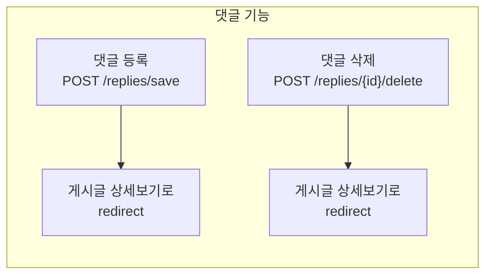
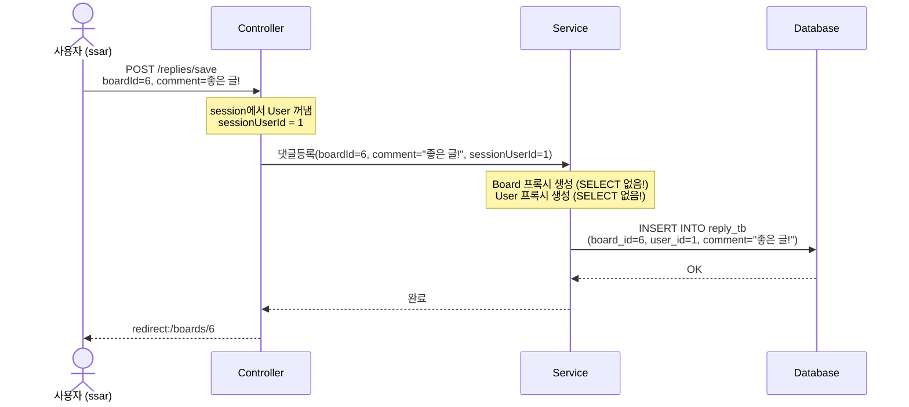
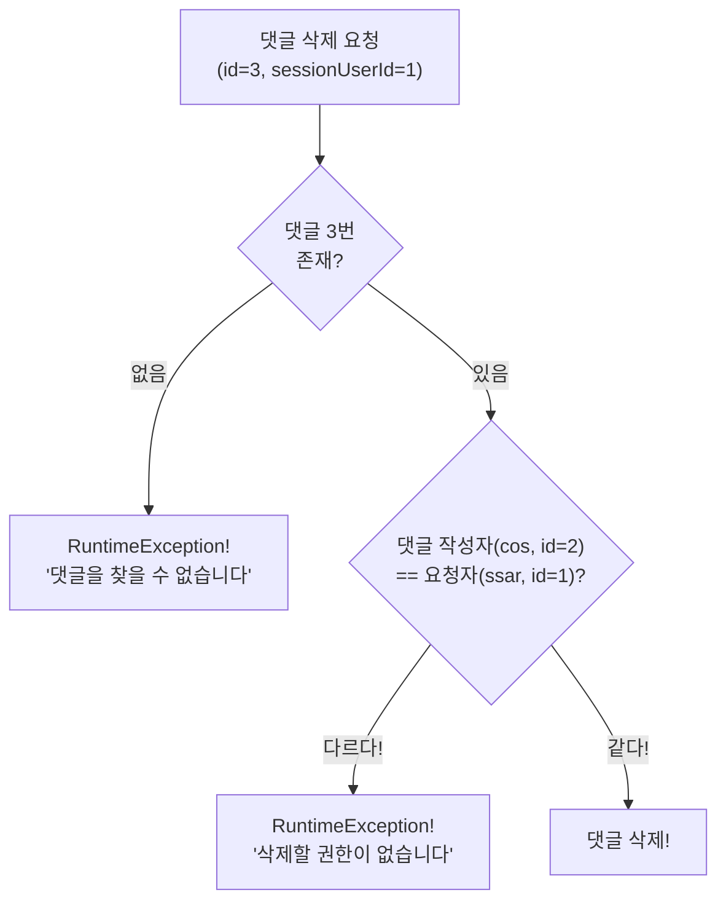
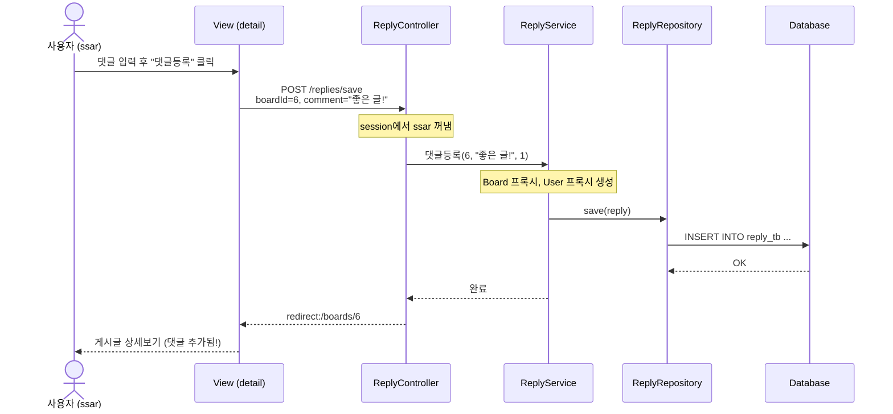
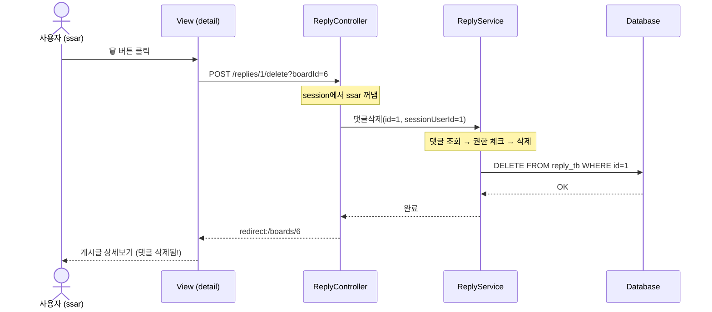

# Chapter 10. 댓글 CRUD - 등록과 삭제

> **선수 조건**: [Chapter 09. Reply 엔티티](part3-ch09-reply-entity.md)를 완료하세요.

---

## 10.1 댓글 기능 개요

게시글 상세보기 페이지에서 댓글을 **등록**하고 **삭제**할 수 있습니다.



> **예시**: 유튜브 댓글을 생각해보세요!
> - 동영상 아래에서 댓글 작성 → 등록!
> - 내가 쓴 댓글 옆에 삭제 버튼 → 내 댓글만 삭제!
> - 등록/삭제 후에는 다시 동영상 페이지로 돌아옴

---

## 10.2 ReplyRequest 만들기

`src/main/java/com/example/boardv1/reply/ReplyRequest.java`

```java
package com.example.boardv1.reply;

import lombok.Data;

public class ReplyRequest {

    @Data
    public static class SaveDTO {
        private Integer boardId;
        private String comment;
    }
}
```

> **SaveDTO**: 댓글 등록 시 필요한 정보
> - `boardId`: 어떤 게시글에 댓글을 다는지
> - `comment`: 댓글 내용
>
> HTML form에서 전송되는 데이터:
> ```
> boardId=6&comment=좋은 글이네요!
> ```

---

## 10.3 ReplyService - 비즈니스 로직

`src/main/java/com/example/boardv1/reply/ReplyService.java`

```java
package com.example.boardv1.reply;

import org.springframework.stereotype.Service;
import org.springframework.transaction.annotation.Transactional;

import com.example.boardv1.board.Board;
import com.example.boardv1.user.User;

import jakarta.persistence.EntityManager;
import lombok.RequiredArgsConstructor;

@RequiredArgsConstructor
@Service
public class ReplyService {

    private final ReplyRepository replyRepository;
    private final EntityManager em;

    @Transactional
    public void 댓글등록(Integer boardId, String comment, Integer sessionUserId) {
        Board board = em.getReference(Board.class, boardId);
        User user = em.getReference(User.class, sessionUserId);
        Reply reply = new Reply();
        reply.setBoard(board);
        reply.setUser(user);
        reply.setComment(comment);

        replyRepository.save(reply);
    }

    @Transactional
    public void 댓글삭제(int id, Integer sessionUserId) {
        // 1. 댓글 찾고
        Reply reply = replyRepository.findById(id)
                .orElseThrow(() -> new RuntimeException("댓글을 찾을 수 없습니다"));

        // 2. 권한 체크
        if (reply.getUser().getId() != sessionUserId)
            throw new RuntimeException("댓글을 삭제할 권한이 없습니다");

        // 3. 댓글 삭제
        replyRepository.delete(reply);
    }
}
```

### 코드 해설

#### 댓글등록 - getReference() 활용!

```java
@Transactional
public void 댓글등록(Integer boardId, String comment, Integer sessionUserId) {
    Board board = em.getReference(Board.class, boardId);
    User user = em.getReference(User.class, sessionUserId);
    Reply reply = new Reply();
    reply.setBoard(board);
    reply.setUser(user);
    reply.setComment(comment);

    replyRepository.save(reply);
}
```

> **왜 `em.getReference()`를 쓸까?**
>
> ch09에서 배운 것처럼, Reply를 INSERT할 때 필요한 건 Board의 **id**와 User의 **id**뿐입니다!
>
> ```sql
> INSERT INTO reply_tb (board_id, user_id, comment, created_at) VALUES (6, 1, '좋은 글!', now())
> ```
>
> Board의 제목이나 User의 이메일은 필요 없습니다!
> 그래서 `find()` 대신 `getReference()`로 **프록시**를 사용합니다.



#### 댓글삭제 - 권한 체크

```java
@Transactional
public void 댓글삭제(int id, Integer sessionUserId) {
    Reply reply = replyRepository.findById(id)
            .orElseThrow(() -> new RuntimeException("댓글을 찾을 수 없습니다"));

    if (reply.getUser().getId() != sessionUserId)
        throw new RuntimeException("댓글을 삭제할 권한이 없습니다");

    replyRepository.delete(reply);
}
```

> 게시글 삭제와 같은 패턴입니다!
> 1. 댓글 찾기 → 없으면 에러
> 2. 권한 체크 → 내 댓글이 아니면 에러
> 3. 삭제!



---

## 10.4 ReplyController - 요청 처리

`src/main/java/com/example/boardv1/reply/ReplyController.java`

```java
package com.example.boardv1.reply;

import org.springframework.stereotype.Controller;
import org.springframework.web.bind.annotation.PathVariable;
import org.springframework.web.bind.annotation.PostMapping;
import org.springframework.web.bind.annotation.RequestParam;

import com.example.boardv1.user.User;

import jakarta.servlet.http.HttpSession;
import lombok.RequiredArgsConstructor;

@RequiredArgsConstructor
@Controller
public class ReplyController {
    private final ReplyService replyService;
    private final HttpSession session;

    @PostMapping("/replies/save")
    public String save(ReplyRequest.SaveDTO reqDTO) {
        User sessionUser = (User) session.getAttribute("sessionUser");
        if (sessionUser == null)
            throw new RuntimeException("인증되지 않았습니다.");

        replyService.댓글등록(reqDTO.getBoardId(), reqDTO.getComment(), sessionUser.getId());
        return "redirect:/boards/" + reqDTO.getBoardId();
    }

    // /replies/5/delete?boardId=2
    @PostMapping("/replies/{id}/delete")
    public String delete(@PathVariable("id") int id, @RequestParam("boardId") int boardId) {
        User sessionUser = (User) session.getAttribute("sessionUser");
        if (sessionUser == null)
            throw new RuntimeException("인증되지 않았습니다.");

        replyService.댓글삭제(id, sessionUser.getId());
        return "redirect:/boards/" + boardId;
    }
}
```

### 코드 해설

#### 댓글 등록

```java
@PostMapping("/replies/save")
public String save(ReplyRequest.SaveDTO reqDTO) {
    // ...
    replyService.댓글등록(reqDTO.getBoardId(), reqDTO.getComment(), sessionUser.getId());
    return "redirect:/boards/" + reqDTO.getBoardId();
}
```

> 댓글 등록 후 → **해당 게시글 상세보기**로 redirect!
> `boardId=6`이면 → `redirect:/boards/6`

#### 댓글 삭제 - @RequestParam

```java
// /replies/5/delete?boardId=2
@PostMapping("/replies/{id}/delete")
public String delete(@PathVariable("id") int id, @RequestParam("boardId") int boardId) {
```

> **`@PathVariable`**: URL 경로에서 값을 꺼냄 → `/replies/5/delete`의 `5`
> **`@RequestParam`**: 쿼리 파라미터에서 값을 꺼냄 → `?boardId=2`의 `2`
>
> **왜 boardId가 필요할까?**
> 댓글을 삭제한 후 **어떤 게시글로 돌아가야 하는지** 알아야 하니까!
> `return "redirect:/boards/" + boardId;` → 삭제 후 게시글 상세보기로!
>
> **예시**: 쇼핑몰에서 장바구니 상품 삭제 후 → 다시 장바구니 페이지로 돌아가는 것!

---

## 10.5 detail.mustache 업그레이드 - 댓글 영역 추가

### Part 2 → Part 3 변경점

Part 2에서는 게시글만 보였지만, Part 3에서는 **댓글 등록 폼**과 **댓글 목록**이 추가됩니다!

### Part 3 detail.mustache 전체 코드

`src/main/resources/templates/board/detail.mustache`

```html
{{> header}}

<div class="container p-5">

    {{#model.isOwner}}
    <!-- 수정삭제버튼 -->
    <div class="d-flex justify-content-end">
        <a href="/boards/{{model.id}}/update-form" class="btn btn-secondary me-1">수정</a>
        <form action="/boards/{{model.id}}/delete" method="post">
            <button class="btn btn-outline-secondary">삭제</button>
        </form>
    </div>
    {{/model.isOwner}}

    <!-- 게시글내용 -->
    <div>
        <h2><b>{{model.title}}</b></h2>
        <hr />
        <div class="d-flex justify-content-end">
            작성자 : {{model.username}}
        </div>
        <div class="m-4 p-2">
            {{model.content}}
        </div>
    </div>

    <!-- 댓글 영역 (Part 3에서 추가!) -->
    <div class="card mt-3">
        <!-- 댓글등록 -->
        <div class="card-body">
            <form action="/replies/save" method="post">
                <input type="hidden" name="boardId" value="{{model.id}}" />
                <textarea id="comment" class="form-control" rows="2" name="comment"></textarea>
                <div class="d-flex justify-content-end">
                    <button class="btn btn-secondary mt-1">
                        댓글등록
                    </button>
                </div>
            </form>
        </div>

        <!-- 댓글목록 -->
        <div class="card-footer">
            <b>댓글리스트</b>
        </div>
        <div class="list-group">

            {{#model.replies}}
                <!-- 댓글아이템 -->
                <div class="list-group-item d-flex justify-content-between align-items-center">
                    <div class="d-flex">
                        <div class="px-1 me-1 bg-secondary text-white rounded">{{replyUsername}}</div>
                        <div>{{comment}}</div>
                    </div>

                    {{#isReplyOwner}}
                    <form action="/replies/{{id}}/delete?boardId={{model.id}}" method="post">
                        <button class="btn">🗑</button>
                    </form>
                    {{/isReplyOwner}}

                </div>
            {{/model.replies}}

        </div>
    </div>
</div>

{{^sessionUser}}
<script>
    const textArea = document.querySelector('#comment');
    textArea.addEventListener('click', function() {
        alert('로그인하세요');
        location.href = "/login-form";
    });
</script>
{{/sessionUser}}
</body>
</html>
```

### 코드 해설

#### 댓글 등록 폼

```html
<form action="/replies/save" method="post">
    <input type="hidden" name="boardId" value="{{model.id}}" />
    <textarea id="comment" class="form-control" rows="2" name="comment"></textarea>
    <button class="btn btn-secondary mt-1">댓글등록</button>
</form>
```

> - `<input type="hidden" name="boardId">`: 눈에 안 보이지만 **어떤 게시글인지** 함께 전송!
> - `<textarea name="comment">`: 댓글 내용 입력
> - form 전송 시: `boardId=6&comment=좋은 글이네요!` → `/replies/save`로 POST
>
> **예시**: 편지 봉투를 생각해보세요!
> - hidden input = 봉투에 적힌 **받는 사람** (보이지 않지만 중요!)
> - textarea = 봉투 안의 **편지 내용**

#### 댓글 목록 - {{#model.replies}} 반복

```html
{{#model.replies}}
    <div class="list-group-item d-flex justify-content-between align-items-center">
        <div class="d-flex">
            <div class="px-1 me-1 bg-secondary text-white rounded">{{replyUsername}}</div>
            <div>{{comment}}</div>
        </div>

        {{#isReplyOwner}}
        <form action="/replies/{{id}}/delete?boardId={{model.id}}" method="post">
            <button class="btn">🗑</button>
        </form>
        {{/isReplyOwner}}
    </div>
{{/model.replies}}
```

> **Mustache 반복문**: `{{#model.replies}}` ~ `{{/model.replies}}`
>
> replies 리스트의 각 항목(ReplyResponse.DTO)을 하나씩 반복합니다!
>
> | Mustache 변수 | DTO 필드 | 설명 |
> |--------------|----------|------|
> | `{{replyUsername}}` | replyUsername | 댓글 작성자 이름 |
> | `{{comment}}` | comment | 댓글 내용 |
> | `{{#isReplyOwner}}` | isReplyOwner | 내 댓글이면 삭제 버튼 보임 |
> | `{{id}}` | id | 댓글 ID (삭제 시 사용) |

#### 비로그인 사용자 - 댓글 입력 차단

```html
{{^sessionUser}}
<script>
    const textArea = document.querySelector('#comment');
    textArea.addEventListener('click', function() {
        alert('로그인하세요');
        location.href = "/login-form";
    });
</script>
{{/sessionUser}}
```

> - `{{^sessionUser}}`: 로그인 안 한 상태에서만 실행!
> - 댓글 입력창을 클릭하면 → "로그인하세요" 알림 → 로그인 페이지로 이동
>
> **예시**: 놀이공원 놀이기구 앞에서
> - 밴드(세션) 있으면 → 바로 탑승!
> - 밴드 없으면 → "입장권 구매하세요!" 안내

---

## 10.6 전체 흐름 정리

### 댓글 등록 흐름



### 댓글 삭제 흐름



---

## 실행 확인

서버를 재시작하고 다음을 확인하세요:

1. `ssar` / `1234`로 로그인 → **제목6** 클릭 → 댓글 3개가 보이는지
2. 댓글 입력 후 "댓글등록" 클릭 → 댓글이 추가되는지
3. ssar가 쓴 댓글 옆에 🗑 버튼이 보이는지
4. cos가 쓴 댓글 옆에 🗑 버튼이 **안** 보이는지
5. 🗑 버튼 클릭 → 댓글이 삭제되는지
6. 로그아웃 → 댓글 입력창 클릭 → "로그인하세요" 알림이 뜨는지

### 이 시점의 파일 구조

```
src/main/java/com/example/boardv1/
├── board/ (기존 유지)
├── user/  (기존 유지)
└── reply/
    ├── Reply.java               ← ch09
    ├── ReplyRepository.java     ← ch09
    ├── ReplyResponse.java       ← ch09
    ├── ReplyRequest.java        ← 이번 챕터!
    ├── ReplyService.java        ← 이번 챕터!
    └── ReplyController.java     ← 이번 챕터!

src/main/resources/templates/
└── board/
    └── detail.mustache          ← 이번 챕터에서 업그레이드!
```

---

## 핵심 정리

- **ReplyRequest.SaveDTO**: 댓글 등록 시 boardId + comment 전송
- **ReplyService.댓글등록()**: `em.getReference()`로 프록시 사용 → INSERT 1번만!
- **ReplyService.댓글삭제()**: 찾기 → 권한 체크 → 삭제 (게시글 삭제와 같은 패턴)
- **ReplyController**: 댓글 등록/삭제 후 → `redirect:/boards/{boardId}`로 돌아감
- **`<input type="hidden">`**: 눈에 안 보이지만 form과 함께 전송되는 값
- **`@RequestParam`**: URL의 쿼리 파라미터(`?boardId=6`)에서 값 꺼냄
- **`{{#model.replies}}`**: Mustache 반복문으로 댓글 목록 표시
- **`{{#isReplyOwner}}`**: 내 댓글일 때만 삭제 버튼 보임
- 비로그인 시 댓글창 클릭 → JavaScript로 로그인 페이지 유도

> **다음 챕터**: [Chapter 11. N+1 문제와 해결](part3-ch11-n-plus-1.md) - 게시글 목록을 조회할 때 쿼리가 **폭발적으로 증가**하는 문제를 발견하고 해결합니다!
