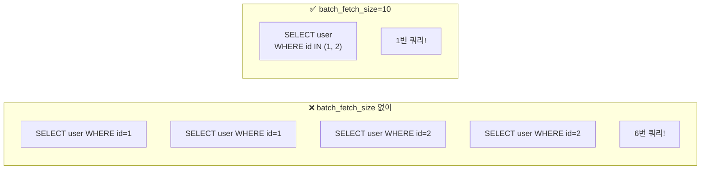

# Chapter 11. N+1 문제와 해결 - batch_fetch_size

> **선수 조건**: [Chapter 10. 댓글 CRUD](part3-ch10-reply-crud.md)를 완료하세요.
>
> **이번 챕터의 목표**: 게시글 목록을 조회할 때 **쿼리가 폭발적으로 증가**하는 N+1 문제를 발견하고, `batch_fetch_size` 설정으로 해결합니다!

---

## 11.1 N+1 문제란?

> **"1번 조회했더니 N번 추가 쿼리가 나가네?!"**

### Part 1: 쿼리 1개

```sql
-- Board만 있을 때 (User, Reply 없음)
SELECT * FROM board_tb;  -- 끝! 1번이면 충분!
```

### Part 2: N+1 문제 (User 추가)

```sql
-- 1번: Board 전체 조회
SELECT * FROM board_tb;                      -- 6개 게시글

-- +N번: 각 Board의 User 조회 (최악의 경우)
SELECT * FROM user_tb WHERE id = 1;          -- Board 1번의 User
SELECT * FROM user_tb WHERE id = 1;          -- Board 2번의 User (같은 사용자)
SELECT * FROM user_tb WHERE id = 1;          -- Board 3번의 User
SELECT * FROM user_tb WHERE id = 2;          -- Board 4번의 User
SELECT * FROM user_tb WHERE id = 2;          -- Board 5번의 User
SELECT * FROM user_tb WHERE id = 2;          -- Board 6번의 User
-- 총 7번 쿼리! (1 + 6 = 7)
```

### Part 3: Massive N+1 문제 (Reply까지 추가!)

```sql
-- 1번: Board 전체 조회
SELECT * FROM board_tb;

-- +N번: 각 Board의 User 조회
SELECT * FROM user_tb WHERE id = ?;   -- × 6번

-- +N번: 각 Board의 Reply 목록 조회
SELECT * FROM reply_tb WHERE board_id = ?;  -- × 6번

-- +N번: 각 Reply의 User 조회
SELECT * FROM user_tb WHERE id = ?;   -- × 5번 (댓글 5개)

-- 총: 1 + 6 + 6 + 5 = 18번 쿼리!!!
```

> **예시**: 출석부를 부르는 상황을 생각해보세요!
>
> | 상황 | 비유 | 쿼리 수 |
> |------|------|---------|
> | Part 1 | "전원 이름 불러!" (한 번에 끝) | **1번** |
> | Part 2 | "이름 부르고, 한 명씩 부모님 전화번호도 확인!" | **7번** |
> | Part 3 | "이름, 부모님, 동아리 활동, 동아리 담당 선생님까지 전부!" | **18번!** |
>
> 게시글이 100개이고 댓글이 500개라면? → 수백 번의 쿼리가 발생!

```mermaid
graph TD
    subgraph Part1["Part 1: Board만"]
        A1["SELECT boards"] --> A2["끝! (1번)"]
    end

    subgraph Part2["Part 2: + User"]
        B1["SELECT boards (1번)"] --> B2["SELECT user (N번)"]
        B2 --> B3["총 1+N번"]
    end

    subgraph Part3["Part 3: + Reply + User"]
        C1["SELECT boards (1번)"] --> C2["SELECT board.user (N번)"]
        C2 --> C3["SELECT replies (N번)"]
        C3 --> C4["SELECT reply.user (M번)"]
        C4 --> C5["총 1+N+N+M번!"]
    end

    style Part1 fill:#e1f5fe
    style Part2 fill:#fff9c4
    style Part3 fill:#fce4ec
```



---

## 11.2 테스트로 N+1 문제 확인하기

### 테스트 1: Massive N+1 문제 재현

`BoardRepositoryTest.java`에서 Part 3 테스트:

```java
@Test
public void part3_findAll_with_replies_massive_n_plus_1_test() {
    System.out.println("===== [Part 3] findAll + Replies 접근 - Massive N+1 문제 =====");
    List<Board> boards = boardRepository.findAll();
    System.out.println("===== " + boards.size() + "개 게시글 조회 완료 (1번 쿼리) =====");

    int boardUserQueryCount = 0;
    int replyQueryCount = 0;
    int replyUserQueryCount = 0;

    for (Board board : boards) {
        // Board의 User 접근
        String boardUsername = board.getUser().getUsername();
        boardUserQueryCount++;

        // Board의 Replies 접근
        int replyCount = board.getReplies().size();
        replyQueryCount++;

        // 각 Reply의 User 접근
        for (int i = 0; i < Math.min(3, replyCount); i++) {
            String replyUsername = board.getReplies().get(i).getUser().getUsername();
            replyUserQueryCount++;
        }
    }

    System.out.println("===== 총 쿼리 발생 =====");
    System.out.println("Board 조회: 1번");
    System.out.println("Board User 조회: " + boardUserQueryCount + "번");
    System.out.println("Reply 조회: " + replyQueryCount + "번");
    System.out.println("Reply User 조회: " + replyUserQueryCount + "번");
}
```

> **콘솔에서 확인:**
> ```
> Board 조회: 1번
> Board User 조회: 6번
> Reply 조회: 6번
> Reply User 조회: 5번
> ──────────────────
> 총: 18번 쿼리!
> ```
>
> Board 6개 조회하는데 18번이나 쿼리가 나갑니다!

---

## 11.3 해결: batch_fetch_size

### 설정 추가

`src/main/resources/application.properties`에 한 줄만 추가하면 됩니다!

```properties
spring.jpa.properties.hibernate.default_batch_fetch_size=10
```

> **이 한 줄이 N+1 문제를 해결합니다!**

### batch_fetch_size가 하는 일

```sql
-- ❌ batch_fetch_size 없이 (N+1)
SELECT * FROM user_tb WHERE id = 1;
SELECT * FROM user_tb WHERE id = 1;
SELECT * FROM user_tb WHERE id = 1;
SELECT * FROM user_tb WHERE id = 2;
SELECT * FROM user_tb WHERE id = 2;
SELECT * FROM user_tb WHERE id = 2;

-- ✅ batch_fetch_size=10 적용 (IN 쿼리!)
SELECT * FROM user_tb WHERE id IN (1, 2);   -- 한 방에!
```

> **N번의 SELECT를 1번의 IN 쿼리로 바꿔줍니다!**
>
> **예시**: 편의점 배달을 생각해보세요!
>
> - **N+1 방식**: 물 1개 배달, 라면 1개 배달, 과자 1개 배달... (6번 왔다 갔다!)
> - **batch_fetch_size**: "물, 라면, 과자 한꺼번에 가져와!" (1번에 끝!)



### 전체 쿼리 비교

| 조회 대상 | N+1 (batch 없이) | batch_fetch_size=10 |
|-----------|-----------------|---------------------|
| Board 전체 | 1번 | 1번 |
| Board의 User | 6번 | **1번** (IN 쿼리) |
| Board의 Reply | 6번 | **1번** (IN 쿼리) |
| Reply의 User | 5번 | **1번** (IN 쿼리) |
| **총합** | **18번** | **4번!** |

> **18번 → 4번!** 쿼리가 **78% 감소!**

---

## 11.4 테스트로 batch_fetch_size 효과 확인

```java
@Test
public void part3_batch_fetch_size_test() {
    System.out.println("===== [Part 3] Batch Fetch Size 테스트 =====");
    System.out.println("application.properties에 default_batch_fetch_size=10 설정됨");

    List<Board> boards = boardRepository.findAll();
    System.out.println("===== " + boards.size() + "개 게시글 조회 완료 =====");

    // User 일괄 조회 (IN 쿼리)
    System.out.println("===== Board User 일괄 접근 시작 =====");
    for (Board board : boards) {
        board.getUser().getUsername();
    }
    System.out.println("===== Board User IN 쿼리로 일괄 조회 완료 =====");

    // Reply + Reply User 일괄 조회
    System.out.println("===== Replies + Reply User 일괄 접근 시작 =====");
    for (Board board : boards) {
        for (int i = 0; i < Math.min(3, board.getReplies().size()); i++) {
            board.getReplies().get(i).getUser().getUsername();
        }
    }
    System.out.println("===== Replies + Reply User IN 쿼리로 일괄 조회 완료 =====");
    System.out.println("총 4개 쿼리 (Board 1번 + User IN 1번 + Reply IN 1번 + Reply User IN 1번)");
}
```

> **콘솔에서 확인 - IN 쿼리가 나오는지 확인!**
> ```sql
> -- 1번째: Board 전체 조회
> SELECT * FROM board_tb;
>
> -- 2번째: User IN 쿼리 (한 방에!)
> SELECT * FROM user_tb WHERE id IN (1, 2);
>
> -- 3번째: Reply IN 쿼리 (한 방에!)
> SELECT * FROM reply_tb WHERE board_id IN (1, 2, 3, 4, 5, 6);
>
> -- 4번째: Reply의 User IN 쿼리 (한 방에!)
> SELECT * FROM user_tb WHERE id IN (1, 2);
> ```
>
> **개별 SELECT 대신 IN 쿼리가 나오면 성공!**

---

## 11.5 batch_fetch_size 숫자의 의미

```properties
spring.jpa.properties.hibernate.default_batch_fetch_size=10
```

> **"한 번에 최대 10개의 id를 IN 쿼리로 묶어라!"**
>
> - User가 2명 → `WHERE id IN (1, 2)` → 1번 쿼리
> - User가 15명 → `WHERE id IN (1,2,3,...,10)` + `WHERE id IN (11,12,...,15)` → 2번 쿼리
> - User가 100명 → 10번 쿼리 (100 ÷ 10 = 10)
>
> **예시**: 엘리베이터를 생각해보세요!
> - batch_fetch_size = 10 → 엘리베이터 정원 10명
> - 30명이 올라가야 하면 → 3번 운행! (30 ÷ 10 = 3)
> - 5명이 올라가야 하면 → 1번 운행! (5 < 10이므로 1번)
>
> **보통 100~1000 사이 값을 많이 사용합니다.**
> 이 교재에서는 데이터가 적으므로 10으로 설정했습니다.

---

## 11.6 Part 1 → Part 2 → Part 3 쿼리 진화 정리

```mermaid
graph TD
    subgraph Part1["Part 1: Board만"]
        P1A["findAll()"] --> P1B["SELECT * FROM board_tb"]
        P1B --> P1C["1번 쿼리"]
    end

    subgraph Part2["Part 2: + User (N+1)"]
        P2A["findAll()"] --> P2B["SELECT * FROM board_tb"]
        P2B --> P2C["SELECT * FROM user_tb WHERE id=?<br/>× N번"]
        P2C --> P2D["1 + N번 쿼리"]
    end

    subgraph Part2B["Part 2: + batch_fetch_size"]
        P2E["findAll()"] --> P2F["SELECT * FROM board_tb"]
        P2F --> P2G["SELECT * FROM user_tb<br/>WHERE id IN (1, 2)"]
        P2G --> P2H["2번 쿼리!"]
    end

    subgraph Part3["Part 3: + Reply (Massive N+1)"]
        P3A["findAll()"] --> P3B["Board 조회 (1번)"]
        P3B --> P3C["User 조회 (N번)"]
        P3C --> P3D["Reply 조회 (N번)"]
        P3D --> P3E["Reply User 조회 (M번)"]
        P3E --> P3F["1+N+N+M번 쿼리!"]
    end

    subgraph Part3B["Part 3: + batch_fetch_size"]
        P3G["findAll()"] --> P3H["Board 조회 (1번)"]
        P3H --> P3I["User IN (1번)"]
        P3I --> P3J["Reply IN (1번)"]
        P3J --> P3K["Reply User IN (1번)"]
        P3K --> P3L["4번 쿼리!"]
    end

    style Part1 fill:#e1f5fe
    style Part2 fill:#fff9c4
    style Part2B fill:#c8e6c9
    style Part3 fill:#fce4ec
    style Part3B fill:#c8e6c9
```



| Part | 상황 | 쿼리 수 | 해결 |
|------|------|---------|------|
| Part 1 | Board만 | 1번 | 문제 없음! |
| Part 2 | + User | 1+N번 | batch_fetch_size |
| Part 3 | + Reply + User | 1+N+N+M번 | batch_fetch_size |
| **최종** | batch 적용 | **4번** | 해결 완료! |

---

## 11.7 application.properties 최종 상태

`src/main/resources/application.properties`

```properties
# ===== Server =====
server.port=8080
spring.servlet.encoding.charset=UTF-8
spring.servlet.encoding.enabled=true
spring.servlet.encoding.force=true

# ===== Mustache =====
spring.mustache.servlet.expose-session-attributes=true
spring.mustache.servlet.expose-request-attributes=true

# ===== ansi =====
spring.output.ansi.enabled=always

# ===== H2 Datasource =====
spring.datasource.driver-class-name=org.h2.Driver
spring.datasource.url=jdbc:h2:mem:test
spring.datasource.username=sa
spring.datasource.password=
spring.h2.console.enabled=true

# ===== SQL Init (data.sql) =====
spring.sql.init.data-locations=classpath:db/data.sql
spring.jpa.defer-datasource-initialization=true

# ===== query view =====
spring.jpa.show-sql=true
spring.jpa.properties.hibernate.format_sql=true
spring.jpa.properties.hibernate.default_batch_fetch_size=10

# ===== osiv =====
spring.jpa.open-in-view=false

# ===== url rewrite close =====
server.servlet.session.tracking-modes=cookie

# ===== Tomcat session =====
server.servlet.session.timeout=1m
```

> **새로 추가된 설정:**
> - `default_batch_fetch_size=10`: N+1 문제 해결!
> - `open-in-view=false`: OSIV 비활성화 (Service 계층에서 모든 데이터를 준비)
> - `session.timeout=1m`: 세션 타임아웃 1분 (테스트용, 실제로는 30m 등)

---

## 실행 확인

1. `BoardRepositoryTest`에서 Part 3 테스트 실행
2. `part3_findAll_with_replies_massive_n_plus_1_test` → 콘솔에서 **IN 쿼리** 확인
3. `part3_batch_fetch_size_test` → 콘솔에서 총 **4개 쿼리**인지 확인
4. 서버 시작 → 메인 페이지(`/`) → 콘솔에서 **IN 쿼리**가 나오는지 확인

---

## 핵심 정리

- **N+1 문제**: 1번 조회(findAll) + N번 추가 쿼리 = 성능 저하!
- **Massive N+1**: Reply까지 추가되면 쿼리가 **폭발적으로** 증가
- **batch_fetch_size**: N번의 개별 SELECT → 1번의 **IN 쿼리**로 변환!
- **IN 쿼리**: `WHERE id IN (1, 2, 3)` → 여러 개를 한 번에 조회
- **설정 한 줄**: `spring.jpa.properties.hibernate.default_batch_fetch_size=10`
- 18번 쿼리 → 4번 쿼리로 **78% 감소!**
- batch_fetch_size는 보통 **100~1000** 사이 값 사용
- **open-in-view=false**: Service에서 모든 데이터를 DTO로 준비해서 넘기기

> **Part 3 완성!** Board + User + Reply가 모두 연결되고, N+1 문제도 해결했습니다!
>
> **다음 챕터**: [Chapter 12. 예외 처리](part4-ch12-exception.md) - 에러가 발생했을 때 사용자에게 친절한 에러 페이지를 보여줍니다!
