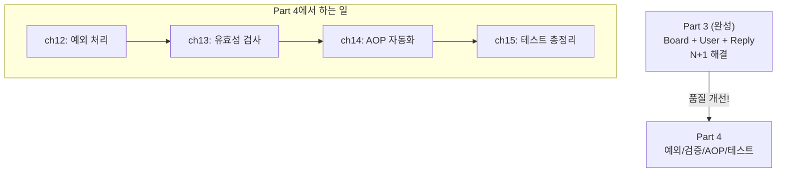
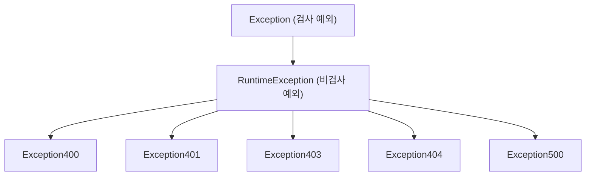
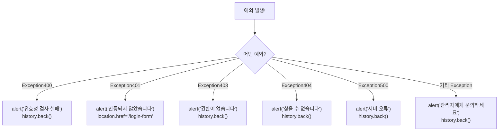
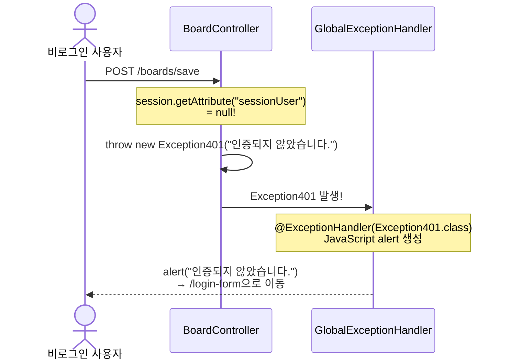
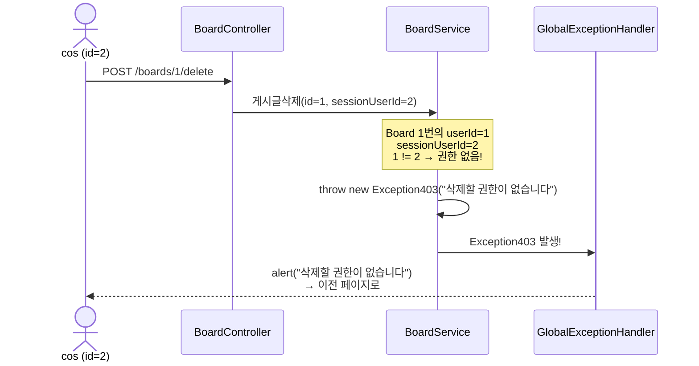

# Chapter 12. 예외 처리 - GlobalExceptionHandler

> **선수 조건**: [Chapter 11. N+1 문제와 해결](part3-ch11-n-plus-1.md)을 완료하세요.
>
> **Part 4에서 달라지는 것**: 완성된 게시판의 **품질을 개선**합니다! 에러가 발생했을 때 사용자에게 친절하게 알려주고, 입력값을 검증합니다.

---

## 12.1 Part 4의 큰 그림



---

## 12.2 지금까지의 문제점

Part 1~3에서 에러가 발생하면 어떻게 되었을까요?

```java
// 게시글을 찾을 수 없을 때
throw new RuntimeException("게시글을 찾을 수 없어요");

// 인증되지 않았을 때
throw new RuntimeException("인증되지 않았습니다.");

// 권한이 없을 때
throw new RuntimeException("수정할 권한이 없습니다");
```

> 모든 예외가 `RuntimeException`입니다!
>
> **문제**: 사용자에게 **Spring Boot 기본 에러 페이지**(Whitelabel Error Page)가 보입니다.

```
Whitelabel Error Page
This application has no explicit mapping for /error
There was an unexpected error (type=Internal Server Error, status=500).
게시글을 찾을 수 없어요
```

> 사용자 입장에서는 무슨 일인지 알 수 없고, 불친절합니다!
>
> **예시**: 식당에서 문제가 생겼을 때
> - ❌ 지금: "500 Internal Server Error" → "뭐야, 무슨 소리야?"
> - ✅ 원하는 것: "죄송합니다. 해당 메뉴는 품절입니다." → "아, 알겠어요!"

---

## 12.3 커스텀 예외 클래스 만들기

에러의 **종류**를 구분하기 위해 커스텀 예외를 만듭니다!

### HTTP 상태 코드 이해하기

| 코드 | 이름 | 의미 | 비유 |
|------|------|------|------|
| 400 | Bad Request | 잘못된 요청 (유효성 검사 실패) | "신청서에 빈칸이 있어요!" |
| 401 | Unauthorized | 인증 실패 (로그인 안 함) | "학생증을 보여주세요!" |
| 403 | Forbidden | 권한 없음 (남의 글) | "이건 다른 사람 사물함이에요!" |
| 404 | Not Found | 찾을 수 없음 | "그런 책은 도서관에 없어요!" |
| 500 | Server Error | 서버 오류 | "기계가 고장났어요..." |

### 예외 클래스 작성

#### Exception400 (유효성 검사 실패)

`src/main/java/com/example/boardv1/_core/errors/ex/Exception400.java`

```java
package com.example.boardv1._core.errors.ex;

public class Exception400 extends RuntimeException {
    public Exception400(String message) {
        super(message);
    }
}
```

#### Exception401 (인증 실패)

`src/main/java/com/example/boardv1/_core/errors/ex/Exception401.java`

```java
package com.example.boardv1._core.errors.ex;

public class Exception401 extends RuntimeException {
    public Exception401(String message) {
        super(message);
    }
}
```

#### Exception403 (권한 없음)

`src/main/java/com/example/boardv1/_core/errors/ex/Exception403.java`

```java
package com.example.boardv1._core.errors.ex;

public class Exception403 extends RuntimeException {
    public Exception403(String message) {
        super(message);
    }
}
```

#### Exception404 (찾을 수 없음)

`src/main/java/com/example/boardv1/_core/errors/ex/Exception404.java`

```java
package com.example.boardv1._core.errors.ex;

public class Exception404 extends RuntimeException {
    public Exception404(String message) {
        super(message);
    }
}
```

#### Exception500 (서버 오류)

`src/main/java/com/example/boardv1/_core/errors/ex/Exception500.java`

```java
package com.example.boardv1._core.errors.ex;

public class Exception500 extends RuntimeException {
    public Exception500(String message) {
        super(message);
    }
}
```

### 왜 RuntimeException을 상속할까?



> **RuntimeException(비검사 예외)** 을 상속하면:
> - `throws` 선언 없이 어디서든 `throw` 할 수 있음!
> - Spring이 자동으로 잡아서 처리할 수 있음!
>
> **예시**: 학교 방송 시스템을 생각해보세요!
> - 각 교실에서 문제가 생기면 → 방송실로 알림 (throw)
> - 방송실에서 → 전교생에게 안내 방송 (GlobalExceptionHandler)

---

## 12.4 GlobalExceptionHandler 만들기

모든 예외를 **한 곳**에서 처리하는 글로벌 예외 처리기입니다!

`src/main/java/com/example/boardv1/_core/errors/GlobalExceptionHandler.java`

```java
package com.example.boardv1._core.errors;

import org.springframework.web.bind.annotation.ExceptionHandler;
import org.springframework.web.bind.annotation.RestControllerAdvice;

import com.example.boardv1._core.errors.ex.Exception400;
import com.example.boardv1._core.errors.ex.Exception401;
import com.example.boardv1._core.errors.ex.Exception403;
import com.example.boardv1._core.errors.ex.Exception404;
import com.example.boardv1._core.errors.ex.Exception500;

@RestControllerAdvice
public class GlobalExceptionHandler {

    @ExceptionHandler(exception = Exception400.class)
    public String ex400(Exception400 e) {
        String html = String.format("""
                <script>
                    alert('%s');
                    history.back();
                </script>
                """, e.getMessage());
        return html;
    }

    @ExceptionHandler(exception = Exception401.class)
    public String ex401(Exception401 e) {
        String html = String.format("""
                <script>
                    alert('%s');
                    location.href = '/login-form';
                </script>
                """, e.getMessage());
        return html;
    }

    @ExceptionHandler(exception = Exception403.class)
    public String ex403(Exception403 e) {
        String html = String.format("""
                <script>
                    alert('%s');
                    history.back();
                </script>
                """, e.getMessage());
        return html;
    }

    @ExceptionHandler(exception = Exception404.class)
    public String ex404(Exception404 e) {
        String html = String.format("""
                <script>
                    alert('%s');
                    history.back();
                </script>
                """, e.getMessage());
        return html;
    }

    @ExceptionHandler(exception = Exception500.class)
    public String ex500(Exception500 e) {
        String html = String.format("""
                <script>
                    alert('%s');
                    history.back();
                </script>
                """, e.getMessage());
        return html;
    }

    @ExceptionHandler(exception = Exception.class)
    public String exUnknown(Exception e) {
        String html = String.format("""
                <script>
                    alert('%s');
                    history.back();
                </script>
                """, "관리자에게 문의하세요");
        System.out.println("error : " + e.getMessage());
        return html;
    }
}
```

### 코드 해설

#### @RestControllerAdvice

```java
@RestControllerAdvice
public class GlobalExceptionHandler {
```

> **"모든 Controller에서 발생하는 예외를 여기서 처리하겠다!"**
>
> **예시**: 학교 방송실을 생각해보세요!
> - 교실 1에서 문제 → 방송실이 처리
> - 교실 2에서 문제 → 방송실이 처리
> - **모든 교실의 문제를 방송실 한 곳에서 처리!**

#### @ExceptionHandler

```java
@ExceptionHandler(exception = Exception401.class)
public String ex401(Exception401 e) {
```

> **"Exception401이 발생하면 이 메서드가 처리해!"**
>
> 각 예외 타입별로 **다른 처리**를 할 수 있습니다.

#### JavaScript alert로 응답

```java
String html = String.format("""
        <script>
            alert('%s');
            history.back();
        </script>
        """, e.getMessage());
```

> - `alert('메시지')`: 사용자에게 팝업 알림
> - `history.back()`: 이전 페이지로 돌아감
> - **401만 특별**: `location.href = '/login-form'` → 로그인 페이지로 이동!



#### 알 수 없는 예외 처리

```java
@ExceptionHandler(exception = Exception.class)
public String exUnknown(Exception e) {
    // ...
    System.out.println("error : " + e.getMessage());
}
```

> **Exception.class** = 모든 예외의 부모!
> 위에서 처리되지 않은 **예상치 못한 예외**를 여기서 잡습니다.
>
> 사용자에게는 "관리자에게 문의하세요"를 보여주고,
> 서버 콘솔에는 실제 에러 메시지를 출력합니다.
>
> **예시**: 병원 응급실
> - 감기 → 내과 (Exception400)
> - 골절 → 정형외과 (Exception404)
> - 원인 모를 증상 → 응급실 (Exception.class) → "일단 검사해봅시다!"

---

## 12.5 기존 코드 업그레이드

### RuntimeException → 커스텀 예외로 변경

#### BoardController 변경

```java
// ❌ Before (Part 1~3)
if (sessionUser == null)
    throw new RuntimeException("인증되지 않았습니다.");

// ✅ After (Part 4)
if (sessionUser == null)
    throw new Exception401("인증되지 않았습니다.");
```

#### BoardService 변경

```java
// ❌ Before
throw new RuntimeException("게시글을 찾을 수 없어요");
throw new RuntimeException("수정할 권한이 없습니다");

// ✅ After
throw new Exception404("게시글을 찾을 수 없어요");
throw new Exception403("수정할 권한이 없습니다");
```

#### UserService 변경

```java
// ❌ Before
throw new RuntimeException("유저네임이 중복되었습니다");
throw new RuntimeException("username을 찾을 수 없어요");
throw new RuntimeException("패스워드가 일치하지 않아요");

// ✅ After
throw new Exception400("유저네임이 중복되었습니다");
throw new Exception404("username을 찾을 수 없어요");
throw new Exception401("패스워드가 일치하지 않아요");
```

#### ReplyService 변경

```java
// ❌ Before
throw new RuntimeException("댓글을 찾을 수 없습니다");
throw new RuntimeException("댓글을 삭제할 권한이 없습니다");

// ✅ After
throw new Exception404("댓글을 찾을 수 없습니다");
throw new Exception403("댓글을 삭제할 권한이 없습니다");
```

### 변경 요약

| 상황 | Before | After |
|------|--------|-------|
| 인증 실패 | `RuntimeException` | **`Exception401`** |
| 권한 없음 | `RuntimeException` | **`Exception403`** |
| 데이터 없음 | `RuntimeException` | **`Exception404`** |
| 중복 데이터 | `RuntimeException` | **`Exception400`** |
| 서버 오류 | `RuntimeException` | **`Exception500`** |

---

## 12.6 예외 처리 흐름 정리

### 비로그인 사용자가 글 작성 시도



### cos가 ssar의 글 삭제 시도



---

## 12.7 파일 구조

```
src/main/java/com/example/boardv1/
├── _core/                           ← 이번 챕터에서 추가!
│   └── errors/
│       ├── GlobalExceptionHandler.java ← 글로벌 예외 처리기
│       └── ex/
│           ├── Exception400.java    ← 유효성 검사 실패
│           ├── Exception401.java    ← 인증 실패
│           ├── Exception403.java    ← 권한 없음
│           ├── Exception404.java    ← 찾을 수 없음
│           └── Exception500.java    ← 서버 오류
├── board/ (기존 유지, RuntimeException → 커스텀 예외로 변경)
├── user/  (기존 유지, RuntimeException → 커스텀 예외로 변경)
└── reply/ (기존 유지, RuntimeException → 커스텀 예외로 변경)
```

---

## 실행 확인

서버를 재시작하고 다음을 확인하세요:

1. 비로그인 상태에서 `/boards/save-form` 접속 → 알림창 "인증되지 않았습니다." → 로그인 페이지로 이동하는지
2. `ssar`로 로그인 → `cos`의 글 수정 시도 → 알림창 "수정할 권한이 없습니다" → 이전 페이지로 돌아가는지
3. 존재하지 않는 게시글 (`/boards/999`) 접속 → 알림창 "게시글을 찾을 수 없어요" → 이전 페이지로 돌아가는지

---

## 핵심 정리

- **커스텀 예외**: 에러의 종류를 구분 (400, 401, 403, 404, 500)
- **@RestControllerAdvice**: 모든 Controller의 예외를 한 곳에서 처리 (방송실)
- **@ExceptionHandler**: 특정 예외 타입별로 다른 처리 (내과, 정형외과, 응급실)
- **RuntimeException을 상속**: throws 없이 어디서든 throw 가능
- **JavaScript alert**: 사용자에게 팝업으로 에러 메시지 전달
- **401만 특별**: 로그인 페이지로 이동 (나머지는 이전 페이지로)
- **exUnknown**: 예상치 못한 예외도 안전하게 처리 → "관리자에게 문의하세요"
- RuntimeException → 커스텀 예외로 **전부 교체**!

> **다음 챕터**: [Chapter 13. 유효성 검사](part4-ch13-validation.md) - 사용자가 빈 값을 보내거나 너무 긴 글을 쓸 때 **미리 막아줍니다!**
