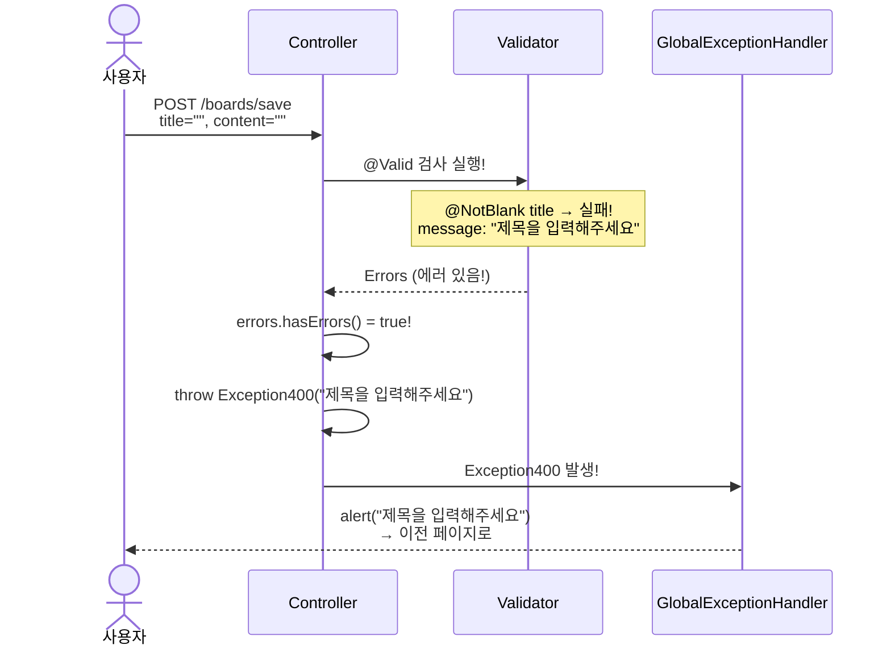
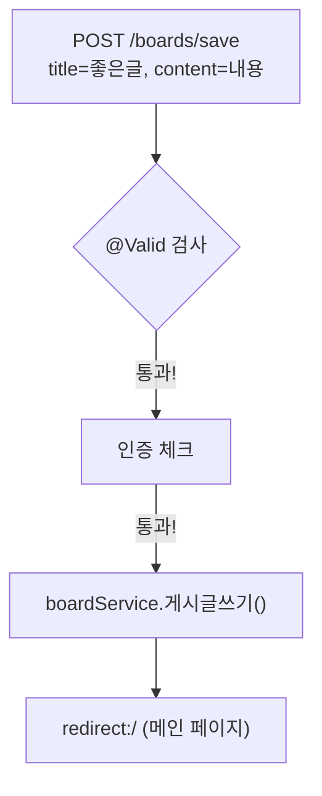
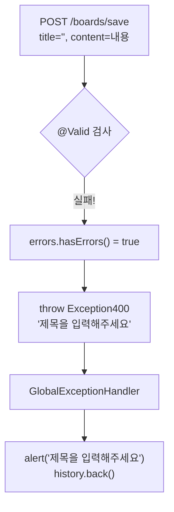

# Chapter 13. 유효성 검사 - @Valid와 Bean Validation

> **선수 조건**: [Chapter 12. 예외 처리](part4-ch12-exception.md)를 완료하세요.

---

## 13.1 유효성 검사란?

> **"사용자가 보낸 데이터가 올바른지 확인하는 것!"**

### 지금까지의 문제점

현재 게시글 작성 시 **아무것도 안 적고** 등록 버튼을 누르면?

```
title = ""    (빈 문자열)
content = ""  (빈 문자열)
```

> 빈 제목, 빈 내용의 게시글이 DB에 저장됩니다! 이건 안 됩니다!

### 유효성 검사가 필요한 곳

| 상황 | 검사 내용 |
|------|----------|
| 게시글 작성/수정 | 제목이 비어있으면 안 됨! |
| 회원가입 | 아이디, 비밀번호가 비어있으면 안 됨! |
| 로그인 | 아이디, 비밀번호가 비어있으면 안 됨! |
| 댓글 등록 | 댓글 내용이 비어있으면 안 됨! |

> **예시**: 시험지를 제출할 때를 생각해보세요!
> - 이름 안 적고 제출 → "이름 적으세요!" (유효성 검사 실패)
> - 답안 안 적고 제출 → "답을 적으세요!" (유효성 검사 실패)
> - 이름 + 답안 모두 작성 → "제출 완료!" (유효성 검사 통과)

---

## 13.2 의존성 추가

유효성 검사를 위해 **Spring Validation** 의존성을 추가합니다.

`build.gradle`의 dependencies에 추가:

```gradle
dependencies {
    // ... 기존 의존성 유지

    implementation 'org.springframework.boot:spring-boot-starter-validation'  // ← 추가!
}
```

> **spring-boot-starter-validation**이 제공하는 어노테이션:
> - `@NotBlank`: 빈 문자열 불가! (null, "", "   " 모두 불가)
> - `@NotNull`: null 불가!
> - `@NotEmpty`: 빈 값 불가! (null, "" 불가)
> - `@Size`: 길이 제한!
> - `@Email`: 이메일 형식 확인!
> - `@Min`, `@Max`: 숫자 범위 제한!
>
> 의존성 추가 후 **Gradle Refresh**를 해야 합니다!

---

## 13.3 Request DTO에 검증 어노테이션 추가

### BoardRequest 업그레이드

`src/main/java/com/example/boardv1/board/BoardRequest.java`

```java
package com.example.boardv1.board;

import jakarta.validation.constraints.NotBlank;
import jakarta.validation.constraints.Size;
import lombok.Data;

public class BoardRequest {

    @Data
    public static class SaveOrUpdateDTO {

        @NotBlank(message = "제목을 입력해주세요")
        @Size(max = 100, message = "제목은 100자 이내로 입력해주세요")
        private String title;

        @NotBlank(message = "내용을 입력해주세요")
        private String content;
    }
}
```

### UserRequest 업그레이드

`src/main/java/com/example/boardv1/user/UserRequest.java`

```java
package com.example.boardv1.user;

import jakarta.validation.constraints.NotBlank;
import jakarta.validation.constraints.Size;
import lombok.Data;

public class UserRequest {

    @Data
    public static class LoginDTO {
        @NotBlank(message = "유저네임을 입력해주세요")
        private String username;

        @NotBlank(message = "비밀번호를 입력해주세요")
        private String password;
    }

    @Data
    public static class JoinDTO {
        @NotBlank(message = "유저네임을 입력해주세요")
        @Size(min = 3, max = 20, message = "유저네임은 3~20자로 입력해주세요")
        private String username;

        @NotBlank(message = "비밀번호를 입력해주세요")
        @Size(min = 4, max = 20, message = "비밀번호는 4~20자로 입력해주세요")
        private String password;

        private String email;
    }
}
```

### ReplyRequest 업그레이드

`src/main/java/com/example/boardv1/reply/ReplyRequest.java`

```java
package com.example.boardv1.reply;

import jakarta.validation.constraints.NotBlank;
import jakarta.validation.constraints.NotNull;
import lombok.Data;

public class ReplyRequest {

    @Data
    public static class SaveDTO {
        @NotNull(message = "게시글 ID가 필요합니다")
        private Integer boardId;

        @NotBlank(message = "댓글을 입력해주세요")
        private String comment;
    }
}
```

### 어노테이션 해설

| 어노테이션 | 의미 | 예시 |
|-----------|------|------|
| `@NotBlank` | 빈 문자열 불가 | `""`, `"  "`, `null` → 실패! |
| `@NotNull` | null 불가 | `null` → 실패! (`""` → 통과!) |
| `@Size(min=3, max=20)` | 길이 제한 | `"ab"` → 실패! (3자 미만) |

> **@NotBlank vs @NotNull vs @NotEmpty 차이:**
>
> | 입력값 | @NotNull | @NotEmpty | @NotBlank |
> |--------|----------|-----------|-----------|
> | `null` | ❌ 실패 | ❌ 실패 | ❌ 실패 |
> | `""` | ✅ 통과 | ❌ 실패 | ❌ 실패 |
> | `"   "` | ✅ 통과 | ✅ 통과 | ❌ 실패 |
> | `"hello"` | ✅ 통과 | ✅ 통과 | ✅ 통과 |
>
> **문자열에는 `@NotBlank`가 가장 엄격하고 안전합니다!**
> **숫자/객체에는 `@NotNull`을 사용합니다!**

---

## 13.4 Controller에 @Valid 추가

### @Valid란?

> **"이 DTO의 유효성 검사를 실행해줘!"**

```java
// ❌ Before: 유효성 검사 없음
@PostMapping("/boards/save")
public String save(BoardRequest.SaveOrUpdateDTO reqDTO) {

// ✅ After: @Valid로 유효성 검사!
@PostMapping("/boards/save")
public String save(@Valid BoardRequest.SaveOrUpdateDTO reqDTO, Errors errors) {
```

### BoardController에 @Valid 추가

```java
@PostMapping("/boards/save")
public String save(@Valid BoardRequest.SaveOrUpdateDTO reqDTO, Errors errors) {
    // 유효성 검사 실패 시
    if (errors.hasErrors()) {
        throw new Exception400(errors.getAllErrors().get(0).getDefaultMessage());
    }

    User sessionUser = (User) session.getAttribute("sessionUser");
    if (sessionUser == null)
        throw new Exception401("인증되지 않았습니다.");

    boardService.게시글쓰기(reqDTO.getTitle(), reqDTO.getContent(), sessionUser);
    return "redirect:/";
}

@PostMapping("/boards/{id}/update")
public String update(@PathVariable("id") int id, @Valid BoardRequest.SaveOrUpdateDTO reqDTO, Errors errors) {
    if (errors.hasErrors()) {
        throw new Exception400(errors.getAllErrors().get(0).getDefaultMessage());
    }

    User sessionUser = (User) session.getAttribute("sessionUser");
    if (sessionUser == null)
        throw new Exception401("인증되지 않았습니다.");

    boardService.게시글수정(id, reqDTO.getTitle(), reqDTO.getContent(), sessionUser.getId());
    return "redirect:/boards/" + id;
}
```

### UserController에 @Valid 추가

```java
@PostMapping("/join")
public String join(@Valid UserRequest.JoinDTO reqDTO, Errors errors) {
    if (errors.hasErrors()) {
        throw new Exception400(errors.getAllErrors().get(0).getDefaultMessage());
    }

    userService.회원가입(reqDTO.getUsername(), reqDTO.getPassword(), reqDTO.getEmail());
    return "redirect:/login-form";
}

@PostMapping("/login")
public String login(@Valid UserRequest.LoginDTO reqDTO, Errors errors) {
    if (errors.hasErrors()) {
        throw new Exception400(errors.getAllErrors().get(0).getDefaultMessage());
    }

    User sessionUser = userService.로그인(reqDTO.getUsername(), reqDTO.getPassword());
    session.setAttribute("sessionUser", sessionUser);
    return "redirect:/";
}
```

### ReplyController에 @Valid 추가

```java
@PostMapping("/replies/save")
public String save(@Valid ReplyRequest.SaveDTO reqDTO, Errors errors) {
    if (errors.hasErrors()) {
        throw new Exception400(errors.getAllErrors().get(0).getDefaultMessage());
    }

    User sessionUser = (User) session.getAttribute("sessionUser");
    if (sessionUser == null)
        throw new Exception401("인증되지 않았습니다.");

    replyService.댓글등록(reqDTO.getBoardId(), reqDTO.getComment(), sessionUser.getId());
    return "redirect:/boards/" + reqDTO.getBoardId();
}
```

### 코드 해설

#### @Valid + Errors

```java
public String save(@Valid BoardRequest.SaveOrUpdateDTO reqDTO, Errors errors) {
```

> - `@Valid`: DTO의 어노테이션(@NotBlank 등)을 검사!
> - `Errors errors`: 검사 결과를 담는 객체
> - **`@Valid`와 `Errors`는 반드시 나란히 놓아야 합니다!**

#### errors.hasErrors()

```java
if (errors.hasErrors()) {
    throw new Exception400(errors.getAllErrors().get(0).getDefaultMessage());
}
```

> - `errors.hasErrors()`: 유효성 검사에 실패한 항목이 있는지?
> - `errors.getAllErrors().get(0)`: 첫 번째 에러 가져오기
> - `.getDefaultMessage()`: 에러 메시지 가져오기 (예: "제목을 입력해주세요")
> - → Exception400으로 던지면 → GlobalExceptionHandler가 처리!



---

## 13.5 유효성 검사 흐름 정리

### 성공 흐름



### 실패 흐름



> **예시**: 놀이공원 놀이기구 탑승을 생각해보세요!
>
> | 단계 | 비유 | 코드 |
> |------|------|------|
> | 1. 키 검사 | "키가 120cm 이상?" | `@Valid` (유효성 검사) |
> | 2. 티켓 확인 | "티켓 있어?" | 인증 체크 (sessionUser) |
> | 3. 탑승! | "탑승하세요!" | 비즈니스 로직 실행 |
>
> 키가 안 되면 1단계에서 바로 돌려보냅니다!

---

## 13.6 import 주의사항

**중요!** `Errors`와 `@Valid`의 import가 정확해야 합니다!

```java
import jakarta.validation.Valid;         // ✅ 올바른 import!
import org.springframework.validation.Errors;  // ✅ 올바른 import!
```

> **주의**: `java.validation`이 아니라 `jakarta.validation`입니다!
> Spring Boot 4.x에서는 `jakarta` 패키지를 사용합니다.

---

## 실행 확인

서버를 재시작하고 다음을 확인하세요:

1. 게시글 작성 시 제목 비우고 등록 → "제목을 입력해주세요" 알림
2. 게시글 작성 시 내용 비우고 등록 → "내용을 입력해주세요" 알림
3. 회원가입 시 아이디 2자로 입력 → "유저네임은 3~20자로 입력해주세요" 알림
4. 로그인 시 비밀번호 비우고 로그인 → "비밀번호를 입력해주세요" 알림
5. 댓글 빈 내용으로 등록 → "댓글을 입력해주세요" 알림

---

## 핵심 정리

- **Bean Validation**: 어노테이션으로 입력값 검증 (@NotBlank, @Size 등)
- **의존성 추가**: `spring-boot-starter-validation`
- **@Valid**: Controller 파라미터에 붙여서 유효성 검사 실행
- **Errors**: 검사 결과를 담는 객체 (`hasErrors()`로 확인)
- **@NotBlank**: 빈 문자열 불가 (가장 엄격!)
- **@Size(min, max)**: 길이 제한
- **@NotNull**: null 불가 (숫자/객체에 사용)
- 유효성 검사 실패 → Exception400 → GlobalExceptionHandler → alert!
- **import**: `jakarta.validation.Valid` (javax가 아님!)

> **문제**: 모든 Controller 메서드에 같은 코드가 반복됩니다!
> ```java
> if (errors.hasErrors()) {
>     throw new Exception400(errors.getAllErrors().get(0).getDefaultMessage());
> }
> ```
> **다음 챕터**: [Chapter 14. 유효성 검사 AOP](part4-ch14-validation-aop.md) - AOP로 반복 코드를 **자동화**합니다!
