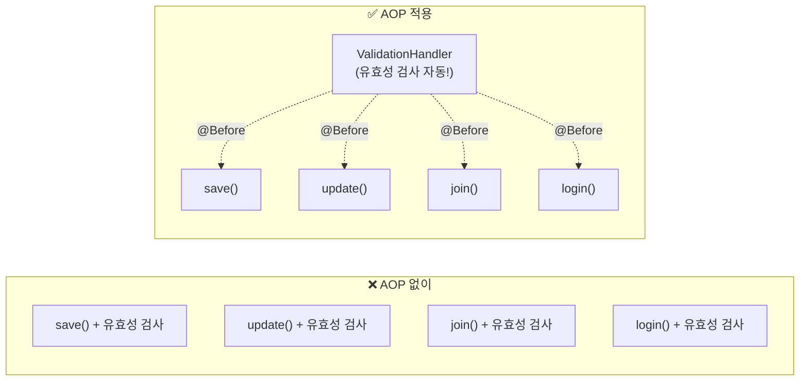
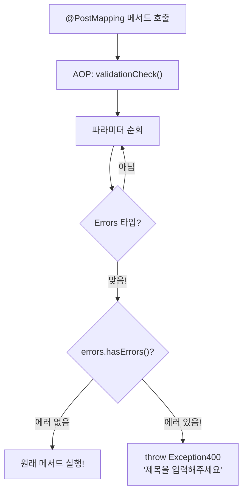
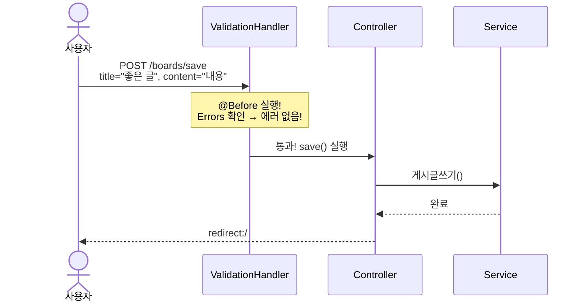
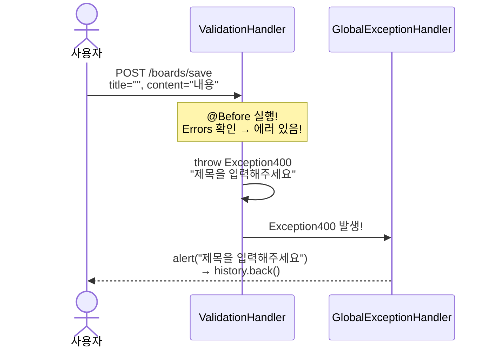
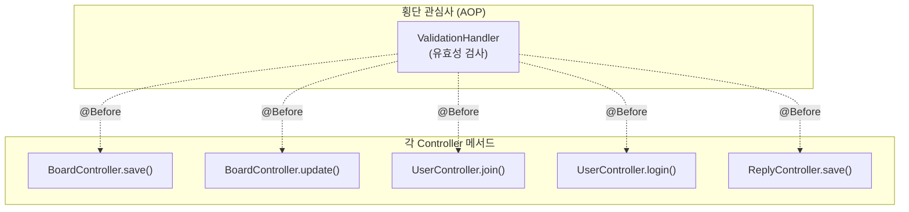

# Chapter 14. 유효성 검사 AOP - 반복 코드 자동화

> **선수 조건**: [Chapter 13. 유효성 검사](part4-ch13-validation.md)를 완료하세요.

---

## 14.1 문제: 반복되는 코드

ch13에서 모든 `@PostMapping` 메서드에 같은 코드를 넣었습니다:

```java
// BoardController.save()
if (errors.hasErrors()) {
    throw new Exception400(errors.getAllErrors().get(0).getDefaultMessage());
}

// BoardController.update()
if (errors.hasErrors()) {
    throw new Exception400(errors.getAllErrors().get(0).getDefaultMessage());
}

// UserController.join()
if (errors.hasErrors()) {
    throw new Exception400(errors.getAllErrors().get(0).getDefaultMessage());
}

// UserController.login()
if (errors.hasErrors()) {
    throw new Exception400(errors.getAllErrors().get(0).getDefaultMessage());
}

// ReplyController.save()
if (errors.hasErrors()) {
    throw new Exception400(errors.getAllErrors().get(0).getDefaultMessage());
}
```

> **5곳에 똑같은 코드가 반복됩니다!**
>
> **예시**: 학교 교실 5곳에 같은 안내문을 붙이는 상황
> - ❌ 교실마다 하나씩 붙이기 (5번 반복)
> - ✅ **방송으로 한 번에 안내하기** (1번이면 충분!)
>
> 이런 **반복되는 코드를 한 곳에서 처리**하는 것이 **AOP**입니다!

---

## 14.2 AOP란?

> **AOP = Aspect Oriented Programming** (관점 지향 프로그래밍)
>
> **핵심 비즈니스 로직과 별개로**, 여러 곳에서 공통으로 필요한 기능을 **한 곳에서 처리**하는 기법!



> **예시**: 학교 정문 검사를 생각해보세요!
> - ❌ AOP 없이: 각 교실 입구에서 학생증 확인 (교실마다 반복!)
> - ✅ AOP 적용: **정문에서 한 번에 확인** (모든 교실에 자동 적용!)

### AOP 핵심 용어

| 용어 | 의미 | 비유 |
|------|------|------|
| **Aspect** | 공통 관심사 (유효성 검사) | 정문 경비원 |
| **@Before** | 메서드 실행 **전**에 동작 | 교실에 들어가기 **전** 학생증 확인 |
| **JoinPoint** | AOP가 적용되는 지점 (메서드) | 각 교실 입구 |
| **Pointcut** | 어떤 메서드에 적용할지 조건 | "@PostMapping이 붙은 메서드" |

---

## 14.3 ValidationHandler 만들기

`src/main/java/com/example/boardv1/_core/aop/ValidationHandler.java`

```java
package com.example.boardv1._core.aop;

import org.aspectj.lang.JoinPoint;
import org.aspectj.lang.annotation.Aspect;
import org.aspectj.lang.annotation.Before;
import org.springframework.stereotype.Component;
import org.springframework.validation.Errors;

import com.example.boardv1._core.errors.ex.Exception400;

@Aspect
@Component
public class ValidationHandler {

    @Before("@annotation(org.springframework.web.bind.annotation.PostMapping)")
    public void validationCheck(JoinPoint jp) {
        Object[] args = jp.getArgs();
        for (Object arg : args) {
            if (arg instanceof Errors) {
                Errors errors = (Errors) arg;
                if (errors.hasErrors()) {
                    throw new Exception400(
                        errors.getAllErrors().get(0).getDefaultMessage()
                    );
                }
            }
        }
    }
}
```

### 코드 해설

#### @Aspect

```java
@Aspect
@Component
public class ValidationHandler {
```

> - `@Aspect`: "이 클래스는 AOP 기능을 담당합니다!"
> - `@Component`: Spring Bean으로 등록 (Spring이 관리)

#### @Before + Pointcut

```java
@Before("@annotation(org.springframework.web.bind.annotation.PostMapping)")
public void validationCheck(JoinPoint jp) {
```

> **"@PostMapping이 붙은 모든 메서드가 실행되기 전에, 이 메서드를 먼저 실행해!"**
>
> - `@Before`: 대상 메서드 **실행 전**에 동작
> - `@annotation(...)`: "@PostMapping이 붙은 메서드"를 대상으로
>
> ```
> 실행 순서:
> 1. validationCheck() ← AOP가 먼저!
> 2. save()            ← 그 다음 원래 메서드
> ```

#### JoinPoint - 메서드 정보 접근

```java
Object[] args = jp.getArgs();
for (Object arg : args) {
```

> `JoinPoint`를 통해 **대상 메서드의 파라미터**에 접근합니다.
>
> ```java
> // 예: save(@Valid BoardRequest.SaveOrUpdateDTO reqDTO, Errors errors)
> // jp.getArgs() → [reqDTO, errors]
> ```
>
> 모든 파라미터를 하나씩 확인하면서 `Errors` 타입인 것을 찾습니다.

#### instanceof - 타입 확인

```java
if (arg instanceof Errors) {
    Errors errors = (Errors) arg;
    if (errors.hasErrors()) {
        throw new Exception400(
            errors.getAllErrors().get(0).getDefaultMessage()
        );
    }
}
```

> - `arg instanceof Errors`: "이 파라미터가 Errors 타입인가?"
> - Errors를 찾으면 → 에러가 있는지 확인 → 있으면 Exception400 발생!
>
> **예시**: 경비원이 가방을 검사하는 것!
> - 가방 하나씩 열어봄 (for문)
> - "이거 반입금지 물품인가?" 확인 (instanceof)
> - 금지물품 발견 → "입장 불가!" (throw Exception400)



---

## 14.4 Controller에서 반복 코드 제거

### Before (ch13)

```java
@PostMapping("/boards/save")
public String save(@Valid BoardRequest.SaveOrUpdateDTO reqDTO, Errors errors) {
    // ❌ 이 코드가 모든 메서드에 반복!
    if (errors.hasErrors()) {
        throw new Exception400(errors.getAllErrors().get(0).getDefaultMessage());
    }

    User sessionUser = (User) session.getAttribute("sessionUser");
    if (sessionUser == null)
        throw new Exception401("인증되지 않았습니다.");

    boardService.게시글쓰기(reqDTO.getTitle(), reqDTO.getContent(), sessionUser);
    return "redirect:/";
}
```

### After (ch14 - AOP 적용)

```java
@PostMapping("/boards/save")
public String save(@Valid BoardRequest.SaveOrUpdateDTO reqDTO, Errors errors) {
    // ✅ 유효성 검사 코드 제거! AOP가 자동으로 처리!

    User sessionUser = (User) session.getAttribute("sessionUser");
    if (sessionUser == null)
        throw new Exception401("인증되지 않았습니다.");

    boardService.게시글쓰기(reqDTO.getTitle(), reqDTO.getContent(), sessionUser);
    return "redirect:/";
}
```

> **중요!** `@Valid`와 `Errors` 파라미터는 **그대로 유지**합니다!
> AOP가 `Errors`를 읽어서 처리하므로, 파라미터가 있어야 합니다.
>
> 제거하는 것은 `if (errors.hasErrors()) { ... }` 코드 블록만!

### 모든 Controller 업그레이드

BoardController, UserController, ReplyController 모두 같은 방식으로
`if (errors.hasErrors())` 블록을 **제거**합니다.

> AOP가 `@PostMapping` 메서드 실행 **전**에 자동으로 유효성 검사를 합니다!

---

## 14.5 AOP 실행 흐름 전체 정리

### 유효성 검사 성공 시



### 유효성 검사 실패 시



> **Controller의 save() 메서드는 실행조차 되지 않습니다!**
> AOP가 **메서드 실행 전**에 유효성 검사를 하고, 실패하면 바로 예외를 던집니다.

---

## 14.6 횡단 관심사 (Cross-Cutting Concerns)



> **횡단 관심사(Cross-Cutting Concerns)**: 여러 곳에서 공통으로 필요한 기능
>
> | 종류 | 설명 | 예시 |
> |------|------|------|
> | 유효성 검사 | 입력값이 올바른지 | ValidationHandler |
> | 로깅 | 요청/응답 기록 | LoggingAspect |
> | 트랜잭션 | DB 작업 원자성 | @Transactional (Spring이 자동!) |
> | 인증/인가 | 로그인/권한 확인 | SecurityFilter |
>
> **예시**: 학교에서 공통으로 적용되는 규칙
> - 유효성 검사 = **모든 교실** 입구에서 학생증 확인
> - 로깅 = **모든 수업**에서 출석 체크
> - 트랜잭션 = **모든 시험**에서 부정행위 감시
>
> 이런 공통 기능을 각 교실에서 따로 하면 비효율적!
> **한 곳에서 한 번에** 처리하는 것이 AOP!

---

## 실행 확인

서버를 재시작하고 다음을 확인하세요:

1. 게시글 작성 시 제목 비우고 등록 → "제목을 입력해주세요" 알림 (AOP가 처리!)
2. 콘솔에서 `validationCheck` 관련 로그가 나오는지 확인
3. ch13과 동일하게 동작하지만, Controller 코드가 **더 깔끔해진** 것을 확인!

### 이 시점의 파일 구조

```
src/main/java/com/example/boardv1/
├── _core/
│   ├── aop/
│   │   └── ValidationHandler.java  ← 이번 챕터에서 추가!
│   └── errors/
│       ├── GlobalExceptionHandler.java
│       └── ex/ (Exception400~500)
├── board/
├── user/
└── reply/
```

---

## 핵심 정리

- **AOP (관점 지향 프로그래밍)**: 반복되는 공통 기능을 한 곳에서 처리
- **@Aspect**: AOP 기능을 담당하는 클래스
- **@Before**: 대상 메서드 실행 **전**에 동작
- **Pointcut**: `@annotation(PostMapping)` → @PostMapping이 붙은 모든 메서드
- **JoinPoint**: AOP가 적용되는 메서드의 정보 (파라미터 접근 가능)
- **instanceof**: 파라미터의 타입 확인 (Errors인지?)
- **횡단 관심사**: 여러 곳에서 공통으로 필요한 기능 (유효성 검사, 로깅, 트랜잭션 등)
- Controller에서 `if (errors.hasErrors())` 코드 **제거** → AOP가 자동 처리!
- `@Valid`와 `Errors` 파라미터는 **유지**해야 함!

> **다음 챕터**: [Chapter 15. 테스트 코드 총정리](part4-ch15-test.md) - Part별로 테스트 코드를 정리하고, 쿼리의 진화를 한눈에 확인합니다!
