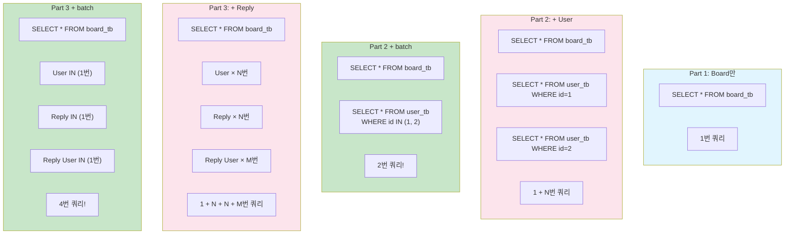

# Chapter 15. 테스트 코드 총정리 - Part별 쿼리 진화

> **선수 조건**: [Chapter 14. 유효성 검사 AOP](part4-ch14-validation-aop.md)를 완료하세요.
>
> **이번 챕터의 목표**: Part 1 → 2 → 3으로 테이블이 추가되면서 **쿼리가 어떻게 변했는지** 테스트 코드로 확인합니다.

---

## 15.1 테스트 코드의 가치

> 테스트 코드는 **"내 코드가 제대로 동작하는지 확인하는 자동 검사"** 입니다.
>
> **예시**: 자동차 출고 검사를 생각해보세요!
> - 엔진 동작 확인 ← save_test
> - 브레이크 동작 확인 ← findById_test
> - 계기판 동작 확인 ← findAll_test
>
> 새 부품(기능)을 추가할 때마다 **전체 검사를 다시** 돌려서
> 기존 기능이 깨지지 않았는지 확인합니다!

### @DataJpaTest 복습

```java
@Import(BoardRepository.class)
@DataJpaTest
public class BoardRepositoryTest {
```

> - `@DataJpaTest`: JPA 관련 Bean만 로딩 (가볍고 빠른 테스트!)
> - `@Import(BoardRepository.class)`: 우리가 만든 Repository를 테스트에 등록
> - H2 인메모리 DB에서 테스트 → 실제 DB에 영향 없음!
> - 각 테스트가 끝나면 **자동 롤백** (데이터 초기화)

---

## 15.2 BoardRepositoryTest - Part별 테스트

### Part 1 테스트: 기본 CRUD

```java
@Import(BoardRepository.class)
@DataJpaTest
public class BoardRepositoryTest {

    @Autowired
    private BoardRepository boardRepository;

    @Autowired
    private EntityManager em;

    // ========== Part 1 테스트: 기본 CRUD ==========

    @Test
    public void save_test() {
        // given
        Board board = new Board();
        board.setTitle("title7");
        board.setContent("content7");

        // when
        boardRepository.save(board);

        // eye
        System.out.println("===after persist");
        System.out.println(board);
    }

    @Test
    public void findById_test() {
        // given
        int id = 1;

        // when
        Board board = boardRepository.findById(id)
                .orElseThrow(() -> new RuntimeException("게시글을 찾을 수 없어요"));

        // eye
        System.out.println(board);
    }

    @Test
    public void findAll_test() {
        // when
        List<Board> list = boardRepository.findAll();

        // eye
        for (Board board : list) {
            System.out.println(board);
        }
    }

    @Test
    public void delete_test() {
        // given
        int id = 1;
        Board board = boardRepository.findById(id)
                .orElseThrow(() -> new RuntimeException("게시글을 찾을 수 없어요"));

        // when
        boardRepository.delete(board);

        // eye
        em.flush();
    }

    @Test
    public void update_test() {
        // given
        int id = 1;
        Board board = boardRepository.findById(id)
                .orElseThrow(() -> new RuntimeException("게시글을 찾을 수 없어요"));

        // when (Dirty Checking!)
        board.setTitle("title1-update");

        // eye
        em.flush();

        List<Board> list = boardRepository.findAll();
        for (Board b : list) {
            System.out.println(b);
        }
    }
```

> **Part 1 쿼리 특징:**
> - 단순 CRUD: `INSERT`, `SELECT`, `UPDATE`, `DELETE`
> - **JOIN 없음!** Board 테이블만 조회
> - 쿼리가 간단하고 명확

### Part 1 영속성 컨텍스트 테스트

```java
    @Test
    public void findByIdV2_test() {
        // given
        int id = 1;

        // when - 1차 캐시 테스트
        boardRepository.findById(id);  // SELECT 쿼리 발생!
        em.clear();                     // 1차 캐시 초기화
        boardRepository.findById(id);  // 다시 SELECT 쿼리 발생!
    }
```

> **1차 캐시 확인:**
> - 첫 번째 `findById` → SELECT 쿼리 발생 + 1차 캐시에 저장
> - `em.clear()` → 1차 캐시 비움!
> - 두 번째 `findById` → 캐시에 없으므로 다시 SELECT 쿼리 발생!
>
> `em.clear()`를 안 하면? → 두 번째 `findById`에서 **쿼리 안 나감!** (캐시에서 가져옴)

---

### Part 2 테스트: User 관계 + N+1

```java
    // ========== Part 2 테스트: User 관계 + N+1 문제 ==========

    @Test
    public void part2_findById_lazy_n_plus_1_test() {
        System.out.println("===== [Part 2] findById 호출 - Lazy Loading =====");
        Board board = boardRepository.findById(1)
                .orElseThrow(() -> new RuntimeException("게시글을 찾을 수 없어요"));
        System.out.println("===== board 조회 완료 =====");

        // User 접근 시 추가 쿼리 발생 (N+1!)
        System.out.println("===== user.username 접근 시작 =====");
        String username = board.getUser().getUsername();
        System.out.println("===== user.username 접근 완료: " + username + " =====");
    }
```

> **확인 포인트:** Board 조회 후 `getUser().getUsername()` 할 때 **추가 SELECT가 나가는지** 확인!
> - EAGER이면 → 이미 JOIN으로 가져왔으므로 추가 쿼리 없음
> - LAZY이면 → 추가 SELECT 발생! (N+1)

```java
    @Test
    public void part2_findByIdJoinUser_no_n_plus_1_test() {
        System.out.println("===== [Part 2] findByIdJoinUser 호출 - JOIN FETCH =====");
        Board board = boardRepository.findByIdJoinUser(1)
                .orElseThrow(() -> new RuntimeException("게시글을 찾을 수 없어요"));
        System.out.println("===== JOIN FETCH로 board + user 조회 완료 =====");

        // User 접근 시 추가 쿼리 없음!
        String username = board.getUser().getUsername();
        System.out.println("===== user.username: " + username + " (추가 쿼리 없음) =====");
    }
```

> **JOIN FETCH** 사용 시 → Board + User를 **한 번의 쿼리**로 가져옴!
> `getUser().getUsername()` 해도 추가 쿼리 없음!

```java
    @Test
    public void part2_findAll_n_plus_1_test() {
        System.out.println("===== [Part 2] findAll 호출 - N+1 문제 =====");
        List<Board> boards = boardRepository.findAll();
        System.out.println("===== " + boards.size() + "개 게시글 조회 완료 (1번 쿼리) =====");

        for (Board board : boards) {
            String username = board.getUser().getUsername();
            System.out.println("Board " + board.getId() + " - User: " + username);
        }
    }
```

> **N+1 문제 확인!** findAll()로 Board 6개 조회 후, 각 Board의 User에 접근하면 추가 쿼리 발생!

---

### Part 3 테스트: Reply + Massive N+1

```java
    // ========== Part 3 테스트: Reply 관계 + Massive N+1 문제 ==========

    @Test
    public void part3_findAll_with_replies_massive_n_plus_1_test() {
        System.out.println("===== [Part 3] findAll + Replies 접근 - Massive N+1 문제 =====");
        List<Board> boards = boardRepository.findAll();
        System.out.println("===== " + boards.size() + "개 게시글 조회 완료 (1번 쿼리) =====");

        int boardUserQueryCount = 0;
        int replyQueryCount = 0;
        int replyUserQueryCount = 0;

        for (Board board : boards) {
            String boardUsername = board.getUser().getUsername();
            boardUserQueryCount++;

            int replyCount = board.getReplies().size();
            replyQueryCount++;

            for (int i = 0; i < Math.min(3, replyCount); i++) {
                String replyUsername = board.getReplies().get(i).getUser().getUsername();
                replyUserQueryCount++;
            }
        }

        System.out.println("===== 총 쿼리 발생 =====");
        System.out.println("Board 조회: 1번");
        System.out.println("Board User 조회: " + boardUserQueryCount + "번");
        System.out.println("Reply 조회: " + replyQueryCount + "번");
        System.out.println("Reply User 조회: " + replyUserQueryCount + "번");
        System.out.println("총 쿼리: " + (1 + boardUserQueryCount + replyQueryCount + replyUserQueryCount) + "번");
    }

    @Test
    public void part3_batch_fetch_size_test() {
        System.out.println("===== [Part 3] Batch Fetch Size 테스트 =====");
        System.out.println("application.properties에 default_batch_fetch_size=10 설정됨");

        List<Board> boards = boardRepository.findAll();
        System.out.println("===== " + boards.size() + "개 게시글 조회 완료 =====");

        // User 일괄 조회 (IN 쿼리)
        for (Board board : boards) {
            board.getUser().getUsername();
        }
        System.out.println("===== Board User IN 쿼리로 일괄 조회 완료 =====");

        // Reply + Reply User 일괄 조회
        for (Board board : boards) {
            for (int i = 0; i < Math.min(3, board.getReplies().size()); i++) {
                board.getReplies().get(i).getUser().getUsername();
            }
        }
        System.out.println("===== Replies + Reply User IN 쿼리로 일괄 조회 완료 =====");
        System.out.println("총 4개 쿼리 (Board 1번 + User IN 1번 + Reply IN 1번 + Reply User IN 1번)");
    }
}
```

---

## 15.3 ReplyRepositoryTest

```java
@Import(ReplyRepository.class)
@DataJpaTest
public class ReplyRepositoryTest {

    @Autowired
    private ReplyRepository replyRepository;

    @Autowired
    private EntityManager em;

    @Test
    public void part3_save_with_getReference_test() {
        System.out.println("===== [Part 3] getReference로 Reply 저장 =====");

        Board boardProxy = em.getReference(Board.class, 1);
        User userProxy = em.getReference(User.class, 1);
        System.out.println("===== 프록시 생성 완료 (아직 SELECT 없음) =====");

        Reply reply = new Reply();
        reply.setComment("getReference 테스트 댓글");
        reply.setBoard(boardProxy);
        reply.setUser(userProxy);

        replyRepository.save(reply);
        em.flush();
        System.out.println("===== Reply 저장 완료 (INSERT만 발생, SELECT 없음!) =====");
        System.out.println("Reply ID: " + reply.getId());
    }

    @Test
    public void part3_save_without_getReference_test() {
        System.out.println("===== [Part 3] find()로 Reply 저장 (비교용) =====");

        Board board = em.find(Board.class, 1);
        User user = em.find(User.class, 1);
        System.out.println("===== Board, User SELECT 쿼리 2번 발생 =====");

        Reply reply = new Reply();
        reply.setComment("find 테스트 댓글");
        reply.setBoard(board);
        reply.setUser(user);

        replyRepository.save(reply);
        em.flush();
        System.out.println("===== Reply 저장 완료 (총 3개 쿼리: SELECT 2번 + INSERT 1번) =====");
        System.out.println("Reply ID: " + reply.getId());
    }
}
```

> **getReference() vs find() 쿼리 비교:**
>
> | 방식 | SELECT | INSERT | 총 쿼리 |
> |------|--------|--------|--------|
> | find() | 2번 | 1번 | **3번** |
> | getReference() | **0번** | 1번 | **1번** |

---

## 15.4 UserRepositoryTest

```java
@Import(UserRepository.class)
@DataJpaTest
public class UserRepositoryTest {

    @Autowired
    private UserRepository userRepository;

    @Test
    public void findById_test() {
        int id = 1;
        User user = userRepository.findById(id)
                .orElseThrow(() -> new RuntimeException("해당 아이디로 유저를 찾을 수 없어요"));
        System.out.println("user : " + user);
    }

    @Test
    public void save_fail_test() {
        // given - 이미 data.sql에 cos가 존재함!
        User user = new User();
        user.setUsername("cos");     // 중복된 username!
        user.setPassword("1234");
        user.setEmail("cos@nate.com");

        // when - UNIQUE 위반!
        User findUser = userRepository.save(user);
        System.out.println(findUser);
    }

    @Test
    public void save_test() {
        User user = new User();
        user.setUsername("love");
        user.setPassword("1234");
        user.setEmail("love@nate.com");

        User findUser = userRepository.save(user);
        System.out.println(findUser);
    }

    @Test
    public void findByUsername_test() {
        String username = "ssar";
        User findUser = userRepository.findByUsername(username)
                .orElseThrow(() -> new RuntimeException("해당 user를 찾을 수 없어요"));
        System.out.println(findUser);
    }
}
```

---

## 15.5 Part별 쿼리 진화 총정리

### findAll() 호출 시 쿼리 비교



### 숫자로 비교 (게시글 6개, 댓글 5개 기준)

| Part | 쿼리 수 (batch 없이) | 쿼리 수 (batch 적용) | 감소율 |
|------|---------------------|---------------------|--------|
| Part 1 | 1번 | 1번 | - |
| Part 2 | 1+6 = **7번** | **2번** | 71% 감소 |
| Part 3 | 1+6+6+5 = **18번** | **4번** | 78% 감소 |

> **데이터가 많아질수록 batch_fetch_size의 효과가 극적입니다!**
>
> | 시나리오 | N+1 쿼리 | batch 쿼리 |
> |---------|---------|-----------|
> | 게시글 100개 | 100+ 번 | ~4번 |
> | 게시글 1000개 | 1000+ 번 | ~4번 |
>
> N+1은 데이터에 비례하지만, batch는 **거의 고정**!

---

## 15.6 전체 테스트 실행

### 실행 방법

1. `BoardRepositoryTest` → Run All Tests → 10개 테스트 모두 통과
2. `UserRepositoryTest` → Run All Tests → 4개 테스트 통과 (save_fail_test 제외)
3. `ReplyRepositoryTest` → Run All Tests → 2개 테스트 모두 통과

### 확인 포인트

| 테스트 | 확인할 것 |
|--------|----------|
| Part 1 기본 CRUD | INSERT, SELECT, UPDATE, DELETE 쿼리 확인 |
| Part 1 캐시 테스트 | em.clear() 후 SELECT 재발생 확인 |
| Part 2 N+1 테스트 | Board 조회 후 User 접근 시 추가 쿼리 |
| Part 2 JOIN FETCH | Board + User를 한 번의 JOIN으로 조회 |
| Part 3 Massive N+1 | Board + User + Reply + Reply User 쿼리 폭발 |
| Part 3 batch | IN 쿼리로 일괄 조회 (4번 쿼리) |
| Reply getReference | INSERT만 1번 (SELECT 없음) |
| Reply find | SELECT 2번 + INSERT 1번 |

---

## 핵심 정리

- **@DataJpaTest**: JPA 테스트 전용 (가볍고 빠름, 자동 롤백)
- **em.flush()**: 영속성 컨텍스트의 변경을 DB에 즉시 반영 (쿼리 확인용)
- **em.clear()**: 1차 캐시 초기화 (캐시 동작 확인용)
- **Part 1 → 2 → 3**: 테이블 추가될수록 쿼리 복잡도 증가
- **N+1 문제**: findAll() 후 연관 데이터 접근 시 쿼리 폭발
- **batch_fetch_size**: IN 쿼리로 해결 (18번 → 4번!)
- **getReference()**: 프록시로 INSERT 최적화 (3번 → 1번!)
- **JOIN FETCH**: 단건 조회 시 N+1 해결

> **축하합니다! 교재의 모든 내용을 완료했습니다!**
>
> Part 1에서 시작한 단순한 게시판이:
> - Part 2에서 **로그인**이 추가되고
> - Part 3에서 **댓글**이 추가되고
> - Part 4에서 **예외 처리**, **유효성 검사**, **AOP**, **테스트**로 완성되었습니다!
>
> ```mermaid
> graph LR
>     P1["Part 1<br/>Board만<br/>1번 쿼리"] --> P2["Part 2<br/>+ User<br/>로그인/권한"]
>     P2 --> P3["Part 3<br/>+ Reply<br/>N+1 해결"]
>     P3 --> P4["Part 4<br/>예외/검증/AOP<br/>품질 완성!"]
>
>     style P1 fill:#e1f5fe
>     style P2 fill:#fff9c4
>     style P3 fill:#f3e5f5
>     style P4 fill:#fce4ec
> ```
