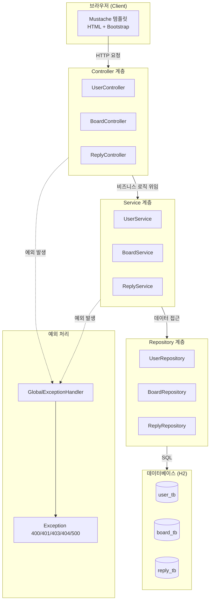

# Spring Boot 게시판 만들기 - 실습 가이드북

> Spring Boot 4 + JPA + Mustache로 게시판을 처음부터 끝까지 만들어보는 실습 교재

---

## 전체 구조도



---

## 목차

### Part 1. 기반 구조

> 프로젝트의 토대를 만듭니다. Entity, Repository, 예외 처리, 뷰 템플릿 등 기능 구현에 필요한 구조를 먼저 갖춥니다.

| 챕터 | 제목 | 핵심 내용 | 실행 확인 |
|------|------|----------|----------|
| [Chapter 01](ch01-project-setup.md) | 프로젝트 소개와 환경 설정 | Spring Boot, Gradle, H2, application.properties | H2 콘솔 확인 |
| [Chapter 02](ch02-entity.md) | 엔티티(Entity) 설계 | User, Board, Reply 테이블 + 연관관계 매핑 | 테이블 생성 확인 |
| [Chapter 03](ch03-repository.md) | Repository 계층 | EntityManager, JPQL, 영속성 컨텍스트 | 컴파일 확인 |
| [Chapter 04](ch04-exception.md) | 예외 처리 설계 | 커스텀 예외, GlobalExceptionHandler | 컴파일 확인 |
| [Chapter 05](ch05-view.md) | 뷰(Mustache) 템플릿 | Mustache 문법, header.mustache, Bootstrap | 컴파일 확인 |

### Part 2. 기능 구현

> 실제 동작하는 기능을 만듭니다. 각 챕터 끝에서 브라우저로 결과를 확인할 수 있습니다!

| 챕터 | 제목 | 핵심 내용 | 실행 확인 |
|------|------|----------|----------|
| [Chapter 06](ch06-user.md) | 회원가입과 로그인 | UserService, UserController, HttpSession | 회원가입/로그인 테스트 |
| [Chapter 07](ch07-board-crud.md) | 게시글 CRUD | 목록, 상세, 작성, 수정, 삭제 | 게시글 CRUD 테스트 |
| [Chapter 08](ch08-reply.md) | 댓글 기능 | 댓글 등록, 삭제, getReference | **전체 기능 완성!** |

### Part 3. 테스트와 개선

> 완성된 프로젝트를 테스트하고, 유효성 검사 등 품질을 개선합니다.
> ch11~12는 build.gradle에 새로운 의존성을 추가해야 합니다.

| 챕터 | 제목 | 핵심 내용 | 비고 |
|------|------|----------|------|
| [Chapter 09](ch09-test.md) | 테스트 코드 | @DataJpaTest, Repository 테스트 | |
| [Chapter 10](ch10-globalException.md) | GlobalExceptionHandler 심화 | 예외 처리 분석과 개선 | [개선] |
| [Chapter 11](ch11-valid.md) | 유효성 검사 | @Valid, @NotBlank, @Size, @Email | [개선] 의존성 추가 필요 |
| [Chapter 12](ch12-valid-aop.md) | 유효성 검사 AOP | ValidationAspect, AOP 자동화 | [개선] 의존성 추가 필요 |

---

## 기술 스택

| 기술 | 버전 | 설명 |
|------|------|------|
| Java | 21 | 프로그래밍 언어 |
| Spring Boot | 4.0.2 | 웹 프레임워크 |
| Spring Data JPA | - | ORM (Hibernate) |
| H2 Database | - | 인메모리 데이터베이스 |
| Mustache | - | 서버사이드 템플릿 엔진 |
| Lombok | - | 보일러플레이트 코드 제거 |
| Bootstrap | 5.3.3 | CSS 프레임워크 |
| Gradle | 9.2.1 | 빌드 도구 |

---

## 프로젝트 패키지 구조

```
src/main/java/com/example/boardv1/
├── Boardv1Application.java          # 메인 클래스
├── _core/
│   └── errors/
│       ├── GlobalExceptionHandler.java
│       └── ex/
│           ├── Exception400.java     # 유효성검사 실패
│           ├── Exception401.java     # 인증 실패
│           ├── Exception403.java     # 권한 실패
│           ├── Exception404.java     # 자원 없음
│           └── Exception500.java     # 서버 에러
├── user/
│   ├── User.java                     # 엔티티
│   ├── UserController.java           # 컨트롤러
│   ├── UserService.java              # 서비스
│   ├── UserRepository.java           # 레포지토리
│   ├── UserRequest.java              # 요청 DTO
│   └── UserResponse.java             # 응답 DTO
├── board/
│   ├── Board.java                    # 엔티티
│   ├── BoardController.java          # 컨트롤러
│   ├── BoardService.java             # 서비스
│   ├── BoardRepository.java          # 레포지토리
│   ├── BoardRequest.java             # 요청 DTO
│   └── BoardResponse.java            # 응답 DTO
└── reply/
    ├── Reply.java                    # 엔티티
    ├── ReplyController.java          # 컨트롤러
    ├── ReplyService.java             # 서비스
    ├── ReplyRepository.java          # 레포지토리
    ├── ReplyRequest.java             # 요청 DTO
    └── ReplyResponse.java            # 응답 DTO

src/main/resources/
├── application.properties            # 설정 파일
├── db/
│   └── data.sql                      # 초기 데이터
└── templates/
    ├── header.mustache               # 공통 헤더
    ├── index.mustache                # 메인 페이지
    ├── user/
    │   ├── login-form.mustache       # 로그인 폼
    │   └── join-form.mustache        # 회원가입 폼
    └── board/
        ├── detail.mustache           # 게시글 상세
        ├── save-form.mustache        # 게시글 작성 폼
        └── update-form.mustache      # 게시글 수정 폼
```
