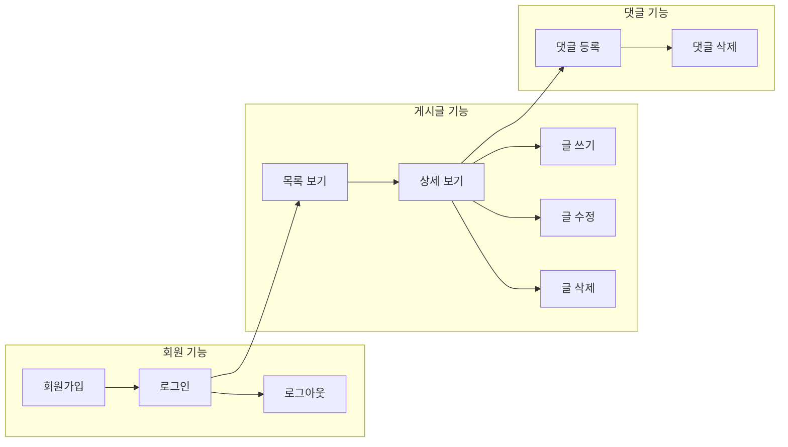
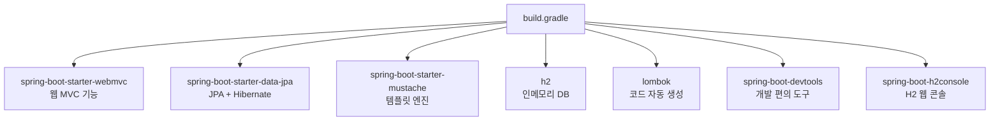
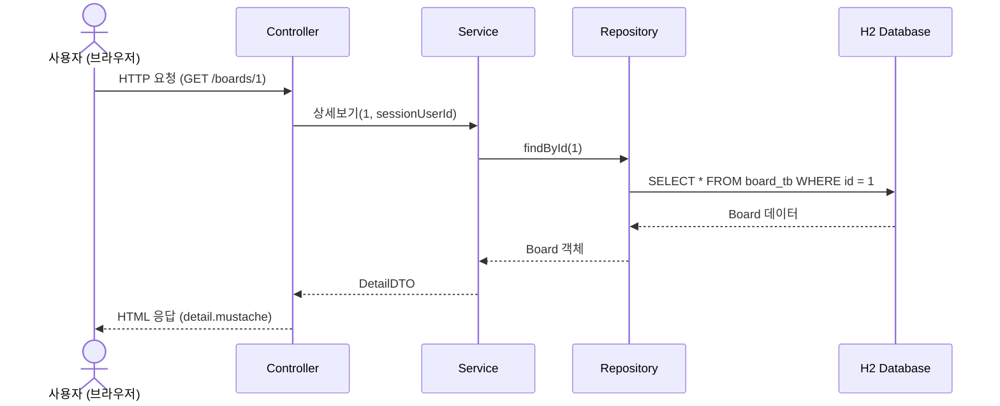

# Chapter 01. 프로젝트 소개와 환경 설정

---

## 1.1 이 프로젝트는 뭘 만드나요?

우리가 만들 것은 **게시판(Board)** 입니다.

> **게시판이 뭐예요?**
> 학교 복도에 있는 게시판을 떠올려보세요. 누구나 종이(게시글)를 붙일 수 있고, 다른 사람이 그 종이 아래에 포스트잇(댓글)을 붙일 수 있죠. 웹 게시판도 똑같습니다!

### 완성된 게시판의 기능



---

## 1.2 기술 스택 소개

### Spring Boot란?

> **정의**: Java로 웹 애플리케이션을 쉽게 만들 수 있게 도와주는 프레임워크
>
> **예시**: 레고 블록 세트를 생각해보세요. 레고 블록(Spring)을 하나하나 조립하려면 시간이 오래 걸리지만, 이미 반쯤 조립된 세트(Spring Boot)를 사면 훨씬 빠르게 완성할 수 있습니다!

### JPA(Java Persistence API)란?

> **정의**: Java 객체와 데이터베이스 테이블을 자동으로 연결해주는 기술
>
> **예시**: 통역사를 생각해보세요. 한국어(Java 객체)를 영어(SQL)로 바꿔주는 통역사가 JPA입니다. 우리가 `user.setUsername("ssar")`라고 Java로 말하면, JPA가 `INSERT INTO user_tb (username) VALUES ('ssar')`라고 SQL로 통역해줍니다!

### Mustache란?

> **정의**: HTML 안에 데이터를 끼워 넣어주는 템플릿 엔진
>
> **예시**: 편지 양식을 생각해보세요. "안녕하세요 {{이름}}님" 이라고 적어두면, "안녕하세요 철수님", "안녕하세요 영희님"처럼 이름 자리에 실제 데이터가 들어갑니다!

### H2 Database란?

> **정의**: 별도 설치 없이 메모리에서 동작하는 가벼운 데이터베이스
>
> **예시**: 메모장에 적는 메모를 생각해보세요. 앱을 켜면 메모가 있고, 앱을 끄면 메모가 사라집니다. H2도 서버를 켜면 데이터가 있고, 서버를 끄면 데이터가 사라집니다. 연습하기에 딱!

---

## 1.3 프로젝트 생성하기

### Step 1: Spring Initializr에서 프로젝트 생성

[https://start.spring.io](https://start.spring.io) 에 접속해서 아래 설정으로 프로젝트를 생성합니다.

| 항목 | 값 |
|------|-----|
| Project | Gradle - Groovy |
| Language | Java |
| Spring Boot | 4.0.2 |
| Group | com.example |
| Artifact | boardv1 |
| Java | 21 |

### Step 2: 의존성(Dependencies) 추가

다음 의존성을 추가합니다:

- **Spring Web** - 웹 애플리케이션 만들기
- **Spring Data JPA** - 데이터베이스 연동
- **H2 Database** - 인메모리 DB
- **Mustache** - 템플릿 엔진
- **Lombok** - 코드 간소화
- **Spring Boot DevTools** - 자동 재시작

---

## 1.4 build.gradle 살펴보기

```groovy
plugins {
    id 'java'
    id 'org.springframework.boot' version '4.0.2'
    id 'io.spring.dependency-management' version '1.1.7'
}

group = 'com.example'
version = '0.0.1-SNAPSHOT'
description = 'Demo project for Spring Boot'

java {
    toolchain {
        languageVersion = JavaLanguageVersion.of(21)
    }
}

configurations {
    compileOnly {
        extendsFrom annotationProcessor
    }
}

repositories {
    mavenCentral()
}

dependencies {
    implementation 'org.springframework.boot:spring-boot-h2console'
    implementation 'org.springframework.boot:spring-boot-starter-data-jpa'
    implementation 'org.springframework.boot:spring-boot-starter-mustache'
    implementation 'org.springframework.boot:spring-boot-starter-webmvc'
    compileOnly 'org.projectlombok:lombok'
    developmentOnly 'org.springframework.boot:spring-boot-devtools'
    runtimeOnly 'com.h2database:h2'
    annotationProcessor 'org.projectlombok:lombok'
    testImplementation 'org.springframework.boot:spring-boot-starter-data-jpa-test'
    testImplementation 'org.springframework.boot:spring-boot-starter-mustache-test'
    testImplementation 'org.springframework.boot:spring-boot-starter-webmvc-test'
    testRuntimeOnly 'org.junit.platform:junit-platform-launcher'
}

tasks.named('test') {
    useJUnitPlatform()
}
```

### 각 의존성의 역할



| 의존성 | 역할 | 쉬운 설명 |
|--------|------|----------|
| `spring-boot-starter-webmvc` | HTTP 요청/응답 처리 | 손님(브라우저) 주문을 받는 웨이터 |
| `spring-boot-starter-data-jpa` | DB 접근 기술 | 주방에서 재료를 꺼내오는 보조 요리사 |
| `spring-boot-starter-mustache` | HTML 화면 생성 | 음식을 예쁜 접시에 담아주는 것 |
| `h2` | 메모리 데이터베이스 | 연습용 메모장 |
| `lombok` | 반복 코드 제거 | 복사-붙여넣기 자동화 로봇 |
| `spring-boot-devtools` | 코드 변경시 자동 재시작 | 실시간 미리보기 |

---

## 1.5 application.properties 설정하기

`src/main/resources/application.properties` 파일을 아래와 같이 작성합니다.

```properties
# ===== Server =====
server.port=8080
spring.servlet.encoding.charset=UTF-8
spring.servlet.encoding.enabled=true
spring.servlet.encoding.force=true

# ===== Mustache =====
spring.mustache.servlet.expose-session-attributes=true
spring.mustache.servlet.expose-request-attributes=true

# ===== ansi =====
spring.output.ansi.enabled=always

# ===== H2 Datasource =====
spring.datasource.driver-class-name=org.h2.Driver
spring.datasource.url=jdbc:h2:mem:test
spring.datasource.username=sa
spring.datasource.password=
spring.h2.console.enabled=true

# ===== SQL Init (data.sql) =====
spring.sql.init.data-locations=classpath:db/data.sql
spring.jpa.defer-datasource-initialization=true

# ===== query view =====
spring.jpa.show-sql=true
spring.jpa.properties.hibernate.format_sql=true
spring.jpa.properties.hibernate.default_batch_fetch_size=10

# ===== osiv =====
spring.jpa.open-in-view=false

# ===== url rewrite close =====
server.servlet.session.tracking-modes=cookie

# ===== Tomcat session =====
server.servlet.session.timeout=1m
```

### 설정 항목 상세 설명

| 설정 | 값 | 설명 |
|------|-----|------|
| `server.port` | 8080 | 서버가 열리는 포트 번호 |
| `spring.servlet.encoding.*` | UTF-8 | 한글이 깨지지 않게 인코딩 설정 |
| `spring.mustache.servlet.expose-session-attributes` | true | Mustache에서 세션 데이터 사용 가능 |
| `spring.datasource.url` | jdbc:h2:mem:test | H2 인메모리 DB 접속 주소 |
| `spring.h2.console.enabled` | true | H2 웹 콘솔 활성화 (localhost:8080/h2-console) |
| `spring.sql.init.data-locations` | classpath:db/data.sql | 서버 시작시 실행할 SQL 파일 경로 |
| `spring.jpa.defer-datasource-initialization` | true | JPA 테이블 생성 후 data.sql 실행 |
| `spring.jpa.show-sql` | true | 실행되는 SQL 쿼리를 콘솔에 출력 |
| `spring.jpa.open-in-view` | false | OSIV 끄기 (Lazy Loading 범위 제한) |
| `server.servlet.session.tracking-modes` | cookie | URL에 세션ID 노출 방지 |
| `server.servlet.session.timeout` | 1m | 세션 유지 시간 (연습용으로 1분) |

### OSIV란?

> **정의**: Open Session In View. 뷰(View) 렌더링 시점까지 DB 연결을 유지할지 결정하는 설정
>
> **예시**: 도서관에서 책을 빌린다고 생각해보세요.
> - `true`: 책을 빌려서 집에 가져가서 읽을 수 있음 (Controller까지 DB 세션 유지)
> - `false`: 도서관 안에서만 읽을 수 있음 (Service까지만 DB 세션 유지)
>
> `false`로 설정하면 성능이 좋아지지만, Controller에서 Lazy Loading을 사용할 수 없습니다.

---

## 1.6 초기 데이터 넣기 (data.sql)

`src/main/resources/db/data.sql` 파일을 만들어 테스트용 데이터를 넣습니다.

```sql
insert into user_tb(username, password, email, created_at) values('ssar', '1234', 'ssar@nate.com', now());
insert into user_tb(username, password, email, created_at) values('cos', '1234', 'cos@nate.com', now());

insert into board_tb (user_id, title, content, created_at) values (1,'title1', 'content1', now());
insert into board_tb (user_id, title, content, created_at) values (1,'title2', 'content2', now());
insert into board_tb (user_id, title, content, created_at) values (1,'title3', 'content3', now());
insert into board_tb (user_id, title, content, created_at) values (2,'title4', 'content4', now());
insert into board_tb (user_id, title, content, created_at) values (2,'title5', 'content5', now());
insert into board_tb (user_id, title, content, created_at) values (2,'title6', 'content6', now());

insert into reply_tb (user_id, board_id, comment, created_at) values(1, 6, 'comment1', now());
insert into reply_tb (user_id, board_id, comment, created_at) values(1, 6, 'comment2', now());
insert into reply_tb (user_id, board_id, comment, created_at) values(2, 6, 'comment3', now());
insert into reply_tb (user_id, board_id, comment, created_at) values(1, 5, 'comment4', now());
insert into reply_tb (user_id, board_id, comment, created_at) values(2, 5, 'comment5', now());
```

> 서버가 시작될 때마다 이 SQL이 실행되어 테스트 데이터가 자동으로 들어갑니다!

---

## 1.7 메인 클래스 확인

```java
package com.example.boardv1;

import org.springframework.boot.SpringApplication;
import org.springframework.boot.autoconfigure.SpringBootApplication;

@SpringBootApplication
public class Boardv1Application {

    public static void main(String[] args) {
        SpringApplication.run(Boardv1Application.class, args);
    }
}
```

### @SpringBootApplication이란?

> **정의**: 아래 3가지 어노테이션을 합친 것
>
> | 어노테이션 | 역할 |
> |-----------|------|
> | `@SpringBootConfiguration` | 설정 파일임을 선언 |
> | `@EnableAutoConfiguration` | 의존성 기반으로 자동 설정 |
> | `@ComponentScan` | 현재 패키지부터 하위 패키지까지 빈(Bean) 스캔 |
>
> **예시**: 식당 개업을 생각해보세요. `@SpringBootApplication` 하나만 붙이면, 직원 채용(@ComponentScan), 주방 기구 셋팅(@EnableAutoConfiguration), 사업자 등록(@SpringBootConfiguration)이 한 번에 됩니다!

---

## 1.8 전체 요청 흐름



---

## 1.9 실행해보기

1. IDE에서 `Boardv1Application.java`의 `main` 메서드 실행
2. 브라우저에서 `http://localhost:8080` 접속
3. 게시글 목록이 보이면 성공!
4. `http://localhost:8080/h2-console` 에서 DB 내용 확인 가능

---

## 핵심 정리

- Spring Boot는 설정을 최소화하고 빠르게 웹 앱을 만들 수 있는 프레임워크
- `build.gradle`에서 필요한 라이브러리(의존성)를 관리
- `application.properties`에서 서버, DB, 뷰 등 모든 설정을 관리
- `data.sql`로 서버 시작시 테스트 데이터를 자동 삽입
- `@SpringBootApplication`이 붙은 메인 클래스에서 애플리케이션이 시작

> **다음 챕터**: [Chapter 02. 엔티티(Entity) 설계](ch02-entity.md) - 데이터베이스 테이블을 Java 클래스로 만들어봅시다!
