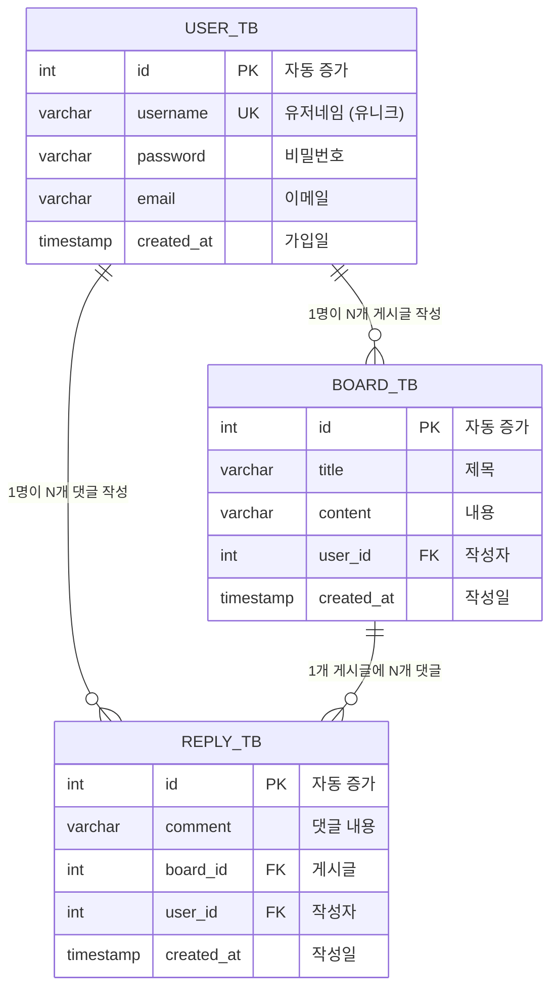
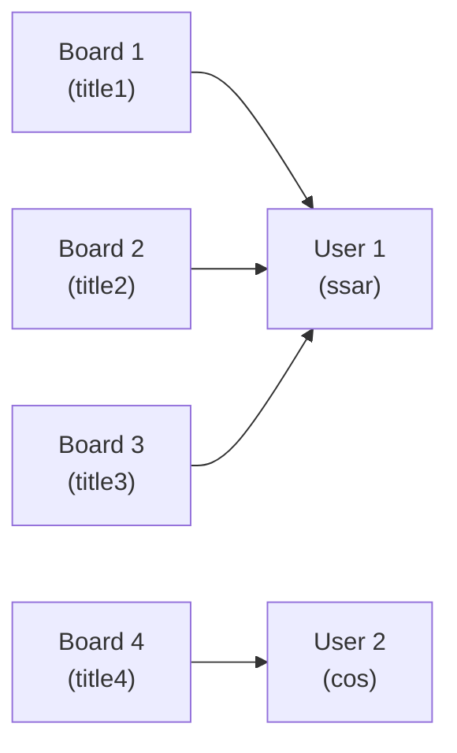
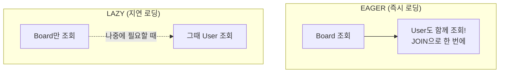
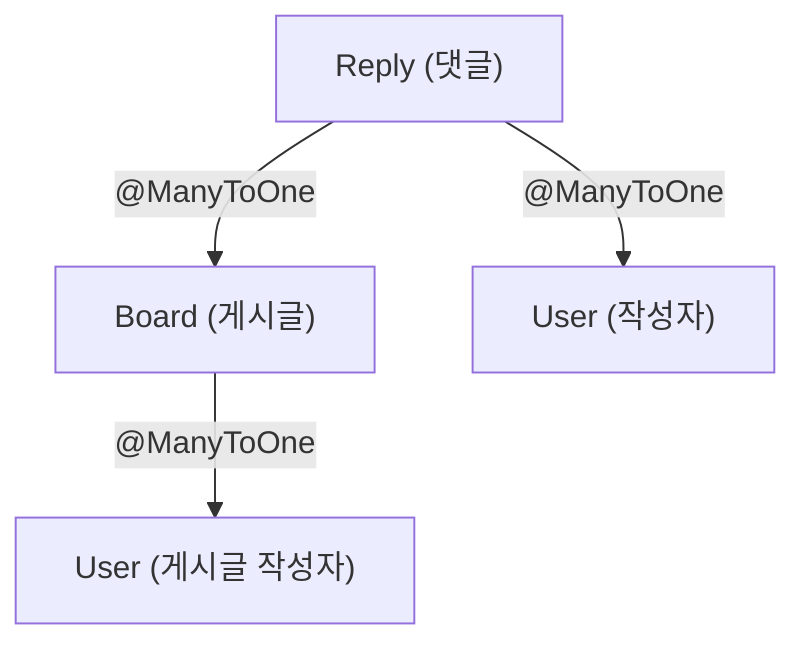
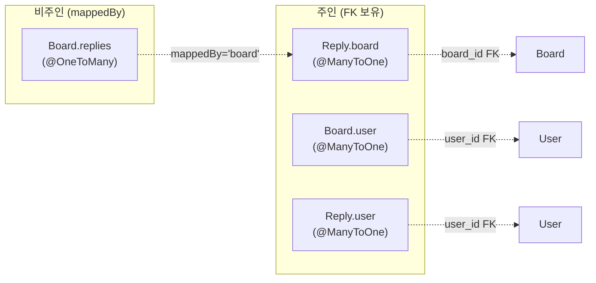

# Chapter 02. 엔티티(Entity) 설계

---

## 2.1 엔티티란?

> **정의**: 데이터베이스 테이블을 Java 클래스로 옮겨놓은 것
>
> **예시**: 학교에 학생 명부가 있다고 생각해보세요. 명부(테이블)에는 이름, 학번, 반 같은 칸(컬럼)이 있고, 한 줄(행)이 한 명의 학생 정보입니다. 엔티티는 이 명부를 Java 클래스로 그대로 옮긴 것입니다!
>
> | 데이터베이스 세상 | Java 세상 |
> |-----------------|----------|
> | 테이블 | 클래스 (Entity) |
> | 컬럼 | 필드 (변수) |
> | 행 (Row) | 객체 (Object) |

---

## 2.2 테이블 관계도 (ER 다이어그램)



### 관계 정리

| 관계 | 설명 | 예시 |
|------|------|------|
| User : Board = 1 : N | 한 명의 유저가 여러 게시글을 쓸 수 있음 | ssar이 title1, title2, title3을 작성 |
| User : Reply = 1 : N | 한 명의 유저가 여러 댓글을 달 수 있음 | ssar이 comment1, comment2를 작성 |
| Board : Reply = 1 : N | 하나의 게시글에 여러 댓글이 달릴 수 있음 | title6에 comment1, comment2, comment3이 달림 |

---

## 2.3 User 엔티티

### 실습 코드

`src/main/java/com/example/boardv1/user/User.java`

```java
package com.example.boardv1.user;

import java.time.LocalDateTime;

import org.hibernate.annotations.CreationTimestamp;

import jakarta.persistence.Column;
import jakarta.persistence.Entity;
import jakarta.persistence.GeneratedValue;
import jakarta.persistence.GenerationType;
import jakarta.persistence.Id;
import jakarta.persistence.Table;
import lombok.Data;
import lombok.NoArgsConstructor;

@NoArgsConstructor
@Data
@Entity
@Table(name = "user_tb")
public class User {
    @GeneratedValue(strategy = GenerationType.IDENTITY)
    @Id
    private Integer id;

    @Column(unique = true)
    private String username;

    @Column(nullable = false, length = 100)
    private String password;

    private String email;

    @CreationTimestamp
    private LocalDateTime createdAt;
}
```

### 어노테이션 상세 설명

| 어노테이션 | 역할 | 쉬운 설명 |
|-----------|------|----------|
| `@Entity` | 이 클래스가 DB 테이블과 매핑된다고 선언 | "나는 테이블이야!" 라고 이름표 붙이기 |
| `@Table(name = "user_tb")` | 매핑할 테이블 이름 지정 | 테이블 이름을 user_tb로 정하기 |
| `@Id` | 기본키(Primary Key) 지정 | 학생의 학번처럼 고유한 번호 |
| `@GeneratedValue(strategy = GenerationType.IDENTITY)` | 기본키 자동 증가 | 번호표 자동 발급 (1, 2, 3...) |
| `@Column(unique = true)` | 유니크 제약 조건 | 중복 불가! (같은 username 두 번 X) |
| `@Column(nullable = false, length = 100)` | NOT NULL + 길이 제한 | 빈칸 불가! 최대 100글자 |
| `@CreationTimestamp` | insert 시 현재 시간 자동 입력 | 가입일을 자동으로 기록 |
| `@NoArgsConstructor` | 기본 생성자 자동 생성 (Lombok) | Hibernate가 객체를 만들 때 필요 |
| `@Data` | Getter, Setter, toString 등 자동 생성 (Lombok) | 반복 코드를 자동으로 만들어줌 |

### @Column 제약 조건

> **예시**: 회원가입 양식을 생각해보세요.
> - `unique = true` : "이미 사용 중인 아이디입니다" → 중복 체크
> - `nullable = false` : "필수 입력 항목입니다" → 빈칸 불가
> - `length = 100` : "100자 이내로 입력해주세요" → 길이 제한

### PK(Primary Key)와 UK(Unique Key)의 차이

> - **PK (Primary Key)** : 테이블의 "주민등록번호". 절대 중복 불가, 절대 NULL 불가, 테이블당 1개만 가능
> - **UK (Unique Key)** : 테이블의 "전화번호". 중복 불가, NULL은 가능, 여러 개 가능
>
> 둘 다 **인덱스(Index)** 가 자동으로 생성되어 검색 속도가 빨라집니다!

---

## 2.4 Board 엔티티

### 실습 코드

`src/main/java/com/example/boardv1/board/Board.java`

```java
package com.example.boardv1.board;

import java.sql.Timestamp;
import java.util.ArrayList;
import java.util.List;

import org.hibernate.annotations.CreationTimestamp;

import com.example.boardv1.reply.Reply;
import com.example.boardv1.user.User;

import jakarta.persistence.Entity;
import jakarta.persistence.FetchType;
import jakarta.persistence.GeneratedValue;
import jakarta.persistence.GenerationType;
import jakarta.persistence.Id;
import jakarta.persistence.ManyToOne;
import jakarta.persistence.OneToMany;
import jakarta.persistence.OrderBy;
import jakarta.persistence.Table;
import lombok.Data;
import lombok.NoArgsConstructor;

@NoArgsConstructor
@Data
@Entity
@Table(name = "board_tb")
public class Board {
    @Id
    @GeneratedValue(strategy = GenerationType.IDENTITY)
    private Integer id;
    private String title;
    private String content;

    @ManyToOne(fetch = FetchType.EAGER)
    private User user;

    @OneToMany(mappedBy = "board", fetch = FetchType.EAGER)
    @OrderBy("id DESC")
    private List<Reply> replies = new ArrayList<>();

    @CreationTimestamp
    private Timestamp createdAt;
}
```

### 연관관계 매핑 핵심

#### @ManyToOne - 다대일 관계



> **정의**: "Many(게시글 여러 개)가 One(유저 한 명)에 속한다"
>
> **예시**: 학생(Board)이 담임선생님(User)을 가리킨다고 생각하세요. 여러 학생이 한 명의 담임선생님을 가질 수 있죠!
>
> ```java
> @ManyToOne(fetch = FetchType.EAGER)
> private User user; // DB에는 user_id 컬럼으로 저장됨
> ```
>
> - Java 세상: `board.getUser()` → User 객체를 바로 가져올 수 있음
> - DB 세상: `board_tb.user_id = 1` → 숫자(FK)만 저장됨

#### @OneToMany - 일대다 관계

> **정의**: "One(게시글 하나)이 Many(댓글 여러 개)를 가진다"
>
> **예시**: 한 개의 게시글(Board) 아래에 여러 개의 댓글(Reply)이 달릴 수 있죠!
>
> ```java
> @OneToMany(mappedBy = "board", fetch = FetchType.EAGER)
> @OrderBy("id DESC")
> private List<Reply> replies = new ArrayList<>();
> ```
>
> - `mappedBy = "board"` : Reply 엔티티의 `board` 필드가 FK를 관리함 (주인이 아님!)
> - `@OrderBy("id DESC")` : 댓글을 최신순으로 정렬

### FetchType (가져오기 전략)



> **EAGER (즉시 로딩)**: 뷔페에서 밥과 반찬을 한 번에 다 가져오는 것
> **LAZY (지연 로딩)**: 필요할 때마다 반찬을 하나씩 가져오는 것
>
> | 전략 | 장점 | 단점 |
> |------|------|------|
> | EAGER | 한 번의 쿼리로 다 가져옴 | 불필요한 데이터도 가져올 수 있음 |
> | LAZY | 필요한 것만 가져옴 | N+1 문제 발생 가능 |

---

## 2.5 Reply 엔티티

### 실습 코드

`src/main/java/com/example/boardv1/reply/Reply.java`

```java
package com.example.boardv1.reply;

import java.time.LocalDateTime;

import org.hibernate.annotations.CreationTimestamp;

import com.example.boardv1.board.Board;
import com.example.boardv1.user.User;

import jakarta.persistence.Entity;
import jakarta.persistence.GeneratedValue;
import jakarta.persistence.GenerationType;
import jakarta.persistence.Id;
import jakarta.persistence.ManyToOne;
import jakarta.persistence.Table;
import lombok.Data;
import lombok.NoArgsConstructor;

@NoArgsConstructor
@Data
@Entity
@Table(name = "reply_tb")
public class Reply {
    @GeneratedValue(strategy = GenerationType.IDENTITY)
    @Id
    private Integer id;
    private String comment;

    @ManyToOne
    private Board board; // board_id

    @ManyToOne
    private User user;

    @CreationTimestamp
    private LocalDateTime createdAt;
}
```

### Reply의 연관관계



> Reply는 두 개의 `@ManyToOne`을 가지고 있습니다:
> 1. **Board**: 이 댓글이 어떤 게시글에 달린 건지
> 2. **User**: 이 댓글을 누가 작성했는지

---

## 2.6 연관관계의 주인 (FK의 주인)

> **정의**: 외래키(FK)를 실제로 관리하는 쪽이 "주인"
>
> **예시**: 커플이 있다고 생각해보세요. 둘 다 서로의 연락처를 알지만, 실제로 전화번호를 바꿀 수 있는 건 본인뿐이죠? FK를 가진 쪽이 바로 "본인" = "주인"입니다!



### 규칙

| 규칙 | 설명 |
|------|------|
| `@ManyToOne` 쪽이 항상 주인 | FK 컬럼은 Many 쪽 테이블에 있으니까! |
| `@OneToMany`에 `mappedBy` 사용 | "나는 주인이 아니야, 저쪽이 관리해" |
| 주인만 FK를 변경 가능 | `board.setUser(user)` → DB 반영 O |
| 비주인은 읽기만 가능 | `board.getReplies()` → 조회만 가능 |

---

## 2.7 JPA가 만들어주는 DDL

JPA가 엔티티를 보고 자동으로 생성하는 테이블 구조:

```sql
-- User 테이블
CREATE TABLE user_tb (
    id INTEGER GENERATED BY DEFAULT AS IDENTITY PRIMARY KEY,
    username VARCHAR(255) UNIQUE,
    password VARCHAR(100) NOT NULL,
    email VARCHAR(255),
    created_at TIMESTAMP
);

-- Board 테이블
CREATE TABLE board_tb (
    id INTEGER GENERATED BY DEFAULT AS IDENTITY PRIMARY KEY,
    title VARCHAR(255),
    content VARCHAR(255),
    user_id INTEGER,              -- FK: user_tb.id
    created_at TIMESTAMP,
    FOREIGN KEY (user_id) REFERENCES user_tb(id)
);

-- Reply 테이블
CREATE TABLE reply_tb (
    id INTEGER GENERATED BY DEFAULT AS IDENTITY PRIMARY KEY,
    comment VARCHAR(255),
    board_id INTEGER,             -- FK: board_tb.id
    user_id INTEGER,              -- FK: user_tb.id
    created_at TIMESTAMP,
    FOREIGN KEY (board_id) REFERENCES board_tb(id),
    FOREIGN KEY (user_id) REFERENCES user_tb(id)
);
```

> 우리는 Java 클래스만 만들었는데, JPA(Hibernate)가 알아서 위의 SQL을 실행해서 테이블을 만들어줍니다!

---

## 실행 확인

1. 서버를 재시작합니다 (`Boardv1Application.java` → Run)
2. 브라우저에서 `http://localhost:8080/h2-console` 접속
3. 다음을 확인하세요:
   - `USER_TB` 테이블 → `username`, `password`, `email` 컬럼이 있는지
   - `BOARD_TB` 테이블 → `user_id` 컬럼(FK)이 있는지
   - `REPLY_TB` 테이블 → `board_id`, `user_id` 컬럼(FK)이 있는지
4. `SELECT * FROM USER_TB` 쿼리 실행 → data.sql의 데이터(ssar, cos)가 보이면 성공!

> 콘솔에 `Hibernate: create table ...` 로그가 출력되면 JPA가 엔티티를 기반으로 테이블을 생성한 것입니다.

---

## 핵심 정리

- **엔티티(Entity)** = DB 테이블을 Java 클래스로 모델링한 것
- **@Id + @GeneratedValue** = 자동 증가 기본키
- **@ManyToOne** = 다대일 관계 (FK를 가진 쪽)
- **@OneToMany(mappedBy)** = 일대다 관계 (FK를 가지지 않은 쪽)
- **FetchType.EAGER** = 즉시 로딩 (한 번에 다 가져옴)
- **FetchType.LAZY** = 지연 로딩 (필요할 때 가져옴)
- FK의 **주인**은 항상 `@ManyToOne` 쪽

> **다음 챕터**: [Chapter 03. Repository 계층](ch03-repository.md) - 데이터를 실제로 저장하고 조회하는 방법을 배워봅시다!
