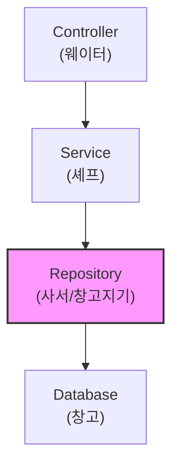
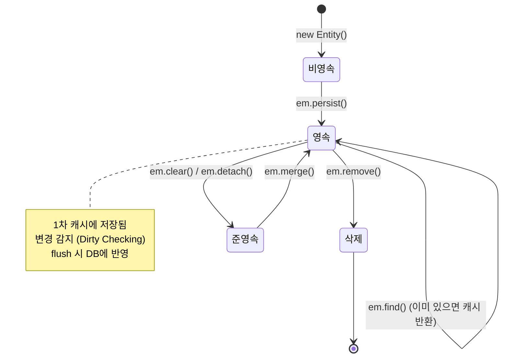
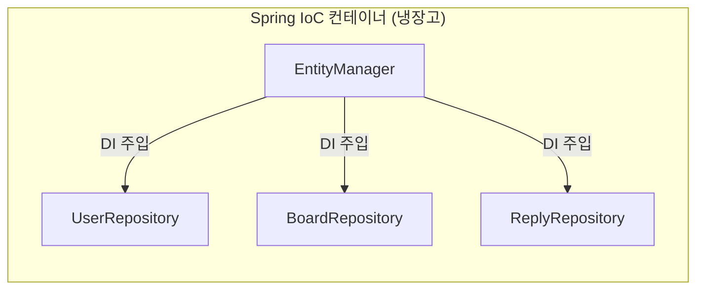

# Chapter 03. Repository 계층

---

## 3.1 Repository란?

> **정의**: 데이터베이스에 데이터를 저장(insert), 조회(select), 수정(update), 삭제(delete)하는 역할을 하는 클래스
>
> **예시**: 도서관 사서를 생각해보세요. "이 책 찾아주세요"(조회), "이 책 넣어주세요"(저장), "이 책 빼주세요"(삭제)를 사서(Repository)가 처리합니다. 우리는 사서에게 부탁만 하면 됩니다!

### 계층 구조에서의 위치



---

## 3.2 EntityManager란?

> **정의**: JPA에서 엔티티를 관리하는 핵심 객체. 모든 DB 작업은 EntityManager를 통해 이루어짐
>
> **예시**: EntityManager는 "매니저"입니다. 직원(엔티티)의 입사(persist), 퇴사(remove), 인사이동(update)을 모두 매니저가 관리합니다!

### EntityManager의 주요 메서드

| 메서드 | 역할 | SQL 대응 | 쉬운 설명 |
|--------|------|---------|----------|
| `em.persist(entity)` | 저장 | INSERT | 새 직원 입사시키기 |
| `em.find(Class, id)` | PK로 조회 | SELECT WHERE id=? | 직원번호로 찾기 |
| `em.remove(entity)` | 삭제 | DELETE | 직원 퇴사시키기 |
| `em.createQuery(jpql)` | JPQL 쿼리 실행 | SELECT (복잡한 조건) | 조건으로 검색하기 |
| `em.getReference(Class, id)` | 프록시 객체 조회 | (쿼리 안 날림) | FK만 필요할 때 사용 |
| `em.flush()` | 영속성 컨텍스트 → DB 반영 | - | 변경사항 즉시 저장 |
| `em.clear()` | 영속성 컨텍스트 초기화 | - | 캐시 비우기 |

---

## 3.3 영속성 컨텍스트 (Persistence Context)

> **정의**: 엔티티를 관리하는 가상의 저장소 (1차 캐시)
>
> **예시**: 장바구니를 생각해보세요!
> - 물건을 장바구니에 넣음 = `em.persist()` (영속 상태)
> - 장바구니에서 빼면 = `em.remove()` (삭제 상태)
> - 결제 버튼 누르면 = `em.flush()` (DB에 실제 반영)
> - 장바구니 비우기 = `em.clear()` (초기화)



### 영속성 컨텍스트의 장점

| 장점 | 설명 | 예시 |
|------|------|------|
| **1차 캐시** | 같은 엔티티를 두 번 조회하면 DB 안 감 | `findById(1)` 두 번 → SQL 1번만 실행 |
| **동일성 보장** | 같은 id면 같은 객체 반환 | `board1 == board2` → true |
| **변경 감지** | 엔티티를 수정하면 자동으로 UPDATE | `board.setTitle("new")` → UPDATE 자동 실행 |
| **쓰기 지연** | SQL을 모았다가 flush 할 때 한 번에 실행 | 성능 최적화 |

---

## 3.4 UserRepository 실습

### 실습 코드

`src/main/java/com/example/boardv1/user/UserRepository.java`

```java
package com.example.boardv1.user;

import java.util.Optional;

import org.springframework.stereotype.Repository;

import jakarta.persistence.EntityManager;
import lombok.RequiredArgsConstructor;

@RequiredArgsConstructor
@Repository
public class UserRepository {

    // DI (의존성 주입)
    private final EntityManager em;

    // 회원가입할때 insert
    public User save(User user) {
        em.persist(user);
        return user;
    }

    // 로그인할때 username으로 조회해서 password 검증
    public Optional<User> findByUsername(String username) {
        try {
            User user = em.createQuery(
                "select u from User u where u.username = :username", User.class)
                    .setParameter("username", username)
                    .getSingleResult();
            return Optional.of(user);
        } catch (Exception e) {
            return Optional.ofNullable(null);
        }
    }

    public Optional<User> findById(int id) {
        User findUser = em.find(User.class, id);
        return Optional.ofNullable(findUser);
    }
}
```

### 코드 해설

#### save() - 회원 저장

```java
public User save(User user) {
    em.persist(user);  // 영속화 (INSERT 쿼리 예약)
    return user;       // 영속화 후 id가 자동으로 채워짐!
}
```

> `persist` 호출 전: `user.getId()` = null
> `persist` 호출 후: `user.getId()` = 3 (자동 채번!)

#### findByUsername() - 유저네임으로 조회 (JPQL)

```java
public Optional<User> findByUsername(String username) {
    try {
        User user = em.createQuery(
            "select u from User u where u.username = :username", User.class)
                .setParameter("username", username)
                .getSingleResult();
        return Optional.of(user);
    } catch (Exception e) {
        return Optional.ofNullable(null);
    }
}
```

> **JPQL이란?** SQL과 비슷하지만, 테이블이 아닌 **엔티티(Java 클래스)** 를 대상으로 하는 쿼리
>
> | SQL | JPQL |
> |-----|------|
> | `SELECT * FROM user_tb WHERE username = 'ssar'` | `SELECT u FROM User u WHERE u.username = :username` |
> | 테이블명 `user_tb` | 엔티티명 `User` |
> | 컬럼명 | 필드명 |

#### findById() - PK로 조회

```java
public Optional<User> findById(int id) {
    User findUser = em.find(User.class, id);  // 1차 캐시 먼저 확인!
    return Optional.ofNullable(findUser);
}
```

> `em.find()`는 1차 캐시를 먼저 확인하고, 없으면 DB를 조회합니다.

### Optional이란?

> **정의**: 값이 있을 수도 있고, 없을(null) 수도 있는 것을 감싸는 컨테이너
>
> **예시**: 선물 상자를 생각해보세요. 상자를 열었는데 선물이 있을 수도 있고(`Optional.of(선물)`), 비어있을 수도 있죠(`Optional.empty()`). Optional을 사용하면 "상자가 비어있으면 이렇게 하세요"라고 미리 정할 수 있습니다!
>
> ```java
> // Optional 없이 (NullPointerException 위험!)
> User user = findById(999); // null 반환
> user.getUsername(); // NullPointerException 발생!
>
> // Optional 사용 (안전!)
> User user = findById(999)
>     .orElseThrow(() -> new Exception404("유저를 찾을 수 없어요"));
> ```

---

## 3.5 BoardRepository 실습

### 실습 코드

`src/main/java/com/example/boardv1/board/BoardRepository.java`

```java
package com.example.boardv1.board;

import java.util.List;
import java.util.Optional;

import org.springframework.stereotype.Repository;

import jakarta.persistence.EntityManager;
import jakarta.persistence.Query;
import lombok.RequiredArgsConstructor;

@RequiredArgsConstructor
@Repository
public class BoardRepository {

    private final EntityManager em;

    public Optional<Board> findByIdJoinUser(int id) {
        Query query = em.createQuery(
            "select b from Board b join fetch b.user u where b.id = :id", Board.class);
        query.setParameter("id", id);
        try {
            Board board = (Board) query.getSingleResult();
            return Optional.of(board);
        } catch (Exception e) {
            return Optional.ofNullable(null);
        }
    }

    public Optional<Board> findById(int id) {
        Board board = em.find(Board.class, id);
        return Optional.ofNullable(board);
    }

    public List<Board> findAll() {
        return em.createQuery("select b from Board b order by b.id desc", Board.class)
                .getResultList();
    }

    public Board save(Board board) {
        em.persist(board);
        return board;
    }

    public void delete(Board board) {
        em.remove(board);
    }
}
```

### 코드 해설

#### findAll() - 전체 목록 조회

```java
public List<Board> findAll() {
    return em.createQuery("select b from Board b order by b.id desc", Board.class)
            .getResultList();
}
```

> `order by b.id desc` → 최신 게시글이 위에 오도록 역순 정렬

#### findByIdJoinUser() - JOIN FETCH

```java
"select b from Board b join fetch b.user u where b.id = :id"
```

> **join fetch란?**
>
> 일반 조회: Board를 가져올 때 쿼리 1번, User를 가져올 때 쿼리 1번 = 총 2번
> join fetch: Board와 User를 한 번에 가져옴 = 총 1번
>
> **예시**: 택배를 생각해보세요.
> - 일반 조회: 책 1번 배달, 연필 1번 배달 = 택배차 2번 옴
> - join fetch: 책 + 연필 한 박스에 넣어서 배달 = 택배차 1번 옴

#### delete() - 게시글 삭제

```java
public void delete(Board board) {
    em.remove(board);  // 영속 상태인 엔티티만 삭제 가능!
}
```

> `em.remove()`는 영속 상태의 엔티티만 삭제할 수 있습니다. 먼저 `findById()`로 영속화한 후 `remove()`를 호출해야 합니다!

---

## 3.6 ReplyRepository 실습

### 실습 코드

`src/main/java/com/example/boardv1/reply/ReplyRepository.java`

```java
package com.example.boardv1.reply;

import java.util.Optional;

import org.springframework.stereotype.Repository;

import jakarta.persistence.EntityManager;
import lombok.RequiredArgsConstructor;

@RequiredArgsConstructor
@Repository
public class ReplyRepository {

    private final EntityManager em;

    public Optional<Reply> findById(int id) {
        Reply reply = em.find(Reply.class, id);
        return Optional.ofNullable(reply);
    }

    public void save(Reply reply) {
        em.persist(reply);
    }

    public void delete(Reply reply) {
        em.remove(reply);
    }
}
```

> ReplyRepository는 가장 기본적인 CRUD만 가지고 있습니다.

---

## 3.7 DI (의존성 주입) 이해하기

```java
@RequiredArgsConstructor
@Repository
public class BoardRepository {
    private final EntityManager em;  // DI로 주입됨
}
```

> **정의**: 의존성 주입(Dependency Injection)은 필요한 객체를 직접 만들지 않고 Spring이 알아서 넣어주는 것
>
> **예시**:
> - DI 없이: 요리할 때 재료를 직접 마트에 가서 사 오기
> - DI 사용: 요리할 때 재료가 냉장고에 이미 있음 (Spring이 넣어둠)



### @RequiredArgsConstructor

> `final` 필드를 초기화하는 생성자를 Lombok이 자동 생성해줍니다.

```java
// Lombok이 자동으로 만들어주는 코드
public BoardRepository(EntityManager em) {
    this.em = em;
}
```

> Spring은 생성자가 하나만 있으면 `@Autowired` 없이도 자동으로 DI를 해줍니다!

---

## 핵심 정리

- **Repository** = DB에 접근하는 계층 (DAO 역할)
- **EntityManager** = JPA의 핵심 객체, 모든 DB 작업을 관리
- **영속성 컨텍스트** = 엔티티를 관리하는 1차 캐시 (장바구니)
- **persist** = 영속화 (INSERT 예약)
- **find** = PK로 조회 (1차 캐시 → DB)
- **remove** = 삭제 (DELETE 예약)
- **JPQL** = 엔티티 기반 쿼리 (SQL과 비슷하지만 클래스/필드명 사용)
- **join fetch** = 연관된 엔티티를 한 번에 조회
- **Optional** = null 안전하게 처리
- **DI** = Spring이 필요한 객체를 알아서 넣어줌

> **다음 챕터**: [Chapter 04. 회원가입과 로그인](ch04-user.md) - 유저 기능을 만들어봅시다!
