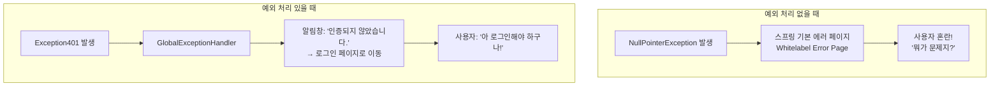
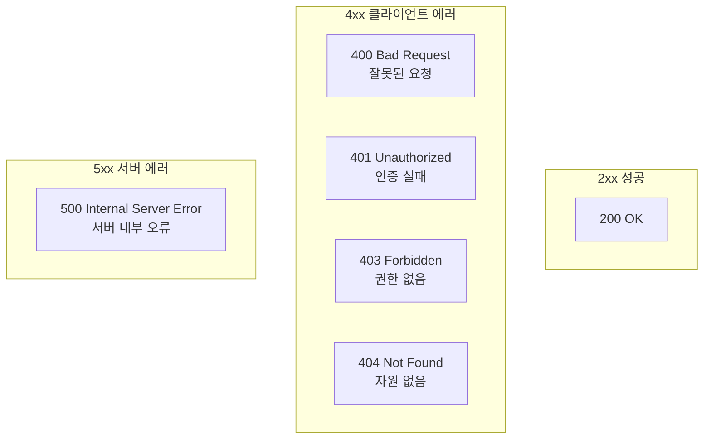
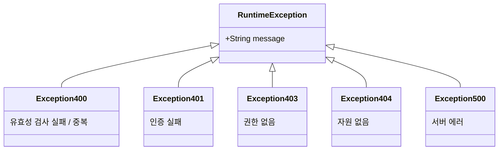
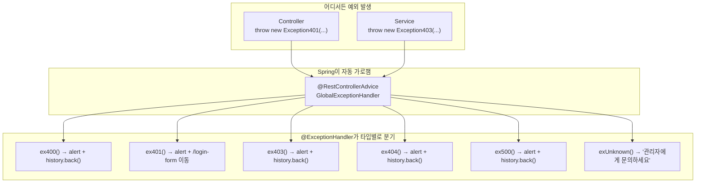
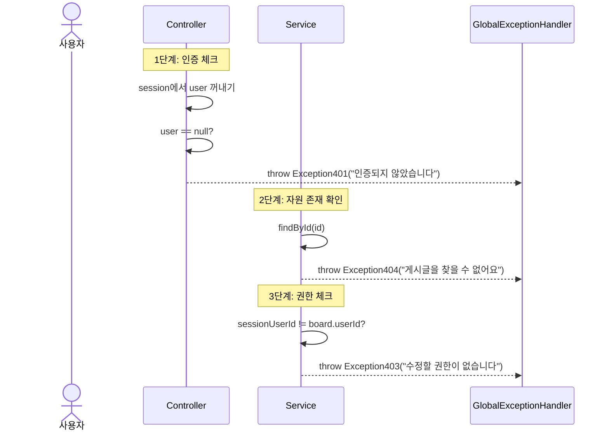
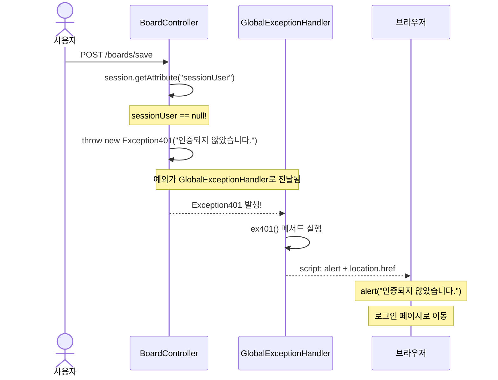
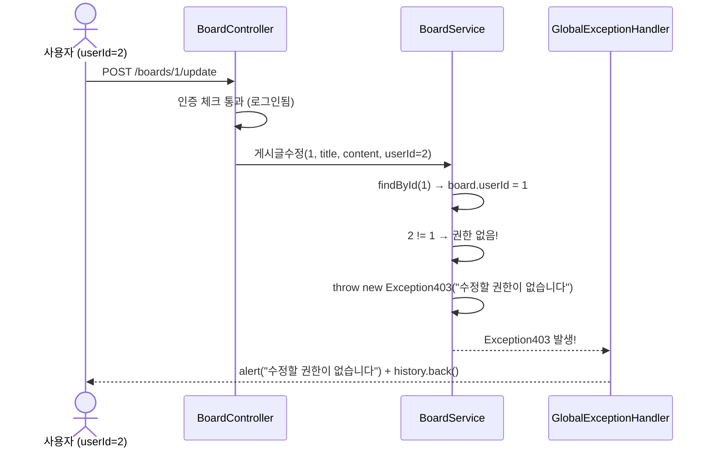

# Chapter 04. 예외 처리 설계

> 기능 구현(회원, 게시글, 댓글) 전에 예외 처리 구조를 먼저 만듭니다.
> 이후 챕터에서 `throw new Exception401(...)` 같은 코드가 나올 때, 이 챕터를 참고하세요!

---

## 4.1 예외 처리가 왜 필요한가요?

> **예시**: 놀이공원에서 놀이기구를 타려고 하는데...
> - 키가 작으면? → "키 120cm 이상만 탑승 가능합니다" (400 - 유효성 검사 실패)
> - 입장권이 없으면? → "입장권을 먼저 구매해주세요" (401 - 인증 실패)
> - 자유이용권이 아니면? → "자유이용권 전용입니다" (403 - 권한 없음)
> - 놀이기구가 고장이면? → "현재 점검 중입니다" (404 - 자원 없음)
> - 정전이 나면? → "관리자에게 문의하세요" (500 - 서버 에러)
>
> 이렇게 **상황별로 다른 메시지**를 보여주는 것이 예외 처리입니다!

### 예외 처리 없이는 어떻게 되나요?



---

## 4.2 HTTP 상태 코드

> **정의**: 서버가 클라이언트에게 "요청 결과가 어떤지" 알려주는 숫자 코드
>
> **예시**: 택배 배송 상태를 생각해보세요. "배송 완료(200)", "주소 오류(400)", "수령인 부재(401)", "접근 금지 구역(403)", "물건 없음(404)", "택배 차량 고장(500)"



---

## 4.3 커스텀 예외 클래스 만들기

### 패키지 구조

```
_core/
└── errors/
    ├── GlobalExceptionHandler.java
    └── ex/
        ├── Exception400.java    # 유효성검사 실패 / 중복
        ├── Exception401.java    # 인증 실패
        ├── Exception403.java    # 권한 없음
        ├── Exception404.java    # 자원 없음
        └── Exception500.java    # 서버 에러
```

### 실습 코드

각 예외 클래스는 `RuntimeException`을 상속합니다.

```java
// Exception400.java - 유효성검사 실패 / 중복
public class Exception400 extends RuntimeException {
    public Exception400(String message) {
        super(message);
    }
}

// Exception401.java - 인증 실패
public class Exception401 extends RuntimeException {
    public Exception401(String message) {
        super(message);
    }
}

// Exception403.java - 권한 없음
public class Exception403 extends RuntimeException {
    public Exception403(String message) {
        super(message);
    }
}

// Exception404.java - 자원 못 찾음
public class Exception404 extends RuntimeException {
    public Exception404(String message) {
        super(message);
    }
}

// Exception500.java - 서버 에러
public class Exception500 extends RuntimeException {
    public Exception500(String message) {
        super(message);
    }
}
```

### 클래스 구조도



### 왜 RuntimeException을 상속하나요?

> **Checked Exception** vs **Unchecked Exception (RuntimeException)**
>
> | 구분 | Checked Exception | RuntimeException (Unchecked) |
> |------|-------------------|------------------------------|
> | try-catch 강제 | O (안 하면 컴파일 에러) | X (자유롭게 throw 가능) |
> | @Transactional 롤백 | 기본적으로 안 됨 | 자동 롤백 |
> | 사용 편의성 | 번거로움 | 편리함 |
>
> **예시**: 학교에서 결석 사유서를 생각해보세요.
> - Checked Exception: 결석할 때마다 사유서 필수 제출 (번거로움)
> - RuntimeException: 사유서 없이 결석 가능, 나중에 한 번에 처리 (GlobalExceptionHandler!)

---

## 4.4 GlobalExceptionHandler - 예외를 한 곳에서 처리

### 개념

> **정의**: 애플리케이션 전체에서 발생하는 예외를 한 곳에서 가로채서 처리하는 클래스
>
> **예시**: 공항의 안내 데스크를 생각해보세요. 어떤 문제가 생기든(항공편 취소, 수화물 분실, 게이트 변경) 안내 데스크(GlobalExceptionHandler)에 가면 다 해결됩니다!

### 동작 원리



### 실습 코드

`src/main/java/com/example/boardv1/_core/errors/GlobalExceptionHandler.java`

```java
package com.example.boardv1._core.errors;

import org.springframework.web.bind.annotation.ExceptionHandler;
import org.springframework.web.bind.annotation.RestControllerAdvice;

import com.example.boardv1._core.errors.ex.Exception400;
import com.example.boardv1._core.errors.ex.Exception401;
import com.example.boardv1._core.errors.ex.Exception403;
import com.example.boardv1._core.errors.ex.Exception404;
import com.example.boardv1._core.errors.ex.Exception500;

@RestControllerAdvice
public class GlobalExceptionHandler {

    @ExceptionHandler(exception = Exception400.class)
    public String ex400(Exception400 e) {
        String html = String.format("""
                <script>
                    alert('%s');
                    history.back();
                </script>
                """, e.getMessage());
        return html;
    }

    @ExceptionHandler(exception = Exception401.class)
    public String ex401(Exception401 e) {
        String html = String.format("""
                <script>
                    alert('%s');
                    location.href = '/login-form';
                </script>
                """, e.getMessage());
        return html;
    }

    @ExceptionHandler(exception = Exception403.class)
    public String ex403(Exception403 e) {
        String html = String.format("""
                <script>
                    alert('%s');
                    history.back();
                </script>
                """, e.getMessage());
        return html;
    }

    @ExceptionHandler(exception = Exception404.class)
    public String ex404(Exception404 e) {
        String html = String.format("""
                <script>
                    alert('%s');
                    history.back();
                </script>
                """, e.getMessage());
        return html;
    }

    @ExceptionHandler(exception = Exception500.class)
    public String ex500(Exception500 e) {
        String html = String.format("""
                <script>
                    alert('%s');
                    history.back();
                </script>
                """, e.getMessage());
        return html;
    }

    @ExceptionHandler(exception = Exception.class)
    public String exUnknown(Exception e) {
        String html = String.format("""
                <script>
                    alert('%s');
                    history.back();
                </script>
                """, "관리자에게 문의하세요");
        System.out.println("error : " + e.getMessage());
        return html;
    }
}
```

### 핵심 어노테이션

| 어노테이션 | 역할 |
|-----------|------|
| `@RestControllerAdvice` | 모든 Controller에서 발생하는 예외를 가로채는 전역 핸들러. 리턴 값이 응답 body로 직접 나감 |
| `@ExceptionHandler` | 특정 예외 타입을 처리할 메서드 지정 |

> `@ControllerAdvice` vs `@RestControllerAdvice`: 후자는 `@ResponseBody`가 내장되어 있어서 리턴 값이 HTML/JSON 문자열로 바로 응답됩니다.

### 각 예외별 처리 방식

| 예외 | 알림 메시지 | 이후 행동 | 사용처 |
|------|-----------|----------|--------|
| Exception400 | 사용자 입력 메시지 | `history.back()` | 유효성 실패, 중복 |
| Exception401 | 사용자 입력 메시지 | `/login-form` 이동 | 인증 실패 → 로그인 유도 |
| Exception403 | 사용자 입력 메시지 | `history.back()` | 권한 없음 |
| Exception404 | 사용자 입력 메시지 | `history.back()` | 자원 없음 |
| Exception500 | 사용자 입력 메시지 | `history.back()` | 서버 에러 |
| Exception (기타) | "관리자에게 문의하세요" | `history.back()` | 예상 못한 에러 (안전망) |

> **401만 다른 이유**: 인증 실패는 로그인이 필요하므로 로그인 페이지로 보냅니다!

---

## 4.5 어디서 어떤 예외를 던지나요?

이후 챕터에서 아래 패턴이 반복됩니다. 미리 익혀두세요!

### 계층별 예외 사용 원칙

```
Controller → 인증 체크 (Exception401)
Service    → 자원 존재 여부 (Exception404)
           → 권한 체크 (Exception403)
           → 비즈니스 규칙 위반 (Exception400)
```



### 인증(Authentication) vs 권한(Authorization)

| | 인증 (Authentication) | 권한 (Authorization) |
|---|-----|-----|
| **질문** | "너 누구야?" | "너 이거 할 수 있어?" |
| **체크 장소** | Controller | Service |
| **실패 시** | Exception401 | Exception403 |
| **예시** | 신분증 확인 | VIP 라운지 입장 |

### Controller에서의 인증 패턴 (앞으로 자주 나옴!)

```java
// 이 패턴이 BoardController, ReplyController에서 반복됩니다
User sessionUser = (User) session.getAttribute("sessionUser");
if (sessionUser == null)
    throw new Exception401("인증되지 않았습니다.");
```

### Service에서의 권한 패턴 (앞으로 자주 나옴!)

```java
// 자원 존재 확인 + 권한 체크 패턴
Board board = boardRepository.findById(id)
        .orElseThrow(() -> new Exception404("게시글을 찾을 수 없어요"));

if (sessionUserId != board.getUser().getId())
    throw new Exception403("수정할 권한이 없습니다");
```

---

## 4.6 예외 흐름 예시

### 예시: 로그인 안 하고 글쓰기 시도



### 예시: 남의 글 수정 시도



---

## 실행 확인

> 이 챕터에서 만든 예외 클래스와 GlobalExceptionHandler는 **ch06부터 사용됩니다.**
> 서버를 실행해서 **컴파일 에러 없이 정상 시작**되는지만 확인하세요!
>
> 이후 ch06(회원), ch07(게시글)에서 `throw new Exception401(...)`, `throw new Exception404(...)` 같은 코드가 등장합니다.
> 그때 이 챕터에서 만든 예외 구조가 어떻게 동작하는지 직접 확인할 수 있습니다.

---

## 핵심 정리

- **커스텀 예외**: HTTP 상태 코드에 맞는 예외 클래스를 만들어 사용
- **RuntimeException 상속**: try-catch 없이 던질 수 있어 편리 + @Transactional 자동 롤백
- **@RestControllerAdvice**: 모든 컨트롤러의 예외를 한 곳에서 처리
- **@ExceptionHandler**: 특정 예외 타입에 대한 처리 메서드 지정
- **Controller** → 인증 체크 (Exception401)
- **Service** → 자원 존재(Exception404) + 권한(Exception403) + 비즈니스 규칙(Exception400)
- **Exception.class 핸들러**: 예상하지 못한 에러를 마지막으로 잡는 안전망

> **다음 챕터**: [Chapter 05. 뷰(Mustache) 템플릿](ch05-view.md) - 사용자가 보는 화면을 만들어봅시다!
