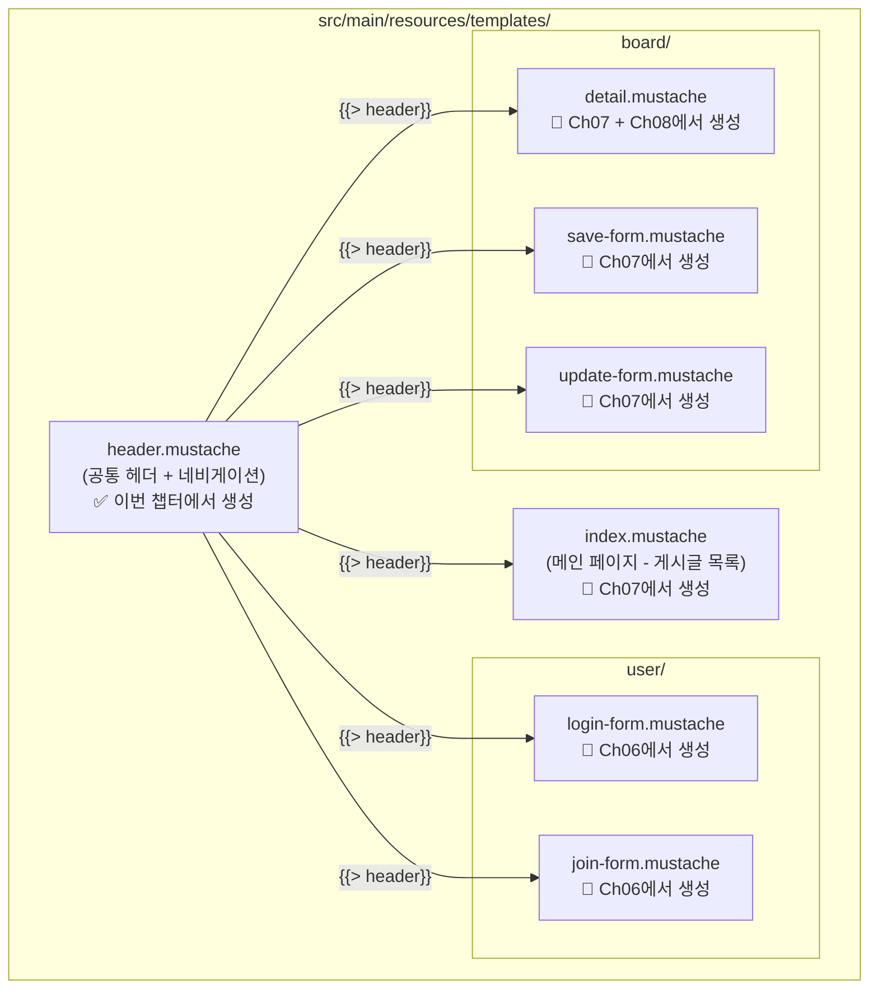
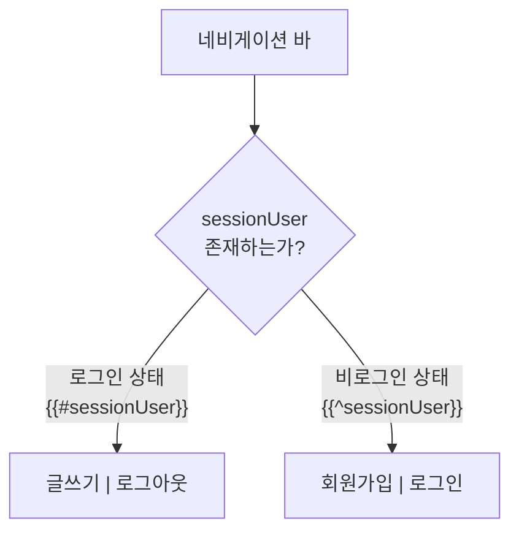
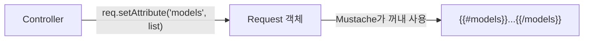
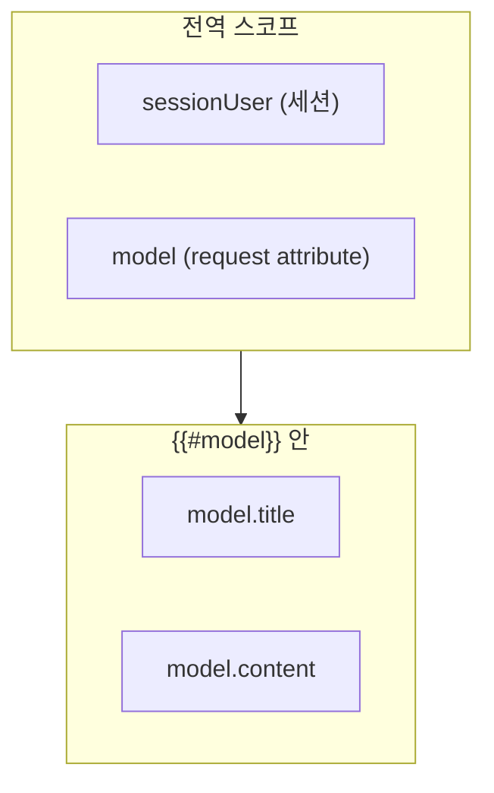

# Chapter 05. 뷰(Mustache) 템플릿

---

## 5.1 Mustache란?

> **정의**: HTML 안에 데이터를 동적으로 삽입할 수 있게 해주는 템플릿 엔진
>
> **예시**: 우편물 봉투를 생각해보세요.
> ```
> {{받는분}} 님께
> {{보내는분}} 드림
> ```
> 이 양식에 실제 이름을 넣으면 "철수 님께 / 영희 드림"이 됩니다!

### Mustache 기본 문법

| 문법 | 역할 | 예시 |
|------|------|------|
| `{{변수}}` | 변수 출력 | `{{title}}` → "제목1" |
| `{{#조건}}...{{/조건}}` | 조건부 렌더링 (true일 때) | 로그인했을 때만 표시 |
| `{{^조건}}...{{/조건}}` | 반전 조건 (false일 때) | 로그인 안 했을 때만 표시 |
| `{{#리스트}}...{{/리스트}}` | 반복 출력 | 게시글 목록 표시 |
| `{{> 파일명}}` | 다른 Mustache 파일 포함 | 공통 헤더 삽입 |
| `{{! 주석 }}` | 주석 (렌더링 안 됨) | 메모용 |

---

## 5.2 템플릿 파일 구조

이 프로젝트에서 사용하는 전체 뷰 파일입니다. **이번 챕터에서는 `header.mustache`만 만들고**, 나머지는 각 기능 챕터에서 함께 만듭니다.



> **왜 한꺼번에 안 만들까요?** 뷰를 만들어도 Controller가 없으면 화면을 확인할 수 없습니다!
> 각 기능을 구현할 때 뷰도 함께 만들면 **바로 실행해서 확인**할 수 있습니다.

---

## 5.3 header.mustache - 공통 헤더

> 모든 페이지에서 공통으로 사용하는 헤더(네비게이션 바)입니다. `{{> header}}`로 다른 Mustache 파일에서 삽입합니다.

### 실습 코드

`src/main/resources/templates/header.mustache`

```html
<!DOCTYPE html>
<html lang="en">
<head>
  <meta charset="utf-8">
  <meta name="viewport" content="width=device-width, initial-scale=1">
  <link href="https://cdn.jsdelivr.net/npm/bootstrap@5.3.3/dist/css/bootstrap.min.css" rel="stylesheet">
  <script src="https://cdn.jsdelivr.net/npm/bootstrap@5.3.3/dist/js/bootstrap.bundle.min.js"></script>
</head>
<body>

<nav class="navbar navbar-expand-sm" style="background-color: grey;">
  <div class="container-fluid">
    <ul class="navbar-nav">
      <li class="nav-item">
        <a class="nav-link" href="/" style="font-weight: bold; color: white">Metacoding</a>
      </li>

      {{#sessionUser}}
      <li class="nav-item">
        <a class="nav-link" href="/boards/save-form" style="color: white">글쓰기</a>
      </li>
      <li class="nav-item">
        <a class="nav-link" href="/logout" style="color: white">로그아웃</a>
      </li>
      {{/sessionUser}}
      {{^sessionUser}}
      <li class="nav-item">
        <a class="nav-link" href="/join-form" style="color: white">회원가입</a>
      </li>
      <li class="nav-item">
        <a class="nav-link" href="/login-form" style="color: white">로그인</a>
      </li>
      {{/sessionUser}}

    </ul>
  </div>
</nav>
</div>
```

### 핵심: 조건부 렌더링



> **`{{#sessionUser}}`**: sessionUser가 존재하면(로그인됨) 이 블록을 렌더링
>
> **`{{^sessionUser}}`**: sessionUser가 없으면(비로그인) 이 블록을 렌더링
>
> **왜 세션 데이터를 Mustache에서 쓸 수 있나요?**
>
> `application.properties`에서 이 설정을 했기 때문!
> ```properties
> spring.mustache.servlet.expose-session-attributes=true
> ```

---

## 5.4 Bootstrap이란?

> **정의**: 미리 만들어진 CSS/JS 디자인 도구 모음
>
> **예시**: 요리할 때 밀키트를 사용하는 것! 재료가 다 준비되어 있어서 빠르게 그럴듯한 음식(웹페이지)을 만들 수 있습니다.

### 이 프로젝트에서 자주 사용하는 Bootstrap 클래스

| 클래스 | 역할 | 사용 위치 |
|--------|------|----------|
| `navbar` | 상단 메뉴바 | header.mustache |
| `container` | 중앙 정렬 컨테이너 | 모든 페이지 |
| `card` / `card-header` / `card-body` | 카드형 레이아웃 | 폼 페이지들 |
| `btn btn-secondary` | 회색 버튼 | 폼 제출 버튼 |
| `form-control` | 입력 필드 스타일 | 폼 입력란 |
| `table table-hover` | 마우스 올리면 강조되는 표 | 게시글 목록 |
| `list-group` | 리스트 스타일 | 댓글 목록 |
| `d-flex justify-content-end` | 오른쪽 정렬 | 버튼 배치 |

---

## 5.5 Mustache에서 데이터 접근 규칙

### Controller → Mustache 데이터 전달



### 데이터 스코프 (범위)



> **중요**: `{{#model}}` 블록 안에서는 model 객체의 필드에 직접 접근할 수 있습니다!
>
> 이 규칙은 ch06~ch08에서 뷰를 만들 때 중요하게 사용됩니다.

### HTML Form과 DTO 바인딩

```
HTML: name="username" → 서버: reqDTO.getUsername()
HTML: name="password" → 서버: reqDTO.getPassword()
HTML: name="email"    → 서버: reqDTO.getEmail()
```

> HTML의 `name` 속성과 DTO의 필드명이 같아야 Spring이 자동으로 바인딩합니다!

---

## 실행 확인

> 이 챕터에서는 `header.mustache`만 만들었습니다. 아직 Controller가 없으므로 브라우저에서 확인할 수 없습니다.
> 다음 챕터(ch06)에서 UserController를 만들면 로그인/회원가입 화면을 확인할 수 있습니다!

### 이 시점의 파일 구조

```
src/main/resources/templates/
└── header.mustache   ← 이번 챕터에서 생성
```

---

## 핵심 정리

- **`{{> header}}`**: 다른 Mustache 파일을 포함 (공통 헤더 재사용)
- **`{{#변수}}...{{/변수}}`**: 변수가 true이거나 리스트일 때 렌더링
- **`{{^변수}}...{{/변수}}`**: 변수가 false이거나 없을 때 렌더링
- **`{{변수}}`**: 변수 값 출력
- **`name` 속성**: DTO 필드명과 일치해야 자동 바인딩
- **세션 데이터 노출**: `expose-session-attributes=true` 설정 필요
- Bootstrap으로 빠르게 UI 구성 가능

> **다음 챕터**: [Chapter 06. 회원가입과 로그인](ch06-user.md) - 유저 기능을 만들어봅시다!
