# Chapter 06. 댓글 기능

---

## 6.1 댓글 기능 전체 흐름

```mermaid
sequenceDiagram
    actor U as 사용자
    participant C as ReplyController
    participant S as ReplyService
    participant R as ReplyRepository
    participant EM as EntityManager
    participant DB as Database

    Note over U,DB: 댓글 등록
    U->>C: POST /replies/save<br/>(boardId, comment)
    C->>C: 인증 체크 (세션)
    C->>S: 댓글등록(boardId, comment, userId)
    S->>EM: getReference(Board, boardId)<br/>getReference(User, userId)
    Note over EM: 프록시 객체 반환<br/>(SELECT 안함!)
    S->>R: save(reply)
    R->>DB: INSERT INTO reply_tb
    C-->>U: redirect:/boards/{boardId}

    Note over U,DB: 댓글 삭제
    U->>C: POST /replies/{id}/delete<br/>?boardId=2
    C->>C: 인증 체크 (세션)
    C->>S: 댓글삭제(id, sessionUserId)
    S->>R: findById(id)
    R->>DB: SELECT
    S->>S: 권한 체크 (내 댓글인지?)
    S->>R: delete(reply)
    R->>DB: DELETE
    C-->>U: redirect:/boards/{boardId}
```



---

## 6.2 응답 DTO

### 실습 코드

`src/main/java/com/example/boardv1/reply/ReplyResponse.java`

```java
package com.example.boardv1.reply;

import lombok.Data;

public class ReplyResponse {

    @Data
    public static class DTO {
        private Integer id;
        private String comment;
        private Integer replyUserId;
        private String replyUsername;
        private boolean isReplyOwner;

        public DTO(Reply reply, Integer sessionUserId) {
            this.id = reply.getId();
            this.comment = reply.getComment();
            this.replyUserId = reply.getUser().getId();
            this.replyUsername = reply.getUser().getUsername();
            this.isReplyOwner = reply.getUser().getId() == sessionUserId;
        }
    }
}
```

### isReplyOwner의 역할

```mermaid
graph TD
    A["댓글 표시"] --> B{"isReplyOwner?"}
    B -->|"true (내 댓글)"| C["삭제 버튼 표시 🗑"]
    B -->|"false (남의 댓글)"| D["삭제 버튼 숨김"]
```



> **예시**: 학교 게시판에 포스트잇을 붙이면, 본인이 붙인 포스트잇만 떼어낼 수 있죠? `isReplyOwner`가 `true`일 때만 삭제 버튼이 보입니다!

---

## 6.3 요청 DTO

### 실습 코드

`src/main/java/com/example/boardv1/reply/ReplyRequest.java`

```java
package com.example.boardv1.reply;

import lombok.Data;

public class ReplyRequest {

    @Data
    public static class SaveDTO {
        private Integer boardId;
        private String comment;
    }
}
```

> 댓글을 등록할 때 필요한 정보:
> 1. `boardId` - 어떤 게시글에 달 것인지
> 2. `comment` - 댓글 내용
> 3. `userId` - 누가 쓰는지 (세션에서 가져오므로 DTO에 없음!)

---

## 6.4 ReplyService - 비즈니스 로직

### 실습 코드

`src/main/java/com/example/boardv1/reply/ReplyService.java`

```java
package com.example.boardv1.reply;

import org.springframework.stereotype.Service;
import org.springframework.transaction.annotation.Transactional;

import com.example.boardv1._core.errors.ex.Exception403;
import com.example.boardv1._core.errors.ex.Exception404;
import com.example.boardv1.board.Board;
import com.example.boardv1.user.User;

import jakarta.persistence.EntityManager;
import lombok.RequiredArgsConstructor;

@RequiredArgsConstructor
@Service
public class ReplyService {

    private final ReplyRepository replyRepository;
    private final EntityManager em;

    @Transactional
    public void 댓글등록(Integer boardId, String comment, Integer sessionUserId) {
        Board board = em.getReference(Board.class, boardId);
        User user = em.getReference(User.class, sessionUserId);
        Reply reply = new Reply();
        reply.setBoard(board);
        reply.setUser(user);
        reply.setComment(comment);

        replyRepository.save(reply);
    }

    @Transactional
    public void 댓글삭제(int id, Integer sessionUserId) {
        Reply reply = replyRepository.findById(id)
                .orElseThrow(() -> new Exception404("댓글을 찾을 수 없습니다"));

        if (reply.getUser().getId() != sessionUserId)
            throw new Exception403("댓글을 삭제할 권한이 없습니다");

        replyRepository.delete(reply);
    }
}
```

### getReference() vs find()

이 챕터의 핵심 개념입니다!

```mermaid
graph TD
    subgraph find["em.find()"]
        direction LR
        F1["em.find(Board.class, 1)"] --> F2["SELECT * FROM board_tb<br/>WHERE id = 1"]
        F2 --> F3["Board 실제 객체"]
    end

    subgraph ref["em.getReference()"]
        direction LR
        R1["em.getReference(Board.class, 1)"] --> R2["SELECT 안 함!<br/>프록시 객체만 생성"]
        R2 --> R3["Board 프록시 객체<br/>(id만 알고 있음)"]
    end
```



> **정의**: `getReference()`는 실제 DB를 조회하지 않고, id값만 가진 "가짜 객체(프록시)"를 반환합니다
>
> **예시**: 택배 보낼 때를 생각해보세요.
> - `em.find()`: 받는 사람 집에 직접 가서 주소를 확인한 후 택배 보내기 (비효율!)
> - `em.getReference()`: 받는 사람의 주소(id)만 알면 택배를 보낼 수 있음 (효율!)
>
> 댓글을 INSERT할 때 필요한 것은 `board_id`와 `user_id` 뿐입니다. 실제 Board나 User의 모든 정보가 필요하지 않으므로 `getReference()`로 프록시 객체를 사용하면 불필요한 SELECT 쿼리를 줄일 수 있습니다!

### 댓글 등록 과정 상세

```mermaid
flowchart TD
    A["댓글등록(boardId=5, comment='안녕', userId=1)"] --> B["em.getReference(Board, 5)<br/>→ Board 프록시 (SELECT 안 함!)"]
    B --> C["em.getReference(User, 1)<br/>→ User 프록시 (SELECT 안 함!)"]
    C --> D["Reply 객체 생성"]
    D --> E["reply.setBoard(board프록시)<br/>reply.setUser(user프록시)<br/>reply.setComment('안녕')"]
    E --> F["replyRepository.save(reply)"]
    F --> G["INSERT INTO reply_tb<br/>(board_id=5, user_id=1, comment='안녕')"]

    style B fill:#ffe0b2
    style C fill:#ffe0b2
```



> getReference 덕분에 SELECT 쿼리 0번, INSERT 쿼리 1번만 실행됩니다!

### 댓글 삭제 과정 상세

```mermaid
flowchart TD
    A["댓글삭제(id=3, sessionUserId=1)"] --> B["replyRepository.findById(3)"]
    B --> C{"댓글 존재?"}
    C -->|"없음"| D["Exception404<br/>'댓글을 찾을 수 없습니다'"]
    C -->|"있음"| E{"reply.getUser().getId() == 1?"}
    E -->|"아님"| F["Exception403<br/>'댓글을 삭제할 권한이 없습니다'"]
    E -->|"맞음"| G["replyRepository.delete(reply)"]
    G --> H["DELETE FROM reply_tb WHERE id = 3"]
```



---

## 6.5 ReplyController - 요청 처리

### 실습 코드

`src/main/java/com/example/boardv1/reply/ReplyController.java`

```java
package com.example.boardv1.reply;

import org.springframework.stereotype.Controller;
import org.springframework.web.bind.annotation.PathVariable;
import org.springframework.web.bind.annotation.PostMapping;
import org.springframework.web.bind.annotation.RequestParam;

import com.example.boardv1._core.errors.ex.Exception401;
import com.example.boardv1.user.User;

import jakarta.servlet.http.HttpSession;
import lombok.RequiredArgsConstructor;

@RequiredArgsConstructor
@Controller
public class ReplyController {
    private final ReplyService replyService;
    private final HttpSession session;

    @PostMapping("/replies/{id}/delete")
    public String delete(@PathVariable("id") int id, @RequestParam("boardId") int boardId) {
        User sessionUser = (User) session.getAttribute("sessionUser");
        if (sessionUser == null)
            throw new Exception401("인증되지 않았습니다.");

        replyService.댓글삭제(id, sessionUser.getId());

        return "redirect:/boards/" + boardId;
    }

    @PostMapping("/replies/save")
    public String save(ReplyRequest.SaveDTO reqDTO) {
        User sessionUser = (User) session.getAttribute("sessionUser");
        if (sessionUser == null)
            throw new Exception401("인증되지 않았습니다.");

        replyService.댓글등록(reqDTO.getBoardId(), reqDTO.getComment(), sessionUser.getId());
        return "redirect:/boards/" + reqDTO.getBoardId();
    }
}
```

### API 엔드포인트 정리

| HTTP 메서드 | URL | 역할 | 파라미터 |
|------------|-----|------|---------|
| POST | `/replies/save` | 댓글 등록 | Body: boardId, comment |
| POST | `/replies/{id}/delete` | 댓글 삭제 | Path: id, Query: boardId |

### @RequestParam이란?

> **정의**: URL의 쿼리 파라미터(?key=value)에서 값을 가져오는 것
>
> ```java
> // URL: /replies/5/delete?boardId=2
> @PostMapping("/replies/{id}/delete")
> public String delete(
>     @PathVariable("id") int id,        // id = 5
>     @RequestParam("boardId") int boardId // boardId = 2
> ) { ... }
> ```
>
> | 어노테이션 | 데이터 위치 | 예시 |
> |-----------|-----------|------|
> | `@PathVariable` | URL 경로 | `/replies/5/delete` → 5 |
> | `@RequestParam` | 쿼리 스트링 | `?boardId=2` → 2 |
> | DTO (파라미터) | 요청 Body | `boardId=5&comment=안녕` |

### 왜 삭제할 때 boardId가 필요한가요?

> 댓글을 삭제한 후 **어떤 게시글 페이지로 돌아갈지** 알아야 하기 때문입니다!
>
> ```java
> return "redirect:/boards/" + boardId;  // boardId번 게시글로 돌아가기
> ```

---

## 6.6 Board와 Reply의 관계 정리

```mermaid
graph TD
    subgraph 게시글상세["게시글 상세 페이지"]
        B["Board (게시글)"]
        B --> R1["Reply 1 (ssar: comment1)"]
        B --> R2["Reply 2 (ssar: comment2)"]
        B --> R3["Reply 3 (cos: comment3)"]
    end

    subgraph DTO변환["DTO 변환 과정"]
        BD["Board 엔티티"]
        BD -->|"new DetailDTO(board, sessionUserId)"| DD["BoardResponse.DetailDTO"]
        DD --> RD1["ReplyResponse.DTO (comment1, isOwner=true)"]
        DD --> RD2["ReplyResponse.DTO (comment2, isOwner=true)"]
        DD --> RD3["ReplyResponse.DTO (comment3, isOwner=false)"]
    end
```

> Board의 `DetailDTO` 생성 시, 내부에서 댓글 목록도 함께 DTO로 변환됩니다:
>
> ```java
> this.replies = board.getReplies().stream()
>     .map(reply -> new ReplyResponse.DTO(reply, sessionUserId))
>     .toList();
> ```

---

## 핵심 정리

- **getReference()**: SELECT 없이 프록시 객체만 생성 (FK만 필요할 때 사용)
- **find()**: 실제 SELECT 쿼리로 데이터 조회
- 댓글 등록 시 Board와 User의 전체 정보가 필요 없으므로 `getReference()` 사용
- `@PathVariable`: URL 경로에서 값 추출
- `@RequestParam`: 쿼리 파라미터에서 값 추출
- 삭제 후 `redirect`할 때 어떤 페이지로 돌아갈지 `boardId`가 필요

> **다음 챕터**: [Chapter 07. 예외 처리](ch07-exception.md) - 에러가 발생했을 때 어떻게 처리하는지 배워봅시다!
