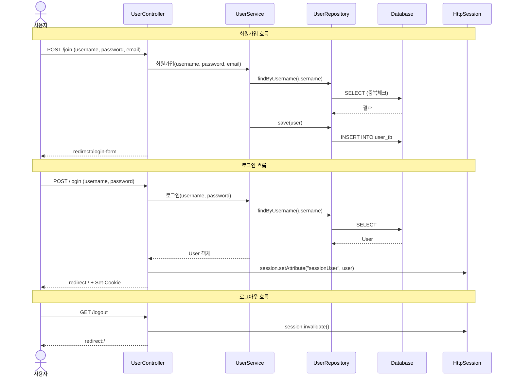
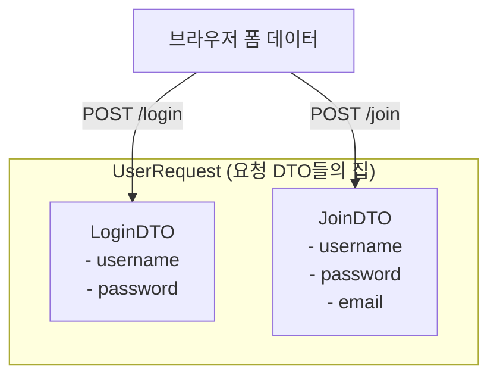
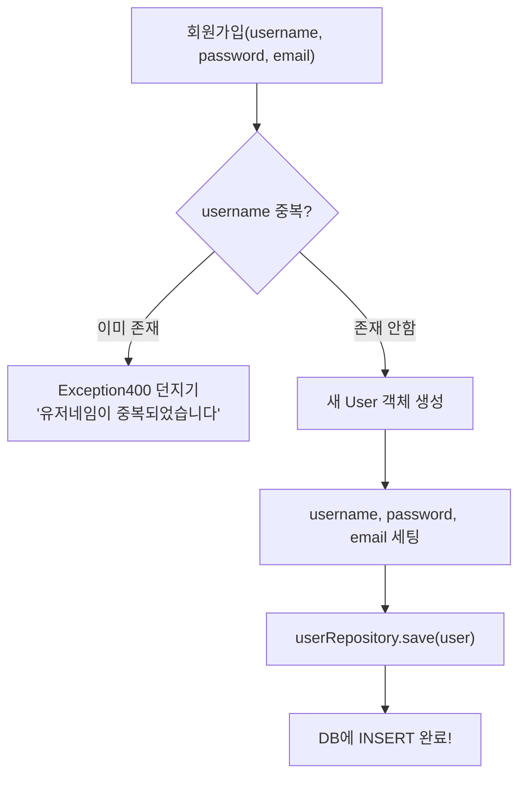
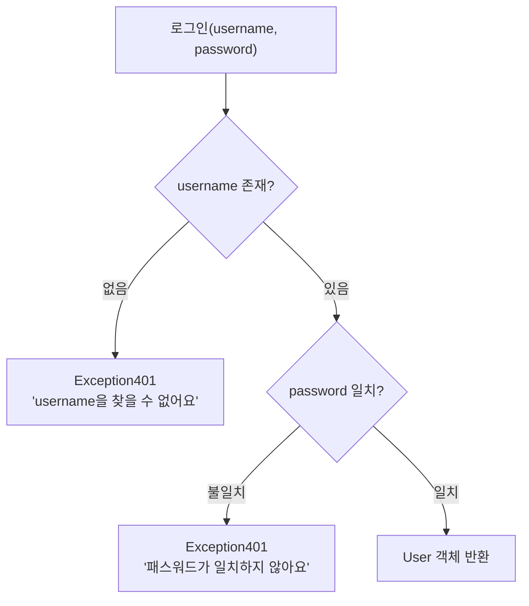
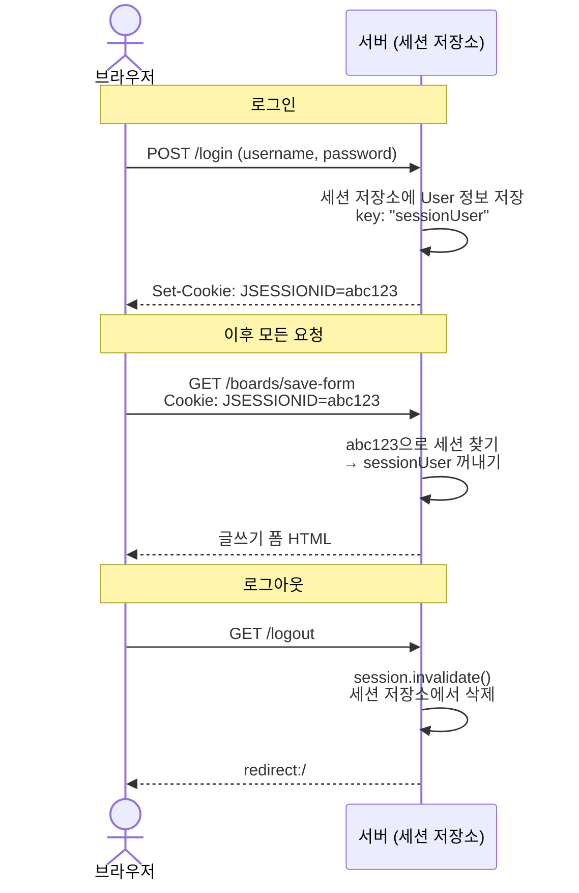
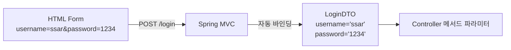

# Chapter 06. 회원가입과 로그인

> **선수 조건**: 이 챕터를 시작하기 전에 다음 챕터를 완료하세요:
> - [Chapter 04. 예외 처리 설계](ch04-exception.md) - `Exception400`, `Exception401` 클래스 사용
> - [Chapter 05. 뷰(Mustache) 템플릿](ch05-view.md) - `header.mustache` 사용

---

## 6.1 회원 기능 전체 흐름



---

## 6.2 DTO (Data Transfer Object) 만들기

### 개념

> **정의**: 데이터를 전달하기 위한 객체. 클라이언트의 요청 데이터를 담는 그릇
>
> **예시**: 이사할 때 짐을 담는 박스를 생각해보세요. 옷 박스(LoginDTO), 책 박스(JoinDTO)처럼 용도별로 박스를 만들어 사용합니다!

### 왜 DTO를 쓰나요?

> **예시**: 택배를 보낼 때 물건을 그냥 보내지 않고, 택배 상자에 담아서 보내죠?
> - **엔티티(Entity)**: 실제 물건 → DB와 직접 연결된 중요한 객체
> - **DTO**: 택배 상자 → 데이터를 안전하게 운반하는 역할
>
> 엔티티를 직접 노출하면 보안 문제가 생길 수 있어서, DTO로 감싸서 전달합니다!

### 실습 코드: UserRequest

`src/main/java/com/example/boardv1/user/UserRequest.java`

```java
package com.example.boardv1.user;

import lombok.Data;

public class UserRequest {

    @Data
    public static class LoginDTO {
        private String username;
        private String password;
    }

    @Data
    public static class JoinDTO {
        private String username;
        private String password;
        private String email;
    }
}
```

### DTO 구조



> **Inner Class(내부 클래스)로 묶는 이유**: 관련된 DTO를 한 파일에 모아두면 관리가 편합니다!

---

## 6.3 UserService - 비즈니스 로직

### 개념

> **정의**: 비즈니스 로직(업무 규칙)을 처리하는 계층
>
> **예시**: 식당에서 셰프를 생각해보세요.
> - 웨이터(Controller): 주문을 받아서 전달
> - **셰프(Service)**: 실제로 요리 (비즈니스 로직 처리)
> - 창고지기(Repository): 재료를 가져다줌

### Service의 3가지 핵심 책임

| 책임 | 설명 | 예시 |
|------|------|------|
| 트랜잭션 관리 | DB 작업의 원자성 보장 | 회원가입 중 에러 → 전체 롤백 |
| DTO 만들기 | 화면에 필요한 데이터 가공 | Entity → DTO 변환 |
| 권한 체크 | DB 정보 기반 권한 확인 | 본인 게시글만 수정 가능 |

### 실습 코드

`src/main/java/com/example/boardv1/user/UserService.java`

```java
package com.example.boardv1.user;

import java.util.Optional;

import org.springframework.stereotype.Service;
import org.springframework.transaction.annotation.Transactional;

import com.example.boardv1._core.errors.ex.Exception400;
import com.example.boardv1._core.errors.ex.Exception401;

import lombok.RequiredArgsConstructor;

@RequiredArgsConstructor
@Service
public class UserService {
    private final UserRepository userRepository;

    @Transactional
    public void 회원가입(String username, String password, String email) {
        // 1. 유저네임 중복체크
        Optional<User> optUser = userRepository.findByUsername(username);

        if (optUser.isPresent()) {
            throw new Exception400("유저네임이 중복되었습니다");
        }

        // 2. 비영속 객체
        User user = new User();
        user.setUsername(username);
        user.setPassword(password);
        user.setEmail(email);

        // 3. save()호출
        userRepository.save(user);
    }

    public User 로그인(String username, String password) {
        User findUser = userRepository.findByUsername(username)
                .orElseThrow(() -> new Exception401("username을 찾을 수 없어요"));

        if (!findUser.getPassword().equals(password)) {
            throw new Exception401("패스워드가 일치하지 않아요");
        }
        return findUser;
    }
}
```

### 회원가입 흐름 상세



### @Transactional이란?

> **정의**: 메서드 안의 모든 DB 작업을 하나의 묶음(트랜잭션)으로 처리
>
> **예시**: 은행 송금을 생각해보세요.
> 1. A 계좌에서 1만원 빼기 (UPDATE)
> 2. B 계좌에 1만원 넣기 (UPDATE)
>
> 만약 2번에서 에러가 나면? 1번도 취소해야 합니다! 이것이 **롤백(Rollback)** 입니다.
>
> - 모두 성공 → **Commit** (확정)
> - 하나라도 실패 → **Rollback** (되돌리기)
>
> **규칙**: `INSERT`, `UPDATE`, `DELETE` 할 때는 반드시 `@Transactional`을 붙이세요!

### 로그인 흐름 상세



---

## 6.4 UserController - 요청 처리

### 개념

> **정의**: HTTP 요청을 받아서 적절한 서비스를 호출하고, 결과를 응답하는 역할
>
> **예시**: 식당의 웨이터입니다. 손님(브라우저) 주문을 받아서 주방(Service)에 전달하고, 요리가 나오면 손님에게 가져다줍니다!

### 실습 코드

`src/main/java/com/example/boardv1/user/UserController.java`

```java
package com.example.boardv1.user;

import org.springframework.stereotype.Controller;
import org.springframework.web.bind.annotation.GetMapping;
import org.springframework.web.bind.annotation.PostMapping;

import jakarta.servlet.http.Cookie;
import jakarta.servlet.http.HttpServletResponse;
import jakarta.servlet.http.HttpSession;
import lombok.RequiredArgsConstructor;

@RequiredArgsConstructor
@Controller
public class UserController {

    private final UserService userService;
    private final HttpSession session;

    // 로그아웃
    @GetMapping("/logout")
    public String logout() {
        session.invalidate();
        return "redirect:/";
    }

    // 로그인
    @PostMapping("/login")
    public String login(UserRequest.LoginDTO reqDTO, HttpServletResponse resp) {
        User sessionUser = userService.로그인(reqDTO.getUsername(), reqDTO.getPassword());
        session.setAttribute("sessionUser", sessionUser);

        Cookie cookie = new Cookie("username", sessionUser.getUsername());
        cookie.setHttpOnly(false);
        resp.addCookie(cookie);

        return "redirect:/";
    }

    // 회원가입
    @PostMapping("/join")
    public String join(UserRequest.JoinDTO reqDTO) {
        userService.회원가입(reqDTO.getUsername(), reqDTO.getPassword(), reqDTO.getEmail());
        return "redirect:/login-form";
    }

    // 로그인 폼 페이지
    @GetMapping("/login-form")
    public String loginForm() {
        return "user/login-form";
    }

    // 회원가입 폼 페이지
    @GetMapping("/join-form")
    public String joinForm() {
        return "user/join-form";
    }
}
```

### API 엔드포인트 정리

| HTTP 메서드 | URL | 역할 | 뷰 / 리다이렉트 |
|------------|-----|------|----------------|
| GET | `/join-form` | 회원가입 폼 페이지 | `user/join-form.mustache` |
| POST | `/join` | 회원가입 처리 | redirect → `/login-form` |
| GET | `/login-form` | 로그인 폼 페이지 | `user/login-form.mustache` |
| POST | `/login` | 로그인 처리 | redirect → `/` |
| GET | `/logout` | 로그아웃 처리 | redirect → `/` |

---

## 6.5 세션(Session) 이해하기

### 세션이란?

> **정의**: 서버가 클라이언트를 기억하기 위해 서버 메모리에 저장하는 정보
>
> **예시**: 놀이공원 팔찌를 생각해보세요!
> 1. 입장할 때(로그인) 팔찌(세션)를 받습니다
> 2. 놀이기구를 탈 때마다 팔찌를 보여줍니다 (인증)
> 3. 퇴장할 때(로그아웃) 팔찌를 반납합니다



### 세션 관련 코드 상세

#### 로그인 시 세션 저장

```java
@PostMapping("/login")
public String login(UserRequest.LoginDTO reqDTO, HttpServletResponse resp) {
    // 1. 서비스 호출 (username, password 검증)
    User sessionUser = userService.로그인(reqDTO.getUsername(), reqDTO.getPassword());

    // 2. 세션에 유저 정보 저장 (서버 메모리의 락카에 넣기)
    session.setAttribute("sessionUser", sessionUser);

    // 3. 쿠키에 username 저장 (로그인 폼에서 아이디 기억용)
    Cookie cookie = new Cookie("username", sessionUser.getUsername());
    cookie.setHttpOnly(false);  // JavaScript에서 접근 가능하게
    resp.addCookie(cookie);

    return "redirect:/";
}
```

#### 로그아웃 (4가지 방법)

```java
/**
 * 세션이 종료되는 4가지 경우:
 * 1. 브라우저 쿠키에서 sessionKey 삭제
 * 2. 일정 시간 동안 요청이 없으면 자동 만료 (timeout=1m)
 * 3. 모든 브라우저 창 종료
 * 4. 서버에서 session.invalidate() 호출
 */
@GetMapping("/logout")
public String logout() {
    session.invalidate();  // 서버 세션 삭제
    return "redirect:/";
}
```

---

## 6.6 쿠키(Cookie) vs 세션(Session)

| 항목 | 쿠키 (Cookie) | 세션 (Session) |
|------|--------------|----------------|
| **저장 위치** | 브라우저 (클라이언트) | 서버 메모리 |
| **보안** | 낮음 (사용자가 볼 수 있음) | 높음 (서버에만 있음) |
| **용량** | 제한적 (4KB) | 서버 메모리 허용 범위 |
| **만료** | 설정한 기간까지 유지 | 서버 설정에 따름 |
| **용도** | 아이디 기억 등 | 로그인 정보 등 |

> **이 프로젝트에서의 사용**:
> - **쿠키**: `username` 저장 → 로그인 폼에서 아이디 자동 입력
> - **세션**: `sessionUser` 저장 → 로그인 상태 유지, 인증 체크

---

## 6.7 요청 데이터 바인딩

### 폼 데이터가 DTO로 변환되는 과정



> **자동 바인딩이란?**
>
> 폼에서 보낸 `name="username"` 값이 DTO의 `setUsername()` 메서드를 통해 자동으로 들어갑니다!
>
> HTML의 `name` 속성 = DTO의 필드명 → 자동 매핑!

---

## 6.8 뷰 템플릿 만들기

UserController가 반환하는 뷰 파일을 만듭니다. `header.mustache`는 ch05에서 이미 만들었으므로, 여기서는 회원 관련 폼만 만듭니다.

### join-form.mustache - 회원가입 폼

`src/main/resources/templates/user/join-form.mustache`

```html
{{> header}}

<div class="container p-5">
    <div class="card">
        <div class="card-header"><b>회원가입 페이지</b></div>
        <div class="card-body">
            <form action="/join" method="post" enctype="application/x-www-form-urlencoded">
                <div class="mb-3">
                    <input type="text" class="form-control" placeholder="Enter username"
                           name="username" required>
                </div>
                <div class="mb-3">
                    <input type="password" class="form-control" placeholder="Enter password"
                           name="password" required>
                </div>
                <div class="mb-3">
                    <input type="email" class="form-control" placeholder="Enter email"
                           name="email" required>
                </div>
                <button class="btn btn-secondary form-control">회원가입</button>
            </form>
        </div>
    </div>
</div>
</body>
</html>
```

> **name 속성이 핵심!** HTML의 `name`과 JoinDTO의 필드명이 같아야 자동 바인딩됩니다.
>
> ```
> HTML: name="username" → 서버: reqDTO.getUsername()
> HTML: name="password" → 서버: reqDTO.getPassword()
> HTML: name="email"    → 서버: reqDTO.getEmail()
> ```

### login-form.mustache - 로그인 폼

`src/main/resources/templates/user/login-form.mustache`

```html
{{> header}}

<div class="container p-5">
    <div class="card">
        <div class="card-header"><b>로그인 페이지</b></div>
        <div class="card-body">
            <form action="/login" method="post" enctype="application/x-www-form-urlencoded">
                <div class="mb-3">
                    <input id="username" type="text" class="form-control"
                           placeholder="Enter username" name="username" required>
                </div>
                <div class="mb-3">
                    <input type="password" class="form-control"
                           placeholder="Enter password" name="password" required>
                </div>
                <button class="btn btn-secondary form-control">로그인</button>
            </form>
        </div>
    </div>
</div>
<script>
    let username = document.cookie.split("=")[1];
    let dom = document.querySelector("#username");
    dom.value = username;
</script>
</body>
</html>
```

> 로그인 후 쿠키에 저장된 `username`을 JavaScript로 읽어서, 다음 로그인 시 아이디를 자동 입력합니다!

---

## 실행 확인

서버를 재시작하고 다음을 확인하세요:

1. `http://localhost:8080/join-form` → 회원가입 폼이 보이는지
2. 회원가입 (username: `test`, password: `1234`, email: `test@nate.com`)
3. 회원가입 성공 후 로그인 페이지로 이동하는지
4. `http://localhost:8080/login-form` → 로그인 폼이 보이는지
5. 로그인 (username: `ssar`, password: `1234`) → 메인 페이지로 이동
6. 네비게이션 바가 "글쓰기 | 로그아웃"으로 바뀌는지
7. 로그아웃 → 네비게이션 바가 "회원가입 | 로그인"으로 돌아오는지

> **메인 페이지(`/`)는 아직 비어있습니다!** 게시글 목록은 다음 챕터(ch07)에서 만듭니다.

### 이 시점의 파일 구조

```
src/main/java/com/example/boardv1/user/
├── User.java            ← ch02
├── UserRepository.java  ← ch03
├── UserRequest.java     ← 이번 챕터
├── UserService.java     ← 이번 챕터
└── UserController.java  ← 이번 챕터

src/main/resources/templates/
├── header.mustache           ← ch05
└── user/
    ├── join-form.mustache    ← 이번 챕터
    └── login-form.mustache   ← 이번 챕터
```

---

## 핵심 정리

- **DTO**: 데이터 전달용 객체 (엔티티를 직접 노출하지 않기 위해)
- **Service**: 비즈니스 로직 처리 (트랜잭션 관리, 권한 체크)
- **Controller**: HTTP 요청을 받아서 Service 호출 후 응답
- **@Transactional**: INSERT/UPDATE/DELETE 시 반드시 사용
- **Session**: 서버 메모리에 로그인 정보를 저장하는 방식
- **Cookie**: 브라우저에 간단한 정보를 저장 (아이디 기억 등)
- 폼 데이터는 DTO의 필드명과 매핑되어 자동으로 바인딩됨

> **다음 챕터**: [Chapter 07. 게시글 CRUD](ch07-board-crud.md) - 게시글의 작성, 조회, 수정, 삭제를 구현합니다!
