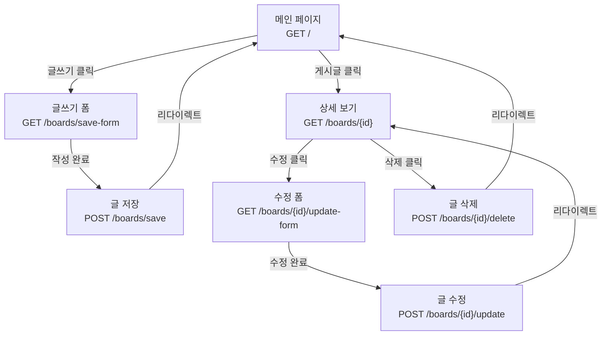
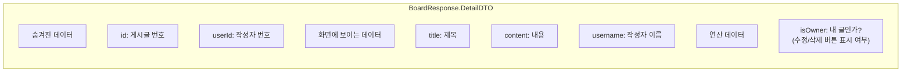
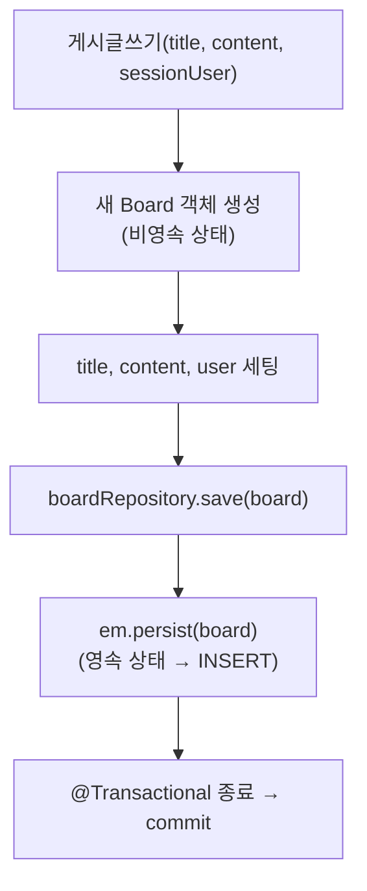
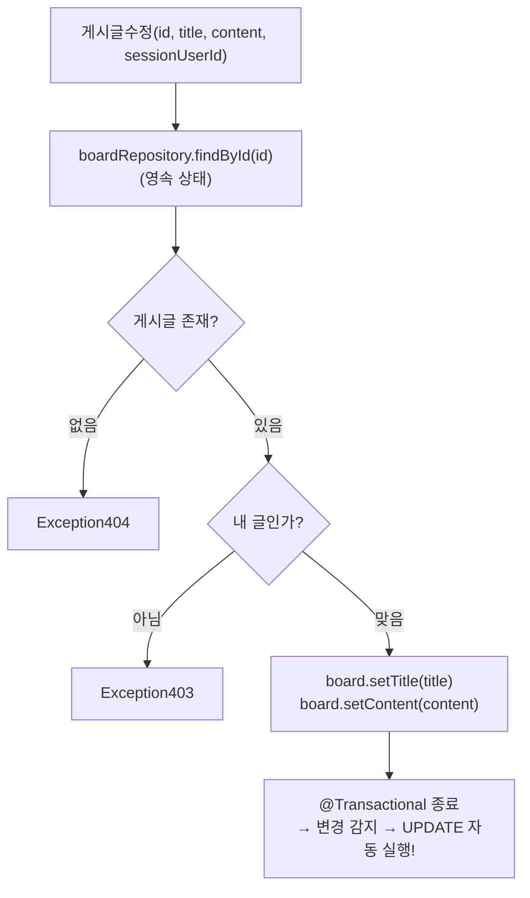
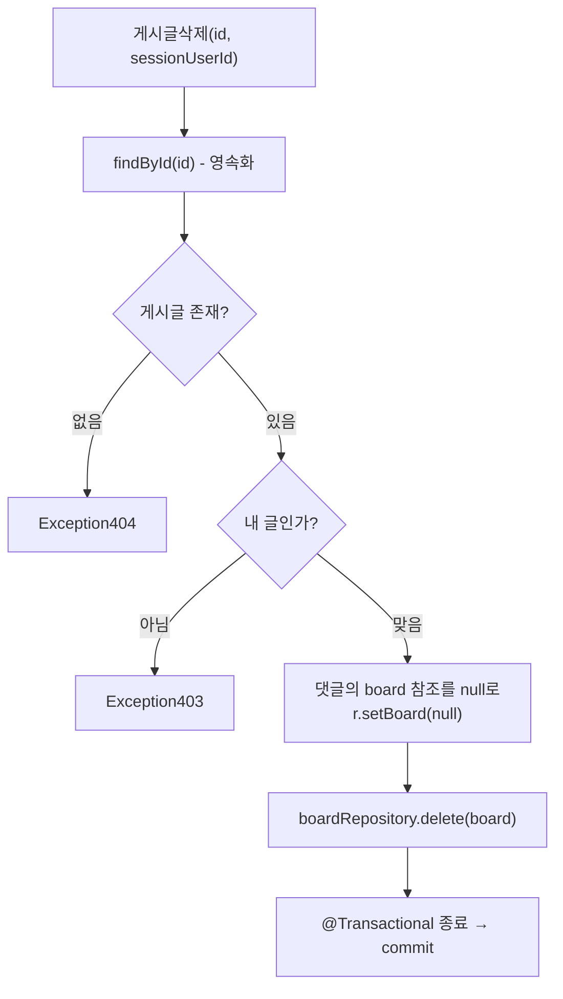
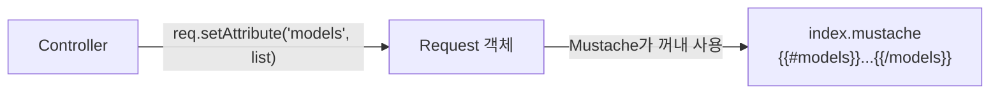

# Chapter 07. 게시글 CRUD

> **선수 조건**: 이 챕터를 시작하기 전에 다음 챕터를 완료하세요:
> - [Chapter 04. 예외 처리 설계](ch04-exception.md) - `Exception401`, `Exception403`, `Exception404` 사용
> - [Chapter 05. 뷰(Mustache) 템플릿](ch05-view.md) - `header.mustache` 사용
> - [Chapter 06. 회원가입과 로그인](ch06-user.md) - 세션(`sessionUser`) 사용

---

## 7.1 CRUD란?

> **정의**: 데이터의 4가지 기본 동작
>
> | 영문 | 한글 | SQL | HTTP 메서드 |
> |------|------|-----|-----------|
> | **C**reate | 생성 | INSERT | POST |
> | **R**ead | 조회 | SELECT | GET |
> | **U**pdate | 수정 | UPDATE | POST (PUT) |
> | **D**elete | 삭제 | DELETE | POST (DELETE) |
>
> **예시**: 일기장을 생각해보세요!
> - Create: 새 일기 쓰기
> - Read: 오늘 일기 읽기 / 일기장 목록 보기
> - Update: 어제 일기 수정하기
> - Delete: 그저께 일기 찢어버리기

---

## 7.2 게시글 기능 전체 흐름



---

## 7.3 요청 DTO

### 실습 코드

`src/main/java/com/example/boardv1/board/BoardRequest.java`

```java
package com.example.boardv1.board;

import lombok.Data;

public class BoardRequest {

    @Data
    public static class SaveOrUpdateDTO {
        private String title;
        private String content;
    }
}
```

> 저장(Save)과 수정(Update)에 필요한 데이터가 동일(title, content)하므로 하나의 DTO로 사용합니다!

---

## 7.4 응답 DTO

### 실습 코드

`src/main/java/com/example/boardv1/board/BoardResponse.java`

```java
package com.example.boardv1.board;

import lombok.Data;

public class BoardResponse {

    @Data
    public static class DTO {
        private int id;
        private String title;
        private String content;

        public DTO(Board board) {
            this.id = board.getId();
            this.title = board.getTitle();
            this.content = board.getContent();
        }
    }

    @Data
    public static class DetailDTO {
        // 화면에 보이지 않는것
        private int id;
        private int userId;

        // 화면에 보이는것
        private String title;
        private String content;
        private String username;

        // 연산해서 만들어야 되는것
        private boolean isOwner;

        public DetailDTO(Board board, Integer sessionUserId) {
            this.id = board.getId();
            this.userId = board.getUser().getId();
            this.title = board.getTitle();
            this.content = board.getContent();
            this.username = board.getUser().getUsername();
            this.isOwner = board.getUser().getId() == sessionUserId;
        }
    }
}
```

> **참고**: 다음 챕터(ch08)에서 댓글 기능을 구현할 때, DetailDTO에 `replies` 필드를 추가합니다.
> 지금은 게시글 정보만 담는 간단한 버전으로 먼저 만듭니다!

### DetailDTO 구조 이해



> **isOwner 필드의 역할**:
>
> ```java
> this.isOwner = board.getUser().getId() == sessionUserId;
> ```
>
> 게시글 작성자 ID와 현재 로그인한 유저의 ID를 비교해서, 본인 글이면 `true` → 수정/삭제 버튼을 보여줍니다!

---

## 7.5 BoardService - 비즈니스 로직

### 실습 코드

`src/main/java/com/example/boardv1/board/BoardService.java`

```java
package com.example.boardv1.board;

import java.util.List;

import org.springframework.stereotype.Service;
import org.springframework.transaction.annotation.Transactional;

import com.example.boardv1._core.errors.ex.Exception403;
import com.example.boardv1._core.errors.ex.Exception404;
import com.example.boardv1.user.User;

import lombok.RequiredArgsConstructor;

@RequiredArgsConstructor
@Service
public class BoardService {

    private final BoardRepository boardRepository;

    public List<Board> 게시글목록() {
        return boardRepository.findAll();
    }

    public Board 수정폼게시글정보(int id, int sessionUserId) {
        Board board = boardRepository.findById(id)
                .orElseThrow(() -> new Exception404("게시글을 찾을 수 없어요"));

        if (sessionUserId != board.getUser().getId())
            throw new Exception403("수정할 권한이 없습니다");
        return board;
    }

    public BoardResponse.DetailDTO 상세보기(int id, Integer sessionUserId) {
        Board board = boardRepository.findById(id)
                .orElseThrow(() -> new Exception404("게시글을 찾을 수 없어요"));

        return new BoardResponse.DetailDTO(board, sessionUserId);
    }

    @Transactional
    public void 게시글수정(int id, String title, String content, int sessionUserId) {
        Board board = boardRepository.findById(id)
                .orElseThrow(() -> new Exception404("수정할 게시글을 찾을 수 없어요"));

        if (sessionUserId != board.getUser().getId())
            throw new Exception403("수정할 권한이 없습니다");

        board.setTitle(title);
        board.setContent(content);
    }

    @Transactional
    public void 게시글쓰기(String title, String content, User sessionUser) {
        Board board = new Board();
        board.setTitle(title);
        board.setContent(content);
        board.setUser(sessionUser);

        boardRepository.save(board);
    }

    @Transactional
    public void 게시글삭제(int id, int sessionUserId) {
        Board board = boardRepository.findById(id)
                .orElseThrow(() -> new Exception404("삭제할 게시글을 찾을 수 없어요"));

        if (sessionUserId != board.getUser().getId())
            throw new Exception403("삭제할 권한이 없습니다.");

        board.getReplies().forEach(r -> {
            r.setBoard(null);
        });

        boardRepository.delete(board);
    }
}
```

### 각 메서드 상세 해설

#### 게시글목록() - READ (목록)

```java
public List<Board> 게시글목록() {
    return boardRepository.findAll();  // SELECT * FROM board_tb ORDER BY id DESC
}
```

> 단순 조회이므로 `@Transactional`이 필요 없습니다.

#### 게시글쓰기() - CREATE



#### 게시글수정() - UPDATE (변경 감지)



> **변경 감지 (Dirty Checking)** 핵심!
>
> ```java
> board.setTitle(title);
> board.setContent(content);
> // em.persist() 호출이 없는데도 UPDATE가 실행됨!
> ```
>
> **예시**: 엑셀 파일을 열어서 수정하면, 저장할 때 "변경사항을 저장하시겠습니까?"라고 물어보죠? 영속성 컨텍스트도 마찬가지입니다. 영속 상태인 엔티티의 필드가 바뀌면, 트랜잭션이 끝날 때 자동으로 UPDATE SQL을 실행합니다!

#### 게시글삭제() - DELETE



> **댓글이 있는 게시글 삭제 시 주의!**
>
> ```java
> board.getReplies().forEach(r -> {
>     r.setBoard(null);  // 댓글의 FK를 null로 만듦
> });
> boardRepository.delete(board);
> ```
>
> **왜 이렇게 해야 하나요?**
> Reply 테이블의 `board_id`가 Board 테이블의 `id`를 참조(FK)하고 있기 때문에, Board를 바로 삭제하면 FK 제약 조건 위반 에러가 발생합니다. 그래서 먼저 댓글의 `board_id`를 null로 바꾼 후 삭제합니다.

---

## 7.6 BoardController - 요청 처리

### 실습 코드

`src/main/java/com/example/boardv1/board/BoardController.java`

```java
package com.example.boardv1.board;

import java.io.IOException;
import java.util.List;

import org.springframework.stereotype.Controller;
import org.springframework.web.bind.annotation.GetMapping;
import org.springframework.web.bind.annotation.PathVariable;
import org.springframework.web.bind.annotation.PostMapping;
import org.springframework.web.bind.annotation.ResponseBody;

import com.example.boardv1._core.errors.ex.Exception401;
import com.example.boardv1._core.errors.ex.Exception500;
import com.example.boardv1.user.User;

import jakarta.servlet.http.HttpServletRequest;
import jakarta.servlet.http.HttpSession;
import lombok.RequiredArgsConstructor;

@RequiredArgsConstructor
@Controller
public class BoardController {

    private final BoardService boardService;
    private final HttpSession session;

    @PostMapping("/boards/save")
    public String save(BoardRequest.SaveOrUpdateDTO reqDTO) throws IOException {
        User sessionUser = (User) session.getAttribute("sessionUser");
        if (sessionUser == null)
            throw new Exception401("인증되지 않았습니다.");

        boardService.게시글쓰기(reqDTO.getTitle(), reqDTO.getContent(), sessionUser);
        return "redirect:/";
    }

    @PostMapping("/boards/{id}/update")
    public String update(@PathVariable("id") int id, BoardRequest.SaveOrUpdateDTO reqDTO) {
        User sessionUser = (User) session.getAttribute("sessionUser");
        if (sessionUser == null)
            throw new Exception401("인증되지 않았습니다.");

        boardService.게시글수정(id, reqDTO.getTitle(), reqDTO.getContent(), sessionUser.getId());
        return "redirect:/boards/" + id;
    }

    @GetMapping("/")
    public String index(HttpServletRequest req) {
        List<Board> list = boardService.게시글목록();
        req.setAttribute("models", list);
        return "index";
    }

    @GetMapping("/boards/save-form")
    public String saveForm() {
        User sessionUser = (User) session.getAttribute("sessionUser");
        if (sessionUser == null)
            throw new Exception401("인증되지 않았습니다.");
        return "board/save-form";
    }

    @GetMapping("/boards/{id}/update-form")
    public String updateForm(@PathVariable("id") int id, HttpServletRequest req) {
        User sessionUser = (User) session.getAttribute("sessionUser");
        if (sessionUser == null)
            throw new Exception401("인증되지 않았습니다.");
        Board board = boardService.수정폼게시글정보(id, sessionUser.getId());

        req.setAttribute("model", board);
        return "board/update-form";
    }

    @GetMapping("/boards/{id}")
    public String detail(@PathVariable("id") int id, HttpServletRequest req) {
        User sessionUser = (User) session.getAttribute("sessionUser");
        Integer sessionUserId = sessionUser == null ? null : sessionUser.getId();
        BoardResponse.DetailDTO dto = boardService.상세보기(id, sessionUserId);
        req.setAttribute("model", dto);
        return "board/detail";
    }

    @PostMapping("/boards/{id}/delete")
    public String delete(@PathVariable("id") int id) {
        User sessionUser = (User) session.getAttribute("sessionUser");
        if (sessionUser == null)
            throw new Exception401("인증되지 않았습니다.");

        try {
            boardService.게시글삭제(id, sessionUser.getId());
        } catch (Exception e) {
            throw new Exception500("댓글이 있는 게시글을 삭제할 수 없습니다");
        }

        return "redirect:/";
    }

    @GetMapping("/api/boards/{id}")
    public @ResponseBody BoardResponse.DetailDTO apiDetail(@PathVariable("id") int id) {
        User sessionUser = (User) session.getAttribute("sessionUser");
        Integer sessionUserId = sessionUser == null ? null : sessionUser.getId();
        BoardResponse.DetailDTO dto = boardService.상세보기(id, sessionUserId);
        return dto;
    }
}
```

### API 엔드포인트 정리

| HTTP 메서드 | URL | 역할 | 인증 필요 | 권한 필요 |
|------------|-----|------|---------|---------|
| GET | `/` | 게시글 목록 | X | X |
| GET | `/boards/{id}` | 게시글 상세 | X | X |
| GET | `/boards/save-form` | 글쓰기 폼 | O | X |
| POST | `/boards/save` | 글 저장 | O | X |
| GET | `/boards/{id}/update-form` | 수정 폼 | O | O (본인) |
| POST | `/boards/{id}/update` | 글 수정 | O | O (본인) |
| POST | `/boards/{id}/delete` | 글 삭제 | O | O (본인) |
| GET | `/api/boards/{id}` | 상세 (JSON) | X | X |

### @PathVariable이란?

> **정의**: URL 경로에 있는 변수값을 메서드 파라미터로 받는 것
>
> ```java
> @GetMapping("/boards/{id}")
> public String detail(@PathVariable("id") int id) { ... }
> ```
>
> **예시**: 호텔 방 번호를 생각해보세요.
> - URL: `/boards/3` → "3번 게시글 보여주세요"
> - `{id}` 자리에 3이 들어가서 → `int id = 3`이 됩니다!

### HttpServletRequest로 뷰에 데이터 전달

```java
@GetMapping("/")
public String index(HttpServletRequest req) {
    List<Board> list = boardService.게시글목록();
    req.setAttribute("models", list);  // "models"라는 이름으로 데이터 전달
    return "index";                     // index.mustache 렌더링
}
```



### @ResponseBody란?

```java
@GetMapping("/api/boards/{id}")
public @ResponseBody BoardResponse.DetailDTO apiDetail(...) {
    ...
    return dto;  // JSON으로 변환되어 응답됨!
}
```

> **정의**: HTML이 아닌 데이터(JSON) 자체를 응답으로 보내는 것
>
> - `@ResponseBody` 없이: Mustache 템플릿을 찾아서 HTML 응답
> - `@ResponseBody` 있으면: Java 객체를 JSON으로 변환해서 응답

---

## 7.7 인증과 권한 패턴

이 프로젝트에서 반복적으로 사용되는 패턴:

```java
// 1. 인증 체크 (로그인 했는지?)
User sessionUser = (User) session.getAttribute("sessionUser");
if (sessionUser == null)
    throw new Exception401("인증되지 않았습니다.");

// 2. 권한 체크 (내 글인지? - Service에서 수행)
if (sessionUserId != board.getUser().getId())
    throw new Exception403("수정할 권한이 없습니다");
```

> **인증 vs 권한**:
>
> | | 인증 (Authentication) | 권한 (Authorization) |
> |---|-----|-----|
> | **질문** | "너 누구야?" | "너 이거 할 수 있어?" |
> | **체크 장소** | Controller | Service |
> | **실패 시** | Exception401 | Exception403 |
> | **예시** | 신분증 확인 | VIP 라운지 입장 |

---

## 7.8 뷰 템플릿 만들기

BoardController가 반환하는 뷰 파일들을 만듭니다.

### index.mustache - 게시글 목록 (메인 페이지)

`src/main/resources/templates/index.mustache`

```html
{{> header}}

<div class="container mt-3">

  <table class="table table-hover">
    <thead>
      <tr>
        <th>번호</th>
        <th>제목</th>
        <th>내용</th>
      </tr>
    </thead>
    <tbody>
    {{#models}}
      <tr onclick="location.href='/boards/{{id}}'" style="cursor: pointer;">
        <td>{{id}}</td>
        <td>{{title}}</td>
        <td>{{content}}</td>
      </tr>
    {{/models}}
    </tbody>
  </table>
</div>

</body>
</html>
```

> `{{#models}}...{{/models}}` 안의 내용이 게시글 리스트의 각 항목마다 반복됩니다!
> `models`는 Controller에서 `req.setAttribute("models", list)`로 전달한 데이터입니다.

### save-form.mustache - 게시글 작성 폼

`src/main/resources/templates/board/save-form.mustache`

```html
{{> header}}

<div class="container p-5">
    <div class="card">
        <div class="card-header"><b>게시글 작성</b></div>
        <div class="card-body">
            <form action="/boards/save" method="post" enctype="application/x-www-form-urlencoded">
                <div class="mb-3">
                    <input type="text" class="form-control" placeholder="Enter title" name="title">
                </div>
                <div class="mb-3">
                    <textarea class="form-control" rows="5" name="content"></textarea>
                </div>
                <button class="btn btn-secondary form-control">글쓰기</button>
            </form>
        </div>
    </div>
</div>

</body>
</html>
```

### update-form.mustache - 게시글 수정 폼

`src/main/resources/templates/board/update-form.mustache`

```html
{{> header}}

<div class="container p-5">
    <div class="card">
        <div class="card-header"><b>게시글 수정</b></div>
        <div class="card-body">
            <form action="/boards/{{model.id}}/update" method="post"
                  enctype="application/x-www-form-urlencoded">
                <div class="mb-3">
                    <input type="text" class="form-control" placeholder="Enter title"
                           name="title" value="{{model.title}}">
                </div>
                <div class="mb-3">
                    <textarea class="form-control" rows="5"
                              name="content">{{model.content}}</textarea>
                </div>
                <button class="btn btn-secondary form-control">글수정하기</button>
            </form>
        </div>
    </div>
</div>

</body>
</html>
```

> 수정 폼은 작성 폼과 거의 같지만, `value="{{model.title}}"`, `{{model.content}}`로 **기존 데이터가 미리 채워져** 있습니다!

### detail.mustache - 게시글 상세

`src/main/resources/templates/board/detail.mustache`

```html
{{> header}}

<div class="container p-5">

    {{#model.isOwner}}
    <!-- 수정삭제버튼 (본인 글일때만 보임) -->
    <div class="d-flex justify-content-end">
        <a href="/boards/{{model.id}}/update-form" class="btn btn-secondary me-1">수정</a>
        <form action="/boards/{{model.id}}/delete" method="post">
            <button class="btn btn-outline-secondary">삭제</button>
        </form>
    </div>
    {{/model.isOwner}}

    <!-- 게시글내용 -->
    <div>
        <h2><b>{{model.title}}</b></h2>
        <hr />
        <div class="d-flex justify-content-end">
            작성자 : {{model.username}}
        </div>
        <div class="m-4 p-2">
            {{model.content}}
        </div>
    </div>

    <!-- 댓글 영역은 Ch08에서 추가합니다 -->
</div>

</body>
</html>
```

> **참고**: 댓글 등록 폼과 댓글 목록은 다음 챕터(ch08)에서 이 파일에 추가합니다!

---

## 실행 확인

서버를 재시작하고 다음을 확인하세요:

1. `http://localhost:8080` → 게시글 목록(6개)이 표시되는지
2. 게시글 행 클릭 → 상세 페이지로 이동하는지
3. 로그인(`ssar` / `1234`) → 네비게이션에 "글쓰기" 버튼이 보이는지
4. 글쓰기 → 제목/내용 입력 후 저장 → 목록에 새 글이 보이는지
5. 본인 글 상세 → 수정/삭제 버튼이 보이는지
6. 수정 → 기존 데이터가 채워져 있고, 수정 후 반영되는지
7. 삭제 → 게시글이 목록에서 사라지는지
8. 다른 사람 글(`cos`의 글) 상세 → 수정/삭제 버튼이 안 보이는지

### 이 시점의 파일 구조

```
src/main/java/com/example/boardv1/board/
├── Board.java            ← ch02
├── BoardRepository.java  ← ch03
├── BoardRequest.java     ← 이번 챕터
├── BoardResponse.java    ← 이번 챕터
├── BoardService.java     ← 이번 챕터
└── BoardController.java  ← 이번 챕터

src/main/resources/templates/
├── header.mustache              ← ch05
├── index.mustache               ← 이번 챕터
├── user/
│   ├── join-form.mustache       ← ch06
│   └── login-form.mustache      ← ch06
└── board/
    ├── detail.mustache          ← 이번 챕터 (댓글 없는 버전)
    ├── save-form.mustache       ← 이번 챕터
    └── update-form.mustache     ← 이번 챕터
```

---

## 핵심 정리

- **CRUD**: Create(생성), Read(조회), Update(수정), Delete(삭제)
- **변경 감지(Dirty Checking)**: 영속 상태 엔티티의 필드를 바꾸면 자동 UPDATE
- **@PathVariable**: URL에서 변수 추출 (`/boards/3` → `id = 3`)
- **@ResponseBody**: JSON으로 응답 (API 용도)
- **인증**: 로그인 여부 확인 (Controller에서)
- **권한**: 본인 글인지 확인 (Service에서)
- 게시글 삭제 시 댓글의 FK를 먼저 null로 설정해야 함

> **다음 챕터**: [Chapter 08. 댓글 기능](ch08-reply.md) - 게시글에 댓글을 달고 삭제하는 기능을 구현합니다!
