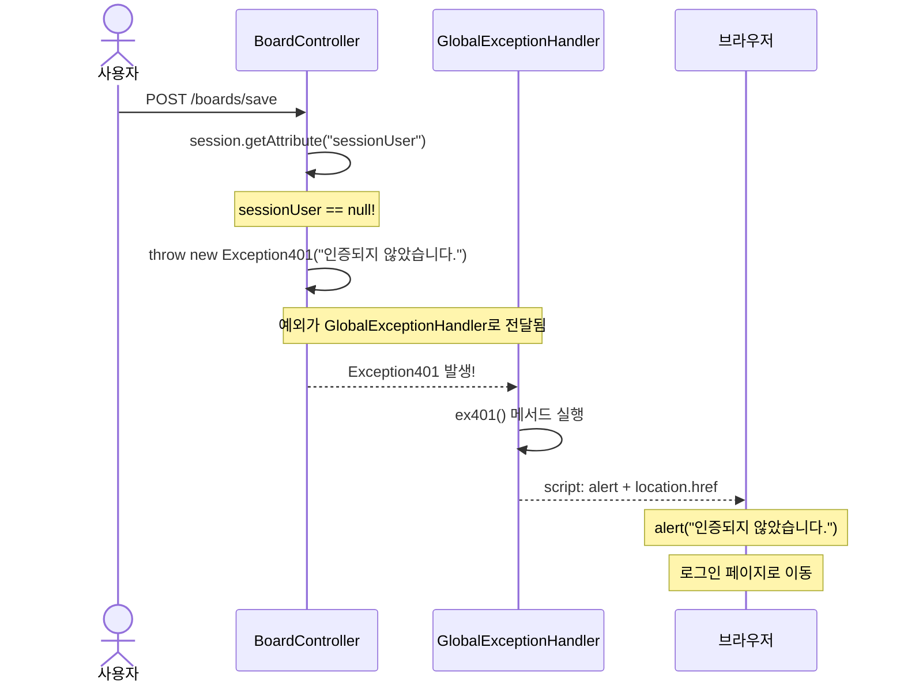

# Chapter 07. 예외 처리

---

## 7.1 예외 처리가 왜 필요한가요?

> **예시**: 놀이공원에서 놀이기구를 타려고 하는데...
> - 키가 작으면? → "키 120cm 이상만 탑승 가능합니다" (400 - 유효성 검사 실패)
> - 입장권이 없으면? → "입장권을 먼저 구매해주세요" (401 - 인증 실패)
> - 자유이용권이 아니면? → "자유이용권 전용입니다" (403 - 권한 없음)
> - 놀이기구가 고장이면? → "현재 점검 중입니다" (404 - 자원 없음)
> - 정전이 나면? → "관리자에게 문의하세요" (500 - 서버 에러)
>
> 이렇게 **상황별로 다른 메시지**를 보여주는 것이 예외 처리입니다!

---

## 7.2 HTTP 상태 코드와 커스텀 예외

### HTTP 상태 코드


### 커스텀 예외 클래스

이 프로젝트에서는 HTTP 상태 코드에 맞는 커스텀 예외를 만들어 사용합니다.

#### Exception400 - 유효성 검사 실패 / 중복

```java
package com.example.boardv1._core.errors.ex;

// 유효성검사 실패시 / 중복
public class Exception400 extends RuntimeException {
    public Exception400(String message) {
        super(message);
    }
}
```

> **사용 예시**: 회원가입 시 이미 존재하는 username으로 가입하려 할 때
> ```java
> throw new Exception400("유저네임이 중복되었습니다");
> ```

#### Exception401 - 인증 실패

```java
package com.example.boardv1._core.errors.ex;

// 인증 실패시
public class Exception401 extends RuntimeException {
    public Exception401(String message) {
        super(message);
    }
}
```

> **사용 예시**: 로그인하지 않고 글을 쓰려고 할 때
> ```java
> throw new Exception401("인증되지 않았습니다.");
> ```

#### Exception403 - 권한 없음

```java
package com.example.boardv1._core.errors.ex;

// 권한 실패시
public class Exception403 extends RuntimeException {
    public Exception403(String message) {
        super(message);
    }
}
```

> **사용 예시**: 남의 글을 수정하려 할 때
> ```java
> throw new Exception403("수정할 권한이 없습니다");
> ```

#### Exception404 - 자원 없음

```java
package com.example.boardv1._core.errors.ex;

// 자원을 찾을 수 없다.
public class Exception404 extends RuntimeException {
    public Exception404(String message) {
        super(message);
    }
}
```

> **사용 예시**: 존재하지 않는 게시글을 조회할 때
> ```java
> throw new Exception404("게시글을 찾을 수 없어요");
> ```

#### Exception500 - 서버 에러

```java
package com.example.boardv1._core.errors.ex;

// 서버측 에러
public class Exception500 extends RuntimeException {
    public Exception500(String message) {
        super(message);
    }
}
```

> **사용 예시**: 예상하지 못한 서버 에러가 발생할 때
> ```java
> throw new Exception500("댓글이 있는 게시글을 삭제할 수 없습니다");
> ```

### 예외 클래스 구조


> **왜 RuntimeException을 상속하나요?**
>
> - **Checked Exception**: 반드시 try-catch나 throws를 해야 함 (번거로움)
> - **RuntimeException(Unchecked)**: try-catch 없이도 던질 수 있음 (편리!)
>
> **예시**: 학교에서 결석 사유서를 생각해보세요.
> - Checked Exception: 결석할 때마다 사유서 필수 제출 (번거로움)
> - RuntimeException: 사유서 없이도 결석 가능, 나중에 한 번에 처리 (GlobalExceptionHandler가 처리!)

---

## 7.3 GlobalExceptionHandler - 예외 한 곳에서 처리

### 개념

> **정의**: 애플리케이션 전체에서 발생하는 예외를 한 곳에서 처리하는 클래스
>
> **예시**: 공항의 안내 데스크를 생각해보세요. 어떤 문제가 생기든(항공편 취소, 수화물 분실, 게이트 변경 등) 안내 데스크(GlobalExceptionHandler)에 가면 다 해결됩니다!


### 실습 코드

`src/main/java/com/example/boardv1/_core/errors/GlobalExceptionHandler.java`

```java
package com.example.boardv1._core.errors;

import org.springframework.web.bind.annotation.ExceptionHandler;
import org.springframework.web.bind.annotation.RestControllerAdvice;

import com.example.boardv1._core.errors.ex.Exception400;
import com.example.boardv1._core.errors.ex.Exception401;
import com.example.boardv1._core.errors.ex.Exception403;
import com.example.boardv1._core.errors.ex.Exception404;
import com.example.boardv1._core.errors.ex.Exception500;

@RestControllerAdvice
public class GlobalExceptionHandler {

    @ExceptionHandler(exception = Exception400.class)
    public String ex400(Exception400 e) {
        String html = String.format("""
                <script>
                    alert('%s');
                    history.back();
                </script>
                """, e.getMessage());
        return html;
    }

    @ExceptionHandler(exception = Exception401.class)
    public String ex401(Exception401 e) {
        String html = String.format("""
                <script>
                    alert('%s');
                    location.href = '/login-form';
                </script>
                """, e.getMessage());
        return html;
    }

    @ExceptionHandler(exception = Exception403.class)
    public String ex403(Exception403 e) {
        String html = String.format("""
                <script>
                    alert('%s');
                    history.back();
                </script>
                """, e.getMessage());
        return html;
    }

    @ExceptionHandler(exception = Exception404.class)
    public String ex404(Exception404 e) {
        String html = String.format("""
                <script>
                    alert('%s');
                    history.back();
                </script>
                """, e.getMessage());
        return html;
    }

    @ExceptionHandler(exception = Exception500.class)
    public String ex500(Exception500 e) {
        String html = String.format("""
                <script>
                    alert('%s');
                    history.back();
                </script>
                """, e.getMessage());
        return html;
    }

    @ExceptionHandler(exception = Exception.class)
    public String exUnknown(Exception e) {
        String html = String.format("""
                <script>
                    alert('%s');
                    history.back();
                </script>
                """, "관리자에게 문의하세요");
        System.out.println("error : " + e.getMessage());
        return html;
    }
}
```

### 핵심 어노테이션 설명

#### @RestControllerAdvice

> **정의**: 모든 컨트롤러에서 발생하는 예외를 가로채서 처리하는 클래스를 선언
>
> | 어노테이션 | 역할 |
> |-----------|------|
> | `@ControllerAdvice` | 모든 컨트롤러의 예외를 처리 (HTML 응답) |
> | `@RestControllerAdvice` | 모든 컨트롤러의 예외를 처리 (데이터/문자열 응답) |

#### @ExceptionHandler

> **정의**: 특정 예외가 발생했을 때 실행될 메서드를 지정
>
> ```java
> @ExceptionHandler(exception = Exception401.class)  // Exception401이 발생하면
> public String ex401(Exception401 e) {               // 이 메서드가 실행됨
>     ...
> }
> ```

### 각 예외별 처리 방식

| 예외 | 알림 메시지 | 이후 행동 |
|------|-----------|----------|
| Exception400 | "유저네임이 중복되었습니다" | `history.back()` (이전 페이지) |
| Exception401 | "인증되지 않았습니다" | `location.href = '/login-form'` (로그인 페이지로) |
| Exception403 | "수정할 권한이 없습니다" | `history.back()` (이전 페이지) |
| Exception404 | "게시글을 찾을 수 없어요" | `history.back()` (이전 페이지) |
| Exception500 | "댓글이 있는 게시글을..." | `history.back()` (이전 페이지) |
| Exception (기타) | "관리자에게 문의하세요" | `history.back()` (이전 페이지) |

> **401만 다른 이유**: 인증 실패는 로그인이 필요하므로 로그인 페이지로 보냅니다!

---

## 7.4 예외 처리 흐름 예시

### 예시: 로그인 안 하고 글쓰기 시도



### 예시: 남의 글 수정 시도


---

## 7.5 마지막 방어선: Exception.class 핸들러

```java
@ExceptionHandler(exception = Exception.class)
public String exUnknown(Exception e) {
    String html = String.format("""
            <script>
                alert('%s');
                history.back();
            </script>
            """, "관리자에게 문의하세요");
    System.out.println("error : " + e.getMessage());
    return html;
}
```

> **예시**: 병원의 응급실을 생각해보세요. 어떤 병인지 모르는 환자가 오면, 일단 응급실(Exception.class 핸들러)에서 처리합니다!
>
> - 커스텀 예외(400~500)에 해당하지 않는 **예상하지 못한 에러**를 잡아줍니다
> - 사용자에게는 "관리자에게 문의하세요"라는 일반적인 메시지를 보여줍니다
> - 서버 콘솔에는 실제 에러 메시지를 출력합니다 (디버깅용)

---

## 7.6 예외 처리 없이는 어떻게 되나요?


---

## 핵심 정리

- **커스텀 예외**: HTTP 상태 코드에 맞는 예외 클래스를 만들어 사용
- **RuntimeException 상속**: try-catch 없이 던질 수 있어 편리
- **@RestControllerAdvice**: 모든 컨트롤러의 예외를 한 곳에서 처리
- **@ExceptionHandler**: 특정 예외 타입에 대한 처리 메서드 지정
- **Exception400**: 유효성 검사 실패 → `history.back()`
- **Exception401**: 인증 실패 → 로그인 페이지로 이동
- **Exception403**: 권한 없음 → `history.back()`
- **Exception404**: 자원 없음 → `history.back()`
- **Exception.class**: 예상하지 못한 에러를 마지막으로 잡는 안전망

> **다음 챕터**: [Chapter 08. 뷰(Mustache) 템플릿](ch08-view.md) - 사용자가 보는 화면을 만들어봅시다!
