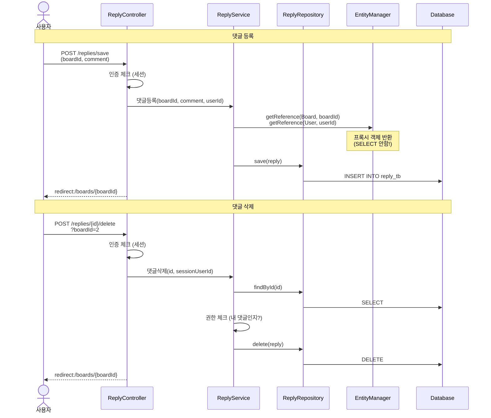
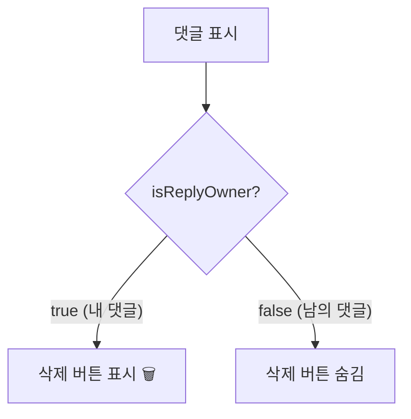
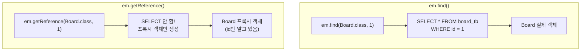
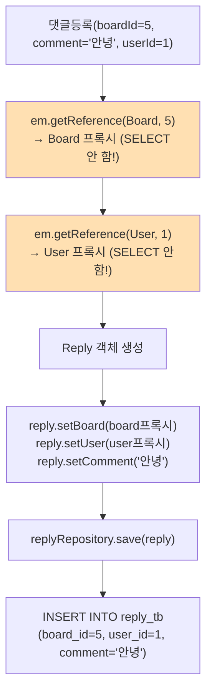
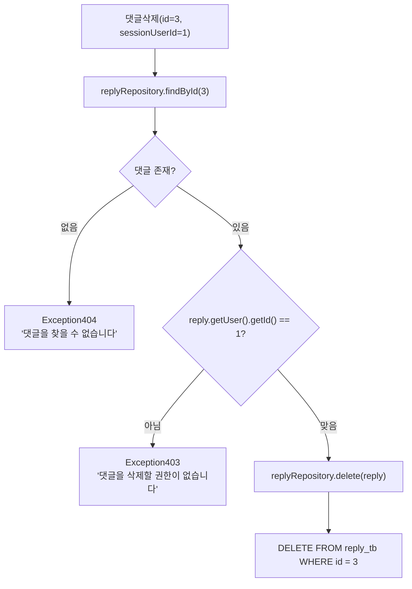
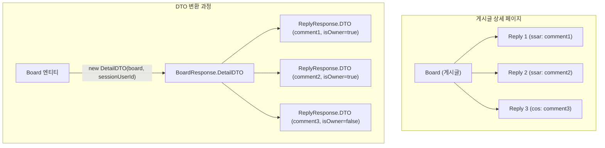

# Chapter 08. 댓글 기능

> **선수 조건**: 이 챕터를 시작하기 전에 다음 챕터를 완료하세요:
> - [Chapter 07. 게시글 CRUD](ch07-board-crud.md) - Board, BoardResponse, detail.mustache 사용

---

## 8.1 댓글 기능 전체 흐름



---

## 8.2 응답 DTO

### 실습 코드

`src/main/java/com/example/boardv1/reply/ReplyResponse.java`

```java
package com.example.boardv1.reply;

import lombok.Data;

public class ReplyResponse {

    @Data
    public static class DTO {
        private Integer id;
        private String comment;
        private Integer replyUserId;
        private String replyUsername;
        private boolean isReplyOwner;

        public DTO(Reply reply, Integer sessionUserId) {
            this.id = reply.getId();
            this.comment = reply.getComment();
            this.replyUserId = reply.getUser().getId();
            this.replyUsername = reply.getUser().getUsername();
            this.isReplyOwner = reply.getUser().getId() == sessionUserId;
        }
    }
}
```

### isReplyOwner의 역할



> **예시**: 학교 게시판에 포스트잇을 붙이면, 본인이 붙인 포스트잇만 떼어낼 수 있죠? `isReplyOwner`가 `true`일 때만 삭제 버튼이 보입니다!

---

## 8.3 BoardResponse.DetailDTO 업그레이드

ch07에서 만든 `BoardResponse.DetailDTO`에 **댓글 목록(replies)** 필드를 추가합니다!

### 수정 전 (ch07 버전)

```java
@Data
public static class DetailDTO {
    private int id;
    private int userId;
    private String title;
    private String content;
    private String username;
    private boolean isOwner;

    public DetailDTO(Board board, Integer sessionUserId) {
        this.id = board.getId();
        this.userId = board.getUser().getId();
        // ... (기존 코드)
    }
}
```

### 수정 후 (댓글 추가 버전)

`src/main/java/com/example/boardv1/board/BoardResponse.java`를 다음과 같이 수정하세요:

```java
package com.example.boardv1.board;

import java.util.List;

import com.example.boardv1.reply.ReplyResponse;

import lombok.Data;

public class BoardResponse {

    @Data
    public static class DTO {
        private int id;
        private String title;
        private String content;

        public DTO(Board board) {
            this.id = board.getId();
            this.title = board.getTitle();
            this.content = board.getContent();
        }
    }

    @Data
    public static class DetailDTO {
        // 화면에 보이지 않는것
        private int id;
        private int userId;

        // 화면에 보이는것
        private String title;
        private String content;
        private String username;

        // 연산해서 만들어야 되는것
        private boolean isOwner;

        private List<ReplyResponse.DTO> replies;  // ← 추가!

        public DetailDTO(Board board, Integer sessionUserId) {
            this.id = board.getId();
            this.userId = board.getUser().getId();
            this.title = board.getTitle();
            this.content = board.getContent();
            this.username = board.getUser().getUsername();
            this.isOwner = board.getUser().getId() == sessionUserId;
            this.replies = board.getReplies().stream()                    // ← 추가!
                    .map(reply -> new ReplyResponse.DTO(reply, sessionUserId))  // ← 추가!
                    .toList();                                            // ← 추가!
        }
    }
}
```

> **핵심 변경**: `ReplyResponse.DTO`를 import하고, `replies` 필드를 추가했습니다.
> Board 엔티티의 `getReplies()`로 댓글 목록을 가져와서, 각각을 `ReplyResponse.DTO`로 변환합니다.
>
> 이것이 실무에서 자주 하는 **기존 코드 업그레이드** 과정입니다!

---

## 8.4 요청 DTO

### 실습 코드

`src/main/java/com/example/boardv1/reply/ReplyRequest.java`

```java
package com.example.boardv1.reply;

import lombok.Data;

public class ReplyRequest {

    @Data
    public static class SaveDTO {
        private Integer boardId;
        private String comment;
    }
}
```

> 댓글을 등록할 때 필요한 정보:
> 1. `boardId` - 어떤 게시글에 달 것인지
> 2. `comment` - 댓글 내용
> 3. `userId` - 누가 쓰는지 (세션에서 가져오므로 DTO에 없음!)

---

## 8.5 ReplyService - 비즈니스 로직

### 실습 코드

`src/main/java/com/example/boardv1/reply/ReplyService.java`

```java
package com.example.boardv1.reply;

import org.springframework.stereotype.Service;
import org.springframework.transaction.annotation.Transactional;

import com.example.boardv1._core.errors.ex.Exception403;
import com.example.boardv1._core.errors.ex.Exception404;
import com.example.boardv1.board.Board;
import com.example.boardv1.user.User;

import jakarta.persistence.EntityManager;
import lombok.RequiredArgsConstructor;

@RequiredArgsConstructor
@Service
public class ReplyService {

    private final ReplyRepository replyRepository;
    private final EntityManager em;

    @Transactional
    public void 댓글등록(Integer boardId, String comment, Integer sessionUserId) {
        Board board = em.getReference(Board.class, boardId);
        User user = em.getReference(User.class, sessionUserId);
        Reply reply = new Reply();
        reply.setBoard(board);
        reply.setUser(user);
        reply.setComment(comment);

        replyRepository.save(reply);
    }

    @Transactional
    public void 댓글삭제(int id, Integer sessionUserId) {
        Reply reply = replyRepository.findById(id)
                .orElseThrow(() -> new Exception404("댓글을 찾을 수 없습니다"));

        if (reply.getUser().getId() != sessionUserId)
            throw new Exception403("댓글을 삭제할 권한이 없습니다");

        replyRepository.delete(reply);
    }
}
```

### getReference() vs find()

이 챕터의 핵심 개념입니다!



> **정의**: `getReference()`는 실제 DB를 조회하지 않고, id값만 가진 "가짜 객체(프록시)"를 반환합니다
>
> **예시**: 택배 보낼 때를 생각해보세요.
> - `em.find()`: 받는 사람 집에 직접 가서 주소를 확인한 후 택배 보내기 (비효율!)
> - `em.getReference()`: 받는 사람의 주소(id)만 알면 택배를 보낼 수 있음 (효율!)
>
> 댓글을 INSERT할 때 필요한 것은 `board_id`와 `user_id` 뿐입니다. 실제 Board나 User의 모든 정보가 필요하지 않으므로 `getReference()`로 프록시 객체를 사용하면 불필요한 SELECT 쿼리를 줄일 수 있습니다!

### 댓글 등록 과정 상세



> getReference 덕분에 SELECT 쿼리 0번, INSERT 쿼리 1번만 실행됩니다!

### 댓글 삭제 과정 상세



---

## 8.6 ReplyController - 요청 처리

### 실습 코드

`src/main/java/com/example/boardv1/reply/ReplyController.java`

```java
package com.example.boardv1.reply;

import org.springframework.stereotype.Controller;
import org.springframework.web.bind.annotation.PathVariable;
import org.springframework.web.bind.annotation.PostMapping;
import org.springframework.web.bind.annotation.RequestParam;

import com.example.boardv1._core.errors.ex.Exception401;
import com.example.boardv1.user.User;

import jakarta.servlet.http.HttpSession;
import lombok.RequiredArgsConstructor;

@RequiredArgsConstructor
@Controller
public class ReplyController {
    private final ReplyService replyService;
    private final HttpSession session;

    @PostMapping("/replies/{id}/delete")
    public String delete(@PathVariable("id") int id, @RequestParam("boardId") int boardId) {
        User sessionUser = (User) session.getAttribute("sessionUser");
        if (sessionUser == null)
            throw new Exception401("인증되지 않았습니다.");

        replyService.댓글삭제(id, sessionUser.getId());

        return "redirect:/boards/" + boardId;
    }

    @PostMapping("/replies/save")
    public String save(ReplyRequest.SaveDTO reqDTO) {
        User sessionUser = (User) session.getAttribute("sessionUser");
        if (sessionUser == null)
            throw new Exception401("인증되지 않았습니다.");

        replyService.댓글등록(reqDTO.getBoardId(), reqDTO.getComment(), sessionUser.getId());
        return "redirect:/boards/" + reqDTO.getBoardId();
    }
}
```

### API 엔드포인트 정리

| HTTP 메서드 | URL | 역할 | 파라미터 |
|------------|-----|------|---------|
| POST | `/replies/save` | 댓글 등록 | Body: boardId, comment |
| POST | `/replies/{id}/delete` | 댓글 삭제 | Path: id, Query: boardId |

### @RequestParam이란?

> **정의**: URL의 쿼리 파라미터(?key=value)에서 값을 가져오는 것
>
> ```java
> // URL: /replies/5/delete?boardId=2
> @PostMapping("/replies/{id}/delete")
> public String delete(
>     @PathVariable("id") int id,        // id = 5
>     @RequestParam("boardId") int boardId // boardId = 2
> ) { ... }
> ```
>
> | 어노테이션 | 데이터 위치 | 예시 |
> |-----------|-----------|------|
> | `@PathVariable` | URL 경로 | `/replies/5/delete` → 5 |
> | `@RequestParam` | 쿼리 스트링 | `?boardId=2` → 2 |
> | DTO (파라미터) | 요청 Body | `boardId=5&comment=안녕` |

### 왜 삭제할 때 boardId가 필요한가요?

> 댓글을 삭제한 후 **어떤 게시글 페이지로 돌아갈지** 알아야 하기 때문입니다!
>
> ```java
> return "redirect:/boards/" + boardId;  // boardId번 게시글로 돌아가기
> ```

---

## 8.7 Board와 Reply의 관계 정리



> Board의 `DetailDTO` 생성 시, 내부에서 댓글 목록도 함께 DTO로 변환됩니다:
>
> ```java
> this.replies = board.getReplies().stream()
>     .map(reply -> new ReplyResponse.DTO(reply, sessionUserId))
>     .toList();
> ```

---

## 8.8 detail.mustache 업그레이드 - 댓글 영역 추가

ch07에서 만든 `detail.mustache`에 **댓글 등록 폼과 댓글 목록**을 추가합니다!

`src/main/resources/templates/board/detail.mustache`를 다음과 같이 수정하세요:

```html
{{> header}}

<div class="container p-5">

    {{#model.isOwner}}
    <!-- 수정삭제버튼 (본인 글일때만 보임) -->
    <div class="d-flex justify-content-end">
        <a href="/boards/{{model.id}}/update-form" class="btn btn-secondary me-1">수정</a>
        <form action="/boards/{{model.id}}/delete" method="post">
            <button class="btn btn-outline-secondary">삭제</button>
        </form>
    </div>
    {{/model.isOwner}}

    <!-- 게시글내용 -->
    <div>
        <h2><b>{{model.title}}</b></h2>
        <hr />
        <div class="d-flex justify-content-end">
            작성자 : {{model.username}}
        </div>
        <div class="m-4 p-2">
            {{model.content}}
        </div>
    </div>

    <!-- ====== 여기부터 이번 챕터에서 추가하는 댓글 영역 ====== -->
    <div class="card mt-3">
        <!-- 댓글등록 -->
        <div class="card-body">
            <form action="/replies/save" method="post">
                <input type="hidden" name="boardId" value="{{model.id}}" />
                <textarea id="comment" class="form-control" rows="2" name="comment"></textarea>
                <div class="d-flex justify-content-end">
                    <button class="btn btn-secondary mt-1">댓글등록</button>
                </div>
            </form>
        </div>

        <!-- 댓글목록 -->
        <div class="card-footer">
            <b>댓글리스트</b>
        </div>
        <div class="list-group">
            {{#model.replies}}
                <div class="list-group-item d-flex justify-content-between align-items-center">
                    <div class="d-flex">
                        <div class="px-1 me-1 bg-secondary text-white rounded">
                            {{replyUsername}}
                        </div>
                        <div>{{comment}}</div>
                    </div>

                    {{#isReplyOwner}}
                    <form action="/replies/{{id}}/delete?boardId={{model.id}}" method="post">
                        <button class="btn">🗑</button>
                    </form>
                    {{/isReplyOwner}}
                </div>
            {{/model.replies}}
        </div>
    </div>
</div>

{{^sessionUser}}
<script>
    const textArea = document.querySelector('#comment');
    textArea.addEventListener('click', function() {
        alert('로그인하세요');
        location.href = "/login-form";
    });
</script>
{{/sessionUser}}
</body>
</html>
```

### 추가된 부분 해설

**hidden input으로 boardId 전달**:
```html
<input type="hidden" name="boardId" value="{{model.id}}" />
```
> 댓글을 등록할 때 **어떤 게시글에 달 것인지** `boardId`를 함께 보냅니다. 사용자 눈에는 안 보이지만 서버로 전송됩니다.

**댓글 목록 반복 렌더링**:
```html
{{#model.replies}}
    {{replyUsername}}     ← ReplyResponse.DTO의 필드
    {{comment}}           ← ReplyResponse.DTO의 필드
    {{#isReplyOwner}}     ← 내 댓글이면 삭제 버튼 표시
{{/model.replies}}
```

**비로그인 시 댓글 입력 방지**:
```html
{{^sessionUser}}
<script>
    textArea.addEventListener('click', function() {
        alert('로그인하세요');
        location.href = "/login-form";
    });
</script>
{{/sessionUser}}
```
> 로그인하지 않은 사용자가 댓글란을 클릭하면 로그인 페이지로 보냅니다.

---

## 실행 확인

서버를 재시작하고 다음을 확인하세요:

1. 게시글 상세 페이지 → 댓글 등록 폼이 보이는지
2. 로그인 후 댓글 입력 → 댓글이 등록되고 목록에 표시되는지
3. 본인 댓글에만 삭제 버튼(🗑)이 보이는지
4. 삭제 버튼 클릭 → 댓글이 삭제되는지
5. 비로그인 상태에서 댓글란 클릭 → "로그인하세요" 알림이 뜨는지

> **축하합니다!** 이 챕터까지 완료하면 **게시판의 모든 기본 기능이 완성**됩니다!

### 이 시점의 파일 구조

```
src/main/java/com/example/boardv1/reply/
├── Reply.java            ← ch02
├── ReplyRepository.java  ← ch03
├── ReplyResponse.java    ← 이번 챕터
├── ReplyRequest.java     ← 이번 챕터
├── ReplyService.java     ← 이번 챕터
└── ReplyController.java  ← 이번 챕터

src/main/java/com/example/boardv1/board/
└── BoardResponse.java    ← 이번 챕터에서 업그레이드 (replies 필드 추가)

src/main/resources/templates/board/
└── detail.mustache       ← 이번 챕터에서 업그레이드 (댓글 영역 추가)
```

---

## 핵심 정리

- **getReference()**: SELECT 없이 프록시 객체만 생성 (FK만 필요할 때 사용)
- **find()**: 실제 SELECT 쿼리로 데이터 조회
- 댓글 등록 시 Board와 User의 전체 정보가 필요 없으므로 `getReference()` 사용
- `@PathVariable`: URL 경로에서 값 추출
- `@RequestParam`: 쿼리 파라미터에서 값 추출
- 삭제 후 `redirect`할 때 어떤 페이지로 돌아갈지 `boardId`가 필요
- 기존 코드를 업그레이드하는 것이 실무의 일반적인 패턴

> **다음 챕터**: [Chapter 09. 테스트 코드](ch09-test.md) - Repository를 테스트하는 방법을 배워봅시다!
