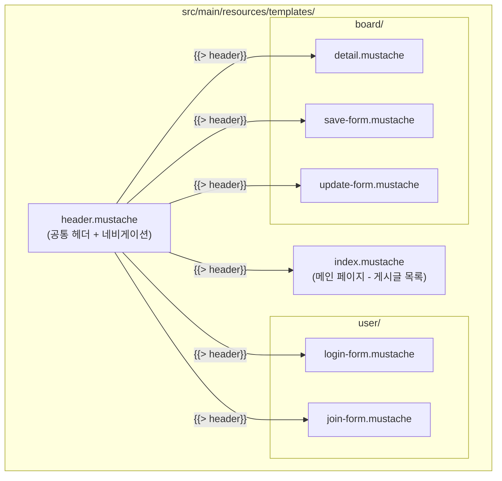
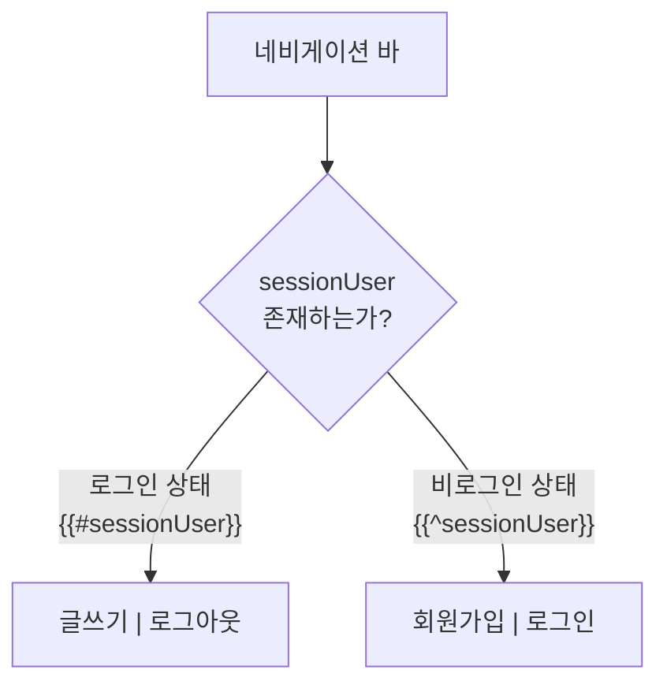
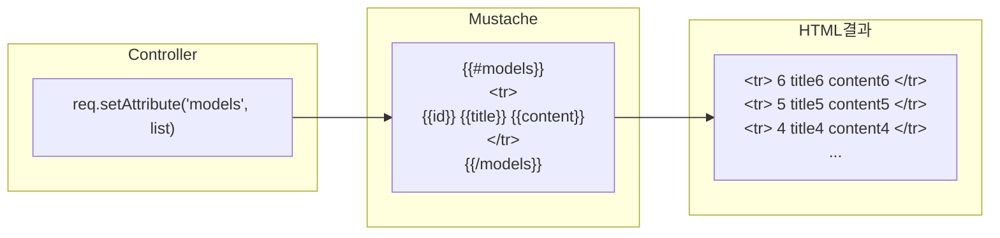
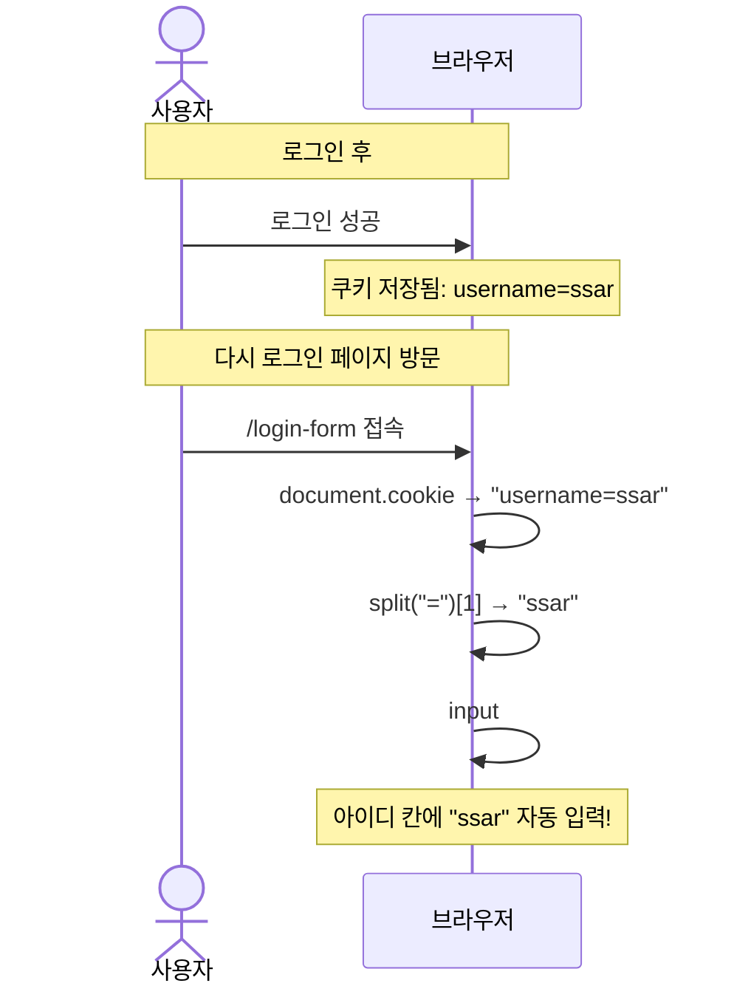
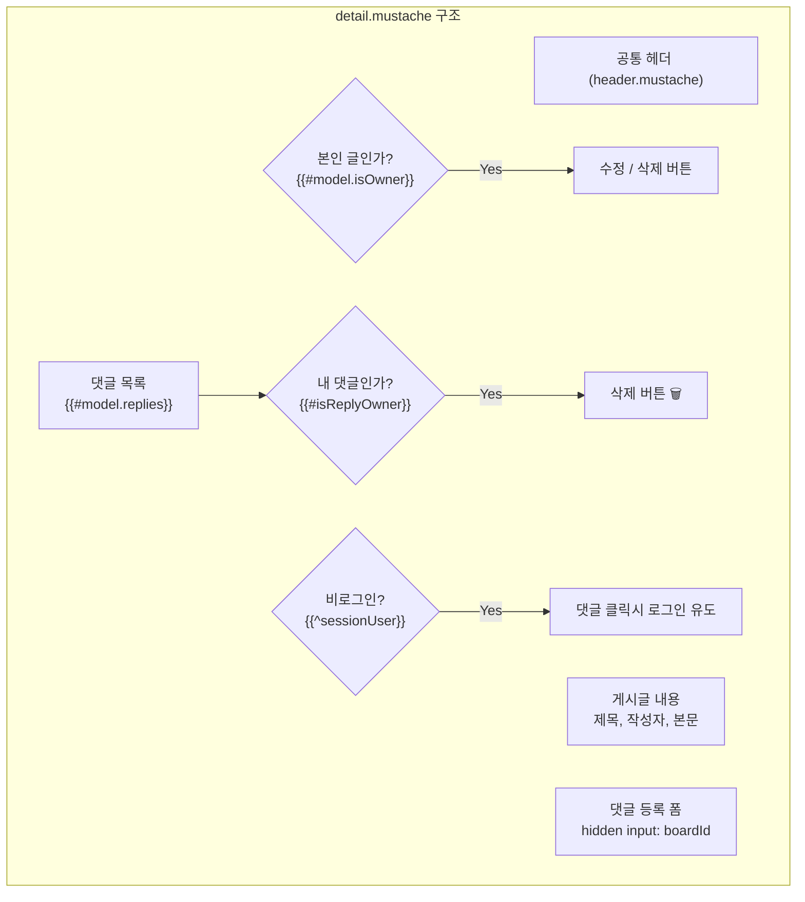
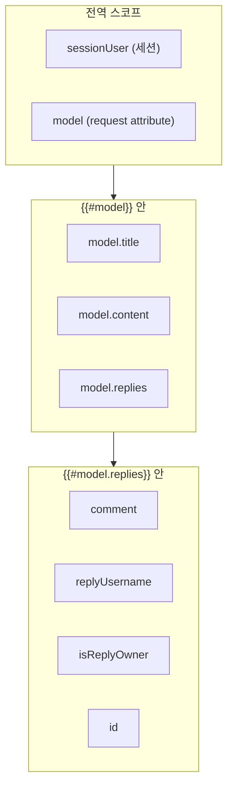

# Chapter 08. 뷰(Mustache) 템플릿

---

## 8.1 Mustache란?

> **정의**: HTML 안에 데이터를 동적으로 삽입할 수 있게 해주는 템플릿 엔진
>
> **예시**: 우편물 봉투를 생각해보세요.
> ```
> {{받는분}} 님께
> {{보내는분}} 드림
> ```
> 이 양식에 실제 이름을 넣으면 "철수 님께 / 영희 드림"이 됩니다!

### Mustache 기본 문법

| 문법 | 역할 | 예시 |
|------|------|------|
| `{{변수}}` | 변수 출력 | `{{title}}` → "제목1" |
| `{{#조건}}...{{/조건}}` | 조건부 렌더링 (true일 때) | 로그인했을 때만 표시 |
| `{{^조건}}...{{/조건}}` | 반전 조건 (false일 때) | 로그인 안 했을 때만 표시 |
| `{{#리스트}}...{{/리스트}}` | 반복 출력 | 게시글 목록 표시 |
| `{{> 파일명}}` | 다른 Mustache 파일 포함 | 공통 헤더 삽입 |
| `{{! 주석 }}` | 주석 (렌더링 안 됨) | 메모용 |

---

## 8.2 템플릿 파일 구조



---

## 8.3 header.mustache - 공통 헤더

### 실습 코드

```html
<!DOCTYPE html>
<html lang="en">
<head>
  <meta charset="utf-8">
  <meta name="viewport" content="width=device-width, initial-scale=1">
  <link href="https://cdn.jsdelivr.net/npm/bootstrap@5.3.3/dist/css/bootstrap.min.css" rel="stylesheet">
  <script src="https://cdn.jsdelivr.net/npm/bootstrap@5.3.3/dist/js/bootstrap.bundle.min.js"></script>
</head>
<body>

<nav class="navbar navbar-expand-sm" style="background-color: grey;">
  <div class="container-fluid">
    <ul class="navbar-nav">
      <li class="nav-item">
        <a class="nav-link" href="/" style="font-weight: bold; color: white">Metacoding</a>
      </li>

      {{#sessionUser}}
      <li class="nav-item">
        <a class="nav-link" href="/boards/save-form" style="color: white">글쓰기</a>
      </li>
      <li class="nav-item">
        <a class="nav-link" href="/logout" style="color: white">로그아웃</a>
      </li>
      {{/sessionUser}}
      {{^sessionUser}}
      <li class="nav-item">
        <a class="nav-link" href="/join-form" style="color: white">회원가입</a>
      </li>
      <li class="nav-item">
        <a class="nav-link" href="/login-form" style="color: white">로그인</a>
      </li>
      {{/sessionUser}}

    </ul>
  </div>
</nav>
</div>
```

### 핵심: 조건부 렌더링



> **`{{#sessionUser}}`**: sessionUser가 존재하면(로그인됨) 이 블록을 렌더링
>
> **`{{^sessionUser}}`**: sessionUser가 없으면(비로그인) 이 블록을 렌더링
>
> **왜 세션 데이터를 Mustache에서 쓸 수 있나요?**
>
> `application.properties`에서 이 설정을 했기 때문!
> ```properties
> spring.mustache.servlet.expose-session-attributes=true
> ```

### Bootstrap이란?

> **정의**: 미리 만들어진 CSS/JS 디자인 도구 모음
>
> **예시**: 요리할 때 밀키트를 사용하는 것! 재료가 다 준비되어 있어서 빠르게 그럴듯한 음식(웹페이지)을 만들 수 있습니다.
>
> - `class="navbar"` → 상단 메뉴바
> - `class="container"` → 중앙 정렬 컨테이너
> - `class="btn btn-secondary"` → 회색 버튼
> - `class="form-control"` → 입력 필드 스타일
> - `class="table table-hover"` → 마우스 올리면 강조되는 표

---

## 8.4 index.mustache - 게시글 목록 (메인 페이지)

### 실습 코드

```html
{{> header}}

<div class="container mt-3">

  <table class="table table-hover">
    <thead>
      <tr>
        <th>번호</th>
        <th>제목</th>
        <th>내용</th>
      </tr>
    </thead>
    <tbody>
    {{#models}}
      <tr onclick="location.href='/boards/{{id}}'" style="cursor: pointer;">
        <td>{{id}}</td>
        <td>{{title}}</td>
        <td>{{content}}</td>
      </tr>
    {{/models}}
    </tbody>
  </table>
</div>

</body>
</html>
```

### 핵심: 리스트 반복 렌더링



> `{{#models}}...{{/models}}` 안의 내용이 리스트의 각 항목마다 반복됩니다!
>
> - `models`는 Controller에서 `req.setAttribute("models", list)`로 전달한 데이터
> - `{{id}}`, `{{title}}`, `{{content}}`는 Board 객체의 필드명

### 행 클릭 시 상세 페이지 이동

```html
<tr onclick="location.href='/boards/{{id}}'" style="cursor: pointer;">
```

> 테이블 행을 클릭하면 `location.href`로 해당 게시글의 상세 페이지로 이동합니다!

---

## 8.5 join-form.mustache - 회원가입 폼

### 실습 코드

```html
{{> header}}

<div class="container p-5">
    <div class="card">
        <div class="card-header"><b>회원가입 페이지</b></div>
        <div class="card-body">
            <form action="/join" method="post" enctype="application/x-www-form-urlencoded">
                <div class="mb-3">
                    <input type="text" class="form-control" placeholder="Enter username"
                           name="username" required>
                </div>
                <div class="mb-3">
                    <input type="password" class="form-control" placeholder="Enter password"
                           name="password" required>
                </div>
                <div class="mb-3">
                    <input type="email" class="form-control" placeholder="Enter email"
                           name="email" required>
                </div>
                <button class="btn btn-secondary form-control">회원가입</button>
            </form>
        </div>
    </div>
</div>
</body>
</html>
```

### HTML Form 핵심 속성

| 속성 | 값 | 설명 |
|------|-----|------|
| `action` | `/join` | 폼 제출 시 요청할 URL |
| `method` | `post` | HTTP 메서드 |
| `enctype` | `application/x-www-form-urlencoded` | 데이터 인코딩 방식 |
| `name` | `username` | 서버에서 받을 파라미터 이름 |
| `required` | - | 필수 입력 항목 |

> **name 속성이 핵심!**
>
> ```
> HTML: name="username" → 서버: reqDTO.getUsername()
> HTML: name="password" → 서버: reqDTO.getPassword()
> HTML: name="email"    → 서버: reqDTO.getEmail()
> ```
>
> HTML의 `name`과 DTO의 필드명이 같아야 자동 바인딩됩니다!

---

## 8.6 login-form.mustache - 로그인 폼

### 실습 코드

```html
{{> header}}

<div class="container p-5">
    <div class="card">
        <div class="card-header"><b>로그인 페이지</b></div>
        <div class="card-body">
            <form action="/login" method="post" enctype="application/x-www-form-urlencoded">
                <div class="mb-3">
                    <input id="username" type="text" class="form-control"
                           placeholder="Enter username" name="username" required>
                </div>
                <div class="mb-3">
                    <input type="password" class="form-control"
                           placeholder="Enter password" name="password" required>
                </div>
                <button class="btn btn-secondary form-control">로그인</button>
            </form>
        </div>
    </div>
</div>
<script>
    let username = document.cookie.split("=")[1];
    let dom = document.querySelector("#username");
    dom.value = username;
</script>
</body>
</html>
```

### 쿠키로 아이디 기억하기



> 로그인할 때 서버가 쿠키에 `username`을 저장했으므로, 로그인 폼에 다시 오면 JavaScript가 쿠키에서 username을 꺼내서 자동으로 입력해줍니다!

---

## 8.7 save-form.mustache - 게시글 작성 폼

### 실습 코드

```html
{{> header}}

<div class="container p-5">
    <div class="card">
        <div class="card-header"><b>게시글 작성</b></div>
        <div class="card-body">
            <form action="/boards/save" method="post" enctype="application/x-www-form-urlencoded">
                <div class="mb-3">
                    <input type="text" class="form-control" placeholder="Enter title" name="title">
                </div>
                <div class="mb-3">
                    <textarea class="form-control" rows="5" name="content"></textarea>
                </div>
                <button class="btn btn-secondary form-control">글쓰기</button>
            </form>
        </div>
    </div>
</div>

</body>
</html>
```

> 폼 제출 → `POST /boards/save` → `BoardRequest.SaveOrUpdateDTO`로 바인딩

---

## 8.8 update-form.mustache - 게시글 수정 폼

### 실습 코드

```html
{{> header}}

<div class="container p-5">
    <div class="card">
        <div class="card-header"><b>게시글 수정</b></div>
        <div class="card-body">
            <form action="/boards/{{model.id}}/update" method="post"
                  enctype="application/x-www-form-urlencoded">
                <div class="mb-3">
                    <input type="text" class="form-control" placeholder="Enter title"
                           name="title" value="{{model.title}}">
                </div>
                <div class="mb-3">
                    <textarea class="form-control" rows="5"
                              name="content">{{model.content}}</textarea>
                </div>
                <button class="btn btn-secondary form-control">글수정하기</button>
            </form>
        </div>
    </div>
</div>

</body>
</html>
```

### 수정 폼의 핵심: 기존 데이터 표시

> 수정 폼은 작성 폼과 거의 같지만, **기존 데이터가 미리 채워져** 있어야 합니다!
>
> ```html
> <!-- 제목 입력란에 기존 제목이 들어가 있음 -->
> <input ... value="{{model.title}}">
>
> <!-- 내용 입력란에 기존 내용이 들어가 있음 -->
> <textarea ...>{{model.content}}</textarea>
>
> <!-- form의 action URL에도 게시글 id가 들어감 -->
> <form action="/boards/{{model.id}}/update" ...>
> ```

---

## 8.9 detail.mustache - 게시글 상세 (가장 복잡!)

### 실습 코드

```html
{{> header}}

<div class="container p-5">

    {{#model.isOwner}}
    <!-- 수정삭제버튼 (본인 글일때만 보임) -->
    <div class="d-flex justify-content-end">
        <a href="/boards/{{model.id}}/update-form" class="btn btn-secondary me-1">수정</a>
        <form action="/boards/{{model.id}}/delete" method="post">
            <button class="btn btn-outline-secondary">삭제</button>
        </form>
    </div>
    {{/model.isOwner}}

    <!-- 게시글내용 -->
    <div>
        <h2><b>{{model.title}}</b></h2>
        <hr />
        <div class="d-flex justify-content-end">
            작성자 : {{model.username}}
        </div>
        <div class="m-4 p-2">
            {{model.content}}
        </div>
    </div>

    <!-- 댓글 -->
    <div class="card mt-3">
        <!-- 댓글등록 -->
        <div class="card-body">
            <form action="/replies/save" method="post">
                <input type="hidden" name="boardId" value="{{model.id}}" />
                <textarea id="comment" class="form-control" rows="2" name="comment"></textarea>
                <div class="d-flex justify-content-end">
                    <button class="btn btn-secondary mt-1">댓글등록</button>
                </div>
            </form>
        </div>

        <!-- 댓글목록 -->
        <div class="card-footer">
            <b>댓글리스트</b>
        </div>
        <div class="list-group">
            {{#model.replies}}
                <div class="list-group-item d-flex justify-content-between align-items-center">
                    <div class="d-flex">
                        <div class="px-1 me-1 bg-secondary text-white rounded">
                            {{replyUsername}}
                        </div>
                        <div>{{comment}}</div>
                    </div>

                    {{#isReplyOwner}}
                    <form action="/replies/{{id}}/delete?boardId={{model.id}}" method="post">
                        <button class="btn">🗑</button>
                    </form>
                    {{/isReplyOwner}}
                </div>
            {{/model.replies}}
        </div>
    </div>
</div>

{{^sessionUser}}
<script>
    const textArea = document.querySelector('#comment');
    textArea.addEventListener('click', function() {
        alert('로그인하세요');
        location.href = "/login-form";
    });
</script>
{{/sessionUser}}
</body>
</html>
```

### 상세 페이지 구조



### hidden input의 역할

```html
<input type="hidden" name="boardId" value="{{model.id}}" />
```

> **정의**: 사용자 눈에는 보이지 않지만, 폼 제출 시 함께 전송되는 데이터
>
> **예시**: 택배 송장에 보이지 않는 바코드가 붙어있는 것! 사람 눈에는 안 보이지만, 시스템은 이 바코드로 어디에 배달할지 알 수 있습니다.
>
> 댓글을 등록할 때 **어떤 게시글에 달 것인지** `boardId`를 함께 보내야 하지만, 사용자가 직접 입력할 필요는 없으므로 `hidden`으로 숨겨둡니다.

### 비로그인 시 댓글 입력 방지

```html
{{^sessionUser}}
<script>
    const textArea = document.querySelector('#comment');
    textArea.addEventListener('click', function() {
        alert('로그인하세요');
        location.href = "/login-form";
    });
</script>
{{/sessionUser}}
```

> 로그인하지 않은 사용자(`{{^sessionUser}}`)가 댓글 입력란을 클릭하면, "로그인하세요" 알림을 보여주고 로그인 페이지로 보냅니다!

---

## 8.10 Mustache에서 데이터 접근 규칙

### 데이터 스코프 (범위)



> **중요**: `{{#model.replies}}` 안에서는 Reply DTO의 필드에 직접 접근할 수 있습니다!
>
> ```html
> {{#model.replies}}
>     {{replyUsername}}  <!-- ReplyResponse.DTO의 replyUsername 필드 -->
>     {{comment}}        <!-- ReplyResponse.DTO의 comment 필드 -->
>     {{#isReplyOwner}}  <!-- ReplyResponse.DTO의 isReplyOwner 필드 -->
> {{/model.replies}}
> ```

---

## 핵심 정리

- **`{{> header}}`**: 다른 Mustache 파일을 포함 (공통 헤더 재사용)
- **`{{#변수}}...{{/변수}}`**: 변수가 true이거나 리스트일 때 렌더링
- **`{{^변수}}...{{/변수}}`**: 변수가 false이거나 없을 때 렌더링
- **`{{변수}}`**: 변수 값 출력
- **`name` 속성**: DTO 필드명과 일치해야 자동 바인딩
- **`type="hidden"`**: 사용자에게 안 보이지만 서버로 전송되는 데이터
- **세션 데이터 노출**: `expose-session-attributes=true` 설정 필요
- Bootstrap으로 빠르게 UI 구성 가능

> **다음 챕터**: [Chapter 09. 테스트 코드](ch09-test.md) - Repository를 테스트하는 방법을 배워봅시다!
