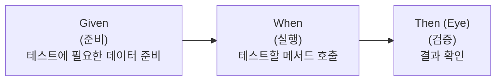
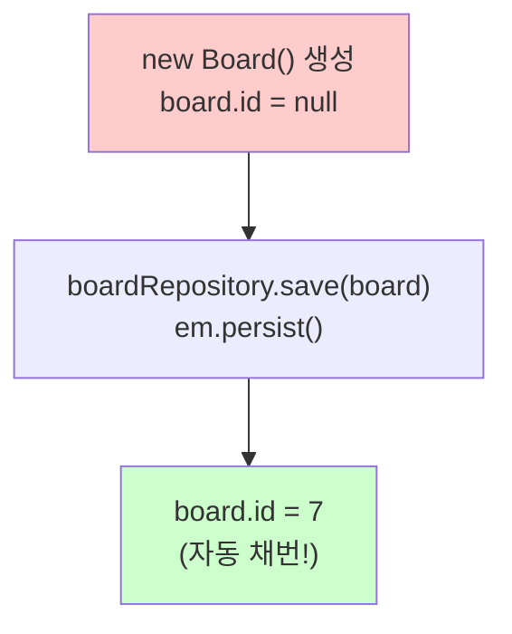
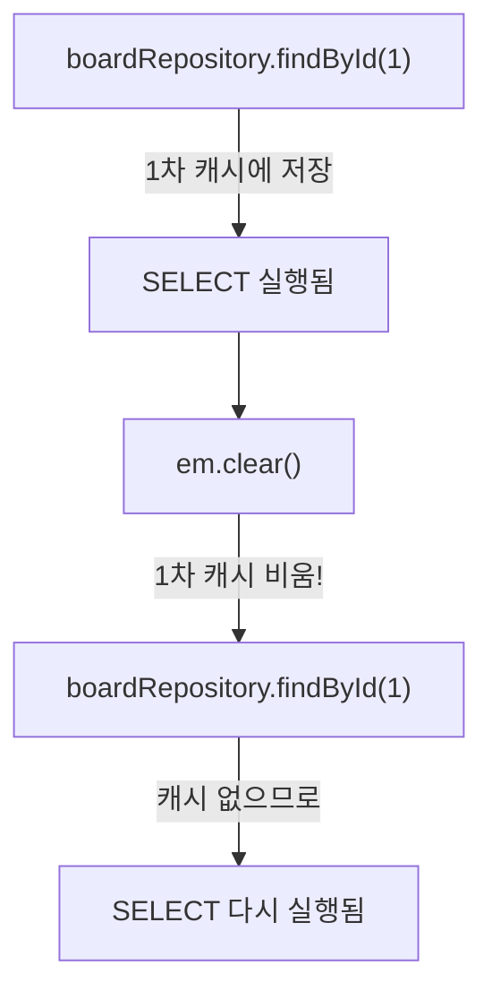
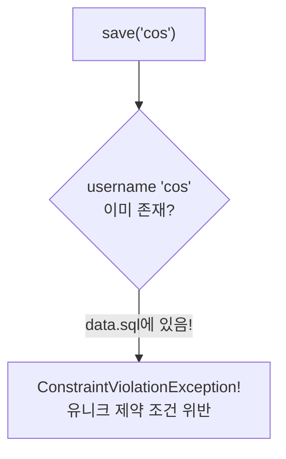
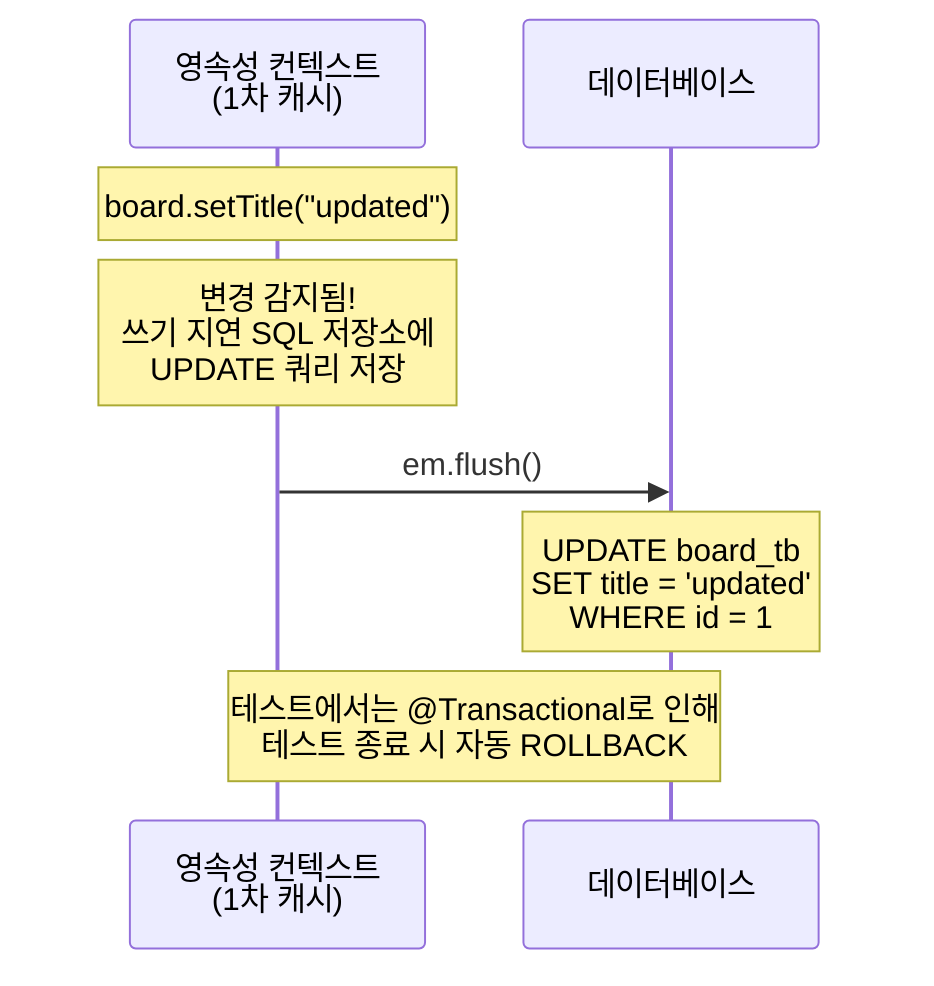
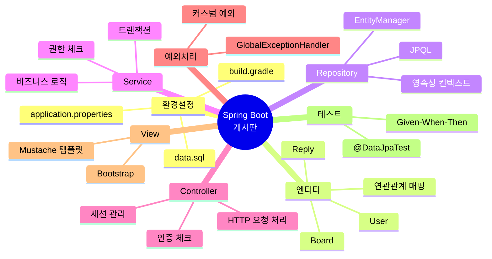

# Chapter 09. 테스트 코드

---

## 9.1 테스트가 왜 필요한가요?

> **예시**: 자동차를 만들고 바로 도로에 내보낼까요? 아닙니다! 공장에서 충돌 테스트, 브레이크 테스트, 엔진 테스트를 먼저 합니다. 코드도 마찬가지입니다!
>
> | 자동차 | 코드 |
> |--------|------|
> | 공장 테스트 | 단위 테스트(Unit Test) |
> | 시운전 | 통합 테스트(Integration Test) |
> | 도로 주행 | 운영 환경(Production) |

### 테스트 코드의 장점

- 코드가 의도대로 동작하는지 **자동으로 확인**
- 코드를 수정해도 기존 기능이 **깨지지 않았는지** 확인
- **문서 역할**: 이 메서드가 어떻게 동작하는지 테스트 코드를 보면 알 수 있음

---

## 9.2 @DataJpaTest란?

> **정의**: JPA 관련 컴포넌트만 로드해서 테스트하는 어노테이션
>
> **예시**: 전체 식당(Spring 앱)을 열지 않고, 주방(JPA)만 따로 테스트하는 것!

### @DataJpaTest의 특징

| 특징 | 설명 |
|------|------|
| EntityManager 자동 등록 | `@Autowired`로 주입받을 수 있음 |
| H2 인메모리 DB 사용 | 테스트용 DB가 자동 설정됨 |
| 각 테스트마다 롤백 | 테스트 데이터가 다른 테스트에 영향 안 줌 |
| `data.sql` 실행 | 초기 데이터가 자동으로 들어감 |

### @Import가 필요한 이유

```java
@Import(BoardRepository.class)
@DataJpaTest
public class BoardRepositoryTest { ... }
```

> `@DataJpaTest`는 `@Repository`가 붙은 우리의 커스텀 Repository를 자동으로 등록하지 않습니다. Spring Data JPA의 인터페이스 Repository만 자동 등록되므로, `@Import`로 직접 등록해줘야 합니다!

---

## 9.3 테스트 코드 패턴: Given-When-Then



> **예시**: 자판기 테스트
> - **Given** (준비): 500원 동전을 넣는다
> - **When** (실행): 콜라 버튼을 누른다
> - **Then** (검증): 콜라가 나온다 (기대값과 비교)

---

## 9.4 BoardRepository 테스트

### 실습 코드

`src/test/java/com/example/boardv1/board/BoardRepositoryTest.java`

```java
package com.example.boardv1.board;

import java.util.List;

import org.junit.jupiter.api.Test;
import org.springframework.beans.factory.annotation.Autowired;
import org.springframework.boot.data.jpa.test.autoconfigure.DataJpaTest;
import org.springframework.context.annotation.Import;

import jakarta.persistence.EntityManager;

@Import(BoardRepository.class)
@DataJpaTest
public class BoardRepositoryTest {

    @Autowired
    private BoardRepository boardRepository;

    @Autowired
    private EntityManager em;

    @Test
    public void save_test() {
        // given
        Board board = new Board();
        board.setTitle("title7");
        board.setContent("content7");
        System.out.println("===before persist");
        System.out.println(board);

        // when
        boardRepository.save(board);

        // eye
        System.out.println("===after persist");
        System.out.println(board);
    }

    @Test
    public void findById_test() {
        // given
        int id = 1;

        // when
        Board board = boardRepository.findById(id)
                .orElseThrow(() -> new RuntimeException("게시글을 찾을 수 없어요"));

        // eye
        System.out.println(board);
    }

    @Test
    public void findAll_test() {
        // given (없음)

        // when
        List<Board> list = boardRepository.findAll();

        // eye
        for (Board board : list) {
            System.out.println(board);
        }
    }

    @Test
    public void delete_test() {
        // given
        int id = 1;
        Board board = boardRepository.findById(id)
                .orElseThrow(() -> new RuntimeException("게시글을 찾을 수 없어요"));

        // when
        boardRepository.delete(board);

        // eye
        em.flush();
    }

    @Test
    public void update_test() {
        // given
        int id = 1;
        Board board = boardRepository.findById(id)
                .orElseThrow(() -> new RuntimeException("게시글을 찾을 수 없어요요"));

        // when
        board.setTitle("title1-update");

        // eye
        em.flush();

        List<Board> list = boardRepository.findAll();
        for (Board b : list) {
            System.out.println(b);
        }
    }

    @Test
    public void findByIdV2_test() {
        // given
        int id = 1;

        // when
        boardRepository.findById(id);
        em.clear();
        boardRepository.findById(id);
    }

    @Test
    public void orm_test() {
        int id = 1;

        Board board = boardRepository.findById(id).get();
        System.out.println("board->user->id : " + board.getUser().getId());
        System.out.println("------------------------------------------");
        System.out.println("board->user->username : " + board.getUser().getUsername());
    }

    @Test
    public void orm_v2_test() {
        int id = 1;

        Board board = boardRepository.findById(id).get();
        System.out.println(board.toString());
    }
}
```

### 각 테스트 메서드 상세 해설

#### save_test() - INSERT 테스트



> **핵심 관찰 포인트**:
> - `persist` 전: `board.getId()` = null
> - `persist` 후: `board.getId()` = 7 (AUTO_INCREMENT)
>
> persist를 하면 DB에 INSERT가 실행되고, 자동 생성된 id가 객체에 반영됩니다!

#### update_test() - 변경 감지 테스트

```java
board.setTitle("title1-update");  // 필드만 변경
em.flush();                        // 변경 감지 → UPDATE 실행!
```

> `em.persist()`를 호출하지 않았는데도 UPDATE가 실행되는 것을 확인할 수 있습니다!
> 이것이 **변경 감지(Dirty Checking)** 입니다.

#### findByIdV2_test() - 1차 캐시 테스트



> **관찰 포인트**: 콘솔에 SELECT 쿼리가 **2번** 출력됩니다!
>
> - `em.clear()`가 없으면: SELECT 1번 (2번째는 캐시에서 가져옴)
> - `em.clear()`가 있으면: SELECT 2번 (캐시를 비웠으므로 다시 조회)

#### orm_test() - 연관관계 매핑 테스트

```java
Board board = boardRepository.findById(1).get();
board.getUser().getId();        // Board에서 User의 id 접근
board.getUser().getUsername();  // Board에서 User의 username 접근
```

> ORM(Object-Relational Mapping)의 핵심! Java 객체의 참조로 연관된 데이터에 접근합니다.
>
> SQL로 하면 JOIN이 필요하지만, JPA에서는 `board.getUser()`로 바로 접근!

---

## 9.5 UserRepository 테스트

### 실습 코드

`src/test/java/com/example/boardv1/user/UserRepositoryTest.java`

```java
package com.example.boardv1.user;

import org.junit.jupiter.api.Test;
import org.springframework.beans.factory.annotation.Autowired;
import org.springframework.boot.data.jpa.test.autoconfigure.DataJpaTest;
import org.springframework.context.annotation.Import;

@Import(UserRepository.class)
@DataJpaTest
public class UserRepositoryTest {

    @Autowired
    private UserRepository userRepository;

    @Test
    public void findById_test() {
        int id = 1;

        User user = userRepository.findById(id)
                .orElseThrow(() -> new RuntimeException("해당 아이디로 유저를 찾을 수 없어요"));

        System.out.println("user : " + user);
    }

    @Test
    public void save_fail_test() {
        // given - 이미 data.sql에 cos가 존재함!
        User user = new User();
        user.setUsername("cos");    // 중복된 username!
        user.setPassword("1234");
        user.setEmail("cos@nate.com");

        // when
        User findUser = userRepository.save(user);

        // eye
        System.out.println(findUser);
    }

    @Test
    public void save_test() {
        // given - 새로운 username
        User user = new User();
        user.setUsername("love");
        user.setPassword("1234");
        user.setEmail("love@nate.com");

        // when
        User findUser = userRepository.save(user);

        // eye
        System.out.println(findUser);
    }

    @Test
    public void findByUsername_test() {
        // given
        String username = "ssar";

        // when
        User findUser = userRepository.findByUsername(username)
                .orElseThrow(() -> new RuntimeException("해당 user를 찾을 수 없어요"));

        // eye
        System.out.println(findUser);
    }
}
```

### save_fail_test() - 유니크 제약 조건 테스트



> `data.sql`에 이미 `cos` 유저가 있으므로, 같은 username으로 INSERT하면 유니크 제약 조건 위반 에러가 발생합니다!

---

## 9.6 테스트 실행 방법

### IDE에서 실행

1. 테스트 클래스나 메서드에서 우클릭
2. "Run Test" 또는 초록색 실행 버튼 클릭
3. 콘솔에서 SQL 쿼리와 결과 확인

### Gradle로 실행

```bash
./gradlew test
```

### 테스트 결과 확인 포인트

| 확인 사항 | 방법 |
|----------|------|
| SQL 쿼리가 의도대로 실행됐는지 | 콘솔의 Hibernate SQL 출력 확인 |
| 데이터가 정확한지 | `System.out.println()`으로 객체 출력 |
| 예외가 발생하는지 | 예외 메시지 확인 |
| 1차 캐시가 작동하는지 | SELECT 쿼리 횟수 확인 |

---

## 9.7 em.flush()의 역할



> **테스트에서 flush를 명시적으로 호출하는 이유**:
>
> `@DataJpaTest`는 각 테스트 후 자동으로 ROLLBACK합니다. ROLLBACK되면 flush가 안 되므로, **UPDATE/DELETE SQL이 실제로 실행되는지 확인하려면** `em.flush()`를 직접 호출해야 합니다!

---

## 핵심 정리

- **@DataJpaTest**: JPA 관련 컴포넌트만 로드하는 슬라이스 테스트
- **@Import**: 커스텀 Repository를 테스트 컨텍스트에 등록
- **Given-When-Then (Eye)**: 준비 → 실행 → 검증 패턴
- **em.flush()**: 영속성 컨텍스트의 변경사항을 DB에 강제 반영
- **em.clear()**: 1차 캐시를 비워 캐시 동작 테스트 가능
- 각 테스트는 독립적으로 실행되며 자동 ROLLBACK됨
- 테스트 코드는 코드의 동작을 검증하는 "살아있는 문서"

---

## 축하합니다!

모든 챕터를 완료했습니다! 이 프로젝트를 통해 배운 핵심 개념을 정리합니다:



> [목차로 돌아가기](README.md)
