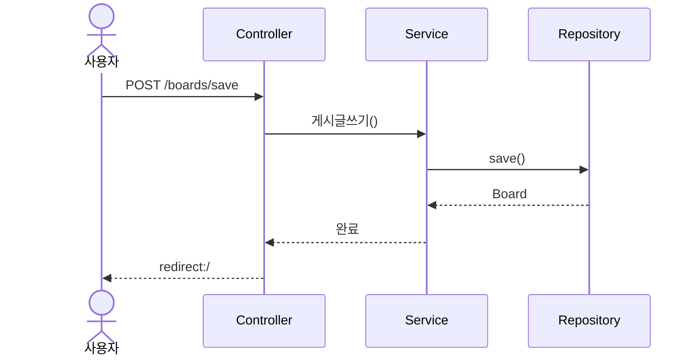

# Claude Code 개발자 가이드

> **목표**: 개발자가 Claude Code CLI를 효과적으로 활용하여 생산성을 극대화하는 방법

---

## 1. Claude Code의 스킬과 Agent 활용

### 1.1 스킬(Skills)이란?

**스킬**은 특정 작업을 자동화하는 명령어입니다. `/commit`, `/review-pr` 같은 슬래시 커맨드로 실행됩니다.

#### 언제 스킬을 사용해야 하나?

✅ **사용하면 좋은 경우:**
- Git 커밋을 자동으로 작성하고 싶을 때 → `/commit`
- PR을 리뷰하고 싶을 때 → `/review-pr`
- 반복적인 워크플로우가 있을 때

❌ **사용하지 않아도 되는 경우:**
- 간단한 파일 읽기/쓰기 작업
- 한 번만 실행하는 작업
- 스킬이 제공되지 않는 작업

**이유**: 스킬은 복잡한 워크플로우를 단순화하지만, 간단한 작업에는 오버헤드가 될 수 있습니다.

### 1.2 Agent란?

**Agent**는 복잡한 다단계 작업을 자율적으로 수행하는 하위 프로세스입니다.

#### Agent 종류와 용도

| Agent 타입 | 용도 | 사용 시기 |
|-----------|------|----------|
| **Explore** | 코드베이스 탐색 | 여러 파일/패턴을 찾아야 할 때 |
| **Plan** | 구현 계획 수립 | 복잡한 기능 추가 전 설계 |
| **Bash** | 명령어 실행 | Git, npm, docker 등 터미널 작업 |
| **general-purpose** | 다단계 검색/연구 | 키워드 검색이 여러 번 필요할 때 |

#### 언제 Agent를 사용해야 하나?

✅ **Agent를 사용하면 좋은 경우:**

```
❌ 나쁜 질문: "프로젝트에서 인증 관련 파일 찾아줘"
✅ 좋은 질문: "프로젝트 전체에서 'authentication', 'login', 'session' 관련된 파일들을 모두 찾아서 정리해줘"
→ Explore Agent가 자동으로 여러 패턴을 탐색합니다.
```

```
❌ 나쁜 질문: "이 버그 고쳐줘"
✅ 좋은 질문: "N+1 문제를 해결하는 방법을 조사하고, 우리 프로젝트에 적용할 수 있는 방안을 제시해줘"
→ Plan Agent가 조사 → 설계 → 구현 계획을 수립합니다.
```

❌ **Agent를 사용하지 않아도 되는 경우:**

```
✅ 간단한 경우: "BoardController.java 파일 읽어줘"
→ Read tool 직접 사용 (Agent 불필요)
```

```
✅ 간단한 경우: "이 파일에서 'getUserId' 함수 찾아줘"
→ Grep tool 직접 사용 (Agent 불필요)
```

**이유**: Agent는 복잡한 탐색/연구 작업을 자동화하지만, 간단한 파일 읽기나 검색에는 오버헤드가 됩니다.

---

## 2. 개발 시 효과적인 질문 방법

### 2.1 질문 구조화의 원칙

#### ❌ 나쁜 질문 vs ✅ 좋은 질문

**케이스 1: 기능 구현 요청**

```
❌ "게시판 만들어줘"
→ 너무 모호함. 어떤 기능? 어떤 구조?

✅ "Spring Boot로 게시판 CRUD를 만들어줘. 요구사항:
   - Board 엔티티 (id, title, content, createdAt)
   - BoardRepository (JPA 사용)
   - BoardController (REST API)
   - 테스트 코드 포함"
→ 명확한 요구사항, 기술 스택, 범위
```

**케이스 2: 버그 수정 요청**

```
❌ "에러 나는데 고쳐줘"
→ 어떤 에러? 어떤 상황?

✅ "게시글 삭제 시 댓글이 있으면 ConstraintViolationException이 발생해.
   - 파일: BoardService.java의 게시글삭제() 메서드
   - 로그: [에러 로그 붙여넣기]
   - 기대 동작: 댓글이 있어도 게시글과 함께 삭제되어야 함"
→ 에러 위치, 로그, 기대 동작 명시
```

**케이스 3: 코드 리뷰 요청**

```
❌ "이 코드 괜찮아?"
→ 무엇을 확인해야 하는지 불명확

✅ "BoardController의 save() 메서드를 리뷰해줘. 특히:
   - 유효성 검사가 제대로 되는지
   - 예외 처리가 적절한지
   - 보안 이슈가 없는지 확인해줘"
→ 리뷰 포인트 명시
```

### 2.2 컨텍스트 제공의 중요성

**Claude Code는 대화 기록을 기억하지만, 명확한 컨텍스트를 제공하면 더 정확한 답변을 얻습니다.**

#### 좋은 컨텍스트 예시:

```
"현재 프로젝트는 Spring Boot 4.0.2, Java 21, JPA/Hibernate를 사용하고 있어.
Board, User, Reply 3개 엔티티가 있고, Board-User는 N:1, Board-Reply는 1:N 관계야.
지금 N+1 문제가 발생하고 있는데, batch_fetch_size 설정 외에 다른 해결 방법도 알려줘."
```

**포함하면 좋은 정보:**
- 기술 스택 (프레임워크, 라이브러리 버전)
- 프로젝트 구조 (엔티티 관계, 아키텍처)
- 현재 상태 (무엇이 작동하고, 무엇이 안 되는지)
- 제약 조건 (사용할 수 없는 방법, 유지해야 하는 구조)

### 2.3 단계별 작업 요청

**복잡한 작업은 단계별로 나눠서 요청하세요.**

```
❌ 한 번에: "회원가입, 로그인, 게시판 CRUD, 댓글 기능 다 만들어줘"
→ 너무 방대함. 에러 발생 시 추적 어려움.

✅ 단계별:
1단계: "User 엔티티와 UserRepository 먼저 만들어줘"
2단계: "회원가입/로그인 기능 추가해줘 (Session 사용)"
3단계: "이제 Board에 User FK 추가하고, 작성자만 수정/삭제 가능하도록 해줘"
→ 단계별로 검증 가능. 문제 발생 시 빠른 수정.
```

### 2.4 예시 제공

**예시를 제공하면 Claude는 패턴을 이해하고 일관된 코드를 생성합니다.**

```
"BoardController처럼 UserController도 만들어줘. 참고:
- BoardController는 save/update/delete 메서드가 있어
- @PostMapping을 사용하고
- 인증 체크는 sessionUser로 해"
```

---

## 3. 나만의 문서(MD) 작성 가이드

### 3.1 왜 MD 문서를 만들어야 하나?

**Claude Code는 프로젝트 컨텍스트를 이해하기 위해 문서를 참조합니다.**

#### 문서가 있으면:
- ✅ Claude가 프로젝트 구조를 빠르게 파악
- ✅ 일관된 코딩 스타일 유지
- ✅ 반복적인 설명 불필요
- ✅ 새로운 팀원 온보딩 시간 단축

### 3.2 필수 문서 구조

```
프로젝트 루트/
├── README.md              # 프로젝트 개요
├── ARCHITECTURE.md        # 아키텍처 설계
├── API.md                 # API 명세
├── CONVENTION.md          # 코딩 컨벤션
├── context/               # Claude Code 전용 컨텍스트
│   ├── tech-stack.md      # 기술 스택
│   ├── entity-relations.md # 엔티티 관계도
│   └── known-issues.md    # 알려진 이슈들
└── book/                  # 학습 자료 (선택)
```

### 3.3 각 문서 작성 가이드

#### README.md

```markdown
# 프로젝트명

## 개요
- 목적: 게시판 웹 애플리케이션
- 기술 스택: Spring Boot 4.0.2, Java 21, JPA/Hibernate, H2, Mustache

## 실행 방법
```bash
./gradlew bootRun
```

## 주요 기능
- 게시글 CRUD
- 회원가입/로그인 (Session)
- 댓글 CRUD
- 권한 관리 (작성자만 수정/삭제)

## 엔티티 구조
- Board (게시글)
- User (회원)
- Reply (댓글)
```

#### ARCHITECTURE.md

```markdown
# 아키텍처 설계

## 계층 구조
```
Controller → Service → Repository → Entity
```

## 엔티티 관계도
```
User 1---N Board 1---N Reply
```

## 패키지 구조
```
com.example.boardv1/
├── board/
│   ├── Board.java
│   ├── BoardRepository.java
│   ├── BoardService.java
│   ├── BoardController.java
│   ├── BoardRequest.java
│   └── BoardResponse.java
├── user/
├── reply/
└── _core/
    ├── errors/
    └── aop/
```

## 설계 원칙
- DTO 패턴 사용 (Entity 직접 노출 금지)
- 트랜잭션은 Service 계층에서만
- 예외 처리는 GlobalExceptionHandler에서 통합
```

#### API.md

```markdown
# API 명세

## 인증
- Session 기반 인증
- `/login`으로 로그인 → `sessionUser` 세션 저장

## 게시글 API

### GET /
- 설명: 게시글 목록 조회
- 인증: 불필요
- 응답: index.mustache (게시글 목록)

### POST /boards/save
- 설명: 게시글 작성
- 인증: 필수 (sessionUser)
- 파라미터:
  - title (String, required, max 100)
  - content (String, required)
- 응답: redirect:/
- 예외:
  - Exception400: 유효성 검사 실패
  - Exception401: 인증되지 않음
```

#### CONVENTION.md

```markdown
# 코딩 컨벤션

## 네이밍 규칙
- 클래스: PascalCase (BoardService)
- 메서드: camelCase (게시글쓰기, findById)
- 변수: camelCase (sessionUser, reqDTO)
- 상수: UPPER_SNAKE_CASE (MAX_LENGTH)

## DTO 네이밍
- Request DTO: {Entity}Request.{Action}DTO
  - 예: BoardRequest.SaveOrUpdateDTO
- Response DTO: {Entity}Response.{View}DTO
  - 예: BoardResponse.DetailDTO

## 메서드 네이밍
- Repository: 영어 (findById, save, delete)
- Service: 한글 (게시글쓰기, 게시글수정, 게시글삭제)
- Controller: 간결한 영어 (save, update, delete)

## 예외 처리
- Custom Exception 사용: Exception400, Exception401, Exception403, Exception404, Exception500
- GlobalExceptionHandler에서 통합 처리
- 메시지는 사용자 친화적으로 작성

## 테스트
- @DataJpaTest 사용
- @DisplayName으로 한글 설명
- Given-When-Then 구조
```

#### context/tech-stack.md

```markdown
# 기술 스택

## Backend
- Spring Boot 4.0.2
- Java 21
- JPA/Hibernate
- Spring Validation

## Database
- H2 (In-Memory)
- data.sql로 초기 데이터

## View
- Mustache Template Engine

## 주요 설정
```properties
# application.properties
spring.jpa.hibernate.ddl-auto=create
spring.jpa.show-sql=true
spring.jpa.properties.hibernate.format_sql=true
spring.jpa.properties.hibernate.default_batch_fetch_size=10
```

## 의존성
```gradle
implementation 'org.springframework.boot:spring-boot-starter-web'
implementation 'org.springframework.boot:spring-boot-starter-data-jpa'
implementation 'org.springframework.boot:spring-boot-starter-mustache'
implementation 'org.springframework.boot:spring-boot-starter-validation'
runtimeOnly 'com.h2database:h2'
```
```

#### context/entity-relations.md

```markdown
# 엔티티 관계도

## ERD
```
User 1---N Board 1---N Reply
```

## Board
```java
@Entity
@Table(name = "board_tb")
public class Board {
    @Id @GeneratedValue
    private Integer id;

    @ManyToOne(fetch = FetchType.LAZY)
    private User user;

    @OneToMany(mappedBy = "board", fetch = FetchType.EAGER)
    @OrderBy("id DESC")
    private List<Reply> replies = new ArrayList<>();

    private String title;
    private String content;
    @CreationTimestamp
    private Timestamp createdAt;
}
```

## FetchType 전략
- Board → User: LAZY (N+1 해결 필요)
- Board → Reply: EAGER (항상 함께 조회)
- Reply → User: LAZY
- Reply → Board: LAZY (getReference 사용)

## N+1 해결 전략
- batch_fetch_size=10 설정
- Board 조회 시: 18 queries → 4 queries (78% 감소)
```

#### context/known-issues.md

```markdown
# 알려진 이슈 및 해결 방법

## 1. N+1 문제
- **증상**: 게시글 목록 조회 시 쿼리 폭증
- **원인**: Board → User (LAZY), Board → Reply (EAGER)
- **해결**: batch_fetch_size=10 설정
- **결과**: 18 queries → 4 queries

## 2. ConstraintViolationException
- **증상**: 댓글이 있는 게시글 삭제 시 FK 제약 위반
- **원인**: Reply.board가 Board를 참조 중
- **해결**: 게시글 삭제 전 댓글 먼저 삭제
```java
public void 게시글삭제(int id, int sessionUserId) {
    // 1. 댓글 먼저 삭제
    List<Reply> replies = replyRepository.findByBoardId(id);
    for (Reply reply : replies) {
        replyRepository.delete(reply);
    }
    // 2. 게시글 삭제
    Board board = boardRepository.findById(id);
    boardRepository.delete(board);
}
```

## 3. LazyInitializationException
- **증상**: Mustache 템플릿에서 LAZY 필드 접근 시 에러
- **원인**: 영속성 컨텍스트가 닫힌 후 접근
- **해결**: DTO에서 필요한 데이터를 모두 로딩
```java
public DetailDTO(Board board, Integer sessionUserId) {
    this.username = board.getUser().getUsername(); // LAZY 로딩 강제
}
```
```

### 3.4 문서 작성 팁

#### 1. **Mermaid 다이어그램 활용**

```markdown
## 데이터 흐름

```

#### 2. **코드 예시 포함**

```markdown
## 예외 처리 패턴

**잘못된 예:**
```java
if (sessionUser == null) {
    throw new RuntimeException("로그인하세요");
}
```

**올바른 예:**
```java
if (sessionUser == null) {
    throw new Exception401("인증되지 않았습니다");
}
```
```

#### 3. **변경 이력 기록**

```markdown
## 변경 이력

### 2026-02-09
- Board에 User FK 추가
- FetchType.LAZY 적용
- N+1 문제 발생 → batch_fetch_size 설정

### 2026-02-08
- Reply 엔티티 추가
- 댓글 CRUD 기능 구현
```

### 3.5 Claude Code에게 문서를 알려주는 방법

#### 방법 1: CLAUDE.md 파일 생성 (자동 로딩)

```markdown
# CLAUDE.md

프로젝트 루트에 이 파일을 만들면 Claude Code가 자동으로 읽습니다.

## 프로젝트 소개
이 프로젝트는 Spring Boot 게시판입니다.

## 중요한 파일들
- `context/api.md`: API 명세
- `context/entity-relations.md`: 엔티티 관계도
- `ARCHITECTURE.md`: 아키텍처 설계

## 개발 시 주의사항
- Service 메서드는 한글로 작성
- DTO 패턴 필수
- 예외는 Custom Exception 사용
```

#### 방법 2: 대화 중 명시적 참조

```
"context/api.md를 참고해서 새로운 API 엔드포인트를 추가해줘"
"ARCHITECTURE.md의 패키지 구조를 따라서 User 모듈을 만들어줘"
```

#### 방법 3: 메모리 디렉토리 활용

Claude Code는 `~/.claude/projects/{프로젝트}/memory/` 디렉토리를 자동으로 읽습니다.

```
C:\Users\G\.claude\projects\c--workspace-spring-lab-boardv1\memory\
├── MEMORY.md              # 핵심 학습 내용 (200줄 제한)
├── debugging.md           # 디버깅 노하우
├── patterns.md            # 자주 쓰는 패턴
└── mistakes.md            # 흔한 실수들
```

**MEMORY.md 예시:**
```markdown
# 프로젝트 핵심 정보

## 기술 스택
Spring Boot 4.0.2, Java 21, JPA/Hibernate, H2, Mustache

## 엔티티 관계
User 1---N Board 1---N Reply

## 주요 설계 패턴
- DTO 패턴 (Entity 직접 노출 금지)
- Custom Exception (Exception400~500)
- AOP 유효성 검사 (ValidationHandler)

## 자주 발생하는 문제
- N+1: batch_fetch_size=10으로 해결
- LazyInitializationException: DTO에서 필드 강제 로딩
- ConstraintViolationException: 댓글 먼저 삭제

## 코딩 컨벤션
- Service 메서드: 한글 (게시글쓰기)
- Repository 메서드: 영어 (findById)
- DTO: {Entity}Request.{Action}DTO

[상세 내용은 patterns.md, debugging.md 참조]
```

---

## 4. 실전 시나리오별 활용법

### 시나리오 1: 새 기능 추가 (댓글 기능)

```
🙋 개발자: "Reply 엔티티를 추가하려고 해. context/entity-relations.md를 참고해서
         Board와 1:N 관계로 만들어줘. CONVENTION.md의 네이밍 규칙도 따라줘."

🤖 Claude:
   1. context/entity-relations.md 읽기 (기존 구조 파악)
   2. CONVENTION.md 읽기 (네이밍 규칙 확인)
   3. Reply.java 생성 (Board와 @ManyToOne)
   4. ReplyRepository.java 생성
   5. data.sql 업데이트
```

### 시나리오 2: 버그 수정 (N+1 문제)

```
🙋 개발자: "게시글 목록 조회 시 쿼리가 너무 많이 나가. 로그:
         SELECT * FROM board_tb
         SELECT * FROM user_tb WHERE id=?
         SELECT * FROM user_tb WHERE id=?
         ...
         context/known-issues.md에 N+1 해결법이 있을 거야."

🤖 Claude:
   1. context/known-issues.md 읽기
   2. batch_fetch_size 설정 확인
   3. application.properties 수정
   4. 테스트 코드로 쿼리 수 검증
```

### 시나리오 3: 코드 리팩토링 (DTO 도입)

```
🙋 개발자: "BoardController가 Entity를 직접 반환하고 있어.
         ARCHITECTURE.md의 DTO 패턴을 적용해서 리팩토링해줘."

🤖 Claude:
   1. ARCHITECTURE.md 읽기 (DTO 패턴 확인)
   2. BoardResponse.java 생성
   3. BoardController 수정 (DTO 반환)
   4. BoardService 수정 (DTO 변환)
```

### 시나리오 4: API 문서 생성

```
🙋 개발자: "전체 프로젝트의 API 엔드포인트를 정리해서 context/api.md를 만들어줘.
         각 엔드포인트마다 인증/인가 요구사항, 파라미터, 응답 형식을 포함해줘."

🤖 Claude:
   1. Explore Agent로 모든 Controller 파일 찾기
   2. 각 @GetMapping, @PostMapping 추출
   3. api.md 생성 (체계적으로 정리)
```

---

## 5. 체크리스트: Claude Code 마스터하기

### 초급 (1주차)

- [ ] README.md 작성
- [ ] 간단한 질문으로 파일 읽기/쓰기
- [ ] Git 커밋 자동화 (`/commit`)
- [ ] 에러 로그 제공하여 버그 수정 요청

### 중급 (2주차)

- [ ] ARCHITECTURE.md, API.md 작성
- [ ] 단계별 작업 요청 (복잡한 기능 나눠서)
- [ ] Explore Agent 활용 (코드베이스 탐색)
- [ ] context/ 폴더에 프로젝트별 문서 정리

### 고급 (3주차)

- [ ] CONVENTION.md 작성 (팀 컨벤션 정립)
- [ ] Plan Agent로 복잡한 기능 설계
- [ ] MEMORY.md 활용 (자주 발생하는 이슈 기록)
- [ ] 커스텀 스킬 작성 (반복 워크플로우 자동화)

---

## 6. 팁 & 트릭

### 1. 파일 패스는 명확하게

```
❌ "컨트롤러 파일 읽어줘"
✅ "src/main/java/com/example/boardv1/board/BoardController.java 읽어줘"
```

### 2. 에러 로그는 전체 복사

```
❌ "에러 나는데 고쳐줘"
✅ "에러 발생:
    at com.example.boardv1.board.BoardService.게시글삭제(BoardService.java:45)
    Caused by: org.hibernate.exception.ConstraintViolationException
    [전체 스택 트레이스 붙여넣기]"
```

### 3. 변경 사항은 구체적으로

```
❌ "이 파일 수정해줘"
✅ "BoardController의 save() 메서드에 @Valid 추가하고,
   Errors가 있으면 Exception400을 던지도록 수정해줘"
```

### 4. 테스트 코드 요청

```
✅ "BoardService의 게시글쓰기() 메서드에 대한 테스트 코드 작성해줘.
   Given: User와 title, content
   When: 게시글쓰기() 호출
   Then: DB에 저장되고, Board 객체가 반환되어야 함"
```

### 5. Git 작업은 명확히

```
❌ "커밋해줘"
✅ "게시글 삭제 버그 수정한 파일들을 커밋해줘. 커밋 메시지는 'Fix: 댓글이 있는 게시글 삭제 시 ConstraintViolationException 해결'"
```

---

## 7. 마무리: 학습 로드맵

### 1단계: Claude Code에 익숙해지기
- 간단한 파일 읽기/쓰기 연습
- README.md 작성
- Git 커밋 자동화

### 2단계: 프로젝트 문서화
- ARCHITECTURE.md 작성
- API.md 작성
- context/ 폴더 정리

### 3단계: 복잡한 작업 요청
- Agent 활용 (Explore, Plan)
- 단계별 기능 구현
- 버그 수정 및 리팩토링

### 4단계: 팀 협업 최적화
- CONVENTION.md 정립
- MEMORY.md 활용
- 팀원들에게 Claude Code 교육

---

## 부록: 자주 사용하는 프롬프트 템플릿

### 기능 추가

```
"{기능명} 기능을 추가해줘. 요구사항:
- {요구사항 1}
- {요구사항 2}
- {요구사항 3}

참고:
- 기술 스택: {기술 스택}
- 기존 패턴: {기존 파일 경로}
- 컨벤션: CONVENTION.md 참조"
```

### 버그 수정

```
"{증상}이 발생하고 있어. 상세 정보:
- 발생 위치: {파일명}:{줄번호}
- 에러 로그: [로그 붙여넣기]
- 재현 방법: {재현 방법}
- 기대 동작: {기대하는 결과}

context/known-issues.md에 비슷한 케이스가 있을 수 있어."
```

### 코드 리뷰

```
"{파일명}의 {메서드명} 메서드를 리뷰해줘. 확인 사항:
- [ ] 유효성 검사
- [ ] 예외 처리
- [ ] 성능 (N+1 등)
- [ ] 보안 이슈
- [ ] 코딩 컨벤션 (CONVENTION.md 참조)

개선 사항이 있으면 코드와 함께 제안해줘."
```

### 테스트 작성

```
"{클래스명}의 {메서드명}에 대한 테스트 코드를 작성해줘.
- Given: {초기 조건}
- When: {실행할 동작}
- Then: {기대 결과}

@DataJpaTest 사용, @DisplayName은 한글로 작성해줘."
```

---

**이 문서를 팀원들에게 공유하고, Claude Code를 효과적으로 활용하세요!** 🚀
